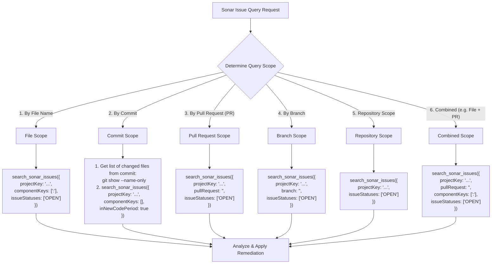

# Sonar Remediation & Quality Gate Workflows

Inspect, remediate, accept, and automate SonarQube/SonarCloud code quality issues across single files, PRs, commits, branches, or entire repositories. (Works with both `sonarcloud:` and `sonarqube:` MCP servers).

## Workflows

### 1. Issue Query Decision Tree (MCP)

> [!IMPORTANT]
> When analyzing an active PR, MUST pass `pullRequest: "<pr_id>"`. Omitting `pullRequest` queries the default branch (`main`), leading to unintended refactoring of pre-existing code.

### 2. Parameter Mapping Reference

| Query Scope | Required / Recommended Parameters for `search_sonar_issues` |
| :--- | :--- |
| **File Scope** | `projectKey`, `componentKeys: ["<projectKey>:<relPath>"]`, `issueStatuses: ["OPEN"]` |
| **Commit Scope** | *Step 1*: `git show --name-only <hash>`   *Step 2*: `projectKey`, `componentKeys: [...]`, `inNewCodePeriod: true` |
| **PR Scope** | `projectKey`, `pullRequest: "<pr_id>"`, `issueStatuses: ["OPEN"]` |
| **Branch Scope** | `projectKey`, `branch: "<branch_name>"`, `issueStatuses: ["OPEN"]` |
| **Repo Scope** | `projectKey`, `issueStatuses: ["OPEN"]` |
| **Combined Scope** | `projectKey`, `pullRequest: "<pr_id>"`, `componentKeys: ["<projectKey>:<relPath>"]`, `issueStatuses: ["OPEN"]` |

### 3. Issue Triage & Decision Policy

| Domain | Issue Category | Rule Keys | Action | Rationale & Requirements |
| :--- | :--- | :--- | :--- | :--- |
| **General** | **Cognitive Complexity** | `S3776` | **Flag `accept`** via `change_sonar_issue_status` | MUST search issue key first. NEVER split functions solely for S3776. Structural splits require `/improve-codebase-architecture`. |
| **General** | **Function Nesting** | `S2004` | **Flag `accept`** via `change_sonar_issue_status` | Deep nesting in UI/search/event closures is intentional design. |
| **General** | **Backtracking Regex** | `S8786` | **Fix or Flag `accept`** | Simplify regex if possible; flag `accept` if regex is already minimal. |
| **CSS** | **Theme / Contrast** | `css:S7924` | **Flag `accept`** via `change_sonar_issue_status` | Brand theme colors override generic WCAG contrast checks. |
| **JS/TS/CSS** | **Language Smells** | `S1854`, `S1481`, `S6582`, `S6606`, `S7780`, `S7758`, `S6594`, `S4666`, `S1874` | **Fix code** | Follow domain-specific refactoring patterns in [REFERENCE.md](REFERENCE.md). |

> [!IMPORTANT]
> Before calling `change_sonar_issue_status` to flag any issue as `"accept"` or `"falsepositive"`, you MUST search for the exact issue key using `search_sonar_issues` with `issueStatuses: ["OPEN"]`.

### 4. Remediation Safety Boundaries

- **NEVER delete, rename, or move** standalone entrypoints, child processes, worker scripts, or dynamic IPC/service wrappers.
- **NEVER modify** exported module interfaces, public API signatures, or database schemas during Sonar remediation.
- **Domain Contract Preservation (`S1854`, `S1481`)**: NEVER alter returned object keys or state properties (e.g. `favorite`, `id`, `status`) to consume an unused variable. Safely delete the dead variable calculation instead.

### 5. Code Duplication Resolution (CPD)

- MUST call `get_duplications` to retrieve exact duplicated lines and read actual code on disk.
- For structural duplication, read `/improve-codebase-architecture` to design a unified module.

### 6. Continuous Zero-Issue Remediation Loop (Goal-Driven Batching)

Triggered via `/goal` or explicit user instruction to fix/accept open issues until **0 open issues remain**:

1. **Query Open Issues**: Call `search_sonar_issues` with appropriate scope parameter (`pullRequest`, `branch`, `componentKeys`, or `projectKey`).
2. **Check Exit Condition**: If `total === 0`, report completion (`<!-- GOAL_COMPLETE -->`).
3. **Triage & Apply**: Apply Table 3 actions (Flag `accept` or Fix code).
4. **Local Verification**: Run project-specific typechecks, linters, or test suites (e.g. `npm run typecheck`, `pytest`, `cargo check`).
5. **Commit & Push**: Stage changes, commit (`git commit -m "refactor: remediate 
"`), and push.
6. **Schedule 150s Timer**: Schedule a 150-second timer (`schedule({ DurationSeconds: "150", Prompt: "150s timer expired. Re-query open Sonar issues" })`) for remote CI scan completion.
7. **Repeat**: Upon timer expiry, re-query open issues until `total === 0`.
