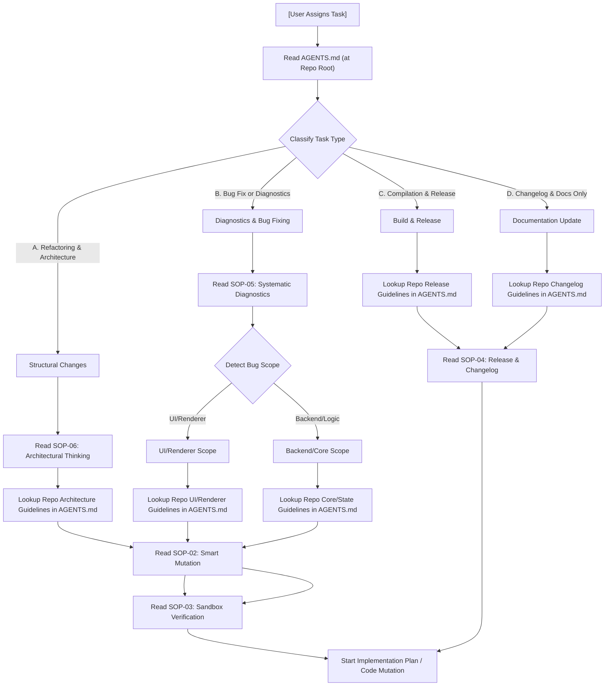

# SOP 00: UNIVERSAL AGENT INTAKE & ROUTING PROTOCOL

This SOP defines the **mandatory Step 0 Startup Ritual** for all incoming AI agents. It ensures that whenever a task is assigned, the agent autonomously classifies the task, consults the universal routing flow, and resolves the exact set of required files **before** performing any research, code modification, or diagnostics.

---

## 🧭 1. Mandatory Step 0 Startup Ritual (Turn 1)

Every session **MUST** start with this intake ritual on **Turn 1**. Do not skip this even for "trivial" or "one-off" fixes.

### The Startup Ritual Checklist:
1.  **Locate Repository Guidelines**: Find the master repository guidelines file (typically `AGENTS.md` at the root of the active workspace) and read it in full.
    > [!NOTE]
    > If `AGENTS.md` is missing or incomplete, immediately execute **[SOP-07: Guideline Maintenance & Repo Bootstrapping](./07-guideline-maintenance.md)** to generate/update the configuration adapter before proceeding.
2.  **Classify the Task**: Analyze the user's request and classify it into one or more categories:
    *   **UI/Renderer/Styling Changes**
    *   **Core Logic/API/Database State Changes**
    *   **Structural Refactoring/Migration**
    *   **Production Compilation/Packaging**
    *   **Public Release/Changelog Writing**
3.  **Resolve Reading Targets**: Use the universal flowchart in [Section 2](#-2-universal-routing-decision-tree) and lookup the **Repository-Specific Routing Map** inside the repository's `AGENTS.md` to compile your exact reading list.
4.  **Execute Reading Phase**: Open and read all designated universal SOPs and repo-specific guidelines using targeted `view_file` commands **before** writing any code.

---

## 📊 2. Universal Routing Decision Tree

This flowchart defines the universal sequence of task classification, SOP loading, and repository-specific configuration lookup:

---

## 📖 3. Task-Specific Reading Dictionary

This dictionary defines which universal SOPs must be loaded for each task type, and directs you to locate the corresponding repo-specific guidelines in `AGENTS.md`.

### 🎨 Task Type: UI, Renderer, or Styling Changes
*   **Universal SOPs to Load**:
    *   [SOP-06: Architectural Thinking](./06-architectural-thinking.md) (DOM Ownership & Encapsulation rules).
    *   [SOP-02: Smart Code Mutation](./02-smart-code-mutation.md) (CRLF handling, structural boundaries, and surgical editing).
    *   **Verification Target**: [SOP-03: Sandbox Verification](./03-sandbox-verification.md) (Browser rendering, visual validation).
*   **Repository Guidelines**: 
    *   Open `AGENTS.md` and read the files listed under the **UI/Renderer/Styling Routing Map**.

### ⚙️ Task Type: Core Logic, API, Database, or State Changes
*   **Universal SOPs to Load**:
    *   [SOP-05: Systematic Diagnostics](./05-systematic-diagnostics.md) (Tracing data flows, verifying IPC payloads, and logging).
    *   [SOP-02: Smart Code Mutation](./02-smart-code-mutation.md) (Decoupled logic patterns, boundary safety).
    *   **Verification Target**: [SOP-03: Sandbox Verification](./03-sandbox-verification.md) (Running unit and integration tests).
*   **Repository Guidelines**: 
    *   Open `AGENTS.md` and read the files listed under the **Core Logic/API/Database Routing Map**.

### 📦 Task Type: Production Build, Packaging, or Compilation
*   **Universal SOPs to Load**:
    *   [SOP-04: Release & Changelog](./04-release-and-changelog.md) (Version management, changelog syntax rules).
*   **Repository Guidelines**: 
    *   Open `AGENTS.md` and read the files listed under the **Build/Release Routing Map**.

### 🔧 Task Type: Refactoring or Codebase Structural Changes
*   **Universal SOPs to Load**:
    *   [SOP-06: Architectural Thinking](./06-architectural-thinking.md) (Dependency direction, shared resources, encapsulation).
    *   **Verification Target**: [SOP-03: Sandbox Verification](./03-sandbox-verification.md) (Post-Refactor structural verification, boot validation).
*   **Repository Guidelines**: 
    *   Open `AGENTS.md` and read the files listed under the **Architecture/Refactoring Routing Map**.

---

## 📌 4. Compliance Check (Before Writing Code)

Before you begin editing any files or presenting an implementation plan, you **MUST** verify:

> *"Have I read all universal SOPs and resolved the repository-specific files mapped in the AGENTS.md Routing Map for this task type?"*

If the answer is **No**, stop immediately and read them using `view_file`. Skipping designated architectural or process guidelines before writing code is a process violation.
