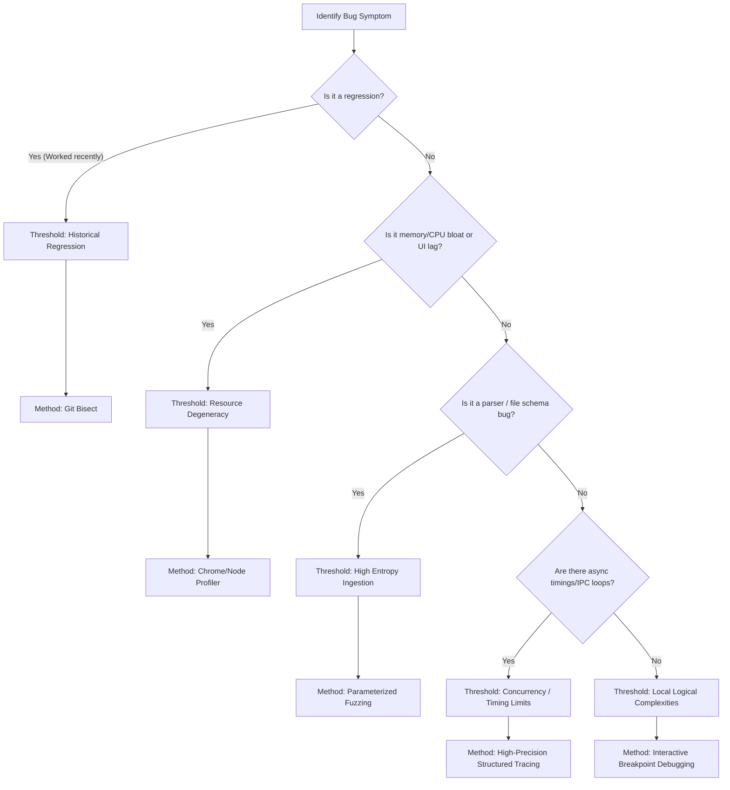

# 🔍 SOP-05: Systematic Diagnostics & Bug-Finding Framework

This Standard Operating Procedure establishes the universal decision triggers and step-by-step methodologies to be used when resolving logical anomalies, performance degradation, and data parsing failures.

Ad-hoc log insertion (the classic `printf` / `console.log` loop) is the baseline starting point. However, **if you hit a "Log-Loop Trap" (i.e., you have added, run, and modified logs 3+ times without isolating the root cause), you MUST halt and pivot to one of the structured methodologies defined below.**

---

## 🚦 1. The Threshold-Method Decision Tree

Evaluate your active environment and the characteristics of the bug to determine which diagnostic tool is most optimal:



---

## 🛠️ 2. Abstract Methodology Guidelines

### ⏱️ Method A: Interactive Debugging & Breakpoints
*   **Triggering Threshold**: *Local Logical Complexities*.
*   **Condition**: A deterministic function containing nested conditional branches, loops, or complex arithmetic returns incorrect values, and logging produces too much noise.
*   **Operational Execution**:
    1. Attach a debugger engine (e.g., V8 Inspector, Chrome DevTools, GDB, LLDB, PDB) to the executing process.
    2. Set a breakpoint on the entry point of the suspicious routine.
    3. Step through line-by-line using `Step Over` (`F10`) and `Step Into` (`F11`).
    4. Inspect frame bindings and state variables in real time. Mutate values directly in memory to test immediate fixes without recompiling.

### 🧬 Method B: Parameterized & Fuzz Testing
*   **Triggering Threshold**: *High-Entropy Ingestion*.
*   **Condition**: Reading highly variable external schemas, parsing obfuscated/custom file streams, or handling untrusted user-supplied payloads where edge-case inputs trigger unhandled panics or memory corruption.
*   **Operational Execution**:
    1. Isolate the target parsing routine in a lightweight testing harness.
    2. Define a clean baseline input payload.
    3. Build a structured mutator engine that randomly alters bytes, drops attributes, inserts invalid character encodings, or exceeds maximum length buffers.
    4. Execute thousands of test inputs against the isolated harness. Assert that the routine gracefully rejects malformed inputs via handled errors rather than thread crashes.

### 📜 Method C: Systematic Delta Debugging (`git bisect`)
*   **Triggering Threshold**: *Historical Regression*.
*   **Condition**: A once-functional capability fails in the current revision, and the exact offending commit is buried across a long, merged commit tree.
*   **Operational Execution**:
    1. Write a self-contained, automated shell script (e.g., `check_regression.sh` or `check.js`) that reproduces the error. The script must return exit code `0` for success and non-zero (e.g., `1`) for failure.
    2. Start the binary search:
       ```bash
       git bisect start
       git bisect bad HEAD
       git bisect good <known-working-commit-hash>
       git bisect run <reproduction-command-or-script>
       ```
    3. Analyze the output when Git isolates the exact offending commit.

### 📊 Method D: Dynamic Profiling (Heap & Flame Graphs)
*   **Triggering Threshold**: *Resource Degeneracy*.
*   **Condition**: Progressive system-level sluggishness, visual rendering drops, memory leaks, unreleased file/socket descriptors, or CPU spikes during runtime.
*   **Operational Execution**:
    1. Run the target environment with CPU and Heap Profilers attached.
    2. **CPU Profiling**: Record a timeline trace during intensive operations. Generate a Flame Graph to isolate deeply nested functions consuming excessive CPU ticks.
    3. **Heap Analysis**: Take a memory snapshot at the zero-state, trigger the memory-intensive action, trigger garbage collection (GC) manually, and capture a second snapshot. Inspect the diff between snapshots to isolate objects that are retained in memory.

### 🛰️ Method E: High-Precision Structured Tracing
*   **Triggering Threshold**: *Concurrency / Timing Limits*.
*   **Condition**: Race conditions, lock contentions, or packet drops inside asynchronous event queues, cross-process IPC bridges, or Web Workers where attaching a debugger halts execution and alters timing (creating Heisenbugs).
*   **Operational Execution**:
    1. Avoid using active breakpoints or stepping engines to preserve the thread scheduling timing.
    2. Inject high-precision structured traces formatted as structured JSON packets.
    3. Each packet must contain:
       *   `timestamp`: High-resolution offset (e.g., sub-millisecond precision via `performance.now()`).
       *   `processId` / `threadId`: To trace which context executes the line.
       *   `correlationId`: A unique uuid generated at request inception to track the transaction lifecycle across boundaries.
