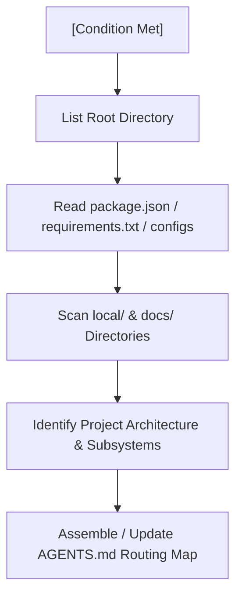

# SOP 07: GUIDELINE MAINTENANCE & REPO BOOTSTRAPPING

This SOP defines the **universal meta-protocol for bootstrapping and maintaining repository-specific guidelines**. Whenever an incoming AI agent discovers that the active repository lacks a master routing adapter (`AGENTS.md`) or has outdated mappings (e.g., new guidelines added to `local/` or `docs/` but not mapped), the agent **MUST** invoke this SOP to autonomously analyze the workspace, generate or update the mapping configurations, and ensure long-term development alignment.

---

## 🧭 1. Trigger Conditions

An agent **MUST** run this protocol immediately if any of the following conditions are met during the Turn 1 intake phase:
1.  **Missing Routing Adapter:** No `AGENTS.md` file is found at the root of the active workspace.
2.  **Empty or Incomplete Routing Map:** `AGENTS.md` exists, but lacks the `SOP-00 Task-Specific Routing Map` or leaves critical categories unmapped.
3.  **Outdated Guideline Linkages:** A new architectural document, serialization specification, or release guide has been created under `local/` or `docs/` during development but is not yet mapped inside the routing table of `AGENTS.md`.

---

## 🔍 2. Repository Scouting Protocol

Before generating or updating guidelines, execute a multi-layered workspace analysis to discover tech stacks, boundaries, and existing documents.

### 2.1 Technology Stack & Boundary Discovery
*   **Step 1:** Read dependency manifests (e.g., `package.json`, `Cargo.toml`, `requirements.txt`, `go.mod`) to identify core frameworks (e.g., Next.js, Electron, Actix, PyTorch, Django).
*   **Step 2:** Inspect directory listings to deduce process boundaries (e.g., Main/Renderer in Electron, Frontend/Backend in web applications, Shared modules, or microservices).

### 2.2 Guideline Discovery
*   Locate any existing development documentation, release guides, code style manuals, or design systems under `local/`, `docs/`, or standard markdown locations at root.

---

## 📝 3. AGENTS.md Generation & Mapping Protocol

When creating or updating `AGENTS.md` at the root of the workspace, strictly adhere to the following universal structure.

### 3.1 Standard AGENTS.md Template
Ensure the generated `AGENTS.md` contains these three core sections:
1.  **Section 1: Master Agent Skills:** Links to specialized repository manuals and local guidelines with clear descriptions of *when* to read them and what their *focus* is.
2.  **Section 2: Universal SOP Router:** Explicitly references the universal `/SOP` directory and points to `SOP-00` as the mandatory Turn 1 entry point.
3.  **Section 3: SOP-00 Task-Specific Routing Map:** The core adapter table mapping universal `SOP-00` task classifications to concrete repository files.

### 3.2 Task Mapping Heuristics
Map repository guidelines to the standard `SOP-00` categories using these heuristics:

| Universal SOP-00 Category | Matching File Keywords / Types | Target Subsystem / Focus |
| :--- | :--- | :--- |
| **🎨 UI / Renderer / Styling** | `*modularization*`, `*component*`, `*theme*`, `*style*`, `*css*` | Frontend containers, styling rules, DOM ownership. |
| **⚙️ Core Logic / Database / IPC** | `*serialization*`, `*save*`, `*db*`, `*ipc*`, `*api*`, `*state*` | Core business logic, database schemes, network layers. |
| **🔧 Structural Refactoring / Migration**| `*modularization*`, `*architecture*`, `*patterns*` | Subsystem boundaries, decoupling contracts. |
| **📦 Production Build / Release Notes**  | `*release*`, `*build*`, `*package*`, `*changelog*` | Compiling, signing, changelog logging, announcement style. |

---

## 🔄 4. The Maintenance Loop (Self-Updating Guidelines)

When writing or modifying files during a coding session, agents must maintain the freshness of the guidelines:

1.  **Post-Document Creation Audit:** If you create a new local guideline (e.g., a serialization manual or design system update), **you must immediately modify `AGENTS.md`** to add a reference under the "Master Agent Skills" section and map it to its corresponding task category in the "SOP-00 Task-Specific Routing Map".
2.  **Incremental Changelog Logging:** Ensure that any updates to guidelines or formatting are recorded in the developer logs according to standard release policies (e.g., `SOP-04`).

---

## 📌 5. Compliance Check

After generating or updating `AGENTS.md`:
*   Run a syntax compilation check on any modified config files or directories.
*   Verify that all paths specified in the new `Routing Map` are valid relative links (e.g. `./local/file.md` or `./docs/file.md`) and can be read successfully by incoming agents on Turn 1.
