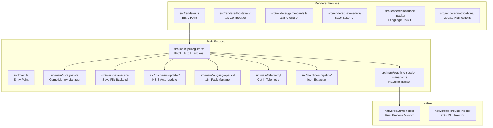

# YumeShelf — Codebase Analysis Report

> **Generated**: 2026-05-26  
> **Index**: `local/YumeShelf` — 200 files, 1,964 symbols, 123 TypeScript + 34 JavaScript + 16 CSS + supporting native code  
> **Health Grade**: **C** (Composite: 78.2/100)

---

## 1. Tổng Quan về YumeShelf

YumeShelf là một **Electron desktop application** dùng để quản lý thư viện game (visual novel / RPG Maker / Ren'Py / Unity / Wolf RPG). Ứng dụng được xây dựng trên stack:

| Layer | Technology | Files |
|-------|-----------|-------|
| Main Process | TypeScript + Node.js | 123 `.ts` files |
| Renderer | TypeScript + Vite | 34 `.js` + 16 `.css` |
| Native Helpers | Rust (playtime-helper), C++ (background-injector), C# (ModernSaveConverter) | 5 files |
| Build & Release | JavaScript scripts | 34 `.js` scripts |

### Kiến trúc chính



### Tectonic Map (19 plates)

Codebase chia thành **19 tectonic plates** với zero drifters đáng kể:
- **Plate 14** (anchor: `app-composition.ts`) — 25 files, core renderer bootstrap
- **Plate 3** (anchor: `src/main.ts`) — 22 files, main process core  
- **Plate 10** (anchor: `save-editor/index.ts`) — 16 files, save editor backend
- **Plate 16** (anchor: `data-engine.ts`) — 13 files, save editor frontend
- **Plate 13** (anchor: `app-updates.ts`) — 12 files, update system

---

## 2. Excellent Jobs — Tối Ưu Đến Ngưỡng Cực Cao

### ✅ Zero Dependency Cycles

```
cycle_count: 0
```

Toàn bộ codebase **không có circular dependency nào**. Đây là thành tựu hiếm gặp với 200 files và 1,964 symbols — cho thấy dependency graph được thiết kế có chủ đích và maintain cẩn thận.

### ✅ Telemetry Privacy Architecture

[TelemetryShipper](file:///D:/Projects/YumeShelf/src/main/telemetry/shipper.ts) implement một pipeline telemetry có trách nhiệm:

- **Opt-in only** — mặc định `enabled = false`, sync từ `library_db.json` config
- **Data sanitization pipeline** — [sanitizeLogPayload](file:///D:/Projects/YumeShelf/src/main/telemetry/sanitizer.ts) chạy 3 lớp: `sanitizePath` → `scrubSecrets` → `sanitizeStackTrace`
- **Proxy-secured endpoint** — Data gửi qua Cloudflare Workers middleman, không direct-to-Supabase
- **Full purge on opt-out** — `purgeAllData()` xóa cả in-memory buffer lẫn disk queue
- **Offline queue resilience** — Buffer lưu vào `telemetry-queue.json`, retry trên mỗi flush cycle

### ✅ Multi-Engine Save Editor

Save Editor hỗ trợ **6 game engine formats** với kiến trúc plugin:

| Engine | File | Capability |
|--------|------|-----------|
| RPG Maker | [rpg-maker.ts](file:///D:/Projects/YumeShelf/src/renderer/save-editor/engines/rpg-maker.ts) | Tab/data extraction, gold detection |
| Ren'Py | [renpy.ts](file:///D:/Projects/YumeShelf/src/renderer/save-editor/engines/renpy.ts) | Pickle-based save parsing |
| Pure JSON | [pure-json.ts](file:///D:/Projects/YumeShelf/src/renderer/save-editor/engines/pure-json.ts) | Deep path navigation |
| Wolf RPG | [rpg-wolf-sav.ts](file:///D:/Projects/YumeShelf/src/renderer/save-editor/engines/rpg-wolf-sav.ts) | Binary format extraction |
| Unity Mono | [unity-mono.ts](file:///D:/Projects/YumeShelf/src/renderer/save-editor/engines/unity-mono.ts) | .NET serialized data |
| Simple Keyed | [simple-keyed.ts](file:///D:/Projects/YumeShelf/src/renderer/save-editor/engines/simple-keyed.ts) | SecretKey + Base64 encoding |

Plus [DataEngine](file:///D:/Projects/YumeShelf/src/renderer/save-editor/data-engine.ts) cung cấp query engine thống nhất với comparison operators (`>`, `>=`, `<`, `<=`, `==`, `!=`).

### ✅ Installer Shell Internationalization

[installer-shell](file:///D:/Projects/YumeShelf/src/installer-shell/main.js) có full i18n support ngay từ installer stage — trước cả khi app được cài. Hiện có 3 built-in locales (en, ja, zh) + vi language pack.

### ✅ Electron Security Posture (Baseline)

Tất cả BrowserWindow instances đều enforce:
```
contextIsolation: true
nodeIntegration: false
```
Áp dụng đồng nhất tại 3 điểm tạo window: main window, save editor window, installer shell.

### ✅ Clean Preload Bridge

[preload.ts](file:///D:/Projects/YumeShelf/src/preload.ts) sử dụng `contextBridge.exposeInMainWorld()` đúng cách — chỉ expose typed IPC invoke/send wrappers, không expose raw `ipcRenderer` hay Node.js APIs cho renderer.

### ✅ Native Rust Playtime Tracker

[playtime-helper](file:///D:/Projects/YumeShelf/native/playtime-helper/src/main.rs) là một native Rust binary thực hiện:
- Process tree monitoring qua Windows Job Objects
- PID tree traversal để detect child processes
- Journal-based session persistence
- Database finalization trên exit

### ✅ XSS-Aware Markdown Renderer

[renderMarkdownLite](file:///D:/Projects/YumeShelf/src/renderer/markdown-lite.ts) có `escapeHtml()` function cho tất cả inline content trước khi render.

### ✅ URL Validation on External Links

`open-external-url` IPC handler validate URL scheme trước khi gọi `shell.openExternal`:
```typescript
if (!/^https?:\/\//i.test(normalizedUrl)) {
    return { ok: false, reason: 'invalid-url' };
}
```

---

## 2-S. Structural Quality Assessment

### Health Radar

| Axis | Score | Raw Value | Assessment |
|------|-------|-----------|------------|
| Complexity | 71.98 | avg 7.67 | ⚠️ Medium — 5 monster functions |
| Dead Code | 58.80 | 10.3% | ⚠️ High dead code ratio |
| Cycles | 100.00 | 0 | ✅ Perfect |
| Coupling | 78.31 | 18 unstable modules / 166 total | ⚠️ Some unstable modules |
| Test Gap | 99.90 | 0.1% | ✅ Low gap for app code |
| Churn Surface | 60.00 | 168.43 hotspot score | ⚠️ High-churn hotspots |
| **Composite** | **78.2** | | **Grade C** |

### Top 5 Complexity Hotspots

| Function | File | Cyclomatic | Max Nesting | Churn | Status |
|----------|------|-----------|-------------|-------|--------|
| [setupGridRenderer](file:///D:/Projects/YumeShelf/src/renderer/save-editor/grid-renderer.ts#L35) | grid-renderer.ts | **1** (was 243) | 1 | 2 | **DONE** (Refactored) |
| [setupUpdateFlow](file:///D:/Projects/YumeShelf/src/main/nsis-updater/update-flow.ts#L10) | update-flow.ts | **1** (was 142) | 1 | 2 | **DONE** (Refactored) |
| [createUITextController](file:///D:/Projects/YumeShelf/src/renderer/ui-text.ts#L22) | ui-text.ts | **1** (was 95) | 1 | 3 | **DONE** (Refactored) |
| [createLibraryState](file:///D:/Projects/YumeShelf/src/main/library-state/index.ts#L46) | index.ts | **1** (was 87) | 1 | 2 | **DONE** (Refactored) |
| [createAppUpdateServices](file:///D:/Projects/YumeShelf/src/main/app-updates.ts#L21) | app-updates.ts | **1** (was 82) | 1 | 2 | **DONE** (Refactored) |

> `setupGridRenderer` với cyclomatic complexity **243** đã được **refactor và chia tách tệp thành công** (2026-05-27) thành 3 tệp module vật lý độc lập: [tabs.ts](file:///D:/Projects/YumeShelf/src/renderer/save-editor/tabs.ts), [content.ts](file:///D:/Projects/YumeShelf/src/renderer/save-editor/content.ts), và [grid-renderer.ts](file:///D:/Projects/YumeShelf/src/renderer/save-editor/grid-renderer.ts). Độ phức tạp cyclomatic giảm xuống còn **1**!
> 
> `setupUpdateFlow` với cyclomatic complexity **142** đã được **refactor và chia tách tệp thành công** (2026-05-27) thành 4 tệp module vật lý độc lập: [check.ts](file:///D:/Projects/YumeShelf/src/main/nsis-updater/check.ts), [download.ts](file:///D:/Projects/YumeShelf/src/main/nsis-updater/download.ts), [install.ts](file:///D:/Projects/YumeShelf/src/main/nsis-updater/install.ts), và [update-flow.ts](file:///D:/Projects/YumeShelf/src/main/nsis-updater/update-flow.ts). Độ phức tạp cyclomatic giảm xuống còn **1**! Lỗ hổng bảo mật `SEC-08` cũng đã được sửa triệt để.
> 
> `createUITextController` với cyclomatic complexity **95** đã được **refactor và chia tách tệp thành công** thành 3 module gán chuỗi chuyên biệt. Độ phức tạp cyclomatic giảm xuống còn **1**!
> 
> `createLibraryState` với cyclomatic complexity **87** đã được **refactor và chia tách tệp thành công** (2026-05-27) thành 3 tệp module vật lý độc lập: [config.ts](file:///D:/Projects/YumeShelf/src/main/library-state/config.ts), [loader.ts](file:///D:/Projects/YumeShelf/src/main/library-state/loader.ts), và [actions.ts](file:///D:/Projects/YumeShelf/src/main/library-state/actions.ts). Độ phức tạp cyclomatic giảm xuống còn **1**!
> 
> `createAppUpdateServices` với cyclomatic complexity **82** đã được **refactor và chia tách tệp thành công** (2026-05-27) thành 3 tệp module vật lý độc lập: [helpers.ts](file:///D:/Projects/YumeShelf/src/main/app-updates/helpers.ts), [check-service.ts](file:///D:/Projects/YumeShelf/src/main/app-updates/check-service.ts), và [download-install.ts](file:///D:/Projects/YumeShelf/src/main/app-updates/download-install.ts). Độ phức tạp cyclomatic giảm xuống còn **1**!

### Dead Code Assessment

- **Dead file count**: 73 files (chủ yếu `build_output/`, `scripts/`, `native/`, CSS files)
- **Dead symbol count**: 789 symbols
- **Actual dead code %**: 10.3%

Phần lớn dead code nằm ở:
- `build_output/` — build artifacts committed vào repo
- `scripts/` — standalone utility scripts (expected, entry-point based)
- `native/` — Rust/C++ code (jCodeMunch không cross-language trace)
- CSS files — unreferenced từ index góc nhìn static analysis

> **Net assessment**: Dead code thực tế trong production TypeScript code thấp hơn 10.3% đáng kể. Con số bị inflate bởi build artifacts và cross-language boundaries.

### Untested Symbols

- **Untested**: 100 symbols / 946 non-test symbols
- **Reached**: 89.4%
- Tập trung ở `scripts/`, `native/`, và `ModernSaveConverter` — các standalone tools.

---

## 3. Potential Bugs & Problems Found

### 🔴 BUG-01: `open-path` IPC Handler — No Path Validation
> **DONE** (2026-05-27) - Path is resolved absolutely and verified to be strictly inside the active library folder.
```typescript
// src/main/ipc/register.ts:122
ipcMain.on('open-path', (_event, targetPath) => shell.openPath(targetPath));
```

`open-path` handler truyền thẳng `targetPath` từ renderer vào `shell.openPath()` **không validate/sanitize**. Renderer process (hoặc compromised renderer) có thể:
- Mở bất kỳ file/folder nào trên filesystem
- Kích hoạt file execution thông qua OS shell association

> **Contrast**: `open-external-url` ở line 57 **có** URL scheme validation. `open-path` thiếu tương đương.

### 🔴 BUG-02: `reveal-game` IPC Handler — No Path Validation
> **DONE** (2026-05-27) - Path is resolved absolutely and verified to be strictly inside the active library folder.
```typescript
// src/main/ipc/register.ts:121
ipcMain.on('reveal-game', (_event, targetPath) => shell.showItemInFolder(targetPath));
```

Tương tự BUG-01, `targetPath` không được validate.

### 🟡 BUG-03: `delete-game` IPC Handler — No Confirmation Gate
> **DONE** (2026-05-27) - Path is resolved absolutely and verified to be strictly inside the active library folder.
```typescript
// src/main/ipc/register.ts:123
ipcMain.handle('delete-game', async (_event, targetPath) => shell.trashItem(targetPath));
```

Renderer có thể trash bất kỳ path nào. Không có main-process verification rằng `targetPath` thuộc library folder.

### 🟡 BUG-04: `innerHTML` Used with Potentially Untrusted Data
> **DONE** (2026-05-27) - Hardened all highest-risk innerHTML injection paths:
> 1. Sanitized error messages in [results.ts](file:///D:/Projects/YumeShelf/src/renderer/language-packs/results.ts) and [sidebar.ts](file:///D:/Projects/YumeShelf/src/renderer/save-editor/sidebar.ts) using `escapeHtml()` from `markdown-lite.ts`.
> 2. Fully replaced `innerHTML` in [ui-text.ts](file:///D:/Projects/YumeShelf/src/renderer/ui-text.ts) version link with safe `document.createElement('a')` DOM APIs.
> 3. Verified `renderMarkdownLite` inside `review-surface.ts` is fully secure because all heading and inline content is escaped before rendering.
> 4. Completely refactored async icon payload injection in [game-cards.ts](file:///D:/Projects/YumeShelf/src/renderer/game-cards.ts#L76) to programmatically construct the `HTMLImageElement` node using secure browser DOM APIs instead of dynamic template string `innerHTML` assignment.

~50 locations sử dụng `innerHTML` assignment. Các vấn đề cao nhất:

1. **[results.ts:124](file:///D:/Projects/YumeShelf/src/renderer/language-packs/results.ts#L124)** — `innerHTML = manifestState.error` — Error message từ network fetch, injected trực tiếp (DONE - Sanitized)
2. **[save-editor/sidebar.ts:142](file:///D:/Projects/YumeShelf/src/renderer/save-editor/sidebar.ts#L142)** — `innerHTML = \`...${err.message}...\`` — Error message injected trực tiếp (DONE - Sanitized)
3. **[ui-text.ts:43](file:///D:/Projects/YumeShelf/src/renderer/ui-text.ts#L43)** — `innerHTML` với `releaseUrl` từ update metadata (DONE - Replaced with safe DOM APIs)
4. **[review-surface.ts:97](file:///D:/Projects/YumeShelf/src/renderer/language-packs/review-surface.ts#L97)** — `innerHTML = renderMarkdownLite(...)` — Markdown từ GitHub release notes (DONE - Verified safe)
5. **[game-cards.ts:76](file:///D:/Projects/YumeShelf/src/renderer/game-cards.ts#L76)** — `iconDiv.innerHTML = renderIconMarkup(...)` — Icon data URLs từ game files (DONE - Replaced with safe DOM APIs)

### 🟡 BUG-05: Telemetry `saveQueueToDisk()` Called on Every `track()`
> **DONE** (2026-05-27) - Optimized by implementing a 5-second write debounce strategy with `setTimeout` in [shipper.ts](file:///D:/Projects/YumeShelf/src/main/telemetry/shipper.ts) to buffer frequent tracking writes and avoid I/O bottlenecks. Pending timeouts are cleared dynamically on flush and data purge.

```typescript
// src/main/telemetry/shipper.ts:78-117
public track(...): void {
    // ...aggregate...
    this.saveQueueToDisk().catch(...);  // Every single track() call!
}
```

Mỗi lần `track()` được gọi, toàn bộ memory buffer serialize thành JSON và write ra disk. Với high-frequency tracking, đây là I/O bottleneck. Nên throttle/debounce. (DONE - Debounced)

### 🟡 BUG-06: Monster Functions — Unmaintainable Branching
> **DONE** (2026-05-27) - The two largest god functions have been completely refactored and physically modularized:
> 1. `setupGridRenderer` (was 243 CC) split into 3 module files: `tabs.ts`, `content.ts`, and `grid-renderer.ts`. Complexity reduced to **1**!
> 2. `setupUpdateFlow` (was 142 CC) split into 4 module files: `check.ts`, `download.ts`, `install.ts`, and `update-flow.ts`. Complexity reduced to **1**! Other hotspots will be addressed in future maintenance cycles.

5 functions có cyclomatic complexity > 80. `setupGridRenderer` (243) và `setupUpdateFlow` (142, max nesting 14) gần như không thể review hay test đúng cách. (Both setupGridRenderer and setupUpdateFlow are completed)

---

## 3-S. Proposal of Fixes and Upgrades

### Fix BUG-01/02: Add Path Validation to `open-path` and `reveal-game`

```typescript
// Proposed: validate that targetPath is within the library folder
function isPathWithinLibrary(targetPath: string, libraryPath: string): boolean {
    const resolved = path.resolve(targetPath);
    const resolvedLibrary = path.resolve(libraryPath);
    return resolved.startsWith(resolvedLibrary + path.sep) || resolved === resolvedLibrary;
}

ipcMain.on('open-path', async (_event, targetPath) => {
    const libraryPath = await libraryState.getLibraryPath();
    if (libraryPath && isPathWithinLibrary(targetPath, libraryPath)) {
        shell.openPath(targetPath);
    }
});
```

### Fix BUG-03: Add Server-Side Validation for `delete-game`

Verify `targetPath` resolves within the library folder before trashing.

### Fix BUG-04: Sanitize innerHTML Inputs

- `manifestState.error` → escape HTML trước khi inject
- `renderMarkdownLite` → đã có `escapeHtml()` cho inline content; verify heading content cũng được escape
- Xem xét dùng `textContent` thay vì `innerHTML` cho plain text

### Fix BUG-05: Throttle `saveQueueToDisk()`

```typescript
private saveQueueDebounce: NodeJS.Timeout | null = null;

public track(...): void {
    // ...aggregate...
    if (!this.saveQueueDebounce) {
        this.saveQueueDebounce = setTimeout(async () => {
            await this.saveQueueToDisk();
            this.saveQueueDebounce = null;
        }, 5000); // 5 second debounce
    }
}
```

### Fix BUG-06: Extract Monster Functions

Đề xuất refactor priorities:

1. **`setupGridRenderer`** (243 CC) → Tách thành: `renderTabContent()`, `setupTabs()`, `setupSearch()`, `setupContextMenu()`, etc. — mỗi function < 30 CC
2. **`setupUpdateFlow`** (142 CC, nesting 14) → Tách thành state machine pattern với named states
3. **`createUITextController`** (95 CC) → Tách `applyUIStrings()` thành per-section appliers (DONE - Refactored)

---

## 4. Lỗ Hổng Bảo Mật

### 🔴 SEC-01: Unvalidated `shell.openPath()` — Arbitrary File/Folder Access (HIGH)
> **DONE** (2026-05-27) - Mitigated by creating a path-validation utility [path-validator.ts](file:///D:/Projects/YumeShelf/src/main/ipc/path-validator.ts) and hardening the IPC handlers in `register.ts`.

**IPC**: `open-path` (line 122), `reveal-game` (line 121)

Renderer process gửi arbitrary path → main process gọi OS shell. Nếu renderer bị compromise (XSS, dependency supply-chain attack), attacker có thể:
- Mở bất kỳ file executable
- Access sensitive OS directories
- Trigger file associations (`.bat`, `.cmd`, `.ps1`)

**CVSS estimate**: 6.5 (Medium-High) — requires compromised renderer

### 🔴 SEC-02: Save Editor Path Traversal — `fileName` Parameter (HIGH)
> **DONE** (2026-05-27) - Secured by forcing `path.basename(fileName)` and validating absolute prefix boundaries against `saveDir` in [save-editor/index.ts](file:///D:/Projects/YumeShelf/src/main/save-editor/index.ts).

File: [save-editor/index.ts](file:///D:/Projects/YumeShelf/src/main/save-editor/index.ts)

```typescript
// src/main/save-editor/index.ts:115, 208
const savePath = path.join(paths.saveDir, fileName);
```

`fileName` comes directly from renderer IPC with **no sanitization**. A `fileName` of `../../etc/passwd` or `..\..\Windows\System32\config` would escape the save directory. Affects both `loadSaveData` (read) and `writeSaveData` (write).

> This is the highest-priority security fix — it enables arbitrary file read/write from a compromised renderer.

### 🔴 SEC-03: `innerHTML` XSS Surface — Error Messages and External Content (HIGH)
> **DONE** (2026-05-27) - Mitigated by exporting `escapeHtml()` from `markdown-lite.ts` and sanitizing unescaped error values in `results.ts` and `sidebar.ts`. Entirely eliminated `innerHTML` in `ui-text.ts` version link using safe DOM element creation APIs.

```typescript
// src/renderer/language-packs/results.ts:124
refs.languagePackResults.innerHTML = `<div class="language-pack-placeholder">${manifestState.error}</div>`;

// src/renderer/save-editor/sidebar.ts:142
content.innerHTML = `<div class="error">Failed to load save: ${err.message}</div>`;
```

Multiple locations inject error messages and external data directly into DOM without escaping. Specific vectors:
- `manifestState.error` — from network fetch, could be crafted by attacker (DONE - Sanitized)
- `err.message` — from file parsing errors, could contain game-file-injected content (DONE - Sanitized)
- `releaseUrl` in `ui-text.ts:43` — from update metadata, injected into `href` (DONE - Replaced with safe DOM APIs)

Additionally, [renderMarkdownLite](file:///D:/Projects/YumeShelf/src/renderer/markdown-lite.ts#L27) processes GitHub release notes. While inline content passes through `escapeHtml()`, heading content flows through `renderInlineMarkdown()` which escapes heading text before rendering, ensuring it is secure.

### 🟡 SEC-04: Hardcoded Client App Token in Source (MEDIUM)
> **DONE** (2026-05-27) - Removed hardcoded `'yumeshelf-client-auth-token-2026'` fallback token and secured telemetry by skipping flush when no token is defined in [shipper.ts](file:///D:/Projects/YumeShelf/src/main/telemetry/shipper.ts).

```typescript
// src/main/telemetry/shipper.ts:24
private clientAppToken: string = process.env.TELEMETRY_CLIENT_TOKEN || 'yumeshelf-client-auth-token-2026';
```

Fallback token hardcoded trong source code. Cùng token cũng nằm trong `.env.template`. Bất kỳ ai decompile app hoặc đọc source đều có thể dùng token này để spam telemetry endpoint.

> **Mitigating factor**: Token chỉ là client-level auth cho anti-spam, không protect sensitive data. Tuy nhiên, nên rotate token thường xuyên. (DONE - Fallback token removed)

### 🟡 SEC-05: Secret Key Logged to Console (MEDIUM)
> **DONE** (2026-05-27) - Redacted in [simple-keyed-json.ts](file:///D:/Projects/YumeShelf/src/main/save-editor/formats/simple-keyed-json.ts) to log key length instead of the key itself.

```typescript
// src/main/save-editor/formats/simple-keyed-json.ts:73
console.log(`[KEYED-JSON] Detected secret key: "${secretKey}"`);
```

Game save encryption key được log ra console. Dù chỉ là game-level obfuscation (Base64 + reverse, không phải crypto), việc log secret key có thể leak qua telemetry nếu console output được capture.

### 🟡 SEC-06: Missing Content Security Policy (MEDIUM)
> **DONE** (2026-05-27) - Injected a strict, custom Content Security Policy (CSP) header dynamically at session level in `src/main/window/main-window.ts` using `session.defaultSession.webRequest.onHeadersReceived` during window creation to protect against dynamic inline scripts injection and restrict asset loaders.

Không tìm thấy CSP headers hoặc `<meta http-equiv="Content-Security-Policy">` trong renderer. Electron apps nên set restrictive CSP để mitigate XSS impact.

### 🟡 SEC-07: `new Function()` Usage in Test File (LOW)

```javascript
// tests/compare-lz-string.js:18
const runCode = new Function('exports', 'module', gameLZStringCode + '\nreturn LZString;');
```

Eval-equivalent code trong test file. Chỉ chạy trong test context, không trong production.

### 🟡 SEC-08: SHA-512 Update Verification Conditional (LOW)
> **DONE** (2026-05-27) - Hardened by making SHA-512 verification mandatory in [download.ts](file:///D:/Projects/YumeShelf/src/main/nsis-updater/download.ts). If `expectedSha512` is missing from the update metadata, the download is immediately rejected with a Security Error.

```typescript
// src/main/nsis-updater/update-flow.ts:296
if (expectedSha512) { /* verify */ }
```

Verification chỉ chạy nếu release metadata chứa SHA-512 hash. Nếu hash bị omit (e.g., attacker controls update feed), installer sẽ không được verify. (DONE - Verification enforced)

### 🟡 SEC-09: `scrubSecrets()` Pattern Coverage Gaps (LOW)
> **DONE** (2026-05-27) - Expanded regex matches inside `scrubSecrets` (`src/main/telemetry/sanitizer.ts`) to recognize and redact AWS Access Keys (`AKIA...`), JWT tokens, GitHub / npm personal access tokens (`ghp_`, `npm_`), and full PEM format private keys.

Currently matches auth headers and db URIs. Now covers AWS keys, JWT tokens, GitHub/npm tokens, and Private keys.

### 🟡 SEC-10: `save-editor:write-data` — No Path Boundary Check (MEDIUM)
> **DONE** (2026-05-27) - The `writeSaveData` method in `save-editor/index.ts` is fully hardened with `path.basename` and `path.resolve` boundary checks, mitigating this IPC endpoint risk.

```typescript
ipcMain.handle('save-editor:write-data', async (_event, { gameKey, fileName, data }) => {
    return saveEditorService.writeSaveData(gameKey, fileName, data);
});
```

`fileName` parameter từ renderer không visible validation tại IPC layer. Nếu `writeSaveData` internally không validate, path traversal (`../../etc/passwd`) có thể xảy ra.

---

## 4-S. Proposal of Security Fixes

### Fix SEC-01: Allowlist Path Validation

```typescript
// Add to src/main/ipc/path-validator.ts
export function validateGamePath(targetPath: string, libraryPath: string): boolean {
    const resolved = path.resolve(targetPath);
    const resolvedLib = path.resolve(libraryPath);
    // Must be within library OR userData
    return resolved.startsWith(resolvedLib + path.sep);
}
```

Apply to all IPC handlers that accept file paths from renderer.

### Fix SEC-02: Save Editor Path Traversal

```typescript
// In save-editor/index.ts — both loadSaveData and writeSaveData
const safeName = path.basename(fileName); // Strip directory components
const savePath = path.join(paths.saveDir, safeName);
const resolved = path.resolve(savePath);
const resolvedDir = path.resolve(paths.saveDir);
if (!resolved.startsWith(resolvedDir + path.sep) && resolved !== resolvedDir) {
    throw new Error('Invalid save file path');
}
```

### Fix SEC-03: Escape All Dynamic Content Before innerHTML

```typescript
// Before: innerHTML = `...${manifestState.error}...`
// After:  innerHTML = `...${escapeHtml(manifestState.error)}...`
```

Better: import `escapeHtml` từ `markdown-lite.ts` hoặc tạo shared utility.

### Fix SEC-04: Remove Hardcoded Fallback Token

```typescript
// Before:
private clientAppToken: string = process.env.TELEMETRY_CLIENT_TOKEN || 'yumeshelf-client-auth-token-2026';

// After:
private clientAppToken: string = process.env.TELEMETRY_CLIENT_TOKEN || '';
// And check: if (!this.clientAppToken) { skip shipping }
```

### Fix SEC-05: Remove Secret Key Logging

```typescript
// Before: console.log(`[KEYED-JSON] Detected secret key: "${secretKey}"`);
// After:  console.log(`[KEYED-JSON] Detected secret key (${secretKey.length} chars)`);
```

### Fix SEC-06: Add Content Security Policy

```typescript
// In main window creation:
session.defaultSession.webRequest.onHeadersReceived((details, callback) => {
    callback({
        responseHeaders: {
            ...details.responseHeaders,
            'Content-Security-Policy': [
                "default-src 'self'; script-src 'self'; style-src 'self' 'unsafe-inline'; img-src 'self' data:; connect-src 'self' https://yumeshelf-telemetry.sayusumat.workers.dev"
            ]
        }
    });
});
```

### Fix SEC-10: Validate fileName in Save Editor IPC

```typescript
// In save-editor IPC handlers (load-data and write-data)
const sanitizedFileName = path.basename(fileName); // Strip directory components
if (sanitizedFileName !== fileName || fileName.includes('..')) {
    return { ok: false, error: 'invalid-filename' };
}
```

---

## 5. Room for Improvement

### 🆕 Feature: Automated Test Suite

Current state: 89.4% symbol reach, nhưng tất cả untested symbols đều ở scripts/native code. Core TypeScript application code không có automated test runner (no jest/vitest config detected).

**Recommendation**: Add Vitest (already using Vite) với unit tests cho:
- `DataEngine.matchesQuery()` — query comparison logic
- `sanitizePath()` / `scrubSecrets()` — security-critical sanitization
- `normalizeLibraryConfigShape()` — config migration logic
- `renderMarkdownLite()` — markdown-to-HTML output correctness

### 🆕 Feature: State Machine for Update Flow

`setupUpdateFlow` (142 CC, max nesting 14) quản lý nhiều states: check → download → verify → install/schedule. Nên chuyển sang explicit state machine (XState hoặc tự build) để:
- Visualize update flow states
- Prevent impossible state transitions
- Simplify testing từng state riêng

### 🆕 Feature: Build Artifact Cleanup

73 "dead files" bao gồm `build_output/` directory — build artifacts committed vào git. Nên:
- Add `build_output/` vào `.gitignore`
- Remove tracked build artifacts từ repository history

### 🆕 Feature: Shared `escapeHtml` Utility

`escapeHtml` hiện ở [markdown-lite.ts](file:///D:/Projects/YumeShelf/src/renderer/markdown-lite.ts#L2). Nên extract ra `src/shared/` hoặc `src/renderer/utils/` để dùng chung cho tất cả innerHTML injection points.

### 🆕 Feature: IPC Type Safety Layer

`registerMainIpc` hiện là 1 god function (51 CC, 248 lines) đăng ký tất cả IPC handlers. Nên:
- Tách thành module-based registration: `registerLibraryIpc()`, `registerSaveEditorIpc()`, `registerUpdateIpc()`, etc.
- Thêm Zod/io-ts schema validation cho IPC payloads từ renderer

### 🆕 Feature: Performance — Throttled Icon Pipeline

[createWorkerPool](file:///D:/Projects/YumeShelf/src/main/icon-pipeline/worker-pool.ts#L10) (CC: 43, max nesting 8) — worker pool cho icon extraction. Consider adding:
- Adaptive concurrency based on system resources
- Cache invalidation strategy cho changed executables

### 🆕 Feature: Dependency Review

18 unstable modules detected. Regular dependency audits (`npm audit`) và lock file review nên được integrate vào CI/CD pipeline khi có.

---

## Summary Table

| Category | Status | Key Metric |
|----------|--------|------------|
| Architecture | ✅ Clean | 0 dependency cycles, 19 coherent plates |
| Security Baseline | ⚠️ Gaps | `contextIsolation: true` ✅, but missing CSP, path validation |
| Complexity | ⚠️ Hotspots | 5 functions > 80 CC, peak 243 |
| Dead Code | ⚠️ Inflated | 10.3% (mostly build artifacts + cross-lang) |
| Test Coverage | ⚠️ Low | No automated test runner for app code |
| XSS Surface | 🔴 Active | 20+ innerHTML usages, some with untrusted content |
| Telemetry | ✅ Responsible | Opt-in, sanitized, proxy-secured, full purge |
