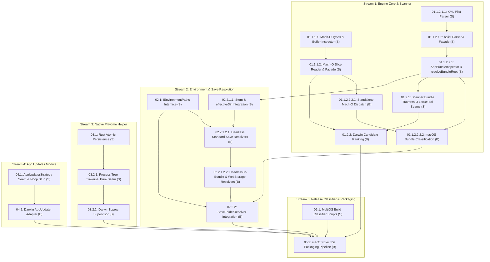

# PRD: Codebase Readiness for MultiOS Platform Support

## Executive Summary
Before implementing direct macOS or expanded Linux features, this PRD establishes preparatory structural refactoring ($S$) followed by Darwin behavioral expansion ($B$) across YumeShelf. Decoupling hardcoded Windows/Linux assumptions into narrow, deep abstractions (*AppUpdaterStrategy*, *IEnvironmentPaths*, bounded *MachOInspector*, and macOS bundle resolution) prevents cross-OS state leakage, enforces engine seam isolation per `AGENTS.md`, and guarantees the codebase is strictly cross-platform ready for automated in-memory CI testing. Darwin process tree supervision is achieved via conditional compilation (`#[cfg(target_os = "macos")]`) in `native/playtime-helper` utilizing `libproc` C FFI routines (`proc_listpids`, `proc_pidinfo`), accompanied by a defensive fallback stub for unsupported platforms.

## User Review Required
> [!IMPORTANT]
> This epic establishes preparatory structural refactoring ($S$) followed by Darwin behavioral expansion ($B$). It unblocks clean multi-OS platform extension and automated in-memory cross-platform CI testing without regressions on Windows or Linux.

## 4-Axis Codebase Readiness Scorecard (Kent Beck Governance)

1. **Maintainability (Locality & Cohesion)**:
   - *Current Friction*: Platform branching is scattered across scanner heuristics, save resolution, update loops, and process monitors.
   - *Target State*: Platform-specific execution logic is encapsulated inside dedicated strategy adapters, leaving core business logic 100% platform-agnostic.
2. **Extensibility (Structural Seams & Adapters)**:
   - *Current Friction*: `AppUpdatesModule` directly instantiates `NsisUpdater`; scanner contains hardcoded `.exe` heuristics.
   - *Target State*: Polymorphic interfaces (`AppUpdaterStrategy`, `IEnvironmentPaths`, `MachOInspector`) allow adding macOS/Linux implementations without modifying calling modules.
3. **Debuggability (Interface Test Surface)**:
   - *Current Friction*: Testing macOS or Linux paths on Windows CI requires live OS environments or brittle mocking of global modules.
   - *Target State*: 100% in-memory virtual testing via `MockFileSystemProvider` and test seams for Mach-O headers, Darwin save paths, and update feeds.
4. **Updatability (Shallowness & Deletion Test)**:
   - *Current Friction*: Deleting or altering Windows updater or save resolver requires untangling mixed OS conditionals.
   - *Target State*: Self-contained strategy adapters can be added, updated, or removed with zero modifications to consumer code.

## Architectural Transition Mapping & Kent Beck Tidying Taxonomy

| Transition Dimension | Current Tangled Landing Zone | Proposed Paved Landing Zone |
| :--- | :--- | :--- |
| **Module Structure** | Monolithic OS conditionals scattered across `src/main/`. | Deep polymorphic strategy modules behind simple interfaces; all binary inspection isolated in `@yumeshelf/engine`. |
| **Dependency Path** | Direct coupling between callers and `NsisUpdater` / hardcoded `%APPDATA%` paths. | Decoupled execution paths isolated via `IEnvironmentPaths` and `AppUpdaterStrategy`. |
| **Code Locations** | Scattered platform checks in main process. | Consolidated engine core in `@yumeshelf/engine` and dedicated strategy adapters in `src/main/`. |

### Tidying Execution Sequence ($S \to B$)
- **Structural Tidying Step 1 ($S_1$)**: Implement `MachOInspector`, `plist-parser`, `AppBundleInspector`, `resolveBundleRoot`, and canonical platform types in `@yumeshelf/engine`, re-exporting them from barrel index (*New Interface, Old Impl*).
- **Structural Tidying Step 2 ($S_2$)**: Expand `IEnvironmentPaths` with macOS directory methods in `@yumeshelf/engine`, declare optional methods on `FileSystemProvider` in `src/main/save-folder-resolver/types.ts`, and forward across the inline `unifiedFs` adapter (*Normalize Symmetries / Extract Helper*).
- **Structural Tidying Step 2b ($S_{2\text{b}}$)**: Re-export `resolveBundleRoot` from barrel index, update `getExeStem`, and integrate `effectiveDir` across all child save resolvers in `packages/yume-engine/src/save-resolvers/index.ts` (*Normalize Symmetries / Extract Helper*).
- **Structural Tidying Step 3 ($S_3$)**: Implement shared `write_atomic` helper with retry backoff and collision caps in Rust playtime helper (*Extract Helper / Normalize Symmetries*).
- **Structural Tidying Step 3b ($S_{3\text{b}}$)**: Extract pure process tree traversal seam `pid_tree_has_live_members_from_relations` (*Extract Helper*), two-tiered error handling, and sized `proc_listpids` dynamic buffer allocation in `native/playtime-helper/src/main.rs`.
- **Structural Tidying Step 4 ($S_4$)**: Establish `AppUpdaterStrategy` and `AppUpdateCheckResult` interfaces with `AppUpdaterActionResult`, implement `NoopUpdaterStrategy` fallback, and wrap `NsisUpdater` inside `NsisUpdaterStrategyAdapter` (*New Interface, Old Impl*).
- **Structural Tidying Step 5 ($S_5$)**: Implement leaf `.app` directory traversal, defensive Dirent inspection, and `resolvedExePath` assignment in `scanner.ts` `collectGameCandidates` (*Extract Helper*).
- **Behavioral Expansion ($B$)**: Implement standalone Mach-O binary dispatch, bundle engine classification heuristics, pure 6-tier Darwin candidate ranking in `pickPreferredExecutable`, Darwin save resolvers, Darwin `libproc` process supervision, macOS updater strategy adapter, and release artifact classifier.

## Proposed Changes & Architectural Seams

### 1. Canonical Types & Headless Mach-O / Bundle Inspection (`@yumeshelf/engine`)
- Resides strictly in `packages/yume-engine/` per `AGENTS.md`.
- Export canonical TypeScript types in `packages/yume-engine/src/types.ts`:
  ```typescript
  export type PlatformType = 'windows' | 'linux' | 'macos';

  export interface MachOInspectionResult {
    magic: number;
    arch: 'x64' | 'arm64' | 'x86' | 'fat' | 'unknown';
    is64Bit: boolean;
    isLittleEndian: boolean;
    isFat: boolean;
    fatArchitectures?: Array<{ cputype: number; cpusubtype: number; offset: number; size: number }>;
  }

  export interface AppBundleInspectionResult {
    bundlePath: string;
    executablePath: string | null;
    executableName: string | null;
    bundleIdentifier: string | null;
    bundleName: string | null;
    displayName: string | null;
  }
  ```
- Widen `GameEngineProfile.arch` in `packages/yume-engine/src/types.ts` to `'x64' | 'arm64' | 'x86' | 'fat' | 'unknown'`.
- Widen `GameEngineProfile.saveStrategy` in `packages/yume-engine/src/types.ts` to include macOS bundle save strategies: `'unity-appsupport-playerprefs' | 'rpgmaker-bundle-data' | 'renpy-appsupport-saves' | 'godot-appsupport-user'`.
- Ensure all newly introduced TypeScript classes in `packages/yume-engine/src/` (such as `MachOInspector`, `AppBundleInspector`, `XmlPlistParser`, `BPlistParser`) explicitly declare class field properties outside constructor parameter lists to ensure compatibility with Node.js native type stripping (`node --experimental-strip-types`).
- In `packages/yume-engine/src/index.ts`, re-export `MachOInspector`, `AppBundleInspector`, `parsePlist`, and `resolveBundleRoot` (via `export * from './binary/index.js'` and `export * from './bundle/index.js'`) ensuring downstream main process modules and tests import them cleanly.
- Implement `resolveBundleRoot(path: string): string | null` in `packages/yume-engine/src/bundle/app-bundle-inspector.ts` (detecting `.app` directory boundaries for both outer `.app` folders and inner binary paths, normalizing both `/` and `\` cross-platform).
- **Bounded Header Reading & Universal FAT Parsing**:
  - Expose `MachOInspector.inspect(buffer: Uint8Array | Buffer, fileSize?: number): MachOInspectionResult` operating directly on an in-memory buffer, providing the canonical entry point for synthetic byte inspection tests in `packages/yume-engine/tests/macho-inspector.test.ts`.
  - Expose `MachOInspector.fromPath(filePath: string, fs?: IFileSystem)` and `YumeEngine.inspectMachOFile(filePath: string, fs?: IFileSystem)` reading only a bounded $\le 4\text{KB}$ header slice via file handles in a `try...finally` block guaranteeing handle closure and bounded memory usage ($\le 64\text{KB}$). Support 64-bit FAT headers (`0xCAFEBABF`, `0xBFBAFECA`) and 32-bit FAT headers (`0xCAFEBABE`, `0xBEBAFECA`).
  - During Universal FAT header inspection:
    - Guard against Java `.class` magic collision by asserting `nfat_arch >= 1 && nfat_arch < 30` when reading `0xCAFEBABE`.
    - Validate that the in-memory FAT architecture descriptor table fits within the header slice: `8 + (is64Bit ? 32 : 20) * nfat_arch <= buffer.length`.
    - Validate individual architecture slice bounds (`Number(offset) + Number(size) <= fileSize`) against the total file size when `fileSize` is known or when inspecting a complete in-memory buffer, preventing false out-of-bounds rejections on bounded 4KB header slices.
- **Headless Property List Parsers**: Implement XML parser (`xml-plist-parser.ts`) and binary `bplist00` deserializer (`bplist-parser.ts`) with unified facade `parsePlist(content: Buffer | Uint8Array | string)`:
  - In `xml-plist-parser.ts`: Strip leading UTF-8 Byte Order Marks (`\uFEFF`) before token stream processing. Prohibit external DTD resolution and external entity loading (`<!ENTITY ...>`) to prevent XXE attacks; restrict entity decoding strictly to predefined standard XML entities (`&amp;`, `&lt;`, `&gt;`, `&quot;`, `&apos;`); enforce a maximum input buffer size threshold of 5 MB and maximum recursion depth limit of 64 levels to prevent entity expansion (DoS) bombs. Gracefully handle XML comment blocks (`<!-- ... -->`) and `<![CDATA[...]]>` sections during tokenization.
  - In both XML and binary Plist parsers: Construct deserialized `<dict>` objects with `Object.create(null)` or sanitize/strip unsafe prototype keys (`__proto__`, `constructor`, `prototype`) to defend against prototype pollution attacks in runtime consumers.
  - In `bplist-parser.ts`: Implement recursion depth bounds (max depth 64) and cyclic reference tracking during offset resolution. Handle Apple Cocoa epoch offset (`978307200` seconds) when decoding `0x33` 8-byte double date values.
- In `AppBundleInspector.fromPath`:
  - Sanitize `CFBundleExecutable` read from `Contents/Info.plist`: strip leading path separators and verify that `path.basename(CFBundleExecutable) === CFBundleExecutable`, `CFBundleExecutable !== '.' && CFBundleExecutable !== '..'`, and that `path.join(bundlePath, 'Contents', 'MacOS', CFBundleExecutable)` strictly resides within `${bundlePath}/Contents/MacOS/`. If traversal sequences (`..`) or paths escaping `Contents/MacOS/` are detected, safely reject and fall back to `Contents/MacOS/<bundle-name>` or return `null`.
- **Unified Facade Inspection & Bundle Engine Classification**: Wire `YumeEngine.inspectExecutable(targetPath: string, fs?: IFileSystem, parentFiles?: string[]): Promise<GameEngineProfile>`:
  - Call `resolveBundleRoot(targetPath) || (targetPath.endsWith('.app') ? targetPath : null)`.
  - If bundle root detected: routes to `AppBundleInspector.fromPath(bundleRoot, fs)` and classifies engine family and save strategy based on bundle layout markers, populating all mandatory `GameEngineProfile` fields (including `arch`):
    - Unity bundle layout (`Contents/Resources/Data/` or `Contents/Frameworks/UnityPlayer.dylib`) $\to$ `family: 'unity'`, `tag: 'Unity'`, `variant: 'standard'`, `arch: machoArch || 'unknown'`, `runtime: 'native'`, `saveStrategy: 'unity-appsupport-playerprefs'`, `detectedBy: 'macOS App Bundle (Unity)'`
    - RPG Maker MV/MZ bundle layout (`Contents/Resources/app.nw/`) $\to$ `family: 'rpg-maker'`, `tag: 'RPGM'`, `variant: isMZ ? 'mz' : 'mv'`, `arch: machoArch || 'unknown'`, `runtime: 'nwjs'`, `saveStrategy: 'rpgmaker-bundle-data'`, `detectedBy: 'macOS App Bundle (RPG Maker)'`
    - Ren'Py bundle layout (`Contents/Resources/autorun/` or `Contents/MacOS/` containing `.py`/`.pyo`) $\to$ `family: 'renpy'`, `tag: "Ren'Py"`, `variant: 'standard'`, `arch: machoArch || 'unknown'`, `runtime: 'python'`, `saveStrategy: 'renpy-appsupport-saves'`, `detectedBy: "macOS App Bundle (Ren'Py)"`
    - Godot bundle layout (`Contents/Resources/` containing `.pck`) $\to$ `family: 'godot'`, `tag: 'Godot'`, `variant: 'standard'`, `arch: machoArch || 'unknown'`, `runtime: 'native'`, `saveStrategy: 'godot-appsupport-user'`, `detectedBy: 'macOS App Bundle (Godot)'`
    - Unreal bundle layout $\to$ `family: 'unreal'`, `tag: 'Unreal Engine'`, `variant: 'standard'`, `arch: machoArch || 'unknown'`, `saveStrategy: 'unreal-sav'`, `runtime: 'native'`, `detectedBy: 'macOS App Bundle (Unreal Engine)'`
    - If unclassified, set `family: 'unknown'`, `tag: 'Others'`, `variant: 'standard'`, `arch: machoArch || 'unknown'`, `runtime: 'native'`, `saveStrategy: 'unknown'`, `detectedBy: 'macOS App Bundle (Unclassified)'`.
  - Else (standalone binary):
    - Inspect initial header bytes ($\le 4\text{KB}$):
      - If Mach-O magic (`0xFEEDFACE`, `0xFEEDFACF`, `0xCEFAEDFE`, `0xCFFAEDFE`, `0xCAFEBABE`, `0xBEBAFECA`, `0xCAFEBABF`, `0xBFBAFECA`): inspects via `MachOInspector`. If inspection succeeds, returns `family: 'native'`, `tag: 'Others'`, `variant: 'standard'`, `arch: macho.arch`, `runtime: 'native'`, `saveStrategy: 'unknown'`, `detectedBy: 'Mach-O Binary'`; if inspection returns `null` (e.g. truncated binary), safely constructs a fallback profile with `arch: 'unknown'`, `family: 'native'`, `tag: 'Others'`, `variant: 'standard'`, `runtime: 'native'`, `saveStrategy: 'unknown'`, `detectedBy: 'Mach-O Binary'`.
      - Else: inspects via `PEInspector` (falling back gracefully to an empty non-PE profile for non-PE binaries) and resolves classification via `defaultRuleRegistry.resolve(inspector, exePath, parentFiles, fs)`.

### 2. MultiOS Save Folder Discovery & Engine Resolvers (`@yumeshelf/engine` & `src/main/`)
- In `packages/yume-engine/src/save-resolvers/index.ts`:
  - Import `resolveBundleRoot` from `../bundle/app-bundle-inspector.js`.
  - In `resolveSaveDirectory(profile, exePath, fs)`:
    ```typescript
    const bundleRoot = resolveBundleRoot(exePath);
    const effectiveDir = bundleRoot || dirName(exePath);
    ```
  - `effectiveDir` explicitly replaces `exeDir` across all subsequent child save resolver calls (`resolveRpgMakerSave`, `resolveRenPySave`, `resolveUnitySave`, `resolveUnrealSave`, `resolveGodotSave`, `resolveUserProfileSave`, `heuristicSaveScan`, `appDataFuzzyMatch`).
- `getExeStem(exePath: string, bundleRoot?: string | null): string`: Pure string path utility in `packages/yume-engine/src/save-resolvers/path-utils.ts` operating strictly without `node:path` imports. Implements an internal pure string `extName(p: string)` helper (or regex extension stripping `baseName(exePath).replace(/\.(exe|x86_64|x86|appimage|sh)$/i, '')`). When `bundleRoot` is provided (or when `baseName(exePath).endsWith('.app')`), computes stem from `baseName(bundleRoot, '.app')`; otherwise computes from `baseName(exePath, extName(exePath))`. In `save-resolvers/index.ts`, callers pass the already-resolved `bundleRoot` directly into `getExeStem(exePath, bundleRoot)`. This prevents circular module dependencies between `path-utils.ts` and `app-bundle-inspector.ts`.
- In `getExeStem(exePath: string, bundleRoot?: string | null)` and engine save resolvers (`resolveGodotSave`, `resolveRenPySave`, `resolveUnitySave`, `resolveUnrealSave`, `resolveRpgMakerSave`):
  - Normalize trailing slashes and sanitize all stem components, bundle identifiers, and extracted company/product/application names (from `app.info`, `package.json`, or bundle markers) by stripping path separators (`/`, `\`), null bytes (`\0`, `%00`), and directory traversal tokens (`..`).
  - Mandate that all sanitized path components (`company`, `product`, `name`, `exeStem`) must have non-zero length after trimming and stripping path separators / null bytes. If any required token evaluates to an empty string, safely reject the candidate and return `null`.
  - Verify that resolved save directory paths are strictly bounded within the expected root directory (`getMacApplicationSupportHome()`, `getMacPreferencesHome()`, or `.app` bundle root) and do not equal the root directory directly before returning them to callers.
- In `packages/yume-engine/src/types.ts`:
  - Extend `IEnvironmentPaths` interface with optional `getMacApplicationSupportHome?()` (`~/Library/Application Support`) and `getMacPreferencesHome?()` (`~/Library/Preferences`).
- In `src/main/save-folder-resolver/types.ts`:
  - Add optional declarations `getMacApplicationSupportHome?(): string;` and `getMacPreferencesHome?(): string;` to `FileSystemProvider`.
- In `src/main/save-folder-resolver/index.ts`:
  - In `SaveFolderResolver.resolve`: Require diagnostic warning logging (`console.warn('[SAVE-RESOLVER][ERROR]', error)`) capturing the failing `exePath` and error stack in catch blocks before returning graceful fallback responses.
  - Update `mapEngineType` to support macOS bundle save strategies:
    - `'rpgmaker-bundle-data'` $\to$ `'rpg-mv-mz'`
    - `'unity-appsupport-playerprefs'` $\to$ `'unity'`
    - `'renpy-appsupport-saves'` $\to$ `'renpy'`
    - `'godot-appsupport-user'` $\to$ `'godot'`
- Implement methods across `NodeFileSystemProvider` and mock providers:
  - In `packages/yume-engine/tests/fixtures/mock-fs-provider.ts`:
    ```typescript
    export interface MockFileSystemOptions {
      macApplicationSupportHome?: string;
      macPreferencesHome?: string;
      [key: string]: any;
    }

    private macApplicationSupportHome: string;
    private macPreferencesHome: string;

    constructor(options: MockFileSystemOptions = {}) {
      this.macApplicationSupportHome = options.macApplicationSupportHome ?? '/Users/MockUser/Library/Application Support';
      this.macPreferencesHome = options.macPreferencesHome ?? '/Users/MockUser/Library/Preferences';
    }

    getMacApplicationSupportHome(): string {
      return this.macApplicationSupportHome;
    }
    getMacPreferencesHome(): string {
      return this.macPreferencesHome;
    }
    ```
  - In `src/main/save-folder-resolver/fs-provider.ts` (`MockFileSystemProvider`):
    ```typescript
    getMacApplicationSupportHome(): string {
      return this.env.get('MAC_APP_SUPPORT_HOME') || this.join(this.getHomeDir(), 'Library', 'Application Support');
    }
    getMacPreferencesHome(): string {
      return this.env.get('MAC_PREFERENCES_HOME') || this.join(this.getHomeDir(), 'Library', 'Preferences');
    }
    ```
  - In `DefaultFileSystemProvider` (`src/main/save-folder-resolver/fs-provider.ts`): Return empty string if `os.homedir()` / `process.env.HOME` is empty or undefined, preventing relative path fallback.
- Forward methods across the inline `unifiedFs` adapter in `src/main/save-folder-resolver/index.ts`.
- Update engine save resolvers (`packages/yume-engine/src/save-resolvers/engine-save-resolvers.ts`) to resolve macOS save paths for Unity, Ren'Py, Unreal, Godot, and RPG Maker MV/MZ, inspecting `Contents/Resources/Data/` and `Contents/Resources/app.nw/` inside bundles. Handle both CRLF and LF line endings in `app.info`.

### 3. Darwin Candidate Ranking Hierarchy & Scanner (`src/main/library-state/scanner.ts`)
- Import canonical `PlatformType` from `@yumeshelf/engine`.
- Extend and widen domain models:
  ```typescript
  export interface ExecutableCandidate {
    name: string;
    platform: PlatformType;
    resolvedExePath?: string;
  }

  export interface CandidateGame {
    folderPath: string;
    exePath: string;
    platform: PlatformType;
  }

  export async function isRecognizedExecutable(
    entry: { name: string; isFile: () => boolean; isDirectory?: () => boolean },
    folderPath: string,
    fs: any,
    targetPlatform?: NodeJS.Platform
  ): Promise<{ isExecutable: boolean; platform: PlatformType; resolvedExePath?: string }>;

  export function pickPreferredExecutable(
    currentPath: string,
    executableEntries: ExecutableCandidate[],
    targetPlatform?: NodeJS.Platform
  ): { exePath: string; platform: PlatformType } | null;
  ```
- In `isRecognizedExecutable`:
  - Order the `.app` bundle recognition check **prior** to the `if (!entry.isFile())` check, and guard it defensively:
    ```typescript
    if (targetPlatform === 'darwin' && typeof entry.isDirectory === 'function' && entry.isDirectory() && entry.name.endsWith('.app')) {
      const bundlePath = path.join(folderPath, entry.name);
      const bundleInfo = await AppBundleInspector.fromPath(bundlePath, fs);
      const resolvedExePath = bundleInfo?.executablePath || (await fs.exists?.(path.join(bundlePath, 'Contents', 'MacOS', path.basename(entry.name, '.app'))) ? path.join(bundlePath, 'Contents', 'MacOS', path.basename(entry.name, '.app')) : undefined);
      return { isExecutable: true, platform: 'macos', resolvedExePath };
    }
    if (!entry.isFile()) {
      return { isExecutable: false, platform: 'windows' };
    }
    ```
  - When `targetPlatform === 'darwin'` and `entry.isFile()` is true, but the provided `fs` lacks both `open` and `readFile` methods, safely return `{ isExecutable: false, platform: 'windows' }` without delegating to host filesystem I/O (`node:fs/promises`).
- In `tests/scanner-cross-platform.test.js`:
  - Extend fixture `createMockFs(fileTree)` to implement mock handles matching `IFileSystem`:
    - `readFile(filePath: string): Promise<Buffer>`: returns Buffer of synthetic file contents from `fileTree`.
    - `exists(filePath: string): Promise<boolean>`: checks path presence in `fileTree`.
    - `open(filePath: string, flags?: string): Promise<{ read: Function, close: Function }>`: returns mock file handle reading bounded slices from `fileTree` Buffer in-memory.
- In `collectGameCandidates`:
  - Step 1: Intercept `.app` bundle directories (`entry.isDirectory() && entry.name.endsWith('.app')`) as candidate bundle leaves and exclude them from recursive descent into `Contents/`.
  - For each intercepted `.app` bundle:
    - Resolve the main executable path via `AppBundleInspector.fromPath(bundlePath, fs)`.
    - If bundle inspection yields `null` or `executablePath: null`, attempt fallback to the canonical binary path (`path.join(bundlePath, 'Contents', 'MacOS', path.basename(bundlePath, '.app'))`) if it exists on disk, or log a standardized diagnostic warning (`console.warn('[SCANNER][WARN] Unresolvable .app bundle at "${bundlePath}": executable missing or unreadable')`) and skip the unresolvable directory.
    - Yield each valid `.app` bundle directly as an independent `CandidateGame` instance (`folderPath: bundlePath, exePath: resolvedExePath, platform: 'macos'`) into `nestedCandidates`.
    - When a parent directory contains multiple `.app` bundles ($N \ge 2$), Resolution Matrix Case A naturally identifies the directory as a Container/Category folder and preserves all child games without silent dropping.
  - Step 2: In direct executable candidate evaluation for `currentPath`, evaluate files and non-bundle directories, explicitly excluding `.app` directory entries that were already intercepted in Step 1. This eliminates redundant $2 \times I/O$ bundle re-inspections and prevents candidate clobbering in Resolution Matrix Case B.
  - In Resolution Matrix Case B (`nestedCandidates.length === 1`): Ensure `directCandidate` does not override `nestedCandidates[0]` when `nestedCandidates[0]` is a host-native macOS `.app` bundle while `directCandidate` is non-native (`targetPlatform === 'darwin' && nestedCandidates[0].platform === 'macos' && directCandidate.platform !== 'macos'`).
  - Ensure native `.app` bundles take precedence over loose non-native executables (e.g. loose `.exe` files in the same directory).
- Candidate evaluation and ranking functions consume injectable `targetPlatform: NodeJS.Platform = process.platform` (`targetPlatform === 'darwin'`) to enable 100% in-memory virtual testing on CI.
- In `pickPreferredExecutable`:
  - Evaluates candidates within a single game folder using the 6-tier Darwin hierarchy:
    1. Host-native `.app` bundle matching folder base name
    2. Any host-native `.app` bundle
    3. Standalone Mach-O binary matching folder base name
    4. Any standalone Mach-O binary
    5. Host-native launcher scripts (`start.sh`, `launch.sh`)
    6. Cross-platform fallback (`.exe`, Linux binaries)
  - Returns `{ exePath: preferred.resolvedExePath || path.join(currentPath, preferred.name), platform: preferred.platform }`.

### 4. Rust Playtime Helper MultiOS Process Supervision (`native/playtime-helper/`)
- In `native/playtime-helper/Cargo.toml`, declare the target-specific macOS dependency:
  ```toml
  [target.'cfg(target_os = "macos")'.dependencies]
  libc = "0.2"
  ```
- In `native/playtime-helper/src/main.rs`, implement two-tiered error handling in `main()`:
  - If `parse_args()` returns `Err`, print the error to `stderr` (`eprintln!("[playtime-helper][FATAL] argument parsing failed: {err:#}");`) and return `Err(err)` immediately without attempting to access `config.log_path`.
  - Once `config` is successfully parsed, any runtime error returned by `run_launch_mode(&config)`, `run_attach_mode(&config)`, or child monitoring is logged to `config.log_path` via `append_log` prior to process termination.
- Extract shared `write_atomic(dest_path: &Path, content: &str) -> Result<()>` helper writing to `<dest_path>.tmp.<pid>.<timestamp_ms>_<counter>` (where `<counter>` is a process-global monotonic atomic counter using `AtomicU64::fetch_add(1, Ordering::Relaxed)` preventing same-millisecond collisions):
  - Verify and create missing parent directories (`if let Some(parent) = dest_path.parent() { if !parent.as_os_str().is_empty() { fs::create_dir_all(parent)?; } }`) before opening the temporary file with `create_new(true)`.
  - Bound temporary file creation attempts on `std::io::ErrorKind::AlreadyExists` to a maximum of 10 retries before returning a typed `std::io::Error` (`"failed to create unique temporary file after 10 attempts"`).
  - Create temporary files with exclusive creation flags (`OpenOptions::new().write(true).create_new(true)`).
  - On Unix targets (`#[cfg(unix)]`), set restrictive file permissions mode `0o600` (`std::os::unix::fs::OpenOptionsExt::mode(0o600)`) on temporary files.
  - Ensure temporary file handles are explicitly synced (`f.sync_all()?`) and dropped out of scope via a scoped block `{ let mut f = ...; f.write_all(...)?; f.sync_all()?; }` before executing `fs::rename` to prevent Win32 sharing violations (`ERROR_SHARING_VIOLATION`).
  - Guarantee temporary file cleanup on all failure paths: wrap the file write, flush, and sync operations in an error-handling block that executes `let _ = fs::remove_file(&temp_path);` whenever an error occurs prior to or during the atomic rename, including when all rename retries are exhausted.
  - Provide a test-configurable retry backoff and temporary path generator seam under `#[cfg(test)]` (e.g. `write_atomic_with_retry_config` taking an optional path generator closure `FnMut(&Path, u32) -> PathBuf` and 0ms delay) allowing unit tests to deterministically simulate 10 consecutive collisions, asserting the retry exhaustion limit and cleanup without timing races. In production, use pseudo-hash jitter.
  - Apply across both `update_db_finalize` and `write_journal`.
- Decouple pure function `pid_tree_has_live_members_from_relations(root_pid: u32, relations: &[(u32, u32)]) -> bool` with pre-allocated capacity (`HashSet::with_capacity(relations.len())`) and bounded traversal depth (`MAX_TREE_DEPTH = 128`), returning `false` immediately if `relations.is_empty()`.
- In Darwin `libproc` process tree traversal (`#[cfg(target_os = "macos")]`):
  - Allocate a sized vector in Rust with minimum capacity `2048` entries (`let mut pids: Vec<pid_t> = Vec::with_capacity(2048)`).
  - Pass raw buffer pointer to `proc_listpids`. If returned byte count indicates the buffer was completely filled (`ret == (pids.capacity() * std::mem::size_of::<pid_t>()) as i32`), dynamically grow the buffer and re-query to guarantee no running processes are truncated. Rust retains exclusive allocator ownership and deallocation.
  - Query parent PID via `proc_pidinfo` with `PROC_PIDTASKALLINFO` per process with error isolation (`EPERM`/`ESRCH`).
- Retain defensive fallback stub `#[cfg(not(any(windows, target_os = "linux", target_os = "macos")))]`.

### 5. App Updater Strategy Seam (`src/main/app-updates/`)
- Define `AppUpdateCheckResult`, `AppUpdaterActionResult`, and `AppUpdaterStrategy` interfaces in `src/main/app-updates/updater-strategy.ts`:
  ```typescript
  export interface AppUpdateCheckResult {
    attempted: boolean;
    available: boolean;
    canSelfUpdate?: boolean;
    checksumSha256?: string | null;
    deferredUntilNextLaunch?: boolean;
    downloadable?: boolean;
    downloadReady?: boolean;
    error?: any;
    fallbackReason?: string | null;
    offline?: boolean;
    releaseName?: string;
    releaseNotes?: string;
    releaseUrl?: string;
    selfApplicable?: boolean;
    source?: string;
    timedOut?: boolean;
    version?: string | null;
    [key: string]: any;
  }

  export interface AppUpdaterActionResult {
    ok: boolean;
    reason?: string;
    [key: string]: any;
  }

  export interface AppUpdaterStrategyOptions {
    app?: any;
    broadcastStatus?: (status: any) => void;
    updateCacheDir?: string;
    resolveFeedOverride?: () => Promise<any>;
    compareVersions?: (a: string, b: string) => number;
    execCommand?: (command: string, args: string[], options?: any) => Promise<{ stdout: string; stderr: string; exitCode?: number }>;
    downloadTimeoutMs?: number;
    fetch?: typeof fetch;
    downloadFile?: (url: string, destPath: string, options?: { timeoutMs?: number; signal?: AbortSignal }) => Promise<{ bytesDownloaded: number }>;
    [key: string]: any;
  }

  export interface AppUpdaterStrategy {
    checkForUpdates(): Promise<AppUpdateCheckResult>;
    downloadUpdate(releaseMetadata?: any): Promise<AppUpdaterActionResult>;
    installDownloadedUpdateNow(releaseMetadata?: any): Promise<AppUpdaterActionResult>;
    summarizeUpdateState(update: any): any;
    scheduleInstallOnNextLaunch?(releaseMetadata?: any): Promise<AppUpdaterActionResult>;
    beginDeferredInstallOnLaunch?(): Promise<any>;
    prepareDeferredInstallOnLaunch?(): Promise<any>;
    runDeferredInstallOnLaunch?(): Promise<any>;
    dispose?(): void;
  }
  ```
- In `src/main/app-updates.ts`:
  - Extend `AppUpdateServicesOptions` with strategy injection seams:
    ```typescript
    export interface AppUpdateServicesOptions {
      app: any;
      broadcastStatus: (payload: any) => void;
      compareVersions: (left: string, right: string) => number;
      openExternalUrl: (url: string) => Promise<void> | void;
      startupNetworkTimeoutMs: number;
      updaterStrategy?: AppUpdaterStrategy;
      updaterOptions?: AppUpdaterStrategyOptions;
      platform?: NodeJS.Platform;
    }
    ```
  - In `createAppUpdateServices`, consume `options.updaterStrategy` if provided, falling back to `createAppUpdaterStrategy(options.updaterOptions, options.platform)`.
  - Wrap optional deferred installation methods with safe default fallbacks to prevent `TypeError` when using strategies that do not implement them:
    - `prepareDeferredInstallOnLaunch: () => typeof updater.prepareDeferredInstallOnLaunch === 'function' ? updater.prepareDeferredInstallOnLaunch() : Promise.resolve({ pending: false })`
    - `beginDeferredInstallOnLaunch: () => typeof updater.beginDeferredInstallOnLaunch === 'function' ? updater.beginDeferredInstallOnLaunch() : Promise.resolve({ ok: false, reason: 'unsupported' })`
    - `runDeferredInstallOnLaunch: () => typeof updater.runDeferredInstallOnLaunch === 'function' ? updater.runDeferredInstallOnLaunch() : Promise.resolve({ ok: false, reason: 'unsupported' })`
  - Expose `dispose(): void` on `AppUpdateServices` delegating to `updater.dispose?.()` to clean up background timers and listeners cleanly during application shutdown and test `afterEach` hooks.
- In `src/main/app-updates/updater-strategy.ts`:
  - Require `NsisUpdaterStrategyAdapter` and `NoopUpdaterStrategy` to implement an explicit `dispose(): void` method (as safe no-ops or detaching any registered listeners), ensuring polymorphic calls via `AppUpdateServices.dispose()` execute cleanly without `TypeError`.
- Generalize `pickExpectedSha512` in `src/main/app-updates/updater-strategy.ts` and `src/main/nsis-updater/update-info.ts` to support `.dmg` and `.zip` Darwin artifacts alongside `.exe`.
- In `src/main/app-updates/check-service.ts`, `download-install.ts`, and `helpers.ts`, resolve the updater instance via an ingress compatibility seam:
  ```typescript
  const updater: AppUpdaterStrategy = context.updaterStrategy || context.nsisUpdaterService || new NoopUpdaterStrategy();
  ```
  This ensures seamless backwards compatibility with existing test fixtures and callers injecting `context.nsisUpdaterService`.
- In `src/main/app-updates/helpers.ts`, update `enrichUpdateInfo` to branch on `if (runtimeStrategy.channel === 'nsis' || runtimeStrategy.channel === 'mac')`, ensuring `resolveNewerReleases` populates `enriched.releaseName`, stacked `enriched.releaseNotes`, and `enriched.releaseUrl` across both Windows NSIS and macOS release channels.
- In `src/main/app-updates/download-install.ts`, defensively guard optional `scheduleInstallOnNextLaunch` calls (`typeof updater.scheduleInstallOnNextLaunch === 'function'`), returning `{ ok: false, reason: 'unsupported' }` when not implemented by the active strategy.
- In `src/main/app-updates/runtime-strategy.ts`:
  Update `resolveRuntimeUpdateStrategy(app, isFakeVersionRun)` to branch on `process.platform === 'darwin'` for packaged applications:
  ```typescript
  if (app.isPackaged) {
      if (process.platform === 'darwin') {
          return {
              artifactKind: 'mac-dmg',
              channel: 'mac',
              manualFallbackReason: null,
              supportsInPlaceApply: true,
              supportsUpdater: true
          };
      }
      return {
          artifactKind: 'nsis-installer',
          channel: 'nsis',
          manualFallbackReason: null,
          supportsInPlaceApply: true,
          supportsUpdater: true
      };
  }
  ```
- Expand `RuntimeUpdateStrategy` in `src/main/app-updates/runtime-strategy.ts`:
  ```typescript
  export type UpdateChannel = 'nsis' | 'mac' | 'development' | 'portable-legacy';
  export type UpdateArtifactKind = 'nsis-installer' | 'mac-dmg' | 'mac-zip' | 'portable-exe';
  ```
- Implement `NsisUpdaterStrategyAdapter` wrapping `NsisUpdaterService` (preserving all 11 existing tests in `tests/app-updates-background.test.js`) and update `check-service.ts` and `download-install.ts` to consume `context.updaterStrategy`.
- Update strategy factory signature to `createAppUpdaterStrategy(options?: AppUpdaterStrategyOptions, platform?: string): AppUpdaterStrategy`, passing contextual dependencies to `NsisUpdaterStrategyAdapter` and `MacUpdaterStrategyAdapter`. Default cleanly to `NoopUpdaterStrategy` on unsupported platforms returning `{ attempted: true, available: false, fallbackReason: 'unsupported-platform' }`.
- Implement `MacUpdaterStrategyAdapter` in `src/main/app-updates/mac-strategy.ts` and update `feed-resolver.ts` to parse `latest-mac.yml`.
- In `MacUpdaterStrategyAdapter`:
  - Consume `options.fetch ?? globalThis.fetch` (or `options.downloadFile`).
  - Maintain an internal `AbortController` and references to active download inactivity timers.
  - In `dispose()`, trigger `abortController.abort()` and clear any active timers to prevent dangling network handles and timer leaks in test runners.
  - Mandate `t.afterEach` hooks in `tests/app-updates.test.js` calling `adapter.dispose()`.
  - Support deterministic timeout testing in `tests/app-updates.test.js` via immediate `AbortController` / `AbortSignal.abort()` triggering or simulated stream errors in mock fetch / mock downloadFile, rather than awaiting real wall-clock elapsed time.
  - Emit structured diagnostic logs via `appendUpdateLog` across all update lifecycle phases (feed resolution, download, SHA-512 verification, `hdiutil attach/detach`, payload staging), recording command exit codes, stderr outputs, artifact paths, and expected vs computed digests upon any failure.
  - Record the temporary mount point from `hdiutil attach` and execute `hdiutil detach <mountPoint> -force` inside a guaranteed `try...finally` teardown block to prevent dangling disk images on verification failure or extraction abort.
  - Route all `hdiutil` commands through `options.execCommand` (defaulting to `child_process.execFile` with `shell: false` in production), passing `-nobrowse -readonly` to `hdiutil attach`. This allows unit testing on Windows CI via injected mock executors.
  - Use `options.downloadTimeoutMs ?? 30000` for HTTPS stream inactivity timeouts.
  - Remove partial temporary download files (`fs.rmSync(tempPath, { force: true })`) upon network dropouts, socket timeouts, or abort events.
  - Execute update installers, disk mount operations (`hdiutil attach`, `hdiutil detach`), and handoff commands using direct array parameterization (`options.execCommand` or `electron.shell.openPath`) rather than shell invocation wrappers (`child_process.exec`, `sh -c`, `system()`), preventing command injection vectors through update file paths or metadata.
  - Compute and strictly verify cryptographic checksum (SHA-512 / SHA-256) of downloaded `.dmg` or `.zip` files against `latest-mac.yml` before initiating mount or handoff. Mandate HTTPS transport for all update downloads, release feed queries, and custom provider endpoints (`new URL(url).protocol === 'https:'`).

### 6. Release Artifact Classifier Seam & macOS Packaging (`scripts/` & `package.json`)
- In `scripts/organize-build-output.js`:
  - Guard top-level CLI execution with `if (require.main === module) { main(); }`.
  - Parameterize directory roots by allowing `buildOutputDir` to be passed into `main(buildOutputDir = getBuildOutputDir())`, `classifyEntry(entryName, buildOutputDir)`, `normalizeNestedEntries(targetDir, classifier, buildOutputDir)`, and `moveEntry(entryName, destinationDir, buildOutputDir)`.
  - Export modular functions via `module.exports = { classifyEntry, normalizeNestedEntries, moveEntry, organizeBuildOutput: main }`.
  - In `classifyEntry`, intercept electron-builder unpacked directories (`'mac'`, `'mac-arm64'`, `'mac-universal'`) **before** evaluating `if (reservedNames.has(entryName))`, directing them to `unpackedOutputDir` (`build_output/unpacked/mac-unpacked`). This prevents collisions between the unpacked `.app` folder and the organized `build_output/mac` category folder.
- In `scripts/release-artifacts.js`:
  - Export full canonical contract of modular macOS helpers corresponding to existing Linux helpers: `getMacOutputDir(buildOutputDir)`, `getMacApplicationOutputDir(buildOutputDir)`, `getMacChecksumOutputDir(buildOutputDir)`, `getMacFeedOutputDir(buildOutputDir)`, `getMacBlockmapOutputDir(buildOutputDir)`, `isMacArtifactName(fileName)`, `isMacDmgArtifactName(fileName)`, `isMacZipArtifactName(fileName)`, `resolveMacArtifactPaths(version, buildOutputDir)`.
- In `scripts/write-release-checksum.js`:
  - Import `getMacApplicationOutputDir` and `getMacChecksumOutputDir` from `release-artifacts.js`.
  - Add `getMacApplicationOutputDir()` to `collectApplicationBinaries()`.
  - Route macOS artifacts (`.dmg`, `.zip`) to `getMacChecksumOutputDir()` in `resolveChecksumPath()`.
  - Add safety guard to `resolveNewestInstallerArtifactPath()` when only non-NSIS application binaries exist to avoid fatal null pointer exceptions on Darwin-only runners.
- In `package.json`:
  - Relocate Windows native executable mapping from root-level `build.extraResources` to `build.win.extraResources`:
    ```json
    "win": {
      "target": [
        "nsis"
      ],
      "icon": "assets/yumeshelf_icon_highres_4096.png",
      "extraResources": [
        {
          "from": "native/playtime-helper/target/release/playtime-helper.exe",
          "to": "native/playtime-helper/playtime-helper.exe"
        }
      ]
    }
    ```
  - Add electron-builder `build.mac` configuration:
    ```json
    "mac": {
      "target": ["dmg", "zip"],
      "icon": "assets/yumeshelf_icon_highres_4096.png",
      "category": "public.app-category.games",
      "artifactName": "${productName}-${version}.${ext}",
      "identity": null,
      "extraResources": [
        {
          "from": "native/playtime-helper/target/release/playtime-helper",
          "to": "native/playtime-helper/playtime-helper"
        }
      ]
    }
    ```
  - Add standardized `"build:mac"` npm script in `package.json` under `"scripts"`:
    `"build:mac": "cross-env CSC_IDENTITY_AUTO_DISCOVERY=false electron-builder --mac"`
  - Add standardized single-test script under `"scripts"`:
    `"test:single": "node --test"`
- In `tests/release-artifacts.test.js`:
  - Mandate `t.afterEach` teardown hooks that recursively remove temporary fixture directories (`fs.rm(tempDir, { recursive: true, force: true })`) to prevent test artifact accumulation on CI runners.
- Extend artifact organization scripts (`scripts/organize-build-output.js`, `scripts/release-artifacts.js`, `scripts/write-release-checksum.js`) to categorize `.dmg`, `.dmg.blockmap`, `.zip`, and `latest-mac.yml` into symmetric `build_output/mac/` directories (`application`, `feed`, `sha256`, `blockmap`, `unpacked/mac-unpacked`).

## Dependency DAG & Execution Sequencing



### Critical Path Analysis
The primary critical path spanning across all 5 streams consists of sequential dependency hops:
```text
01.1.2.1.1 (XML Plist Parser)
  └──> 01.1.2.1.2 (bplist00 Deserializer & Unified Facade)
        └──> 01.1.2.2.1 (App Bundle Inspector & resolveBundleRoot)
              ├──> 01.1.2.2.2.2 (macOS Bundle Layout Engine Classification) ────────┐
              └──> 02.2.1.1 (Bundle Root Stem & effectiveDir Integration)           │
                    └──> 02.2.1.2.1 (Standard AppSupport Save Resolvers) [02.1]     │
                          └──> 02.2.1.2.2 (In-Bundle & WebStorage Save Resolvers) ──┴──> 02.2.2 (SaveFolderResolver Cross-Platform Integration)
                                                                                                └──> 05.2 (macOS Electron Packaging Pipeline)
```

### Milestone Staging & Exit Gates

#### Milestone 1: Structural Seams & Headless Core MVP ($S$)
- **Scope**: Delivers pure in-memory parsers, interfaces, and test seams across all streams: `01.1.1.1`, `01.1.1.2`, `01.1.2.1.1`, `01.1.2.1.2`, `01.1.2.2.1`, `01.2.1`, `02.1`, `02.2.1.1`, `03.1`, `03.2.1`, `04.1`, `05.1`.
- **Exit Gate Verification**:
  - `pnpm --filter @yumeshelf/engine test` (100% passing headless unit tests, expected output: `pass`).
  - `cargo test --manifest-path native/playtime-helper/Cargo.toml` (100% passing Rust unit tests, expected output: `test result: ok.`).
  - `npm run build:main` (Main process TypeScript compiles cleanly).
  - `npx vitest run src/main/save-folder-resolver/save-folder-resolver.test.ts` (100% passing save folder resolver vitest suite, expected output: `✓ passed (100% pass)`).
  - `node --test tests/app-updates-background.test.js` (100% passing update strategy seam tests, expected output: `pass` / `ok`).
  - `node --test tests/scanner-cross-platform.test.js` (100% passing scanner bundle traversal tests, expected output: `pass` / `ok`).
  - `node --test tests/release-artifacts.test.js` (100% passing build classifier script tests, expected output: `pass` / `ok`).

#### Milestone 2: Darwin Behavioral Expansion ($B$)
- **Scope**: Implements Mach-O/bundle engine classification, Darwin scanner candidate ranking, Darwin save resolvers, `libproc` process supervision, and macOS app updater: `01.1.2.2.2.1`, `01.1.2.2.2.2`, `01.2.2`, `02.2.1.2.1`, `02.2.1.2.2`, `02.2.2`, `03.2.2`, `04.2`.
- **Exit Gate Verification**:
  - `pnpm --filter @yumeshelf/engine test && npm run build:main && npm test` (Full engine and main process test suites passing, including `node --test tests/scanner-cross-platform.test.js`, `node --test tests/save-folder-resolver-cross-platform.test.js`, `node --test tests/app-updates-background.test.js`, `node --test tests/app-updates.test.js`, and `node --test tests/release-artifacts.test.js`).
  - `cargo test --manifest-path native/playtime-helper/Cargo.toml` (100% passing Rust unit tests, expected output: `test result: ok. (all tests passed)`).
  - `npx vitest run src/main/save-folder-resolver/save-folder-resolver.test.ts` (100% passing save folder resolver vitest suite).

#### Milestone 3: Release Packaging & Verification
- **Scope**: MultiOS packaging configuration and Darwin build pipeline integration: `05.2`.
- **Exit Gate Verification**:
  - `node -e "const pkg = require('./package.json'); const assert = require('assert'); assert(pkg.scripts['build:mac'] && pkg.build.mac && pkg.build.mac.extraResources && pkg.build.win.extraResources); console.log('build:mac valid');"` (Expected output: `build:mac valid`).
  - `node --test tests/release-artifacts.test.js` (expected output: `pass` / `ok`).

## Verification Plan

### 1. Automated Test Execution Commands
- **Engine Core Test Suite**:
  ```bash
  pnpm --filter @yumeshelf/engine test
  # Expected stdout: pass / Tests passed (all unit tests passing)

  pnpm --filter @yumeshelf/engine build && node --experimental-strip-types --test packages/yume-engine/tests/macho-inspector.test.ts
  # Expected stdout: pass / ok

  pnpm --filter @yumeshelf/engine build && node --experimental-strip-types --test packages/yume-engine/tests/xml-plist-parser.test.ts
  # Expected stdout: pass / ok

  pnpm --filter @yumeshelf/engine build && node --experimental-strip-types --test packages/yume-engine/tests/bplist-parser.test.ts
  # Expected stdout: pass / ok

  pnpm --filter @yumeshelf/engine build && node --experimental-strip-types --test packages/yume-engine/tests/app-bundle-inspector.test.ts
  # Expected stdout: pass / ok

  pnpm --filter @yumeshelf/engine build && node --experimental-strip-types --test packages/yume-engine/tests/headless-save-resolvers.test.ts
  # Expected stdout: pass / ok
  ```
- **Main Process Unit & Integration Suites**:
  ```bash
  npm run build:main
  # Expected stdout: Clean build with exit code 0

  node --test tests/scanner-cross-platform.test.js
  # Or: npm run test:single -- tests/scanner-cross-platform.test.js
  # Expected stdout: pass / ok

  node --test tests/save-folder-resolver-cross-platform.test.js
  # Or: npm run test:single -- tests/save-folder-resolver-cross-platform.test.js
  # Expected stdout: pass / ok

  node --test tests/app-updates-background.test.js
  # Or: npm run test:single -- tests/app-updates-background.test.js
  # Expected stdout: pass / ok

  # Authored under Milestone 2 (Ticket 04.2):
  node --test tests/app-updates.test.js
  # Or: npm run test:single -- tests/app-updates.test.js
  # Expected stdout: pass / ok

  npx vitest run src/main/save-folder-resolver/save-folder-resolver.test.ts
  # Expected stdout: ✓ passed (100% pass)

  node --test tests/release-artifacts.test.js
  # Or: npm run test:single -- tests/release-artifacts.test.js
  # Expected stdout: pass / ok
  ```
- **Native Rust Helper Test Suite**:
  ```bash
  cargo test --manifest-path native/playtime-helper/Cargo.toml
  # Expected stdout: test result: ok. (all tests passed)
  ```
- **Milestone 3 Packaging Verification**:
  ```bash
  node -e "const pkg = require('./package.json'); const assert = require('assert'); assert(pkg.scripts['build:mac'] && pkg.build.mac && pkg.build.mac.extraResources && pkg.build.win.extraResources); console.log('build:mac valid');"
  # Expected stdout: build:mac valid
  ```

### 2. Acceptance Criteria & Edge Case Verification Matrix

| Edge Case / Robustness Requirement | Primary Automated Test Suite | Assertion & Verification Mechanism |
| :--- | :--- | :--- |
| **1. Java `.class` magic collision guard** | `packages/yume-engine/tests/macho-inspector.test.ts` | Asserts rejection of `0xCAFEBABE` when `nfat_arch < 1` or `nfat_arch >= 30`. |
| **2. FAT architecture table buffer slice bounds** | `packages/yume-engine/tests/macho-inspector.test.ts` | Asserts bounds check `8 + (is64Bit ? 32 : 20) * nfat_arch <= buffer.length`. |
| **3. BigInt-to-Number slice offset bounds** | `packages/yume-engine/tests/macho-inspector.test.ts` | Asserts safe integer conversion and slice containment (`offset + size <= fileSize`). |
| **4. XML plist UTF-8 BOM stripping** | `packages/yume-engine/tests/xml-plist-parser.test.ts` | Asserts successful tokenization and parsing when buffer starts with `\uFEFF`. |
| **5. XML external entity & expansion bomb defense** | `packages/yume-engine/tests/xml-plist-parser.test.ts` | Asserts rejection of `<!ENTITY>` tags and enforcement of 5MB / 64-depth limits. |
| **6. Plist dictionary prototype pollution defense** | `packages/yume-engine/tests/xml-plist-parser.test.ts` & `bplist-parser.test.ts` | Asserts `__proto__`, `constructor`, `prototype` are stripped or created with `Object.create(null)`. |
| **7. Binary plist Cocoa epoch date offset decoding** | `packages/yume-engine/tests/bplist-parser.test.ts` | Asserts `0x33` 8-byte double decodes accurately using `978307200`s epoch offset. |
| **8. `CFBundleExecutable` directory escape sanitization** | `packages/yume-engine/tests/app-bundle-inspector.test.ts` | Asserts rejection of `..` traversal and paths escaping `Contents/MacOS/`. |
| **9. Mandatory `arch` population in engine profiles** | `packages/yume-engine/tests/app-bundle-inspector.test.ts` | Asserts `arch` is populated (`x64`, `arm64`, `fat`, etc.) across all bundle profiles. |
| **10. Non-zero token length validation** | `packages/yume-engine/tests/headless-save-resolvers.test.ts` | Asserts `null` return when sanitized stem, product, or company evaluates to empty string. |
| **11. Save directory root collapse protection** | `packages/yume-engine/tests/headless-save-resolvers.test.ts` | Asserts paths equal to root directory directly (`Application Support` root) are rejected. |
| **12. In-bundle & WebStorage path containment** | `packages/yume-engine/tests/headless-save-resolvers.test.ts` | Asserts resolved save paths reside strictly within bundle root or web storage directories. |
| **13. End-to-end `.app` bundle save resolution** | `tests/save-folder-resolver-cross-platform.test.js` | Asserts complete resolution across Unity, Ren'Py, RPG Maker, Godot, and Unreal bundles. |
| **14. Rust `write_atomic` 10-retry collision cap** | `native/playtime-helper/src/main.rs` | Asserts retry exhaustion error and temp file cleanup via mock collision generator. |
| **15. Rust process tree cycle detection & max depth** | `native/playtime-helper/src/main.rs` | Asserts traversal termination on circular parent-child relations and `MAX_TREE_DEPTH = 128`. |
| **16. Rust two-tiered error handling** | `native/playtime-helper/src/main.rs` | Asserts fatal errors abort execution while non-fatal permission errors log diagnostics. |
| **17. Scanner Step 1 / Step 2 `.app` bundle deduplication** | `tests/scanner-cross-platform.test.js` | Asserts leaf `.app` bundles are visited once without duplicate nested candidate emissions. |
| **18. Scanner Case B host-native `.app` preservation** | `tests/scanner-cross-platform.test.js` | Asserts host-native `.app` candidate ranked over loose Windows `.exe` under Darwin target. |
| **19. Scanner missing `open`/`readFile` host FS leak defense** | `tests/scanner-cross-platform.test.js` | Asserts fallback to `{ isExecutable: false, platform: 'windows' }` without touching host FS. |
| **20. App Updater `hdiutil detach -force` teardown** | `tests/app-updates.test.js` | Asserts `hdiutil detach` executes in `try...finally` even if mount or attach throws. |
| **21. App Updater inactivity timeout abort & cleanup** | `tests/app-updates.test.js` | Asserts `AbortSignal.abort()` triggers partial file deletion without wall-clock waits. |
| **22. Build output classifier unpacked directory collision** | `tests/release-artifacts.test.js` | Asserts safe handling and collision avoidance when unpacked directory already exists. |

## Out of Scope
- Direct macOS GUI / Cocoa native window implementations.
- Wine / Proton container orchestration for macOS (covered under compatibility layer).

## Tickets

- 01.1.1.1 — Canonical Types & In-Memory Mach-O Inspector in YumeEngine ($S$) (`tickets/01.1.1.1-canonical-types-and-in-memory-macho-inspector.md`)
- 01.1.1.2 — Bounded Mach-O Slice Reader & Facade in YumeEngine ($S$) (`tickets/01.1.1.2-bounded-macho-slice-reader-and-facade.md`)
- 01.1.2.1.1 — Headless XML Info.plist Parser in YumeEngine ($S$) (`tickets/01.1.2.1.1-headless-xml-plist-parser.md`)
- 01.1.2.1.2 — Headless Binary bplist00 Deserializer & Unified Facade in YumeEngine ($S$) (`tickets/01.1.2.1.2-headless-bplist-parser-and-facade.md`)
- 01.1.2.2.1 — macOS .app Bundle Metadata Inspector & resolveBundleRoot in YumeEngine ($S$) (`tickets/01.1.2.2.1-macos-app-bundle-inspector.md`)
- 01.1.2.2.2.1 — Standalone Mach-O Binary Facade Inspection in YumeEngine ($B$) (`tickets/01.1.2.2.2.1-standalone-macho-facade-inspection.md`)
- 01.1.2.2.2.2 — macOS Bundle Layout Engine Classification in YumeEngine ($B$) (`tickets/01.1.2.2.2.2-macos-bundle-engine-classification.md`)
- 01.2.1 — macOS .app Bundle Scanner Directory Traversal & Structural Seams ($S$) (`tickets/01.2.1-macos-bundle-scanner-traversal.md`)
- 01.2.2 — macOS Executable Recognition & Priority Ranking ($B$) (`tickets/01.2.2-macos-executable-recognition-and-ranking.md`)
- 02.1 — MultiOS Environment Paths Interface Seam in YumeEngine ($S$) (`tickets/02.1-multios-environment-paths-interface.md`)
- 02.2.1.1 — Bundle Root Resolution Seam, Stem & effectiveDir Integration ($S$) (`tickets/02.2.1.1-bundle-root-resolution-seam.md`)
- 02.2.1.2.1 — Headless Standard AppSupport Save Resolvers in YumeEngine ($B$) (`tickets/02.2.1.2.1-headless-standard-appsupport-save-resolvers.md`)
- 02.2.1.2.2 — Headless In-Bundle & WebStorage Save Resolvers in YumeEngine ($B$) (`tickets/02.2.1.2.2-headless-bundle-and-webstorage-save-resolvers.md`)
- 02.2.2 — SaveFolderResolver Cross-Platform Integration ($B$) (`tickets/02.2.2-save-folder-resolver-cross-platform-integration.md`)
- 03.1 — Rust Playtime Helper Atomic Persistence Seam ($S$) (`tickets/03.1-rust-playtime-atomic-persistence.md`)
- 03.2.1 — Rust Playtime Helper Process Tree Traversal Pure Seam ($S$) (`tickets/03.2.1-rust-process-tree-pure-seam.md`)
- 03.2.2 — macOS Process Tree Supervisor via libproc C FFI ($B$) (`tickets/03.2.2-macos-libproc-supervisor.md`)
- 04.1 — App Updater Strategy Interface Seam & NsisUpdaterStrategyAdapter ($S$) (`tickets/04.1-updater-strategy-interface-seam.md`)
- 04.2 — macOS AppUpdaterStrategy Adapter ($B$) (`tickets/04.2-macos-updater-strategy-adapter.md`)
- 05.1 — MultiOS Build Output Classifier Scripts ($S$) (`tickets/05.1-multios-build-classifier-scripts.md`)
- 05.2 — macOS Electron Packaging Pipeline & Playtime Helper Bundle ($B$) (`tickets/05.2-macos-electron-builder-packaging.md`)
