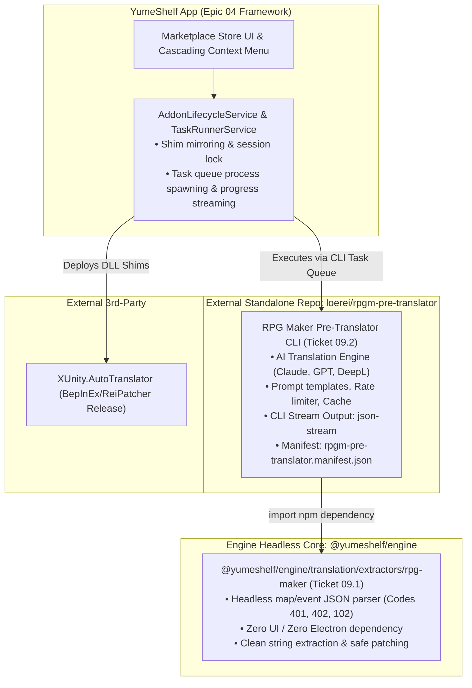

# PRD 04: Community Add-on Marketplace, Task Runner & Cascading Tool Manager

## Problem Statement

Currently, community translation and modding tools for eroge/doujin games (e.g. XUnity.AutoTranslator, MTool, Textractor, RPG Maker Pre-Translators) require complex manual downloading, archive extraction, file copying, and configuration.
- There is no central, searchable catalog within YumeShelf to browse and install community-verified tools.
- Users cannot easily discover, assign, or run tools with multiple actions (e.g. "Extract Text", "Translate & Patch", "Revert Vanilla") directly from the UI.
- Tools requiring third-party credentials (BYOK API keys, VIP tokens) cannot be managed or authenticated safely.

## Solution

1. **Global Marketplace & Discovery Store (VS Code / CurseForge style):**
   - A dedicated top-level **Marketplace Tab** to browse, search, and filter community tools by Engine Tag (Unity, RPG Maker, Wolf, Ren'Py), Category (Translation, Save Editor, Modding, Cheats), and Strategy (`shim`, `companion`, `task`).
   - 1-click installation from official sources (GitHub Releases / direct HTTPS) into a sandboxed `userData/addons/<id>/` directory, plus a manual "Import Local Archive / Folder" fallback for forum-exclusive (F95) tools.

2. **3-Tier Cascading Context Menu & Prism-style Game Tool Manager:**
   - **3-Tier Cascading Context Menu on Game Cards:**
     - **Tier 1 (Game Card Context Menu):** Contains `🧩 Add-ons ▶`.
     - **Tier 2 (Compatible Add-ons List):**
       - *Launch-Bound Add-on (`shim`, `companion`, `composite`):* Rendered with checkbox `[x]` to toggle execution during gameplay. Hovering opens Tier 3 (`⚙ Settings`, `🗑 Uninstall`).
       - *Task-Bound Add-on (`task`):* Rendered with tool icon and name. Hovering opens Tier 3 (`▶ Action 1`, `🔍 Action 2`, `↺ Revert`, `⚙ Settings`, `🗑 Uninstall`).
     - **Tier 3 (Action Flyout):** Lists specific executable actions declared in manifest.
       - **1-Click Execution (Default):** Dispatches directly to Task Queue in background.
       - **Interactive Popover (Optional):** If action declares `inputSchema`, auto-renders a native input popover before dispatching.
   - **Adaptive UI & Mutual Exclusion Guards:**
     - *When Game is Running:* Action buttons in context menus and Prism tab are grayed out (disabled) with an informative tooltip (`⚠️ Game is currently running. Please close the game before running tasks.`).
     - *When Task is Running on a Game:* The Game Card "Play" button displays an adaptive busy state (`⏳ Task in progress (45%)...`), opening a confirmation popover if clicked (`"Cancel task to launch now?"`).
   - **Prism-Style Tool Manager Tab (Game Details Modal):**
     - Table view of assigned add-ons, launch toggles, task action buttons, and configuration drawers.

3. **Task Queue Execution Engine & Floating Task Drawer:**
   - **Concurrency Model:** Strictly 1 active running task at a time (FIFO Queue) to prevent CPU starvation and disk I/O bottlenecks. Additional actions are queued automatically.
   - **Floating Task Drawer (Bottom Toast UI):** Non-blocking bottom-right drawer displaying real-time progress % (e.g. `[=====>    ] 45%`), active sub-step (e.g. `Translating Map005.json (45/100)`), game name, and a `Cancel` button. Allows users to browse their library smoothly while tasks execute in the background.

4. **Secure Credential Vault & Auth Modal:**
   - Dedicated configuration modal per tool to input and verify credentials (API Keys, VIP Tokens).
   - Sensitive tokens are stored in encrypted local storage (`safeStorage` / DPAPI fallback AES-256-GCM) under `userData/credentials.enc` with binary format header `[YSCR]` and strictly redacted from logs.

## Explicit Assumptions & Risk Disclosures

> [!IMPORTANT]
> The following assumptions are explicitly documented to guide design and mitigate edge cases:

1. **Distribution & Host Accessibility:**
   - *Assumption:* Tools with automated 1-click download have publicly accessible, direct URLs or GitHub Release APIs (e.g. XUnity, BepInEx).
   - *Mitigation for F95 / Closed Hosts:* For tools hosted behind CAPTCHAs, paywalls, or temporary file-hosters (Mega/Gdrive), YumeShelf will NOT scrape or automate logins; instead, YumeShelf provides an **"Install from Local File / Folder"** action in the Marketplace.
2. **Process Lifecycle & Execution Strategies:**
   - *Assumption:* Tools run as an **injected shim/DLL** (e.g. BepInEx/XUnity), as a **companion process** (e.g. MTool, Textractor), or as an **on-demand batch task** (e.g. RPG Maker Pre-Translator).
   - *Mitigation:* YumeShelf monitors companion processes and terminates them on game exit, while task processes stream progress to the Task Drawer and support graceful cancellation.
3. **Authentication Scope (BYOK vs GUI Login):**
   - *Assumption:* Tools with paid/VIP tiers (like MTool) either accept a Token / Auth Header / Config File, or allow the user to authenticate inside the companion GUI.
   - *Design Choice:* YumeShelf provides both token injection (if supported by the tool format) and direct companion GUI passthrough without attempting to reverse-engineer proprietary login protocols.
4. **Engine Dependency:**
   - *Assumption:* Marketplace compatibility badges depend on the deterministic `GameEngineProfile` provided by `PRD 00 (YumeEngine Core)`.

## User Stories

1. As a player, I want a dedicated **Marketplace Tab** in YumeShelf, so that I can browse, search by name, and filter community tools by Game Engine (Unity, RPG Maker, Wolf, Ren'Py) and Category.
2. As a player, I want to install verified community tools with one click from GitHub/official releases without manual archive extraction.
3. As a player with tools downloaded from F95Zone (Mega/Gdrive), I want a "Import Local Archive" button in the Marketplace, so that YumeShelf can automatically register and deploy the tool.
4. As a player, I want to hover over `Add-ons` in the Game Card context menu to toggle mods or trigger 1-click batch actions (e.g. Pre-Translate) without leaving my library.
5. As a player managing a specific game, I want a **Tools Tab** in Game Details (similar to Prism Launcher's Mods tab), so that I can see all available tools and toggle them on/off with checkboxes before playing.
6. As a player running a long translation job, I want a non-blocking **Floating Task Drawer** showing progress %, current step, and a Cancel button so I can keep browsing my games.
7. As a player with an MTool VIP token or DeepL API key, I want a settings icon on the tool card to enter and test my credentials.

## Implementation Decisions

1. **Add-on Manifest Schema (`AddonManifest`):**
   ```typescript
   export type AddonStrategy = 'shim' | 'companion' | 'composite' | 'task';
   export type AddonCategory = 'translation' | 'save-editor' | 'modding' | 'utility' | 'cheat';

   export interface EngineCompatibilityRule {
       tag: F95EngineTag;
       variants?: string[]; // e.g. ['mono', 'il2cpp'] or ['mv', 'mz', 'vx-ace']
       arch?: ('x64' | 'x86')[];
   }

   export interface AddonActionField {
       key: string;
       label: string;
       type: 'text' | 'select' | 'boolean' | 'number' | 'password';
       defaultValue?: any;
       options?: Array<{ label: string; value: string }>;
       placeholder?: string;
       description?: string;
       required?: boolean;
   }

   export interface AddonActionSpec {
       id: string;
       label: string;
       description?: string;
       icon?: string;
       argsTemplate: string[];
       progressFormat?: 'json-stream' | 'percent' | 'regex';
       cancellable?: boolean;
       inputSchema?: AddonActionField[];
   }

   export interface AddonCredentialField {
       key: string;
       label: string;
       type: 'text' | 'password';
       required?: boolean;
       placeholder?: string;
       description?: string;
       envVar?: string; // Optional environment variable override; defaults to YUMESHELF_CREDENTIAL_<KEY>
   }

   export interface AddonManifest {
       id: string;
       name: string;
       version: string;
       author: string;
       description: string;
       homepage?: string;
       engineCompatibility: Array<F95EngineTag | EngineCompatibilityRule>;
       category: AddonCategory;
       strategy: AddonStrategy;
       entryPoint?: string; // Relative POSIX path within userData/addons/<id>/; required for 'task', 'companion', 'composite'; optional for 'shim'
       shimFiles?: string[]; // Non-empty array of relative POSIX paths strictly contained within userData/addons/<id>/; required for 'shim', 'composite'
       actions?: AddonActionSpec[]; // Non-empty array required for 'task'
       downloadUrl?: string;
       sha256?: string;
       configSchema?: AddonActionField[];
       credentialsSchema?: AddonCredentialField[];
       minAppVersion?: string;
   }
   ```

2. **Marketplace UI & Registry Architecture:**
   - **Marketplace View:** Grid layout with fixed dimension reservations on add-on icons to eliminate Cumulative Layout Shift (CLS), structural skeleton placeholders during remote catalog fetching, search bar with empty state ("No add-ons found matching '{query}'. Try clearing active filters or import a local archive"), tag filters (`engine:unity`, `engine:rpg-maker`, `type:translation`, `strategy:task`), offline error banner with local archive fallback, tool cards with version badges, and multi-state action buttons (`Available / Install` $\to$ `Downloading (progress %)` $\to$ `Extracting` $\to$ `Installed` $\to$ `Update Available`). Tag filter queries and engine compatibility rules are evaluated authoritatively via `@yumeshelf/engine` compatibility matching helper `matchesEngineCompatibility(profileOrTag: GameEngineProfile | F95EngineTag | string, rule: F95EngineTag | EngineCompatibilityRule): boolean` exported on the `YumeEngine` facade (`packages/yume-engine/src/index.ts`) to preserve engine headless core separation. All third-party README, description, and changelog markdown rendered in the Marketplace modal are strictly sanitized via a zero-dependency in-tree allowlist utility (`src/shared/utils/markdown-sanitizer.ts`, utilizing co-located `src/shared/utils/markdown-lite.ts`) compiled via `tsconfig.main.json` into `dist/shared/utils/markdown-sanitizer.js` to prevent Cross-Site Scripting (XSS). External hyperlinks in rendered markdown and IPC URL openers enforce a strict protocol allowlist (`https:` and `http:`), blocking dangerous URI schemes (`file:`, `javascript:`, `data:`, `shell:`).
   - **Registry Source & Cache Envelope:** Manifests loaded from remote JSON registry (with offline fallback cache envelope in `userData/addons/addons.json` formatted as `{ version: number; lastSyncedAt: number; addons: AddonManifest[] }`, written with atomic `.tmp` $\to$ `fsync` $\to$ `rename` semantics).
   - **Service Construction & DI Options:**
     - `SSRFValidatorOptions { dnsResolver?: (hostname: string, options: any, callback: Function) => void; }`
     - `AddonRegistryOptions { paths?: { addonsDir?: string; cacheFile?: string; }; fetchFn?: typeof fetch; ssrfValidator?: SSRFValidator; }`
     - `AddonInstallerOptions { paths?: { addonsDir?: string; tempDir?: string; }; fetchFn?: typeof fetch; ssrfValidator?: SSRFValidator; webContentsProvider?: () => Electron.WebContents[]; broadcastFn?: (channel: string, payload: any) => void; }`
   - **LocalArchiveImporter & Installer Security:** Mandates Zip Slip path traversal sanitization (`resolvedPath === targetDir || resolvedPath.startsWith(targetDir + path.sep)`), DOS device names matching `/^(CON|PRN|AUX|NUL|COM[1-9]|LPT[1-9])(\..*)?$/i` on Windows destinations and NTFS Alternate Data Stream (`:`) rejection, symlink and hardlink escape neutralization (rejecting or ignoring symlink/hardlink entries to eliminate symlink traversal attacks), atomic staging extraction (`.staging_<tool-id>_<timestamp>`), and asynchronous non-blocking decompression (`zlib.inflateRaw`) with uncompressed size caps (max 2 GB uncompressed, max 10,000 entries, max ratio 100:1) to prevent event loop stutter and Zip Bomb denial-of-service. Outbound requests enforce custom socket lookup IP validation via `SSRFValidator` (`127.0.0.0/8`, `10.0.0.0/8`, `172.16.0.0/12`, `192.168.0.0/16`, `169.254.0.0/16`, `0.0.0.0/8`, `100.64.0.0/10`, `224.0.0.0/4`, `240.0.0.0/4`, `255.255.255.255/32`, `::1/128`, `::/128`, `fc00::/7`, `fe80::/10`, `ff00::/8`, `2001:db8::/32`, `2002::/16`, and decoded IPv4-mapped IPv6 `::ffff:0:0/96`) using native `node:https`/`node:http` agents or undici `Dispatcher` wrappers to prevent DNS rebinding, validating all resolved IP records from DNS and rejecting protocol downgrades from `https:` to `http:`.

3. **3-Tier Cascading Context Menu & Prism-Style Tool Manager UI:**
   - **Game Card Context Menu (Cascading 3 Tiers):**
     - Tier 1: `🧩 Add-ons ▶`.
     - Tier 2: Filtered compatible tools (evaluated via `@yumeshelf/engine`). Checkboxes for `shim`/`companion`; flyout triggers for `task`.
     - Tier 3: Action triggers from `manifest.actions[]`, `⚙ Settings`, `🗑 Uninstall`.
   - **Game Details Modal:** New subtab **"Add-ons / Tools"** with table view and configuration drawers.
   - **Persistent State Schema & Migration:** Stored in YumeShelf's JSON database (`libraryState` / `games.json` under `game.addons: Array<{ id: string; enabled: boolean; config: Record<string, any> }>`). All disk writes to `games.json` follow atomic write-tmp-then-rename semantics. All mutations to `libraryState` are serialized through an in-memory sequential promise chain (`mutateDB(updater)`) to eliminate lost-update race conditions between concurrent add-on mutations and playtime tracking. `normalizeGameRecord` initializes `addons: []` by default, verifying element types and deduplicating array items by unique `id`.
   - **Library Rescan State Preservation (`loader.ts`):** When `loadGamesForConfig()` completes an asynchronous directory scan, it commits updates through `mutateDB(updater)`, merging discovered file metadata (`sizeBytes`, `sizeMtime`, `engine`, `exePath`) into `latestDb.games[gameKey]` while strictly preserving dynamically mutated properties (`addons`, `playtime`, `lastPlayed`, `favorite`, `customName`, `saveFolderOverride`).
   - **Backward Compatibility Migration:** On `libraryState` initialization, for any record where `game.autoTranslate === true` and `game.addons` does not contain `xunity-autotranslator`, automatically synthesize `{ id: 'xunity-autotranslator', enabled: true, config: {} }` into `game.addons`. Unconditionally **delete** the legacy `game.autoTranslate` property from all records across disk and in-memory state. Update `src/main/library-state/loader.ts` and `src/main/library-state/continuity.ts` (`normalizeGameRecord` and `buildLogicalGames`) to omit `autoTranslate` from record synthesis and preserve `addons: Array.isArray(existingRecord?.addons) ? existingRecord.addons : []`. Refactor `src/main/library-state/actions.ts: toggleAutoTranslate` to delegate directly to toggling `{ id: 'xunity-autotranslator' }` within `game.addons`.
   - **Adaptive UI States & Test Determinism:**
     - When game is active (`isGameActive(gameKey)`), action triggers in context menus and Prism tab are grayed out with tooltips (`⚠️ Game is currently running. Please close the game before running tasks.`).
     - When a task is active on a game (`isTaskActive(gameKey)`), the Play button displays an animated progress spinner (`⏳ Task in progress...`) with a Cancel-to-Launch prompt on click.
     - 3-Tier Cascading Context Menu hover timing (150ms open delay, 300ms close grace period) must be tested deterministically using fake timers (`vi.useFakeTimers()`).

4. **Runtime Execution Hook & AddonLifecycleService:**
   - **Preparatory Refactoring ($S \to B$):** `PlaytimeSessionManager` introduces `registerSessionLifecycleHook({ onBeforeLaunch, onSessionTerminated })`, exports `isGameActive(gameKey: string): boolean`, supports constructor options `PlaytimeSessionManagerOptions { app?: App; BrowserWindow?: typeof BrowserWindow; libraryState?: LibraryState; isTaskActive?: (gameKey: string) => boolean; }`, and legacy inline translator calls are decoupled from `src/main/ipc/controllers/library.controller.ts`.
   - **Hook Execution Ordering:**
     - `onBeforeLaunch`: Executed in registration order (FIFO: $H_1 \to H_2 \dots \to H_n$).
     - `onSessionTerminated`: Executed in reverse registration order (LIFO: $H_n \dots \to H_2 \to H_1$), ensuring companion processes release active file locks before shim deletion and reversion runs on Windows.
   - **Concurrency Control & 2-Tier Lock Lifecycle:**
     - **Transient Launch Lock (`inFlightLaunches: Set<string>`):** Acquired during the asynchronous launch phase (`onBeforeLaunch` hooks, shim mirroring, companion spawning, process bootstrapping) and released immediately upon launch success or failure rollback (`catch`/`finally`).
     - **Active Session Exclusivity:** Once spawned, the game remains tracked in active session state until `onSessionTerminated` finishes. Concurrent calls to `launchTrackedGame(gameKey)` while active or in-flight are rejected with typed `ConcurrentLaunchError`.
     - **Cross-Subsystem Mutual Exclusion:** `launchTrackedGame(gameKey)` verifies `!taskRunnerService.isTaskActive(gameKey)` before acquiring launch locks, rejecting the launch with typed `TaskRunningConflictError` if a background task is modifying the game.
   - Dedicated service `AddonLifecycleService` under `src/main/addons/` wired into `PlaytimeSessionManager` via asynchronous lifecycle hooks:
     - **`onBeforeLaunch`:** Check `.yumeshelf-session.json`, execute pre-launch rollback if stale lock exists, backup collision targets to `<filename>.yumeshelf-bak`, write `.yumeshelf-session.json` atomically with status `'deploying'` and planned paths, validate that all source files resolve strictly within `userData/addons/<id>/` and target copy destinations resolve strictly within `gameDir`, mirror shim files from `userData/addons/<id>/` 1:1 into game root (recursively traversing subdirectories while tracking all copied paths for reverse depth-first unlinking), update session lock status atomically to `'active'`, and spawn companion processes via `CompanionSupervisor`.
     - **`onSessionTerminated`:** Triggered asynchronously upon game process exit; terminates companion process trees (executing `taskkill /F /T /PID <pid>` on Windows), validates all recorded paths against `gameDir` boundary, reverts shim files from `.yumeshelf-bak`, unlinks recorded empty directories in reverse depth-first order (catching and ignoring `ENOTEMPTY` / `EEXIST` errors to preserve user mod logs/caches), and releases launch locks.
     - **Crash Recovery (`recoverCrashedSessions(targetDirs?: string[])`):** Run on startup (`app.whenReady()`) or called with explicit target directories in test fixtures; wraps `.yumeshelf-session.json` parsing in try/catch. If parse error occurs, triggers fallback directory scan to restore all `*.yumeshelf-bak` files. Validates all target paths remain strictly contained within `gameDir` before unlinking or restoring.

5. **Task Runner & Queue Engine (`strategy: 'task'`):**
   - Dedicated service `TaskRunnerService` under `src/main/addons/task-runner.service.ts`:
     - FIFO task queue with single active job execution.
     - **Cross-Subsystem Mutual Exclusion:** Verifies `!playtimeSessionManager.isGameActive(gameKey)` before dequeuing/starting a task targeting `gameKey`, rejecting conflicting tasks with typed `GameRunningConflictError`.
     - Asynchronous child process spawning with non-shell `child_process.spawn(executable, argsArray, { shell: false })`. Prohibits raw `.bat`/`.cmd` script execution without an explicit runtime interpreter (e.g. `node.exe entryPoint.js`) to eliminate CVE-2024-27980 command injection.
     - Supported options: `TaskRunnerOptions { paths?: { addonsDir?: string; tempDir?: string }; spawnFn?: typeof child_process.spawn; killTreeFn?: (pid: number) => Promise<void>; isGameActive?: (gameKey: string) => boolean; webContentsProvider?: () => Electron.WebContents[]; broadcastFn?: (channel: string, payload: any) => void; gracePeriodMs?: number; throttleMs?: number; }` and `CompanionSupervisorOptions { spawnFn?: typeof child_process.spawn; killTreeFn?: (pid: number) => Promise<void>; gracePeriodMs?: number; }`.
     - Parameter interpolation precedence: `Built-in Variables ({gameDir}, {exePath}, {gameKey}, {addonDir}, {entryPoint}) > Action InputSchema Values > Tool ConfigSchema Values`. Decrypted vault credentials are NEVER interpolated into CLI argument arrays (`argsArray`) to eliminate command-line secret exposure (CWE-214); sensitive credentials are injected exclusively via child process environment variables (`env: { ... }` in `spawn`, mapped via `AddonCredentialField.envVar` defaulting to `YUMESHELF_CREDENTIAL_<KEY>`) or standard input. Unset optional variables are pruned without leaving unresolved tokens or empty string arguments (`""`).
     - **Secret Sanitization:** All decrypted credentials in CLI arguments, error messages, and broadcast events are sanitized via `08.1.1` redaction (`[REDACTED]`) before logging or IPC transmission.
     - Non-blocking `stdout` stream parsing (`json-stream`, `percent`, `regex`) using line buffering (`readline` interface or carryover buffer) to prevent `JSON.parse` syntax exceptions across chunk boundaries.
     - IPC broadcaster streaming real-time `addon:task-status` events containing `taskId`, `addonId`, `gameKey`, `phase`, `percent`, `step`, and `message` to the Floating Task Drawer, rate-limited via 50–100ms throttling and checking `!win.isDestroyed()` before transmission.
     - Pull-based IPC query `addon:get-task-state` returning `{ activeTask: AddonTaskStatusEvent | null, queuedTasks: AddonTaskStatusEvent[] }` for reactive UI hydration on mount/reload.
     - Cancellation signaling (`SIGTERM` $\to$ `SIGKILL` escalation using configurable `gracePeriodMs`).
     - Universal shutdown lifecycle hook (`dispose(): Promise<void>`) registered to `app.on('before-quit')` ensuring clean termination of active process trees with signal escalation and immediate clearance of pending broadcast throttle timers (`if (this.broadcastTimer) { clearTimeout(this.broadcastTimer); this.broadcastTimer = null; }`).

6. **Security & Credential Vault:**
   - Encrypted in `userData/credentials.enc` with binary header `[magic 4B 'YSCR'][version 1B 0x01][mode 1B 0x01=safeStorage | 0x02=aes-gcm][salt 32B (if aes-gcm)][iv 12B (if aes-gcm)][tag 16B (if aes-gcm)][ciphertext]` written with POSIX file permissions `mode: 0o600`.
   - Primary encryption via Electron's `safeStorage` (Windows DPAPI / Linux Secret Service); fallback via AES-256-GCM with PBKDF2 HMAC-SHA256 ($\ge 100,000$ iterations) derived from local machine ID. Written via atomic write-tmp-then-rename with retry backoff for Windows file lock contention (`EPERM`/`EBUSY`).
   - Supported options: `CredentialVaultOptions { credentialsFilePath?: string; safeStorageProvider?: typeof safeStorage; machineIdProvider?: () => string; }`.
   - Formally typed multi-tenant decrypted store: `export type DecryptedCredentialStore = Record<string, Record<string, string>>;` (`{ [addonId: string]: { [fieldKey: string]: string } }`).
   - Store Operations: `setCredentials(addonId, credentials)` upserts into `store[addonId]`; `deleteCredentials(addonId)` removes `store[addonId]`.
   - Main-to-Renderer IPC boundary contracts: `getCredentialStatus`, `setCredentials`, `testCredential`. Plaintext secrets are never logged or exposed.

## Ecosystem Architecture & Multi-Repo Roadmap (Steps 2–5)

> [!NOTE]
> **Cross-Repo Ecosystem & Execution Timing:**  
> To guarantee a stable foundation, full implementation of Epic 04 and its connected ecosystem will execute **after Epic 02 (Core Library) and Epic 03 (Tagging & Organization) are completed**.



1. **`RpgMakerExtractor` in `@yumeshelf/engine` (Ticket 09.1)**:
   - Module: `packages/yume-engine/src/translation/extractors/rpg-maker/`.
   - Headless parser for RPG Maker MV/MZ/VX Ace map events, choices, and system data (`401`, `402`, `102`).
   - Bidirectional serialization: text extraction $\leftrightarrow$ safe JSON patching.
2. **Standalone Repository `RPG Maker Pre-Translator` (Ticket 09.2)**:
   - Separate repository (`loerei/rpgm-pre-translator`) importing `@yumeshelf/engine` as a dependency.
   - CLI tool handling LLM API requests, prompt engineering, rate-limiting, and streaming `json-stream` progress on stdout.
   - Declares official `rpgm-pre-translator.manifest.json` (`strategy: 'task'`).
3. **`XUnity.AutoTranslator` Manifest**:
   - Official manifest `docs/specs/04-marketplace-and-tool-manager/examples/xunity-autotranslator.manifest.json` (`strategy: 'shim'`).
4. **Platform Execution (Epic 04 Implementation)**:
   - Executed after Epic 02/03 finish, wiring the complete Addon Platform directly into stable library and session managers without temporary throwaway code.

## Testing Decisions & Verification Plan

### 1. Automated Test Execution Commands
- **Main Process Unit & Integration Suites**:
  ```bash
  # Node native test runner (Main process services and IPC controllers)
  npm run test:node -- tests/ssrf-validator.test.js
  npm run test:node -- tests/addon-registry.test.js
  npm run test:node -- tests/zip-extractor.test.js
  npm run test:node -- tests/addon-installer.test.js
  npm run test:node -- tests/credential-vault.test.js
  npm run test:node -- tests/game-addon-persistence.test.js
  npm run test:node -- tests/session-lifecycle-hook.test.js
  npm run test:node -- tests/addon-lifecycle.test.js
  npm run test:node -- tests/companion-supervisor.test.js
  npm run test:node -- tests/task-stream-parser.test.js
  npm run test:node -- tests/task-runner.test.js
  ```
- **Engine Core Extractor Test Suite**:
  ```bash
  # Pure headless engine core modules (@yumeshelf/engine)
  pnpm --filter @yumeshelf/engine test
  node --test packages/yume-engine/tests/rpg-maker-extractor.test.ts
  ```
- **Renderer Component & UI Test Suite**:
  ```bash
  # Vitest runner (co-located component and sanitizer suites under src/)
  npx vitest run src/shared/utils/markdown-sanitizer.test.ts
  npx vitest run src/renderer/components/marketplace-grid.test.ts
  npx vitest run src/renderer/components/marketplace-actions-modal.test.ts
  npx vitest run src/renderer/components/game-details/tools-tab.test.ts
  npx vitest run src/renderer/components/cascading-tool-menu.test.ts
  npx vitest run src/renderer/components/tool-settings-modal.test.ts
  npx vitest run src/renderer/components/floating-task-drawer.test.ts

  # Full UI test suite
  npm run test:vitest
  ```

### 2. Pass Criteria & Exit Code Assertions
- All test suites must complete with exit code `0` and `0` failing test cases.
- Stateful test suites must implement `afterEach` teardown hooks calling `service.dispose()` to guarantee 0 leaked child process handles, sockets, or open timers.

### 3. Edge-Case Verification Matrix
- **SSRF & Networking**: DNS rebinding simulation, full CIDR blocklist (`169.254.0.0/16`, `0.0.0.0/8`, `100.64.0.0/10`, IPv4 Class E `240.0.0.0/4`, IPv4-mapped IPv6 `::ffff:127.0.0.1`), redirect hop re-validation, and protocol downgrade rejection.
- **Decompression & Extraction**: Zip Slip path traversal rejection (`..`), prefix collision prevention, DOS device names matching `/^(CON|PRN|AUX|NUL|COM[1-9]|LPT[1-9])(\..*)?$/i`, NTFS Alternate Data Streams (`:`), symlink neutralization, Zip Bomb memory cap abortion, atomic staging rollback on failure, and abandoned staging folder cleanup.
- **Crash Recovery & Backups**: Pre-existing `*.yumeshelf-bak` found before shim deployment triggers crash recovery or throws `StaleBackupConflictError` to prevent clobbering vanilla backup; corrupted/0-byte `.yumeshelf-session.json` startup recovery triggers `*.yumeshelf-bak` fallback directory scan.
- **State & Migration**: Unconditional legacy `autoTranslate` deletion, record deduplication by `id`, defensive shape sanitization in `normalizeGameRecord`, concurrent `mutateDB` sequential serialization without lost updates or error deadlocks, and dynamic library rescan metadata merging without overwriting live user configuration.
- **Process Supervision**: Non-shell spawning, `.bat`/`.cmd` script rejection, synthetic process fixtures with mock `spawnFn`/`killTreeFn` using `PassThrough` duplex streams and `setImmediate` event emission, `gracePeriodMs` cancellation escalation, line buffer stdio chunk boundary splitting / multi-line concatenation, and IPC credential redaction.

## Out of Scope

- Bypassing paid VIP subscription checks or hosting pirated mirrors.
- Native in-game DirectX/OpenGL overlay GUI injection.

## Tickets

- 01.1.1 — SSRF Socket Validator & Network Security Layer (`tickets/01.1.1-ssrf-socket-validator.md`)
- 01.1.2 — Manifest Registry and Multi-Tag Search Index (`tickets/01.1.2-manifest-registry-and-search.md`)
- 01.2 — Security-Hardened Zip Decompression Engine (`tickets/01.2-security-hardened-zip-extractor.md`)
- 02 — Package Installer & Local Archive Importer (`tickets/02-package-installer-and-local-importer.md`)
- 03 — Credential Vault & Secure Main-to-Renderer IPC (`tickets/03-credential-vault-and-security-ipc.md`)
- 04.1 — Marketplace Discovery Grid & Sanitizer Utility (`tickets/04.1-marketplace-grid-and-sanitizer.md`)
- 04.2 — Marketplace Card Action States, Detail Modal & Drag-and-Drop Importer (`tickets/04.2-marketplace-actions-modal-and-importer.md`)
- 05.1.1.1 — Game Add-on State Persistence & Migration (Preparatory Seam $S$) (`tickets/05.1.1.1-game-addon-persistence-and-migration.md`)
- 05.1.1.2 — Prism-Style Game Tool Manager UI (Behavioral Feature $B$) (`tickets/05.1.1.2-prism-style-game-tool-manager-ui.md`)
- 05.1.2 — 3-Tier Cascading Context Menu & Action Popover (`tickets/05.1.2-cascading-context-menu-and-action-popover.md`)
- 05.2 — Tool Settings & Credential Configuration Modal (`tickets/05.2-tool-credential-configuration-modal.md`)
- 06.1.1 — Playtime Session Lifecycle Hook Seam & Concurrency Lock (`tickets/06.1.1-playtime-session-lifecycle-hook-seam.md`)
- 06.1.2 — Add-on Shim Deployment & Reversion Engine (`tickets/06.1.2-addon-shim-deployment-and-reversion-engine.md`)
- 06.2 — Add-on Transactional Rollback & Crash Recovery (`tickets/06.2-addon-transactional-rollback-and-crash-recovery.md`)
- 07 — Companion Supervisor & Launch Orchestration (`tickets/07-companion-supervisor-and-launch-orchestration.md`)
- 08.1.1 — Task Parameter Interpolation & Stream Parser Engine (`tickets/08.1.1-task-parameter-and-stream-parser.md`)
- 08.1.2 — Task Runner & Queue Execution Engine (`tickets/08.1.2-task-runner-and-queue-engine.md`)
- 08.2 — Floating Task Drawer UI & Adaptive Launch Actions (`tickets/08.2-floating-task-drawer-ui.md`)
- 09.1 — RPG Maker Translation Extractor Engine Core Module (@yumeshelf/engine) (`tickets/09.1-rpg-maker-translation-extractor-engine.md`)
- 09.2 — RPG Maker Pre-Translator Standalone CLI & Manifest Integration (`tickets/09.2-rpgm-pre-translator-standalone-cli.md`)
