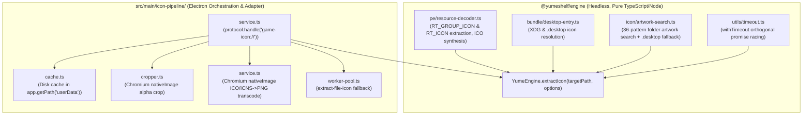
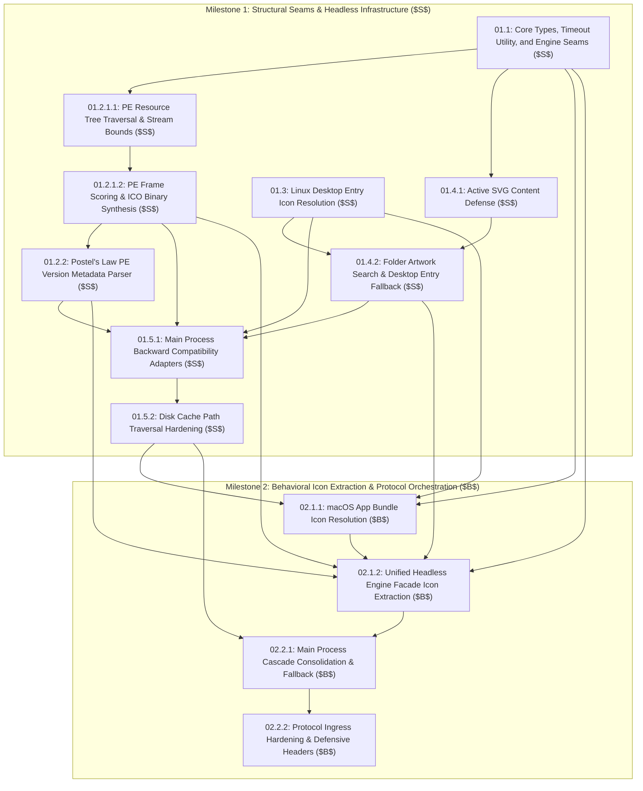

# PRD: Move Headless Icon Extraction to @yumeshelf/engine

## Goal Description
Migrate headless icon extraction logic (PE `.rsrc` icon tree parsing, ICO buffer synthesis, Linux `.desktop` icon resolution, and game artwork discovery) from `src/main/icon-pipeline/` into `packages/yume-engine/`. This eliminates duplicate PE header parsing in `src/main/` and restores full compliance with the repository architectural boundary defined in [`AGENTS.md`](file:///d:/Projects/YumeShelf/AGENTS.md) ("All game engine inspection (PE binary headers, section mapping...) MUST reside strictly inside packages/yume-engine/").

---

## User Review Required

> [!IMPORTANT]
> This epic establishes preparatory structural refactoring ($S$) followed by behavioral icon extraction orchestration ($B$). It unblocks clean multi-OS platform extension and automated in-memory cross-platform CI testing without regressions on Windows, Linux, or macOS.

---

## Architectural Boundary & Responsibilities



| Module | Responsibility | Environment |
| :--- | :--- | :--- |
| **`@yumeshelf/engine`** | Binary `.rsrc` parsing, PE icon extraction, `.desktop` parsing, artwork scanning, pure headless buffers, timeout governance | 100% headless, zero Electron dependencies, virtual in-memory testable |
| **`src/main/icon-pipeline/`** | Custom protocol handling (`game-icon://`), disk caching in `userData`, Chromium `nativeImage` ICO/ICNS transcoding & alpha cropping, shell fallback worker pool | Electron Main process runtime |

### 4-Axis Readiness Scorecard

| Axis | Pre-Refactor ($S_0$) | Post-Refactor ($B$) | Architectural Guarantee |
| :--- | :--- | :--- | :--- |
| **Maintainability** | Duplicate PE parsing in `src/main/` and `@yumeshelf/engine` | Unified PE header parsing via `PEInspector` | Zero PE binary decoding logic in `src/main/` |
| **Extensibility** | Hardcoded Node `fs` & host env paths in main process | Virtual parameter seams (`IFileSystem`, `IEnvironmentPaths`, `signal`, `maxRsrcSize`, `maxArtworkSize`) | Linux/macOS/Windows desktop & artwork resolution testable in-memory |
| **Debuggability** | Monolithic `service.ts` mixing Electron protocol, cache & scanning | Decoupled submodules (`artwork-search`, `desktop-entry`, `pe`, `utils/timeout`) | Isolated unit testing of discrete extraction strategies and timeout racing |
| **Updatability** | Tight coupling between main test suites and local path files | Re-exported compatibility adapters in `src/main/icon-pipeline/` | 100% backward compatibility for existing callers and test fixtures |

### Architectural Transition Mapping

| Transition Dimension | Current Tangled Landing Zone | Proposed Paved Landing Zone |
| :--- | :--- | :--- |
| **Module Structure** | Duplicate PE parsing and icon logic tangled inside `src/main/icon-pipeline/`. | Deep headless icon modules inside `@yumeshelf/engine` behind simple facade. |
| **Dependency Path** | Direct coupling to Node `fs` and Electron in icon parsing utilities. | Decoupled execution path isolated via `IFileSystem`, `IEnvironmentPaths`, and parameter seams. |
| **Code Locations** | Binary decoding logic scattered across `src/main/icon-pipeline/` and `@yumeshelf/engine`. | Concentrated locality inside `packages/yume-engine/src/pe/`, `src/icon/`, and `src/utils/`. |

### Preparatory Refactoring ($S \to B$) Execution Sequence

1. **Stage $S_1$ (Structural Tidying - Type Definitions & Constants - *Explaining Constants & Explaining Variables*)**:
   - Declare `RT_ICON = 3`, `RT_GROUP_ICON = 14`, `DEFAULT_MAX_RSRC_SIZE = 32 * 1024 * 1024`, `MAX_RESOURCE_ENTRIES = 2048`, and `MAX_RECURSION_DEPTH = 3` in `packages/yume-engine/src/pe/types.ts`.
   - Define `PeResourceDecoderOptions { fs?: IFileSystem; signal?: AbortSignal; maxRsrcSize?: number; }` and `PeVersionMetadata` in `pe/types.ts`.
   - Define domain interfaces `ExtractedPeIcon`, `PeResourceSection` in `pe/types.ts`.
   - Implement `withTimeout<T, F = never>(promise: Promise<T>, options?: WithTimeoutOptions<F>): Promise<T | F>` in `packages/yume-engine/src/utils/timeout.ts`, attaching `promise.catch(() => {})` error suppression to the in-flight target promise unconditionally at immediate function ingress prior to checking `signal?.aborted` or evaluating `fallbackValue` to prevent unhandled late promise rejections, scheduling a timer only when `typeof timeoutMs === 'number' && timeoutMs >= 0`, removing `abort` event listeners and clearing timers inside `finally`, and supporting generic fallback value return typing.
   - Re-export `withTimeout` in `packages/yume-engine/src/utils/index.ts`, canonically declare `DEFAULT_MAX_ARTWORK_SIZE = 32 * 1024 * 1024` in `packages/yume-engine/src/types.ts`, and re-export PE types and `DEFAULT_MAX_RSRC_SIZE` in `packages/yume-engine/src/types.ts`. (Ticket `01.1`)
2. **Stage $S_{2.1.1}$ (Structural Tidying - PE Resource Tree Traversal & Stream Bounds)**:
   - Implement `PeResourceDecoder` core in `packages/yume-engine/src/pe/resource-decoder.ts` enforcing entry iteration bounds (`MAX_RESOURCE_ENTRIES = 2048`), recursion depth $\le 3$, `maxRsrcSize` capping across all entrypoints (`fromFile`, `fromFileSync`, and `fromBuffer`), early abort checking on `signal.aborted` at ingress and before reading section data, and `IFileSystem` seam support. (Ticket `01.2.1.1`)
3. **Stage $S_{2.1.2}$ (Structural Tidying - PE Frame Scoring & ICO Binary Synthesis)**:
   - Implement GRPICONDIR frame decoding (capped at $\le 64$ frames), frame scoring hierarchy, DIB header length validation (`rawFrameBuffer.length >= 40 && biSize >= 40 && rawFrameBuffer.length >= biSize`), synthetic ICO buffer synthesis, and sync/async extraction entrypoints (`extractPeIcon`, `extractPeIconAsync`). Re-export in `packages/yume-engine/src/pe/index.ts`. (Ticket `01.2.1.2`)
4. **Stage $S_{2.2}$ (Structural Tidying - PE Version Metadata Parser - *Postel's Law Tolerant Parsing*)**:
   - Implement Postel's Law PE version metadata extraction in `packages/yume-engine/src/pe/resource-decoder.ts`, attempting structured `VS_VERSIONINFO` parsing first and falling back to lenient UTF-16LE string search via `extractStringFileInfoValue`.
   - Expose `extractMetadata(): PeVersionMetadata | null` on `PeResourceDecoder` and helper function `extractPeMetadataAsync(filePath, options?: PeResourceDecoderOptions | IFileSystem)`. Re-export in `packages/yume-engine/src/pe/index.ts`. (Ticket `01.2.2`)
5. **Stage $S_{2.3}$ (Structural Tidying - Linux Desktop Entry Icon Resolution - *Path Containment & Whitelist Defense*)**:
   - Implement `packages/yume-engine/src/bundle/desktop-entry.ts` with strict forward-slash-normalized path containment within `baseDir` or authorized system icon directories, unconditional `..` traversal rejection across relative and absolute paths, path normalization, allowed image extension filtering, null-byte sanitization, synchronous variants, and parameter seams (`fs`, `env`, `targetPlatform`, `signal`).
   - Re-export in `packages/yume-engine/src/bundle/index.ts`. (Ticket `01.3`)
6. **Stage $S_{2.4.1}$ (Structural Tidying - Active SVG Content Defense - *Content Sanitization & Vector Scanning*)**:
   - Implement pure in-memory SVG active content validation in `packages/yume-engine/src/icon/svg-defense.ts` (`isSafeSvgBuffer`, `validateSvgContent`, `decodeXmlEntities`). Reject buffers containing null bytes (`0x00`) or UTF-16 Byte Order Marks (BOM `0xFF 0xFE` or `0xFE 0xFF`) prior to UTF-8 decoding. Inspect SVG text against 7 threat categories (active element tags, inline event handlers, JavaScript pseudo-protocols in attributes and CSS `url(...)` constructs with normalized scheme whitespace and control-character stripping, `xml:base` SSRF, external network/UNC imports in attributes and CSS `url(...)`, scriptable `data:` URIs, and `<!(ENTITY|DOCTYPE)` declarations), with self-contained inline XML entity decoding. Re-export in `packages/yume-engine/src/icon/index.ts`. (Ticket `01.4.1`)
7. **Stage $S_{2.4.2}$ (Structural Tidying - Folder Artwork Search & Desktop Entry Fallback - *Candidate Hierarchy & Seams*)**:
   - Implement `packages/yume-engine/src/icon/artwork-search.ts` with `LocalGameImageResult`, pre-read file size check (`stat.size <= maxLimit`), candidate loop `try...catch` guarding `fs.stat` against `ENOENT`, 36-candidate pattern matching with abort responsiveness, active SVG validation via `isSafeSvgBuffer`, desktop entry fallback with active SVG defense, and `getImageMimeType`. Re-export in `packages/yume-engine/src/icon/index.ts`. (Ticket `01.4.2`)
8. **Stage $S_{3.1}$ (Structural Tidying - Main Process Backward Compatibility Adapters - *New Interface, Old Impl*)**:
   - Update `src/main/icon-pipeline/pe-resource-decoder.ts`, `src/main/icon-pipeline/desktop-entry.ts`, and `src/main/icon-pipeline/service.ts` to re-export engine types and delegate functions directly to `@yumeshelf/engine`. (Ticket `01.5.1`)
9. **Stage $S_{3.2}$ (Structural Tidying - Disk Cache Path Traversal Hardening - *4-Tier Defensive Boundary*)**:
   - Harden `deleteIconCacheFileIfUnused` in `src/main/icon-pipeline/cache.ts` against path traversal via basename check (`path.basename(fileName) === fileName`), strict regex match `/^[a-f0-9]{40}\.png$/i`, and root directory containment verification. (Ticket `01.5.2`)
10. **Stage $B_{1.1}$ (Behavioral Expansion - macOS App Bundle Icon Resolution)**:
   - Implement macOS `.app` bundle inspection in `packages/yume-engine/src/bundle/app-bundle-inspector.ts`, `Info.plist` parsing (`CFBundleIconFile`, `CFBundleIconName`), and `Contents/Resources/*.icns` directory scan fallback with `try...catch` error guarding. Re-export in `packages/yume-engine/src/bundle/index.ts` preserving all 5 pre-existing barrel re-exports alongside `desktop-entry.js`. (Ticket `02.1.1`)
11. **Stage $B_{1.2}$ (Behavioral Orchestration - Unified Headless Engine Facade)**:
   - Implement unified `extractGameIcon` in `packages/yume-engine/src/icon/index.ts` composing `withTimeout` (catching timeout/abort rejections and returning `null`), pre-checking `stat.size <= maxLimit` before reading image buffers, orchestrating Priority 1 (Local Artwork) and Priority 2 (PE binary via `PeResourceDecoder.fromFile` with coalesced size bounds / macOS `.app` bundle via `Contents/Info.plist` and `Contents/Resources/*.icns` directory scan fallback).
   - Re-export `ExtractedGameIcon` and `ExtractIconOptions` in `packages/yume-engine/src/types.ts` and wire facade methods on `YumeEngine`. (Ticket `02.1.2`)
12. **Stage $B_{2.1}$ (Behavioral Orchestration - Main Process Cascade Consolidation)**:
   - Extract `processIconExtraction` helper in `src/main/icon-pipeline/service.ts` with defensive signal propagation, wire `YumeEngine.extractIcon`, handle macOS `.icns` transcoding via defensive `nativeImage` check and try/catch, add abort guard before Stage 5 shell fallback, and fall through strictly to Stage 5 (`app.getFileIcon`) on empty/failed transcoding or omitted native factory instead of returning raw `.icns`. (Ticket `02.2.1`)
13. **Stage $B_{2.2}$ (Behavioral Orchestration - Protocol Ingress Hardening & Defensive Headers)**:
   - Wire `createIconPipeline` in `src/main/icon-pipeline/service.ts` with `IconPipelineOptions.extractIconOptions` seam. Validate `targetPath` at ingress against UNC network paths, Windows NT device namespace paths (`\??\UNC\...` / paths containing `?` or starting with `[\\\/]\?`), Windows DOS device names (including `CONIN$` and `CONOUT$`), and null bytes. Check `request.signal?.aborted` at ingress returning HTTP 499 immediately. Attach response security headers (`X-Content-Type-Options: nosniff`, `Content-Security-Policy`). (Ticket `02.2.2`)

---

## Milestone Phasing & Directed Acyclic Graph (DAG)



### Critical Path

```text
Track A (PE Decoding & Core Seams):
01.1 (Core Types & Timeout Utility)
  └──> 01.2.1.1 (PE Tree Traversal)
        └──> 01.2.1.2 (Icon Synthesis)
              └──> 01.2.2 (Version Metadata) ─────────────────────────────┬──> [Milestone 1 Exit Gate]
                                                                          │            │
Track B (Linux Desktop & Artwork Discovery):                              │            │
01.1 ──> 01.4.1 (Active SVG Defense) ────────────────────────┐            │            │
                                                             ▼            │            │
01.3 (Linux Desktop Entry Resolution) ──> 01.4.2 (Folder Artwork Search) ─┼────────────┤
                                                                          │            │
Track D (Main Process Adapters & Hardening):                              │            │
(Unblocked by 01.2.1.2, 01.2.2, 01.3, 01.4.2) <──────────────────────────┘            │
  └──> 01.5.1 (Main Process Adapters)                                                  │
        └──> 01.5.2 (Disk Cache Hardening) ────────────────────────────────────────────▼
                                                                              [Milestone 2 Commencement]
                                                                                       │
Track C (macOS App Bundle Resolution - $B$):                                           ├──────────────────────────┐
(Depends on 01.1, 01.3 + M1 Exit Gate) ──> 02.1.1 (macOS App Bundle Resolution) ──────┴──> 02.1.2 (Facade)        │
                                                                                                   │              │
Terminal Orchestration ($B$):                                                                      ▼              ▼
                                                                                            02.2.1 (Cascade) <────┘
                                                                                              └──> 02.2.2 (Ingress & Headers)
```

---

## Milestone Staging & Exit Gates

- **Milestone 1 Exit Gate (Structural Seams & Headless Infrastructure - $S$)**:
  - All unit tests in `@yumeshelf/engine` pass:
    `pnpm --filter @yumeshelf/engine build && pnpm --filter @yumeshelf/engine exec node --experimental-strip-types --test tests/timeout.test.ts tests/pe-resource-decoder.test.ts tests/desktop-entry.test.ts tests/svg-defense.test.ts tests/artwork-search.test.ts`
  - Legacy main process test suites and cache hardening tests pass 100%:
    `npm run build:main && node --test tests/pe-resource-decoder.test.js tests/icon-pipeline-local-image.test.js tests/icon-pipeline-optimization.test.js`
- **Milestone 2 Exit Gate (Behavioral Icon Extraction & Protocol Orchestration - $B$)**:
  - Unified engine facade and bundle inspector tests pass:
    `pnpm --filter @yumeshelf/engine build && pnpm --filter @yumeshelf/engine exec node --experimental-strip-types --test tests/timeout.test.ts tests/pe-resource-decoder.test.ts tests/desktop-entry.test.ts tests/svg-defense.test.ts tests/artwork-search.test.ts tests/app-bundle-inspector.test.ts tests/icon-extractor.test.ts`
  - Electron main optimization, regression, and simulation tests pass:
    `npm run build:main && node --test tests/pe-resource-decoder.test.js tests/icon-pipeline-local-image.test.js tests/icon-pipeline-optimization.test.js`
    `npm run build:main && npm run test:icon-sim` (Expected stdout: `SUMMARY: Scanned 4 game(s). Issues detected: 0`, exit code 0).

---

## Sequential Ticket Inventory

| Ticket ID | Type | Title | Dependencies | Description |
| :--- | :---: | :--- | :--- | :--- |
| `01.1` | $S$ | Core Types, Timeout Utility, and Engine Seams | None | PE resource types, bounds constants, and extracted timeout utility with ingress error suppression and abort listener cleanup. |
| `01.2.1.1` | $S$ | PE Resource Tree Traversal & Stream Bounds | `01.1` | Two-stage bounded PE header reading, section table parsing via PEInspector, resource tree traversal limits, non-negative section bounds, and IFileSystem seam. |
| `01.2.1.2` | $S$ | PE Frame Scoring & ICO Binary Synthesis | `01.2.1.1` | GRPICONDIR decoding ($\le 64$ frames), frame scoring hierarchy, DIB header validation, 22-byte ICO assembly, and sync/async entrypoints. |
| `01.2.2` | $S$ | Postel's Law PE Version Metadata Parser | `01.2.1.2` | PE `RT_VERSION` metadata extraction delegating to `version-parser.ts`, and lenient UTF-16LE fallback. |
| `01.3` | $S$ | Linux Desktop Entry Icon Resolution | None | Headless Linux `.desktop` parsing, `baseDir` relative containment, authorized system icon whitelist, and cross-platform absolute path checking. |
| `01.4.1` | $S$ | Active SVG Content Defense | `01.1` | Self-contained inline XML entity decoding, 7 threat category regex scanners, safe raster data URI allowance, and pure in-memory SVG validation. |
| `01.4.2` | $S$ | Folder Artwork Search & Desktop Entry Fallback | `01.1`, `01.3`, `01.4.1` | 36-pattern folder artwork search, pre-read file size check, candidate loop `continue` on oversized files, SVG defense integration, desktop entry fallback, and engine exports. |
| `01.5.1` | $S$ | Main Process Backward Compatibility Adapters | `01.2.1.2`, `01.2.2`, `01.3`, `01.4.2` | Re-export adapter shims in `src/main/icon-pipeline/` delegating to `@yumeshelf/engine`. |
| `01.5.2` | $S$ | Disk Cache Path Traversal Hardening | `01.5.1` | Harden `tryGetCachedIconBuffer` and `deleteIconCacheFileIfUnused` in `src/main/icon-pipeline/cache.ts` with basename, SHA-1 regex, and directory containment. |
| `02.1.1` | $B$ | macOS App Bundle Icon Resolution | `01.1`, `01.3`, `01.5.2 (M1 Exit Gate)` | macOS `.app` bundle inspection in `packages/yume-engine/src/bundle/app-bundle-inspector.ts`, `Info.plist` parsing with MultiOS separator sanitization, and ICNS scan fallback preserving existing tests. |
| `02.1.2` | $B$ | Unified Headless Engine Facade Icon Extraction | `01.1`, `01.2.1.2`, `01.2.2`, `01.4.2`, `02.1.1` | Unified fallback cascade (`extractGameIcon`), timeout wrapping with `fallbackValue: null`, size constraint forwarding/coalescing, and `YumeEngine` facade. |
| `02.2.1` | $B$ | Main Process Cascade Consolidation & Fallback | `01.5.2`, `02.1.2` | Extract `processIconExtraction` helper in `src/main/icon-pipeline/service.ts`, wire `YumeEngine.extractIcon`, ICNS transcoding, Stage 5 abort guard, and strict PNG fallback. |
| `02.2.2` | $B$ | Protocol Ingress Hardening & Defensive Headers | `02.2.1` | Protocol ingress validation (UNC `/^[\\\/]{2}/`, Windows NT device paths `/^[\\\/]\?/` or containing `?`, DOS devices `/^(con|prn|aux|nul|com[1-9]|lpt[1-9]|conin\$|conout\$)([.:\s].*)?$/i`, colon checks, null bytes), HTTP 499 early abort handling with headers, uniform defensive headers (`nosniff`, CSP), and unit tests. |

---

## Acceptance Criteria & Edge Case Verification Matrix

| # | Edge Case / Robustness Requirement | Primary Automated Test Suite | Assertion & Verification Mechanism |
| :- | :--- | :--- | :--- |
| **1** | **PE Resource Directory Entry Bounds** | `packages/yume-engine/tests/pe-resource-decoder.test.ts` | Enforces iteration cap `MAX_RESOURCE_ENTRIES = 2048` during tree traversal to prevent infinite/cyclic resource loops on crafted PEs (Ticket `01.2.1.1`). |
| **2** | **PE Resource Tree Recursion Depth Limit** | `packages/yume-engine/tests/pe-resource-decoder.test.ts` | Asserts traversal termination at `MAX_RECURSION_DEPTH = 3` (Type $\to$ Name/ID $\to$ Language), guarding against stack exhaustion attacks (Ticket `01.2.1.1`). |
| **3** | **GRPICONDIR Frame Count Cap** | `packages/yume-engine/tests/pe-resource-decoder.test.ts` | Asserts `idType === 1 && idCount > 0` and `idCount` capped at $\le 64$ frames in `GRPICONDIR` header decoding, returning `null` for non-icon resource groups or zero frames, preventing CPU exhaustion from crafted icon directories (Ticket `01.2.1.2`). |
| **4** | **DIB Frame Minimum Header Length** | `packages/yume-engine/tests/pe-resource-decoder.test.ts` | Validates `rawFrameBuffer.length >= 40`, `biSize >= 40`, and `rawFrameBuffer.length >= biSize` (`BITMAPINFOHEADER` bounds) before synthesizing `.ico` header, rejecting malformed DIB streams (Ticket `01.2.1.2`). |
| **5** | **PE `.rsrc` Buffer Allocation Bounds** | `packages/yume-engine/tests/pe-resource-decoder.test.ts` | Asserts `Math.min(sizeOfRawData, options?.maxRsrcSize ?? DEFAULT_MAX_RSRC_SIZE)` (32 MB) across `fromFile`, `fromFileSync`, and `fromBuffer` with non-negative bounds checking (Ticket `01.2.1.1`). |
| **6** | **Postel's Law Version Metadata Parsing** | `packages/yume-engine/tests/pe-resource-decoder.test.ts` | Asserts structured `parseVsVersionInfo` parsing first, falling back to lenient UTF-16LE string search via `extractStringFileInfoValue` (Ticket `01.2.2`). |
| **7** | **Linux Desktop Entry Relative Path Containment** | `packages/yume-engine/tests/desktop-entry.test.ts` | Resolves relative icon paths against `baseDir`, enforcing forward-slash-normalized path containment, verifying allowed image extensions (`.png`, `.svg`, `.xpm`, `.ico`, `.webp`, `.jpg`, `.jpeg`), and rejecting `..` traversal sequences (Ticket `01.3`). |
| **8** | **Linux Desktop Entry Authorized Icon Whitelist** | `packages/yume-engine/tests/desktop-entry.test.ts` | Normalizes paths and restricts absolute icon paths to `baseDir` or authorized system icon dirs (`$XDG_DATA_HOME/icons`, `~/.local/share/icons`, `/usr/share/icons`, `/usr/share/pixmaps`) with forward-slash directory containment checking and unconditional rejection of `..` traversal sequences (Ticket `01.3`). |
| **9** | **Linux Desktop Entry Null-Byte Sanitization** | `packages/yume-engine/tests/desktop-entry.test.ts` | Rejects null bytes (`\0`, `%00`) and control characters in `iconVal`, returning `null` safely without filesystem access (Ticket `01.3`). |
| **10** | **Folder Artwork Loop Abort Responsiveness** | `packages/yume-engine/tests/artwork-search.test.ts` | Asserts `signal?.aborted` check on each iteration of the 36 candidate pattern loop, enabling early exit upon request abort (Ticket `01.4.2`). |
| **11** | **Active SVG Content Injection Defense** | `packages/yume-engine/tests/svg-defense.test.ts` | Rejects buffers containing null bytes (`0x00`) or UTF-16 Byte Order Marks (BOM `0xFF 0xFE` or `0xFE 0xFF`) prior to UTF-8 decoding to prevent UTF-16 encoding evasion, normalizes/strips internal whitespace and control characters from URI schemes before evaluating against pseudo-protocols (`javascript:` and `data:`), decodes XML character entities via self-contained inline decoder and asserts decoded content contains no null bytes (`\0`) to prevent entity-encoded token-splitting evasion (`&#0;`, `&#x0;`), and inspects `.svg` candidates with case-insensitive regex checks for active tags including optional XML namespace prefixes (`<\s*([a-zA-Z0-9_-]+:)?(script|foreignobject|iframe|embed|object|animate|set)\b`), inline handlers (`/\bon[a-z]+\s*=/i`), `javascript:` pseudo-protocols across attributes (`href`, `xlink:href`, `src`) and CSS `url(...)` declarations, `xml:base` SSRF, external network/UNC, local file (`file:`), and blob (`blob:`) URLs in attributes and CSS `url(...)` constructs, exhaustive document-wide iteration blocking scriptable `data:` URIs in attributes and CSS contexts, `@import`, and `<!(ENTITY|DOCTYPE)` (Ticket `01.4.1`). |
| **12** | **Artwork Candidate File Size Capping & Zero-Byte Defense** | `packages/yume-engine/tests/artwork-search.test.ts` | Asserts `stat.size > 0 && stat.size <= (options?.maxArtworkSize ?? options?.maxRsrcSize ?? DEFAULT_MAX_ARTWORK_SIZE)` pre-check before reading image buffer into memory, skipping empty 0-byte candidate files and validating non-SVG desktop entry fallback icons (Ticket `01.4.2`). |
| **13** | **Main Process Protocol Ingress Sanitization** | `tests/icon-pipeline-optimization.test.js` | Asserts validation of `targetPath`: rejects remote UNC network paths (`/^[\\\/]{2}/`), Windows NT device namespace prefixes (`/^[\\\/]\?/` or containing `?`), Windows DOS devices (`/^(con|prn|aux|nul|com[1-9]|lpt[1-9]|conin\$|conout\$)([.:\s].*)?$/i`), colons beyond index 1, and null bytes (Ticket `02.2.2`). |
| **14** | **Disk Cache Filename Path Traversal Hardening** | `tests/icon-pipeline-optimization.test.js` | In both `tryGetCachedIconBuffer` and `deleteIconCacheFileIfUnused`: verifies `path.basename(fileName) === fileName`, regex `/^[a-f0-9]{40}\.png$/i`, and root-safe `cacheDir` prefix containment (`const cacheDirPrefix = resolvedCacheDir.endsWith(path.sep) ? resolvedCacheDir : resolvedCacheDir + path.sep; resolvedPath.startsWith(cacheDirPrefix)`) (Ticket `01.5.2`). |
| **15** | **Client Request Cancellation (HTTP 499)** | `tests/icon-pipeline-optimization.test.js` | In `handleProtocolRequest`: if client aborts at ingress, if `extracted === null` and `request.signal?.aborted` is true, or if `request.signal?.aborted` is true in outer error handler, immediately returns `new Response(null, { status: 499, headers: defensiveHeaders })` carrying defensive security headers (Ticket `02.2.2`). |
| **16** | **Strict PNG Egress on macOS `.app` Bundles** | `tests/icon-pipeline-optimization.test.js` | Transcodes `.icns` to PNG via `nativeImage` with defensive null check; if omitted, transcoding fails or yields empty, bypasses Stage 4 Windows worker pool and falls through directly to Stage 5 (`app.getFileIcon`) instead of returning raw `.icns` (Ticket `02.2.1`). |

---

## Automated Verification Plan

### 1. Engine Build & Unit Tests
- Build engine package:
  ```bash
  pnpm --filter @yumeshelf/engine build
  # Expected stdout: TSUP  Build complete, exit code 0
  ```
- Targeted engine icon tests:
  ```bash
  pnpm --filter @yumeshelf/engine build && pnpm --filter @yumeshelf/engine exec node --experimental-strip-types --test tests/timeout.test.ts tests/pe-resource-decoder.test.ts tests/desktop-entry.test.ts tests/svg-defense.test.ts tests/artwork-search.test.ts tests/app-bundle-inspector.test.ts tests/icon-extractor.test.ts
  # Expected stdout: ✔ pass, ✔ fail 0, exit code 0
  ```
  *(Note: broad `pnpm test` executes unrelated tests requiring local game paths; targeted execution is standard for CI).*

### 2. Main Process TypeScript & Unit Tests
- Type checking:
  ```bash
  npx tsc --noEmit
  # Expected exit code 0 with zero diagnostics
  ```
- Vitest unit suites:
  ```bash
  npm run test:vitest
  # Expected stdout: Test Files  5 passed (5), Tests  74 passed (74), exit code 0
  ```
- Legacy and optimization test suites:
  ```bash
  npm run build:main && node --test tests/pe-resource-decoder.test.js tests/icon-pipeline-local-image.test.js tests/icon-pipeline-optimization.test.js
  # Expected stdout: pass 39+, fail 0, exit code 0
  ```

### 3. Electron Runtime Simulator
- Electron simulator execution:
  ```bash
  npm run build:main && npm run test:icon-sim
  # Expected stdout: SUMMARY: Scanned 4 game(s). Issues detected: 0, exit code 0
  ```

### Manual Verification
- Verify running simulator against synthetic game fixtures and target directories without errors or memory regressions.

---

## Out of Scope

- Modifying Chromium nativeImage ICO decoding internals or alpha cropping algorithms in `src/main/icon-pipeline/cropper.ts`.
- Modifying the Windows worker pool fallback (`worker-pool.ts`, `extract-file-icon`) in `src/main/icon-pipeline/`.
- Changing the disk cache storage location or format (`userData/icon-cache/*.png`).

---

## Tickets

- [01.1 — Core Types, Timeout Utility, and Engine Seams ($S$)](file:///d:/Projects/YumeShelf/docs/specs/06-headless-icon-pipeline/tickets/01.1-core-types-timeout-and-engine-seams.md)
- [01.2.1.1 — PE Resource Tree Traversal & Stream Bounds ($S$)](file:///d:/Projects/YumeShelf/docs/specs/06-headless-icon-pipeline/tickets/01.2.1.1-pe-resource-tree-traversal.md)
- [01.2.1.2 — PE Frame Scoring & ICO Binary Synthesis ($S$)](file:///d:/Projects/YumeShelf/docs/specs/06-headless-icon-pipeline/tickets/01.2.1.2-pe-icon-synthesis-and-scoring.md)
- [01.2.2 — Postel's Law PE Version Metadata Parser ($S$)](file:///d:/Projects/YumeShelf/docs/specs/06-headless-icon-pipeline/tickets/01.2.2-pe-version-metadata-parser.md)
- [01.3 — Linux Desktop Entry Icon Resolution ($S$)](file:///d:/Projects/YumeShelf/docs/specs/06-headless-icon-pipeline/tickets/01.3-linux-desktop-entry-icon-resolution.md)
- [01.4.1 — Active SVG Content Defense ($S$)](file:///d:/Projects/YumeShelf/docs/specs/06-headless-icon-pipeline/tickets/01.4.1-active-svg-content-defense.md)
- [01.4.2 — Folder Artwork Search & Desktop Entry Fallback ($S$)](file:///d:/Projects/YumeShelf/docs/specs/06-headless-icon-pipeline/tickets/01.4.2-folder-artwork-search-and-desktop-entry-fallback.md)
- [01.5.1 — Main Process Backward Compatibility Adapters ($S$)](file:///d:/Projects/YumeShelf/docs/specs/06-headless-icon-pipeline/tickets/01.5.1-main-process-compat-adapters.md)
- [01.5.2 — Disk Cache Path Traversal Hardening ($S$)](file:///d:/Projects/YumeShelf/docs/specs/06-headless-icon-pipeline/tickets/01.5.2-disk-cache-path-traversal-hardening.md)
- [02.1.1 — macOS App Bundle Icon Resolution ($B$)](file:///d:/Projects/YumeShelf/docs/specs/06-headless-icon-pipeline/tickets/02.1.1-macos-app-bundle-icon-resolution.md)
- [02.1.2 — Unified Headless Engine Facade Icon Extraction ($B$)](file:///d:/Projects/YumeShelf/docs/specs/06-headless-icon-pipeline/tickets/02.1.2-unified-engine-facade-icon-extraction.md)
- [02.2.1 — Main Process Extraction Cascade Consolidation ($B$)](file:///d:/Projects/YumeShelf/docs/specs/06-headless-icon-pipeline/tickets/02.2.1-main-process-extraction-cascade-consolidation.md)
- [02.2.2 — Protocol Ingress Hardening & Defensive Headers ($B$)](file:///d:/Projects/YumeShelf/docs/specs/06-headless-icon-pipeline/tickets/02.2.2-protocol-ingress-hardening-and-security-headers.md)
