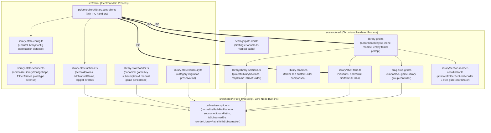
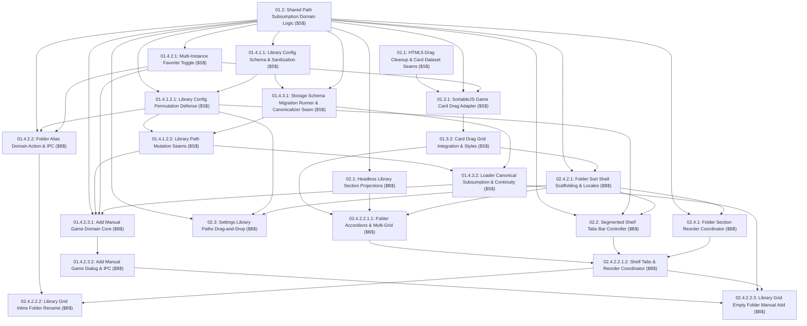

# PRD: Sort By Folder (Variant C) & Game Card Drag-Drop Migration to SortableJS

## Goal Description
Implement "Sort by Folder" library sorting mode using **Variant C (Top Segmented Shelf Tabs)**, and completely migrate the existing game card drag-and-drop architecture from fragile HTML5 drag math to **SortableJS**, unifying drag interactions across Game Cards, Shelf Tabs, and Settings.

This epic introduces headless path subsumption algorithms in `src/shared/path-subsumption.ts`, hardens configuration and IPC security boundaries against arbitrary directory injection and prototype pollution, and establishes clean DOM elements with SortableJS adapters, eliminating legacy manual 2D row math and FLIP animation helpers.

---

## User Review Required

> [!IMPORTANT]
> This epic establishes preparatory structural refactoring ($S$) followed by behavioral feature expansion ($B$). It completely replaces native HTML5 drag-and-drop math with SortableJS, adds folder-based library organization with top segmented tabs, and provides headless cross-platform path subsumption tested across Windows, Linux, and macOS.

---

## Architectural Boundary & Responsibilities



| Module | Responsibility | Environment |
| :--- | :--- | :--- |
| **`src/shared/path-subsumption.ts`** | Pure string path normalization, segment boundary containment (`isSubsumedBy`), ancestor subsumption (`subsumeLibraryPaths`), leaf extraction (`getFolderBaseName`), and data-loss-free reordering (`reorderLibraryPathsWithSubsumption`). | Pure TypeScript, zero Node `path` imports, browser and Node safe. |
| **`src/main/library-state/`** | Configuration sanitization, directory permutation validation, manual game executable inspection, multi-instance favorite propagation, canonical `gameKey` derivation, offline volume preservation, and category migration. | Electron Main process runtime. |
| **`src/renderer/drag-drop-grid.ts`** | SortableJS controller for game library grids, cross-zone favorite drop reconciliation, sibling-relative custom order calculation, and headless put validation. | Electron Renderer process runtime. |
| **`src/renderer/library/shelf-tabs.ts`** | Variant C segmented tabs bar, horizontal SortableJS reordering, zero-favorite fallback, wheel scroll normalization, and safe DOM rendering. | Electron Renderer process runtime. |
| **`src/renderer/settings/path-dnd.ts`** | SortableJS vertical reordering of configured library paths with boundary auto-scroll and identity order guards. | Electron Renderer process runtime. |
| **`src/renderer/library/library-sections.ts`** | Headless projection of favorites, folder accordion sections, mascot card safety, and folder display name resolution. | Headless pure TypeScript, 100% Vitest testable. |
| **`src/renderer/library/section-reorder-coordinator.ts`** | Dedicated 3-step section reorder coordinator (`collapse -> translateY glide -> re-expand`), concurrency locking, reduced-motion bypass, and FLIP position calculations. | Electron Renderer process runtime, 100% Vitest testable. |
| **`src/renderer/library-grid.ts`** | Accordion collapse tracking, dynamic `.library-section` DOM lifecycle, inline folder title editing, empty folder manual prompt, and SortableJS grid binding. | Electron Renderer process runtime. |

---

### 4-Axis Readiness Scorecard (Kent Beck Governance)

| Axis | Pre-Refactor ($S_0$) | Post-Refactor ($B$) | Architectural Guarantee |
| :--- | :--- | :--- | :--- |
| **Maintainability** | Tangled HTML5 drag event listeners, bespoke pointer tolerance math (`drag-math.ts`), and FLIP animation transforms (`flip-animation.ts`) scattered across multiple files. | Drag-and-drop mechanics unified into SortableJS instances. Game cards and stack cards become clean, lightweight DOM elements with zero native drag-and-drop event handlers. | Single drag paradigm across Game Cards, Shelf Tabs, and Settings. |
| **Extensibility** | `drag-drop-grid.ts` tightly coupled to a fixed pair of grid elements (`refs.favGrid` and `refs.unfavGrid`). Path subsumption logic missing from shared scope. | `dragDropGridController` exposes explicit lifecycle methods (`bindGrids(containers: HTMLElement[])`, `destroy()`) allowing dynamic multi-grid binding across folder accordion sections. Path subsumption placed in `src/shared/path-subsumption.ts`. | Clean multi-grid binding and cross-process path validation without boundary violations. |
| **Debuggability** | Drag behavior requires simulated HTML5 DataTransfer drag events; path normalization and folder subsumption logic lack isolated headless test suites. | Pure path subsumption, folder mapping, and section projection logic are 100% headless and virtually testable in-memory with Vitest across Windows, Linux, and macOS platforms. | 100% isolated headless testability with zero mock DOM overhead. |
| **Updatability** | Updating grid drag logic requires synchronizing custom 2D math, FLIP transforms, and card opacity styles simultaneously. | Deletion test passed: `drag-math.ts` and `flip-animation.ts` are completely deleted with zero lingering shims. | Reduced code surface and eliminated fragile bespoke math. |

---

### Architectural Transition Mapping & Kent Beck Tidying Taxonomy

| Transition Dimension | Current Tangled Landing Zone | Proposed Paved Landing Zone |
| :--- | :--- | :--- |
| **Module Structure** | Coupled HTML5 drag event math and FLIP animations mixed with DOM creation in `game-cards.ts` and `stack-cards.ts`. | Headless SortableJS controller managing clean card elements; pure projection functions in `library-sections.ts` and `path-subsumption.ts`. |
| **Dependency Path** | Main process controller handling raw file dialogs and ad-hoc record creation; fixed grid elements hardcoded in drag controller. | Domain action methods on `libraryState` (`addManualGame`, `setFolderAlias`); dynamic container binding seam (`bindGrids`) on drag controller. |
| **Code Locations** | Drag math split between `drag-math.ts`, `flip-animation.ts`, `drag-drop-grid.ts`, `game-cards.ts`, and `stack-cards.ts`. | Consolidated SortableJS adapters in `drag-drop-grid.ts`, `shelf-tabs.ts`, and `path-dnd.ts`. |

---

### Preparatory Refactoring ($S \to B$) Execution Sequence

1. **Stage $S_1$ (Structural Tidying - Card Dataset Seams & SortableJS Dependencies - *Dead Code / Normalize Symmetries*)**:
   - Install `sortablejs` and `@types/sortablejs`.
   - Attach `options.rootFolderPath?: string` parameter seam on card factories (`createGameCardFactory.createCard` and `createStackCardFactory.createStackCard`) and assign `card.dataset.rootFolderPath = options.rootFolderPath || ''` and `card.dataset.folderPath = game.folderPath || ''` (or `stack.primaryGame?.folderPath || stack.folderPath || ''` on stack cards).
   - Retain existing HTML5 `draggable` attributes and event listeners during this preparatory ticket to prevent intermediate application drag regression across sequential PRs. Provide unit tests in `src/renderer/game-cards.test.ts` defining headless Node.js test stubs on `globalThis.document.createElement` and `globalThis.window.iconCache`, passing mock `electronAPI.checkTranslationSupport`, and enforcing `afterEach` global fixture restoration. (Ticket `01.1`)

2. **Stage $S_2$ (Structural Tidying - Shared Domain Seam - *Extract Helper / New Interface, Old Impl*)**:
   - Extract `subsumeLibraryPaths`, `reorderLibraryPathsWithSubsumption`, `isSubsumedBy`, `normalizePathForPlatform`, and pure-string `getFolderBaseName` into `src/shared/path-subsumption.ts` (operating strictly on pure strings with explicit `PlatformInput` normalizing both Node and Engine platform strings without `node:path` built-in imports or ambient Node globals).
    - Enforce strict path security invariants: null-byte rejection, defensive relative segment normalization (`.` and `..` without escaping root boundaries), non-root trailing slash stripping in `normalizePathForPlatform` (e.g. `C:/Games/` -> `C:/Games`, `/home/user/games/` -> `/home/user/games`, preserving `/` or `C:/` root boundaries, mapping bare Windows drive roots matching `^[A-Za-z]:$` to include a trailing root slash `C:/`), input sanitization in `subsumeLibraryPaths` filtering out empty, non-string, or whitespace-only elements (and any paths whose canonical representation via `normalizePathForPlatform` evaluates to empty string `""`) prior to deduplication, canonical deduplication of input paths by normalized form before ancestor filtering and normalized non-self comparisons (`normalizePathForPlatform(p, targetPlatform) !== normalizePathForPlatform(other, targetPlatform)`) in `subsumeLibraryPaths` (preventing case and slash variants from mutually eliminating each other and absorbing child paths regardless of input ordering), input validation guard returning strictly `false` for empty child or parent paths in `isSubsumedBy`, input normalization of both child and parent paths inside `isSubsumedBy` via `normalizePathForPlatform` prior to segment boundary delimiter matching rejecting sibling prefix collisions, platform-aware case sensitivity, pure-string `getFolderBaseName` extracting leaf folder names while returning canonical drive roots for root paths and handling non-root trailing slashes cleanly, and preservation of all configured paths in `reorderLibraryPathsWithSubsumption` (strictly matching each root in `reorderedRootPaths` against `allConfiguredPaths` via `normalizePathForPlatform`, emitting the authentic configured path string from `allConfiguredPaths` while skipping already-emitted roots and ignoring roots that do not match any configured path, immediately sweeping `allConfiguredPaths` to cluster all subsumed child paths matching `isSubsumedBy(candidate, root, platform)` beneath their parent root, and appending remaining unmentioned or offline paths to guarantee a bijective permutation without data loss).
   - Provide comprehensive cross-platform Vitest unit tests in `src/shared/path-subsumption.test.ts`. (Ticket `01.2`)

3. **Stage $S_3$ (Structural Tidying - Multi-Instance Favorite Toggle Action & Parameterized IPC Contract)**:
   - Implement parameterized `toggleFavorite(gameKey: string, targetFavorite?: boolean)` in `src/main/library-state/actions.ts`: queries `buildLogicalGames` to locate `targetGroup`, resolves `nextFavorite` via target boolean or toggle fallback, and propagates `nextFavorite` symmetrically across all instances in `targetGroup.instances` for both multi-instance and single-instance groups, validating all instance keys against prototype pollution (`__proto__`, `constructor`, `prototype`) and own-property existence, preventing phantom records and permanent favorite locks. Catches operational failures, logs structured error diagnostics (`console.error('[LIBRARY_STATE][TOGGLE_FAVORITE] Failed to persist favorite toggle:', { gameKey, targetFavorite, error: err })`), and re-throws the error to ensure deterministic rejection across IPC.
   - Bind `toggleFavorite` on `createLibraryState` in `src/main/library-state/index.ts`.
   - Update `ElectronAPI.toggleFavorite(gameKey: string, targetFavorite?: boolean): Promise<boolean>` in `src/shared/types/ipc.d.ts` and `src/preload.ts`.
   - Update `'toggle-favorite'` handler in `src/main/ipc/controllers/library.controller.ts` to receive and forward `targetFavorite` to `libraryState.toggleFavorite(gameKey, targetFavorite)`.
   - Add Vitest unit tests in `src/main/library-state/actions.test.ts` and `src/main/ipc/controllers/library.controller.test.ts`. (Ticket `01.4.2.1`)

4. **Stage $S_4$ (Structural Tidying - Drag Controller Adapter & Lifecycle - *Dead Code / New Interface, Old Impl*)**:
   - Refactor `drag-drop-grid.ts` to SortableJS with `bindGrids(containers: HTMLElement[])`, tracking active Sortable instances and destroying pre-existing instances prior to re-binding, enforcing active drag teardown invariant (forcefully cancelling active in-flight drag sessions and purging lingering drag artifact clones `.sortable-drag`, `.sortable-ghost`, `.sortable-fallback` from `document.body` before unbinding or re-binding), connected group configuration (`group: 'game-library'`), same-container internal reorder identity guard (`if (to.el === from.el) return true;`), accepting optional parameter seam `isReordering?: () => boolean` and rejecting all cross-container drops (`return false`) while section reordering is in-flight, early rejection guard in `createGameLibraryPutValidator` rejecting drops into collapsed (`.is-collapsed`) or `inert` destination containers, strict drop boundary validation rejecting elements lacking valid non-empty `dataset.gameKey` before DOM mutation, sort-mode branched cross-folder drop rejection using card root folder datasets and path subsumption (strictly disallowing moves across disparate folder grids), excluding `.mascot-game-card` and items with `dataset.gameKey === '__mascot_card__'` from dragging and drop targets, ground-truth favorite grid identification (`to.el.id === 'fav-grid'` / `to.el === refs.favGrid`), indexed $O(1)$ element lookup with `safeEscapePath` in `createGameLibraryPutValidator` to eliminate linear query sweeps and high-frequency array allocations while preventing CSS selector crashes on special characters, and state-driven favorite reconciliation via `electronAPI.toggleFavorite(gameKey, targetFavorite)` wrapped in an interaction lock (`updateDisabled(true)` or `pointer-events: none`) in `try ... finally` and a `try ... catch` transactional rollback block with structured diagnostic logging restoring in-memory favorite state on persistence rejection or failure.
   - Sibling-relative custom order insertion: query adjacent sibling references by traversing contiguous sibling elements forward (`nextElementSibling`) or backward (`previousElementSibling`) until encountering the first candidate element that is a valid game card (`el.classList.contains('game-card') && !el.classList.contains('mascot-game-card') && el.dataset.gameKey`) whose `gameKey` is present in `cleanedOrder`, skipping non-game elements, `.mascot-game-card`, and self keys; normalizing `customOrder` authoritatively via `normalizeCustomOrder(getAllGames())` prior to computing dragged keys, evaluating candidate anchors independently without shadowing (evaluating next sibling presence in `cleanedOrder` first, then previous sibling presence, before falling back to `cleanedOrder.length` for empty containers or unindexed candidates), strictly avoiding negative or zero-offset index splicing. Auto-switch to `custom` sort via `options.setCurrentSort?.('custom')` alongside updating `customOrder` when not in `folder` mode.
   - Reactive view refresh seam: delegate refresh outside the active SortableJS drop event cycle via environment-safe scheduler `scheduleRefresh` falling back from `requestAnimationFrame` to `queueMicrotask`.
   - Lifecycle & test seams: expose `handleCardDragEnd: (evt: any) => Promise<void> | void` on the controller interface for headless testing, export pure function seam `createGameLibraryPutValidator` on `drag-drop-grid.ts` for headless unit testing in `src/renderer/drag-drop-grid.test.ts`, provide transitional backward-compatible no-op stubs (`attachZoneHandlers: () => void`, `startDrag: () => false`, `resetDragState: () => void`) to preserve bootstrap runtime safety until Ticket `01.3.2`, and provide `destroy()` tearing down all tracked Sortable instances.
   - Delete obsolete `drag-math.ts` and `flip-animation.ts` once `drag-drop-grid.ts` is fully migrated. (Ticket `01.3.1`)

5. **Stage $S_5$ (Structural Tidying - Library Grid Card Drag Integration & HTML5 Cleanup)**:
   - Add SortableJS card drag CSS classes to `src/style.css` (`.sortable-card-fallback` with explicit `z-index: var(--zIndex-card-drag, 1600)` elevated stacking level above sticky shelf tabs bar 200, header 1000, and search dropdown 1500; beneath modal overlays 2000, `.sortable-card-ghost`, `.sortable-card-chosen`).
   - Execute HTML5 drag cutover: strip native HTML5 drag attributes and handlers (`draggable`, `ondragstart`, `ondragend`, `ondragenter`, `ondragleave`, `ondragover`, `ondrop`) from both `game-cards.ts` and `stack-cards.ts`. Clean obsolete `onDragStart` and `onDragStateReset` hooks from `commonCardCallbacks`, and remove obsolete `dragDropGridController.attachZoneHandlers();` from bootstrap sequence in `app-composition.ts`. Remove obsolete `dragPointerSlop` and `dragRowTolerance` parameters from `app-composition.ts` and `src/renderer.ts`.
   - Update `createLibraryGridController` in `src/renderer/library-grid.ts` to accept injected seam `bindGrids?: (containers: HTMLElement[]) => void`, and invoke `options.bindGrids([refs.favGrid, refs.unfavGrid])` after rendering cards in flat sort modes (ensuring `refs.favGrid` retains drop-target styling `.drop-zone` with minimum 40px drop height when `favorites.length === 0`), and invoke `options.bindGrids?.([])` when the library is empty (`visibleGames.length === 0`) to clean up dangling Sortable instances. Wrap `localStorage.setItem('yumeshelf_sort_pref', type)` in a `try ... catch` error boundary logging structured diagnostics (`console.error('[LIBRARY_GRID] Failed to persist sort preference to localStorage:', { sortType: type, error: err })`) allowing rendering to complete uninterrupted under quota exhaustion or private browsing restrictions.
   - Update `createRendererComposition` in `src/renderer/bootstrap/app-composition.ts` to accept optional `cardDragOptions` and instantiate `createDragDropGridController` forwarding `...cardDragOptions`, `targetPlatform: options.targetPlatform`, and `isReordering: () => libraryGridController ? libraryGridController.isReordering() : false` while retaining required runtime dependencies (`electronAPI`, `getActiveCategoryId`, `getAllGames`, `getCurrentSort`, `setCurrentSort`, `refs`, `sortGames`), cleaning obsolete HTML5 parameters while preserving `createLibraryItem: (item, options) => libraryRuntime.createLibraryItem(item, options)` for card and section rendering, and pass `bindGrids: (containers) => dragDropGridController.bindGrids(containers)` to `createLibraryGridController`.
   - Add unit tests in `src/renderer/library-grid.test.ts` verifying `bindGrids` is called with `[refs.favGrid, refs.unfavGrid]` on render pass and with `[]` on empty library. (Ticket `01.3.2`)

6. **Stage $S_6$ (Structural Tidying - Library Config Schema Extension & Prototype Sanitization)**:
   - Extend `LibraryConfig` interface in `src/main/library-state/scanner.ts` with `folderAliases?: Record<string, string>`.
   - Update `normalizeLibraryConfigShape` in `scanner.ts` to accept parameter seam `targetPlatform?: PlatformInput`, and safely sanitize `folderAliases` against prototype pollution by rejecting/stripping `__proto__`, `constructor`, `prototype`, trimming keys/values, and defaulting to `{}`.
   - Export `WRAPPER_DIRECTORY_NAMES` from `src/main/library-state/scanner.ts` to expose wrapper detection to storage migrations and canonicalizer seams.
   - Add unit tests in `src/main/library-state/scanner.test.ts`. (Ticket `01.4.1.1`)

7. **Stage $S_7$ (Structural Tidying - Isolated Storage Schema Migration Runner & Key Canonicalizer Seam)**:
   - Establish explicit schema versioning and minimal isolated storage migration runner in `src/main/library-state/migrations.ts`: declare `CURRENT_SCHEMA_VERSION = 1` and extend root database envelope `LibraryDatabase` with `schemaVersion: number`, `config: LibraryConfig`, `games: Record<string, StoredGameRecord>`, and `titleResolutionConfig` (defaulting unversioned stores to `0`). In `loadDB()`, uniformly wrap database retrieval whether provided via injected `(options as any).loadDB` or default file reader `readJsonWithRetry(options.dbFilePath)`, initialize fresh installs upon `ENOENT` (across both `fs.stat` and `readJsonWithRetry`) with canonical envelope `{ schemaVersion: CURRENT_SCHEMA_VERSION, config: normalizeLibraryConfigShape({}, targetPlatform), games: {} }`, emit structured error logging (`console.error('[LIBRARY_STATE] Storage load failed, entering degraded state:', { dbFilePath: options.dbFilePath, reason: stats?.size === 0 ? 'zero-byte-file' : 'read-error', error: err })`) whenever `isDegradedState` is set to `true` on zero-byte file or read failures, and dispatch migrations under `serializedQueue` with double-checked locking when `initialVersion < CURRENT_SCHEMA_VERSION` (verifying `isDegradedState` inside the queued double-checked lock, `if (isDegradedState || (cachedDb && (cachedDb.schemaVersion ?? 0) >= CURRENT_SCHEMA_VERSION)) return cachedDb || data;`, and aborting immediately if a preceding task tripped degraded state without attempting secondary migrations), wrapping migration execution in a `try ... catch` block logging structured diagnostics and authoritatively setting `isDegradedState = true` on migration or persistence failure.
   - Implement and export standalone async helper `canonicalizeStoredGames(db, categoryState, libraryPaths, targetPlatform?: PlatformInput, options?: { isBootstrapMigration?: boolean; purgeOrphans?: boolean }): Promise<{ migratedCount: number }>` in `src/main/library-state/migrations.ts` to re-key stored games to canonical `gameKey`s via `subsumeLibraryPaths`, pre-indexing surviving contained game records in `db.games` into a `Set<string>` of logical game IDs to eliminate $O(K \times N)$ quadratic scans during orphan category purging, explicitly purge uncontained stored game records when `options?.purgeOrphans === true` while purging category assignments for an orphan ID only if `!survivingLogicalIds.has(orphanId)`, merge user metadata non-destructively on key collisions (preserving manual, autoTranslate, runInBackground, engine, platform, exePath, playtime, favorite, customName, saveFolderOverride), guard against prototype pollution and null records, delete legacy keys, and migrate category assignments in `categoryState` to canonical `gameId`s in-memory, committing changes strictly once via `await categoryState.saveCategoryState(catState)` upon loop completion, ensuring any failure during category load or persistence in bootstrap migrations (`options?.isBootstrapMigration === true`) rethrows out of `runStorageMigrations` to trip `isDegradedState = true` and abort advancing `schemaVersion` without state desynchronization.
   - Enforce Snapshot-and-Rollback Contract across mutative configuration actions in `config.ts` (`setFolderAlias`, `folderOrder`, `customOrder`), snapshotting in-memory configuration objects before mutations and restoring them on persistence rejection prior to rethrowing.
   - Enforce Orphaned Folder Alias Lifecycle Invariant: retain `folderAliases` mappings as persistent bookmarks/tombstones even when a folder path is removed from `libraryPaths`, avoiding premature alias deletion.
   - Implement sequential migration runner `runStorageMigrations(db, context, targetPlatform?: PlatformInput)` invoked exclusively at startup bootstrap inside `createLibraryState.loadDB()` in `src/main/library-state/index.ts`, validating that each sequential migration function exists and throwing an Error with structured error logging (`console.error('[STORAGE_MIGRATIONS] Missing migration function for schema version:', ...); throw new Error(...)`) if a step is unregistered or missing, wrapping migration step execution in structured error logging before rethrowing, executing migrations before domain services, scanners/loaders, IPC controllers, or UI components mount.
   - Implement Migration $M_{0 \to 1}$ (Path Subsumption Key Canonicalization & Category Continuity): operates strictly as an in-memory transformation unit without performing direct disk persistence or schema version stamping (leaving persistence and version stamping authoritatively to the migration runner); scans root database envelope keys with prototype pollution defense (`key !== '__proto__' && key !== 'constructor' && key !== 'prototype'`), adopting unversioned top-level legacy game records into `db.games` under their uncanonicalized legacy key (resolving macOS `.app` bundle roots, iteratively unwrapping wrapper subdirectories matching `WRAPPER_DIRECTORY_NAMES` in a `while` loop for nested descendant records, and falling back to `record.folderPath` when not a descendant or residing in wrapper directories, updating `folderPath = effectiveFolder` and `folderName = getFolderBaseName(effectiveFolder) || record.folderName || getLeafFolderName(effectiveFolder)` before deleting root property), sweeps `db.games` to purge transient `migratedFromGameKey` fields across all records, normalizes `db.config` via `normalizeLibraryConfigShape(db.config, targetPlatform)` with `context.fsSync?.existsSync(context.defaultGamesDir)` existence check (mirroring `config.ts:10`), and delegates storage and category re-keying to `await canonicalizeStoredGames(db, context.categoryState, db.config.libraryPaths, targetPlatform, { isBootstrapMigration: true })`.
   - Update `tests/library-state.test.js` cold-start, restore, inactive library path, and legacy migration assertions (lines 175, 497-498, 515, and 539/571) to align with canonical `schemaVersion: 1` envelope and canonical keys without `migratedFromGameKey`, maintaining 100% pass rate across all 303 legacy tests in `npm run test:node`, and add unit and integration test verification via `npm run compile:main && node --test tests/library-state.test.js && npm run test:vitest -- src/main/library-state/migrations.test.ts`. (Ticket `01.4.3.1`)

8. **Stage $S_8$ (Structural Tidying - Library Config Permutation Defense & Whitelist)**:
   - Update `config.ts` `updateLibraryConfig` to accept `targetPlatform?: PlatformInput` parameter seam, check `context.isDegraded?.() === true` and throw an Error on degraded database state, enforce property whitelisting against the complete `LibraryConfig` keys (`libraryPaths`, `folderAliases`, `telemetryEnabled`, `titleDisplayMode`, `displayProductCodes`, `preferredLocale`, `maxDepth`, `autoLaunch`, `minimizeToTray`, `exposeBetaOptions`) rejecting or stripping unexpected fields, and strictly validate incoming `updates.libraryPaths` against arbitrary directory injection and path dropping by validating element types (`typeof p === 'string' && p.trim() !== ''`) and symmetrically normalizing both `currentConfig.libraryPaths` and `updates.libraryPaths` via `normalizePathForPlatform(p, targetPlatform)`; reject invalid permutations by throwing an Error to guarantee transactional rollback across callers; validate incoming `updates.folderAliases` ensuring all alias path keys reside within configured library paths via `isSubsumedBy`, stripping invalid or external aliases with structured security warning (`[SECURITY][CONFIG_ALIAS_INJECTION]` logging `aliasKey` and `configuredRoots`); bypass permutation checks when omitted; strip legacy singular `libraryPath` property via `delete (updates as any).libraryPath;` if passed on updates object to prevent legacy mutations from bypassing array checks; enforce `!Array.isArray(updates.libraryPaths) || updates.libraryPaths.length === 0 || updates.libraryPaths.some(p => typeof p !== 'string' || !p.trim())` rejection throwing `Invalid libraryPaths: expected non-empty array of non-empty path strings`; throw `Cannot reorder empty libraryPaths configuration` if `currentConfig.libraryPaths` has zero canonical paths.
   - Update `src/main/library-state/index.ts` facade method `updateLibraryConfig` to accept and forward `targetPlatform`; in `src/main/ipc/controllers/library.controller.ts`, delegate `'update-library-config'` to `libraryState.updateLibraryConfig(updates)` first, followed by synchronizing `TelemetryShipper.getInstance().setTelemetryEnabled(updates.telemetryEnabled)` wrapped in a non-fatal `try ... catch` error boundary logging structured diagnostics when `telemetryEnabled` is a boolean; persist sanitized `folderAliases`.
   - Add Vitest unit tests in `src/main/library-state/config.test.ts` and `src/main/ipc/controllers/library.controller.test.ts`. (Ticket `01.4.1.2.1`)

9. **Stage $S_9$ (Structural Tidying - Library Path Mutation Seams & Storage Canonicalization)**:
   - Symmetrically normalize path lookups in `setupLibrary`, `removeLibraryPath`, `changeLibraryPath`, and `addLibraryPath` using `normalizePathForPlatform(p, targetPlatform)` with `folderAliases` key migration across all subsumed child paths matching `isSubsumedBy(aliasPath, oldPath, targetPlatform)` and pruning of orphaned aliases, checking `context.isDegraded?.() === true` immediately at entry and throwing an Error before dialogs or mutations, guarding `changeLibraryPath` against duplicate path injection by pruning `oldPath` if replacement path is already present; in `setupLibrary`, `removeLibraryPath`, `addLibraryPath`, and `changeLibraryPath`, reject filesystem root boundaries (`/` on POSIX, `^[A-Za-z]:[/\\]?$` on Windows) with structured warning `[SECURITY][CONFIG]` and throw an Error; declare `folderPickerSeam` on `LibraryContext` in `src/main/library-state/index.ts`; invoke `await canonicalizeStoredGames(db, context.categoryState, nextPaths, targetPlatform)` from `./migrations` (with `{ purgeOrphans: true }` in `removeLibraryPath`) to re-key stored records and migrate category assignments for newly promoted or subsumed roots before committing `db` via `await saveFn(db)`.
   - Update `src/main/library-state/index.ts` facade methods (`setupLibrary`, `addLibraryPath`, `removeLibraryPath`, `changeLibraryPath`) to accept and forward `targetPlatform`.
   - Add Vitest unit tests in `src/main/library-state/config.test.ts`. (Ticket `01.4.1.2.2`)

10. **Stage $S_{10}$ (Structural Tidying - Canonical Loader Reconciliation & Continuity)**:
    - Canonical Loader Read Invariant in `loader.ts`:
       - Consumes strictly canonical `schemaVersion: 1` storage; completely eliminates helper functions `readLegacyGames` and `removeLegacyGames`, call-sites `const legacyGames = readLegacyGames(db)`, candidate fallback lookup `|| legacyMigrationMap.get(...)`, and envelope mutation `removeLegacyGames(latestDb)`; removes unused `buildLegacyMigrationMap` import; completely eliminates `migratedFromGameKey` across both `loader.ts` and renderer `library-order.ts:33`, eliminates fallback queries (`latestStoredGames[scannedRecord.migratedFromGameKey]`), and eliminates multi-phase category migration loops from `persistPhase`.
       - Pre-computes `canonicalActiveRoots = subsumeLibraryPaths(activePaths, targetPlatform)` once before iterating candidate games for candidate canonical key derivation, and replaces `isPathWithinDirectory` with `isSubsumedBy`.
        - In `persistPhase`, derives authoritative library paths from `latestDb.config?.libraryPaths || normalizedConfig.libraryPaths` without resurrecting deleted paths; preserves user selections (`exePath`, `engine`, `folderPath`, `platform`, `manual: true`) across both the primary scanned games overlay loop (when `latestStoredGames[gameKey]?.manual === true`) and the secondary un-scanned manual retention loop; logs structured diagnostic warnings capturing key-value resource identifiers and error stacks on candidate folder stat failures (`[LOADER][STAT_FAIL]`), candidate executable inspection failures (`[LOADER][ENGINE_INSPECT]`), directory sizing failures (`[LOADER][DIR_SIZE]`), and game title resolution failures (`[LOADER][TITLE_RESOLVE]`), eliminating silent error swallowing.
        - Retains stored records across offline paths and manual additions: retains all stored records (both regular scanned games and manual games) on inactive library paths (`inactivePaths`) unconditionally without disk checks to protect offline storage against data loss; for active paths, retains un-scanned manual game records (`record.manual === true`) iff `exePath` and `folderPath` are valid non-empty strings (`typeof record.exePath === 'string' && record.exePath.trim().length > 0 && typeof record.folderPath === 'string' && record.folderPath.trim().length > 0`) and both exist on physical disk via `context.fsSync.existsSync(...)`, logging structured warning `[LOADER][MANUAL_CORRUPT]` and skipping corrupt records without throwing TypeError, deduplicated against `nextGames` via a folder path lookup `Set` in $O(N + M)$ time; pre-computes `canonicalConfigRoots = subsumeLibraryPaths(latestDb.config?.libraryPaths || normalizedConfig.libraryPaths, targetPlatform)` once prior to iterating manual games and re-derives canonical `gameKey` using `canonicalConfigRoots`, guarding derived keys against prototype pollution (`__proto__`, `constructor`, `prototype`); purges manual games whose parent library path has been removed.
        - Commits updated database to disk via single atomic write `await (context.persistDbDirectly || saveDB)(latestDb)`.
     - Add Vitest unit tests in `src/main/library-state/loader.test.ts`. (Ticket `01.4.3.2`)

11. **Stage $B_{11}$ (Behavioral Expansion - Set Folder Alias Domain Action & IPC Integration)**:
     - Implement `setFolderAlias(folderPath: string, alias: string, targetPlatform?: PlatformInput)` in `src/main/library-state/actions.ts`: degraded database guard, asynchronously loads `const db = await context.loadDB()` and runs `normalizeLibraryConfigShape(db.config, targetPlatform)` prior to mutating aliases, prototype safety, boundary validation via `isSubsumedBy`, canonicalization via `normalizePathForPlatform`, 255 char bound, control character stripping, safe deletion on empty alias, wrapping atomic persistence in a `try ... catch` error boundary logging structured diagnostics (`[LIBRARY_STATE][SET_FOLDER_ALIAS] Failed to persist folder alias:`) and returning `{ ok: false, error }` upon failure, or returning `{ ok: true, config }` on success.
     - Bind on `createLibraryState` in `src/main/library-state/index.ts` using `serializedQueue`.
     - Declare on `ElectronAPI` in `src/shared/types/ipc.d.ts` and expose in `src/preload.ts`.
     - Wire `library:set-folder-alias` thin IPC handler in `src/main/ipc/controllers/library.controller.ts`.
     - Add Vitest unit tests in `src/main/library-state/actions.test.ts` and `src/main/ipc/controllers/library.controller.test.ts`. (Ticket `01.4.2.2`)

12. **Stage $B_{12}$ (Behavioral Expansion - Add Manual Game Domain Core & Database Persistence)**:
     - Implement `addManualGameCore(context, targetPath, options?: AddManualGameOptions)` in `src/main/library-state/actions.ts`: accepts typed `options?: AddManualGameOptions` (with optional `targetPlatform?: PlatformInput` and optional `enclosingFolderPath?: string`), asynchronously loads `const db = await context.loadDB()` at function entry, validates physical disk existence of `targetPath` via `context.fs` or `context.fsSync` (failing fast with `{ ok: false, error: 'target-not-found' }` if missing), determines candidate library roots via `candidateRoots = subsumeLibraryPaths(config.libraryPaths, platform)`, validates selected path resides within library roots via `isSubsumedBy`, resolves macOS `.app` bundle internal executable via `AppBundleInspector` strictly when the target is an `.app` bundle or inside an `.app` bundle (normalizing and verifying physical disk existence and containment of any synthesized fallback binary via `context.fs` and `isSubsumedBy(fallbackExe, folderPath + '/Contents/MacOS', platform)` to prevent directory traversal, failing fast with `{ ok: false, error: 'unresolvable-executable' }` if missing or outside bundle boundaries, while allowing non-bundle macOS executables to resolve via standard containing directory resolution), derives `folderPath` from the individual game executable containing directory (resolving `.app` bundles and iteratively unwrapping `WRAPPER_DIRECTORY_NAMES` bounded against candidate library roots so unwrapping terminates when `parentDir` matches any candidate root or is no longer subsumed by candidate roots, preventing collapsing into the library root itself), matches `owningLibPath` strictly against `candidateRoots = subsumeLibraryPaths(config.libraryPaths, platform)` to prevent key divergence during automated scans (failing fast with `{ ok: false, error: 'outside-library' }` if `candidateRoots` is empty or no root matches without falling back to synthetic defaults) while treating `options.enclosingFolderPath` strictly as a boundary containment validator (`isSubsumedBy`) without overwriting `owningLibPath`, inspects binary via `YumeEngine.inspectExecutable` passing `adaptFileSystem(context.fs)` wrapped in `try ... catch` with structured diagnostic logging falling back to safe default profiles on inspection failure, resolves folder and executable paths with deterministic `normalizePathForPlatform` pre-normalization, checks derived `gameKey` against prototype pollution (`__proto__`, `constructor`, `prototype`) rejecting with `{ ok: false, error: 'invalid-game-key' }`, checks degraded database state, re-queries `latestDb = await context.loadDB()` inside `persistTask` to eliminate lost update race conditions against concurrent operations, re-verifies library root containment under the queue lock aborting with `{ ok: false, error: 'outside-library' }` if the owning library path was removed during binary inspection, overlays profile onto existing stored record under canonical `latestDb.games[gameKey]` preserving `playtime`, `favorite`, `lastPlayed`, `saveFolderOverride`, `name`/`customName`, sets explicit `folderPath` and `exePath` coordinates on the record, tags with `manual: true`, assigns `platform` ('macos', 'windows', 'linux') derived from `targetPlatform`, commits database persistence through `context.queue(persistTask)` via `saveDB`, retains user category associations by querying `context.categoryState?.loadCategoryState?.()` wrapped in a non-fatal `try ... catch` error boundary (logging diagnostic warning `console.warn('[LIBRARY_STATE][MANUAL_ADD] Failed to load category state, defaulting to empty categories:', { gameKey, error: err })` and defaulting `categoryIds: []` on failure, preventing category read errors from aborting already-committed game records), normalizes stored records via `Object.entries(readStoredGames(latestDb)).map(([storedGameKey, record]) => normalizeGameRecord(storedGameKey, record))` and `buildLogicalGames(normalizedGames, catState?.assignments || {})`, and returns `{ ok: true, game }`.
     - Declare optional `targetPlatform?: PlatformInput;` on `LibraryContext`, forward into internal `context`, and bind `addManualGameCore` on `createLibraryState` in `src/main/library-state/index.ts`.
     - Add Vitest unit tests in `src/main/library-state/actions.test.ts`. (Ticket `01.4.2.3.1`)

13. **Stage $B_{13}$ (Behavioral Expansion - Add Manual Game Dialog, IPC Controller & Preload Wiring)**:
     - Implement `addManualGame(context, options?: { folderPath?: string; targetPlatform?: PlatformInput })` in `src/main/library-state/actions.ts`: checking `context.isDegraded?.() === true` and returning `{ ok: false, error: 'degraded-database' }` immediately at function entry prior to dialogs or path validation, consuming typed `folderPath` from `options?.folderPath`, consumes `dialog` from injected `context` (`const { dialog } = context;`) with defensive fallback returning `{ ok: false, error: 'dialog-unavailable' }` if omitted, wraps `dialog.showOpenDialog` in a `try ... catch` error boundary logging structured diagnostics (`console.error('[ADD_MANUAL_GAME] Open dialog failed:', { error: err, defaultPath })`) returning `{ ok: false, error: err instanceof Error ? err.message : String(err) }` on rejection, validates default `folderPath` via `isSubsumedBy` with fallback for dialog `defaultPath`, delegates selected path to `addManualGameCore` forwarding `{ enclosingFolderPath: validatedEnclosing, targetPlatform }` to validate enclosing folder containment strictly when scoped to a folder section while allowing executables from any configured library root when invoked generically, and handles dialog cancellation.
     - Bind `addManualGame` on `createLibraryState` in `src/main/library-state/index.ts`.
     - Declare on `ElectronAPI` in `src/shared/types/ipc.d.ts` as `addManualGame(data?: { folderPath?: string } | string): Promise<{ ok: boolean; game?: any; canceled?: boolean; error?: string }>` and expose in `src/preload.ts`.
     - Wire `library:add-manual-game` IPC handler in `src/main/ipc/controllers/library.controller.ts` normalizing incoming payloads at the transport membrane boundary (evaluating raw string payloads as `{ folderPath: payload }`, strictly validating that non-string payloads are non-null objects and defaulting to `{}` for primitive or invalid payloads) into canonical typed options `{ folderPath?: string }` before delegating to `libraryState.addManualGame(options)`.
     - Add Vitest unit tests in `src/main/library-state/actions.test.ts` and `src/main/ipc/controllers/library.controller.test.ts`. (Ticket `01.4.2.3.2`)

14. **Stage $B_{14}$ (Behavioral Expansion - Folder Sort Shell Scaffolding, Markup, Styles & Locales)**:
    - Extend `RendererRefs` in `src/renderer/bootstrap/dom-refs.ts` with `shelfTabsWrapper: HTMLElement | null`.
    - Update `src/index.html` with "By Folder" option in `#sort-menu`, `#shelf-tabs-wrapper` below `#controls`, and dynamic `#game-grid-wrapper` structure.
    - Update `src/style.css` with CSS rules for shelf tabs bar, GPU-accelerated CSS Grid accordion transitions (`grid-template-rows: 0fr <-> 1fr`) and chevron rotation (with `@media (prefers-reduced-motion: reduce)` disabling transitions for instantaneous state toggling), section moving highlights (`.section-moving` with `position: relative; z-index: var(--zIndex-section-moving, 10);`), settings path scroll container, and inline title edit inputs.
    - Update `src/renderer/ui-text.ts` mapping `currentSortVal === 'folder'` to `d.sort_folder`.
    - Update localization files (`en.json`, `ja.json`, `zh.json`, `vi.json`) with keys: `sort_folder`, `all_folders`, `expand_all`, `collapse_all`, `manual_add_prompt`, `add_game_to_folder`.
    - Update `CHANGELOG.md` under `## [2.2.7] - working`. (Ticket `02.4.2.1`)

15. **Stage $B_{15}$ (Behavioral Expansion - Headless Section Projections & Library Stacks)**:
    - Implement `src/renderer/library/library-sections.ts`: `mapGameToRootFolder` (resolving canonical roots via `subsumeLibraryPaths` with mascot card defensive checks and guarding against double-separator concatenation on drive roots) and `projectLibrarySections` (resolving canonical roots via `subsumeLibraryPaths(params.rootPaths, params.targetPlatform)` and aggregating nested games under topmost ancestor roots) supporting flat sorts and folder sort across tabs `all`, `fav`, and individual folder IDs; safe alias resolution via own-property checks falling back to `getFolderBaseName`; dual favorite placement; empty folder placeholder; automatic fallback to `'all'` tab if `activeTabId` is invalid or deleted.
    - Add Vitest unit tests in `src/renderer/library/library-sections.test.ts`.
    - Update `src/renderer/library-stacks.ts` to normalize and supply `customOrder` when `type === 'folder'`, and compare games using `customOrder` in `folder` mode via $O(1)$ map lookups, guaranteeing unmapped keys default to `Number.MAX_SAFE_INTEGER` so comparator arithmetic never produces `NaN` and sorting maintains strict weak ordering.
    - Add Vitest unit tests in `src/renderer/library-stacks.test.ts`. (Ticket `02.1`)

16. **Stage $B_{16}$ (Behavioral Expansion - Segmented Shelf Tabs Bar Component)**:
    - Implement `src/renderer/library/shelf-tabs.ts` for Variant C segmented tabs bar (`#shelf-tabs-wrapper`) exposing lifecycle methods (`updateTabs`, `getActiveTab`, `destroy` cancelling pending scroll measurement animation callbacks with environment guards or injected seams, disconnecting `ResizeObserver`, and symmetrically detaching listeners) with injected coordinator callbacks (`getLibraryConfig`, `onConfigUpdated`, `onTabReorder: (oldOrder, newOrder, movedPath) => ...`, `onTabSelect`, `targetPlatform?: PlatformInput`, `resizeObserverFactory?: typeof ResizeObserver`, `scheduleAnimation?: (cb: () => void) => any`, `cancelAnimation?: (handle: any) => void`).
    - Symmetrically destroy pre-existing Sortable instances before creation; zero-favorite fallback rule transitioning active tab from `'fav'` to `'all'` when count reaches 0.
    - Geometric overflow observation: Safely instantiate `ResizeObserver` via `options.resizeObserverFactory || (typeof ResizeObserver !== 'undefined' ? ResizeObserver : undefined)`, falling back gracefully to window `resize` events guarded by `typeof window !== 'undefined'` with symmetrical listener removal in `destroy()`. Support deterministic execution in headless Node.js Vitest environments without ambient browser animation globals, guarding all calls to `requestAnimationFrame` and `cancelAnimationFrame` against undefined globals or accepting optional injected animation seams (`scheduleAnimation`, `cancelAnimation`). Isolate overflow button dimensions from container measurements (reserving button layout footprint via `visibility: hidden` or layout separation) or evaluate within `requestAnimationFrame` with hysteresis to eliminate `ResizeObserver` feedback loops ("ResizeObserver loop limit exceeded") and layout thrashing. Enforce clean `controller.destroy()` teardown in `afterEach()` hooks across unit tests to prevent listener and observer leaks.
    - Pointer-events interaction lock: lock container interaction (`container.style.pointerEvents = 'none'`) during drag reorder processing spanning both `onTabReorder` coordinator animations and `updateLibraryConfig` IPC persistence, releasing in a mandatory `finally` block to prevent re-entrant drag events or race conditions during in-flight network/IPC operations.
    - Identity order guard in SortableJS `onEnd`; safe text rendering (`textContent`/`escapeHtml`) to prevent DOM XSS; horizontal mouse wheel delta normalization (`deltaX || deltaY`) + `<` and `>` arrow scroll buttons when overflowing > 4 items.
    - Add Vitest unit tests in `src/renderer/library/shelf-tabs.test.ts`. (Ticket `02.2`)

17. **Stage $B_{17}$ (Behavioral Expansion - Settings Library Paths Drag-and-Drop & Composition Wiring)**:
    - Implement `src/renderer/settings/path-dnd.ts` with handle `.grip-handle`, boundary auto-scroll, identity order guard, pre-destruction of Sortable instance, container interaction locking (`container.style.pointerEvents = 'none'`) during in-flight reorder persistence with guaranteed `finally` release, `handlePathDragEnd: (evt: any) => Promise<void> | void` test seam forwarding promise from `onOrderChanged: (newPaths: string[]) => Promise<void> | void`, and `destroy()` lifecycle seam.
    - Add Vitest unit tests in `src/renderer/settings/path-dnd.test.ts`.
    - Update `src/renderer/settings.ts` with `SettingsControllerOptions` interface declarations (`electronAPI`, `pathDndOptions`, `onConfigUpdated`), grip handles, canonical path dataset attribute `data-path`, safe text rendering, folder alias display alongside path, attach `path-dnd.ts` controller, and max 4 visible rows before scrolling.
    - Update `src/renderer/bootstrap/app-composition.ts` to wire `createSettingsController` passing `electronAPI`, `pathDndOptions`, and `onConfigUpdated` callback. (Ticket `02.3`)

18. **Stage $B_{18}$ (Behavioral Expansion - Folder Section Reorder Coordinator Module)**:
    - Implement `animateFolderSectionReorder` in dedicated module `src/renderer/library/section-reorder-coordinator.ts` accepting parameter seams for timings (`collapseMs: 280, glideMs: 340, expandMs: 280, watchdogPaddingMs?: number` with default 100) and `movedPath`. If any step timing is configured <= 0 (`timing.collapseMs <= 0`, `timing.glideMs <= 0`, `timing.expandMs <= 0`) or executed in environments lacking CSS transition support, immediately bypass awaiting `transitionend` / `Animation.finished` promises and advance immediately to prevent test suite hangs in headless Vitest. Every transition promise must race against a bounded safety watchdog timer `(timingMs + (timing.watchdogPaddingMs ?? 100))` via `Promise.race`, clearing the watchdog timer via `clearTimeout` when transition completes first, removing event listeners when watchdog expires first, emitting a structured warning (`console.warn('[SECTION_REORDER_COORDINATOR] Transition step timed out, forcing advancement:', { step, movedPath, expectedDuration: timingMs })`) and forcing promise resolution if `transitionend` drops due to 0px height, background tab throttling, or transition cancellation.
    - Defensive CSS escape helper: `safeEscapePath = (p: string) => typeof CSS !== 'undefined' && typeof CSS.escape === 'function' ? CSS.escape(p) : p.replace(/(["\\])/g, '\\$1');`.
    - Guard clauses: identity order guard (0ms), length mismatch guard (`oldOrder.length !== newOrder.length`, immediately bypassing FLIP glide animations and committing physical DOM reordering immediately, 0ms), reduced-motion guard (0ms bypassing transitions and executing physical DOM reordering immediately), already-collapsed section (skip step 1, 0ms), active tab !== `'all'` (0ms).
    - Concurrency & re-entrancy locking: respect and preserve caller's tabs wrapper interaction lock across persistence, only managing pointer-events directly when not already locked externally, releasing locks in `finally` blocks even upon transition rejection or animation failure, preventing premature unlocking during in-flight persistence or permanent interaction deadlocks on error.
    - 3-step sequence: (1) Diff order or consume `movedPath`, resolve `[data-folder-path="${safeEscapePath(movedPath)}"]`, (2) Smooth collapse, (3) FLIP `translateY` glide coordinating position shifts across both target moving section and all displaced sibling sections between initial and destination positions, executing a batched layout measurement contract (Batch Read First bounding rects -> Batch DOM Mutation node reordering -> Batch Read Last bounding rects -> Batch Invert & Play displacement transforms with frame-scheduled transition activation on the subsequent animation frame when using CSS transitions or direct keyframe dispatch via Web Animations API to prevent same-frame style coalescing and watchdog timeouts) with zero-displacement bypass (`Math.abs(deltaY) < 1` bypassing `transitionend` promise awaiting to prevent test hangs), (4) Re-expand if previously open. Step 3 completion strictly cleans up inline style overrides without repeating physical DOM re-insertion (already committed in Step 2), committing the new folder order cleanly without visual flicker or redundant reflow.
    - Add Vitest unit tests in `src/renderer/library/section-reorder-coordinator.test.ts`. (Ticket `02.4.1`)

19. **Stage $B_{19}$ (Behavioral Expansion - Library Grid Folder View Rendering & Multi-Grid Binding)**:
    - Update `src/renderer/library-grid.ts`: accept `getLibraryConfig?: () => any`, accordion state (`collapsedSections`), `refs.unfavGrid` visibility lifecycle toggling (`display: none` in folder mode vs. `display: ''` in flat sorts), section projection via `projectLibrarySections`, safe assignment of `data-folder-path` and `data-root-folder-path` via native dataset properties or HTML-escaped attributes to prevent DOM attribute breakout, in-place section reconciliation keyed by `dataset.folderPath` during folder mode render passes (restricting unconditional clearance of `.library-section` DOM containers strictly to mode switches leaving folder mode and controller `destroy()`), symmetrically reconciling child game cards within each section by pre-indexing existing card DOM elements into an $O(1)$ Map (`Map<string, HTMLElement>`) prior to iterating model games to eliminate $O(N^2)$ quadratic traversals, assigning deterministic unique HTML `id` attribute to each section's collapsible `.game-grid` container matching `aria-controls` on the toggle button with `role="region"` and `aria-labelledby`, dynamically configuring `#game-grid-wrapper` with `role="tabpanel"` and `aria-labelledby` pointing to active tab ID in folder sort mode (and stripping in flat sort modes), releasing overflow clipping on expanded sections upon transition completion to preserve card context menus and tooltips, SortableJS binding across all sort modes via `options.bindGrids` with tracked active instances, enforcing cross-folder drop rejection and active drag teardown invariant, filtering `.mascot-game-card` and mascot keys from drag initiation and query targets, invoking `options.bindGrids?.([])` on empty library, container-scoped composite keying in `captureCardRects` and `animateReorderedCards` to eliminate coordinate overwrite collisions for dual-placed cards, filtering out non-visible cards (`card.offsetParent === null`, collapsed `.is-collapsed`, or `inert` containers) in `captureCardRects` prior to querying `getBoundingClientRect()`, mandating a strict two-phase batched layout execution pattern in `animateReorderedCards` (batch-reading visible non-collapsed cards and computing displacement vectors in a first pass, and dispatching `card.animate(...)` in a second pass, strictly prohibiting interleaving geometry reads with animation writes), dynamically updating SortableJS state on `.game-grid` containers when collapsing/expanding sections (disabling SortableJS on collapsed grids or excluding from `options.bindGrids`) to prevent redundant bounding box layout calculations on zero-height grids, anchoring active focus to `#shelf-tab-all` before unmounting if an unmounting section contains active focus and has zero surviving focusable siblings to prevent focus eviction to `document.body`, and propagating `rootFolderPath`.
    - Update `src/renderer/bootstrap/app-composition.ts` to wire `gameGridWrapper: refs.gameGridWrapper` and `getLibraryConfig: () => state.getCurrentLibraryConfig()` into `createLibraryGridController`.
    - Add Vitest unit tests in `src/renderer/library-grid.test.ts`. (Ticket `02.4.2.2.1.1`)

20. **Stage $B_{20}$ (Behavioral Expansion - Library Grid Shelf Tabs Lifecycle & Section Reorder Coordination)**:
    - Update `src/renderer/library-grid.ts`: shelf tabs controller integration, active tab selection, zero-favorite fallback, automatic `activeTabId = 'all'` reset when active folder path is removed in Settings, forwarding `reorderAnimationTiming`, `targetPlatform?: PlatformInput`, and `movedPath` into `animateFolderSectionReorder` with `isReordering` concurrency guard locking `refs.gameGridWrapper` (`pointer-events: none`, `aria-busy="true"`, capturing keydown suppression) across both animation and configuration update persistence, and `pendingRenderPass` deferred queue, `onReorderFailed` rollback, and public controller `destroy()` (invoking `options.bindGrids?.([])`, unmounting dynamic `.library-section` DOM containers, resetting `isReordering = false;`, clearing `pendingRenderPass = null;`, and safely delegating to `shelfTabsController?.destroy()` with defensive null checks for partial test harnesses where `refs.shelfTabsWrapper` is omitted).
    - Update `src/renderer/bootstrap/app-composition.ts` to wire folder view dependencies into `createLibraryGridController` (`shelfTabsWrapper`, `getCurrentSort`, `onConfigUpdated`, `targetPlatform`, `shelfTabsOptions`, `reorderAnimationTiming`).
    - Add Vitest unit tests in `src/renderer/library-grid.test.ts`. (Ticket `02.4.2.2.1.2`)

21. **Stage $B_{21}$ (Behavioral Expansion - Library Grid Single-Click Inline Folder Rename)**:
    - Update `src/renderer/library-grid.ts`: single-click inline folder rename with safe DOM text bindings, section-header-scoped `.rename-input` styling overriding card-level centered alignment with left-aligned natural width layout, applying preventable event contracts on title click and within the input (invoking `e.preventDefault()` where default action suppression is needed while allowing bubbling to document listeners, with parent toggle triggers checking `if (e.defaultPrevented) return;` and strictly prohibiting `e.stopPropagation()` or `e.stopImmediatePropagation()`), blur/Esc cancellation guard preventing save on cancel, Enter/blur saving via `electronAPI.setFolderAlias` wrapped in a `try ... catch` block with structured diagnostic logging, retaining the input mounted in an error state with `aria-invalid="true"` on failure to allow retry without losing typed text, restoring `titleElement.textContent`, restoring `titleElement.style.display = ''`, removing the input element, and focusing `titleElement` strictly BEFORE dispatching `options.onConfigUpdated` and live shelf tabs label synchronization, Esc cancel, and live shelf tabs label synchronization via in-place `titleElement.textContent` update (resolving to `trimmedValue` or falling back to `getFolderBaseName(folderPath)` when alias is cleared to empty string) and re-projected `shelfTabsController.updateTabs` without full-grid `renderLibraryGrid` DOM teardown.
    - Add Vitest unit tests in `src/renderer/library-grid.test.ts`. (Ticket `02.4.2.2.2`)

22. **Stage $B_{22}$ (Behavioral Expansion - Library Grid Empty Folder Manual Game Addition)**:
    - Update `src/renderer/library-grid.ts`: empty folder placeholder prompt (`.manual-add-btn` with text set via `textContent` and `aria-label` set via `btn.setAttribute('aria-label', ...)` or `escapeHtml` to prevent DOM XSS, complying with WCAG 2.5.3 with visible prompt text and folder identification) triggering `options.electronAPI.addManualGame({ folderPath })`, guarded by an `isSelecting` in-flight boolean flag to prevent re-entrant file dialogs, with in-flight progress feedback (`aria-disabled="true"`, `aria-busy="true"`, interaction blocking, and active label localized via `empty_folder_selecting`), structured diagnostic logging on failure, delegating to `options.onGameAdded` to update in-memory games and dynamically refresh the folder view, and restoring keyboard focus to the newly rendered game card element (via `data-game-key`) or section container to prevent focus eviction to `document.body`.
    - Update `src/renderer/bootstrap/app-composition.ts` to wire `onGameAdded` into `createLibraryGridController` to update in-memory games with deduplication by `gameId`, `gameKey`, and normalized folder path, replacing existing entries matching `gameId` to preserve complete canonical multi-instance stacks, and re-sort library.
    - Add Vitest unit tests in `src/renderer/library-grid.test.ts`. (Ticket `02.4.2.2.3`)

---

## Unified Drag-and-Drop Architecture via SortableJS

- **Game Cards**: Completely replace the bespoke 2D grid drag math (`src/renderer/drag-drop-grid.ts`, `drag-math.ts`, `flip-animation.ts`) with SortableJS connected groups (`group: 'game-library'`).
  - **Eliminates Browser Ghost**: `forceFallback: true` renders a real physical clone attached 1:1 to the mouse cursor with depth shadows.
  - **Real-Time Sibling Shifting**: Cards smoothly slide out of the way (`animation: 180`) to open slots in real time.
  - **Cross-Zone Dragging**: Moving a card between the pinned Favorites grid and Main grid automatically toggles favorite status via `electronAPI.toggleFavorite`, guarded by transactional `try ... catch` error rollback to revert card placement and in-memory state on persistence failure.
  - **Cross-Folder Drag Policy**: Moving cards between different folder sections is prohibited (`put: false` across disparate folder containers).
  - **Multi-Instance Stacks**: Moving stacked/duplicate games moves all associated instances together in custom order.
  - **Dual-Placement Sibling Resolution**: In folder sort mode, relative custom order calculations resolve adjacent sibling game cards skipping non-game elements, `.mascot-game-card`, and cards matching the dragged game key or stack group keys, preventing self-sibling resolution and order corruption when dragging from Favorites into a folder where a duplicate card for that game already exists.
  - **Clean Game Card DOM**: Strips HTML5 `draggable="true"` and `ondragstart` handlers from `game-cards.ts` and `stack-cards.ts`.

---

## Variant C (Segmented Shelf Tabs) Specifications

- **Layout & Stacking Context**: Segmented shelf tabs bar mounted as a full-width container directly beneath `<div class="header">` (before `#loading` and `#game-grid-wrapper`, not inside `<div class="controls">`). Styled with `position: sticky; top: 0;`, authoritative tokenized elevation `z-index: var(--zIndex-shelf-tabs, 200)` (above card elevation `50/100`, below dropdowns `1000`), opaque `background-color: var(--bg-color)`, and separation border `border-bottom: 1px solid var(--border-color)`. Contains "All Folders", "Favorites" (rendered with an accessible inline vector SVG star icon inheriting active gold or theme tokens via `currentColor` when count > 0, banning raw Unicode emoji glyphs), and individual folder tabs with game count badges. When transitioning `activeTabId` from `'fav'` to `'all'` upon `favoritesCount === 0` and unmounting the Favorites tab element, the controller detects whether keyboard focus was on the Favorites tab; if so, it anchors and programmatically restores focus to `#shelf-tab-all`, preserving roving `tabindex` continuity without focus eviction to `document.body`. Similarly, when transitioning `activeTabId` from a folder tab to `'all'` because the folder was removed or subsumed, if keyboard focus was on that folder tab, the controller anchors and programmatically restores focus to `#shelf-tab-all` before unmounting the tab DOM node, maintaining unbroken roving `tabindex` continuity. Elevation Token Scale & Fallback Drag Elements Stacking Hierarchy: Standardize tokenized elevation scale in design tokens (`src/styles/theme.css`): `--zIndex-section-moving: 10`, `--zIndex-shelf-tabs: 200`, `--zIndex-tab-drag: 500`, `--zIndex-card-drag: 1600`, `--zIndex-path-row-drag: 2100`. All SortableJS fallback drag elements must declare explicit stacking context levels referencing these tokens rather than raw integer literals: `.sortable-card-fallback` declares elevated stacking level `z-index: var(--zIndex-card-drag, 1600)` (positioned above sticky shelf tabs bar 200, header search controls 1000, and dropdown menus 1500; beneath modal overlays 2000), `.sortable-tab-fallback` declares `z-index: var(--zIndex-tab-drag, 500)` (positioned above shelf tabs bar 200 and sibling tabs; beneath header controls 1000), and `.sortable-row-fallback` in settings declares `z-index: var(--zIndex-path-row-drag, 2100)` (positioned above settings modal panel and overlay 2000; beneath toast notifications 10005). In addition, `#game-grid-wrapper` and dynamic folder section containers (`.library-section`) declare stacking context isolation (`isolation: isolate`) to contain internal child z-index escalations (card hover states at `z-index: 50/100`, `.section-moving` highlights at `z-index: var(--zIndex-section-moving, 10)`, and card context menus at `z-index: 2000`) beneath the sticky shelf tabs bar (`z-index: var(--zIndex-shelf-tabs, 200)`) during scrolling.
- **WAI-ARIA Tablist Semantics & Keyboard Navigation**: Shelf tabs container implements `role="tablist"` with accessible name `aria-label="Shelf folders"`. Individual tabs implement `role="tab"`, dynamic `aria-selected="true" | "false"`, and `aria-controls="game-grid-wrapper"`. Each rendered tab element is assigned a deterministic, unique element `id` (`shelf-tab-all`, `shelf-tab-fav`, `shelf-tab-<sanitized-folder-key>`). When in "By Folder" sort mode, `#game-grid-wrapper` dynamically declares `role="tabpanel"` and `aria-labelledby` referencing the active tab's unique element `id`; when switching to flat sort modes where `#shelf-tabs-wrapper` is hidden, `#game-grid-wrapper` removes `role="tabpanel"` and `aria-labelledby` to restore standard grid presentation. Supports roving `tabindex` (`0` for active tab, `-1` for inactive tabs) and horizontal keyboard arrow navigation (`ArrowRight` / `ArrowLeft`, `Home` / `End`) with automatic `scrollIntoView`. Across generic tab updates (`updateTabs`), the controller preserves and reuses existing tab DOM elements keyed by stable entity identifiers, retaining keyboard focus on the active tab throughout updates without unmounting active focused nodes, evicting focus to `document.body`, or resorting to post-render DOM re-querying hacks. Overflow buttons render canonical vector SVG chevron glyphs inheriting theme color via `currentColor` rather than raw ASCII text characters, paired with explicit visual tooltip attributes (`data-tooltip` matching localized labels "Scroll tabs left" / "Scroll tabs right"), accessible names (`aria-label`), dynamic `aria-disabled="true"`, visual disabled opacity, and functional activation guards in click, mousedown, and keydown handlers (`if (btn.getAttribute('aria-disabled') === 'true') return;`) rather than applying CSS `pointer-events: none` on the button, preserving mouseover and focus events for tooltip discovery while preventing scrolling past boundary limits.
- **Shelf Tabs Dragging**: Reorder tabs smoothly using horizontal SortableJS (`direction: 'horizontal'`, `animation: 180`, `forceFallback: true`). While a tab reorder transaction is in flight (spanning coordinator section FLIP glide and IPC persistence), keyboard arrow navigation (`ArrowRight`, `ArrowLeft`, `Home`, `End`) and selection triggers within `shelf-tabs.ts` are suppressed, ignoring keydown activations until the reorder transaction completes or rolls back. Reordering syncs immediately with Settings and All Folders section order using `reorderLibraryPathsWithSubsumption` to cluster and preserve un-rendered child paths before persisting to `db.config.libraryPaths`, preventing data loss. Persistence rollbacks dispatch ephemeral toast notifications via `showToastPill`.
- **All Folders Tab & WAI-ARIA Accordions**: Sections are collapsible accordions with chevrons and an Expand All / Collapse All toolbar container (`.folder-accordion-toolbar` with `role="toolbar"` and `aria-label="Folder accordion controls"`, using `.small-btn.text-btn` for action buttons, rendered strictly when `activeTabId === 'all'` and `folderSections.length > 0`, and cleared alongside section containers on view transitions). Section header containers serve as semantic heading wrappers (`role="heading"`, `aria-level="3"`), while accordion expansion triggers are isolated toggle button controls (`role="button"`, `tabindex="0"`, dynamic `aria-expanded="true" | "false"`, `aria-controls` referencing the unique section grid ID) encompassing the chevron indicator (rendered as an accessible inline vector SVG glyph with `aria-hidden="true"` bound to `currentColor`), declaring a dynamic `aria-label` (e.g. "Toggle folder <folder displayName>") or `aria-labelledby` referencing both the toggle trigger and the sibling folder title element identifier, paired with a visual hover/focus tooltip (`data-tooltip` matching localized toggle state). Each accordion section's collapsible grid container is assigned a deterministic, unique HTML `id` attribute matching `aria-controls`, and declares `role="region"` and `aria-labelledby` pointing back to the section toggle button ID or heading element ID per WAI-ARIA APG standards. When an accordion section is collapsed (`.is-collapsed` and `aria-expanded="false"`), its collapsible grid container and child interactive elements are completely suppressed from the keyboard focus sequence and screen reader traversal via HTML `inert`, while visual transitions and discrete visibility states are governed declaratively by CSS transitions without imperative JavaScript timers. If `document.activeElement` is contained within the section being collapsed, the controller programmatically anchors and restores focus to the section's accordion toggle button or the toolbar "Collapse All" button before applying the `inert` attribute, preventing focus eviction to `document.body`. Expanding the section immediately clears the `inert` attribute and restores discrete visibility declaratively via CSS transitions, binding post-animation state updates to native `transitionend` events on the animating container rather than imperative timeout shims. The folder title and inline rename input render as independent sibling elements within the heading container, strictly prohibiting interactive element nesting (`tabindex="0"` or `<input>`) inside an ancestor declaring `role="button"`. Toggling accordions executes in-place DOM class toggling (e.g. `.is-collapsed`) without triggering full `renderLibraryGrid('folder')` passes, preserving DOM nodes and GPU-accelerated CSS Grid transitions (`grid-template-rows: 0fr <-> 1fr`), respecting `@media (prefers-reduced-motion: reduce)` by disabling CSS transitions for instantaneous state changes. While CSS Grid animations require clipping during collapsing/expanding transitions, the expanded state must allow visible overflow once expansion completes (when `.is-collapsed` is absent) to prevent truncating card context menus (`z-index: 2000`) and tooltips. Both individual accordion section toggle buttons and toolbar buttons check active reordering state (`if (options.isReordering?.() || isReordering) return;`) and temporarily block interactions (`pointer-events: none` and `aria-disabled="true"`) during in-flight reordering (FLIP glide and IPC persistence). Reordering a folder triggers a 3-step sequence: collapse -> translateY glide coordinating FLIP position shifts across both target moving section and all displaced sibling sections between initial and destination positions (with `.section-moving` declaring `position: relative` with elevated local `z-index: var(--zIndex-section-moving, 10)`) -> re-expand (if previously open), with teardown in `finally`, injectable duration parameter seams, and reduced-motion bypass.
- **Individual Folder Tabs**: Clean, non-collapsible flat view (fixed open, no chevrons).
- **Single-Click & Keyboard Inline Rename**: Single-click on a folder title or pressing `F2` / `Enter` on focused title activates an inline text input (`<input class="rename-input" type="text" aria-label="Rename folder <name>">`), invoking `e.preventDefault()` on the activation event. Prior to activation, the static folder title element (`tabindex="0"`) declares text-editing hover affordance (text selection cursor styling and subtle edit hover state), an accessible visual tooltip on hover/focus, and an accessible description (`aria-description="Click or press Enter/F2 to rename folder"`) informing assistive technology and keyboard users of the rename capability, disambiguating title interaction from the sibling accordion toggle button. The inline folder title rename input must be explicitly scoped (e.g. section-header-scoped `.rename-input` or dedicated modifier) to override card-level centered styling with left text alignment, natural width matching the header title layout, and visual harmony with the folder heading text and sibling chevron button. Inline rename interaction events (click, mousedown, keydown) apply preventable event contracts: invoking `e.preventDefault()` where default action suppression is needed and allowing events to bubble to document-level listeners, while parent section header toggle handlers check `if (e.defaultPrevented) return;` before toggling accordion collapse, strictly prohibiting `e.stopPropagation()`. Enter/blur saves to `db.config.folderAliases` (dispatching `showToastPill` on persistence failure), Esc cancels without blur saving. In-flight persistence protects the input element via `aria-disabled="true"` and `readOnly` preserving keyboard focus, while terminating inline rename mode safely restores keyboard focus to `titleElement` (`tabindex="0"`) upon `Enter` commit or `Esc` cancellation without post-render focus re-querying. Real OS disk directories are never renamed.
- **Nested Path Subsumption**: If Settings contains parent and child paths (e.g. `D:/Games` and `D:/Games/Visual Novel`), Settings retains both, but Library view aggregates games under topmost ancestor (`D:/Games`).
- **Dual Favorite Display**: Favorited games appear in the pinned Favorites section at top AND inside their respective folder section. Card rect capture (`captureCardRects`) and reorder animation (`animateReorderedCards`) routines enforce container-scoped composite keying (combining container zone identity with the game key) so that dual-placed cards record distinct spatial coordinates, eliminating coordinate collisions and visual jump animations during library re-sorting. In addition, focus continuity across render passes enforces container-scoped composite keying, preserving DOM element identity and updating cards in-place without unmounting active focused nodes, preventing focus displacement to the pinned favorites grid at the top of the document and eliminating abrupt viewport scroll jumps.
- **Manual Executable Chooser & Empty Folder Layout**: Empty folder sections display a centered prompt spanning all grid columns (`grid-column: 1 / -1;`, `min-height: 120px;`, dashed accent border) with text "Your Game Is Not Scanned? Manually Add Them Here." when no category filter is active and the section contains zero games in the unfiltered library state (guarded by `isReordering` lock to prevent concurrency conflicts with section animations). The `.manual-add-btn` button declares explicit `type="button"` and a contextual accessible name complying with WCAG 2.5.3 (Label in Name) by ensuring its accessible name starts with or contains the visible button label text, with its text set via `textContent` and accessible name assigned via `btn.setAttribute('aria-label', ...)` or sanitized via `escapeHtml(section.displayName)`, strictly prohibiting raw unescaped template string interpolation of folder names or aliases into HTML markup strings to prevent attribute breakout and DOM XSS vulnerabilities. Clicking `.manual-add-btn` immediately applies `aria-disabled="true"`, `aria-busy="true"`, and interaction blocking displaying in-flight state (`empty_folder_selecting`), dynamically updating its accessible name via `btn.setAttribute('aria-label', ...)` to contain the visible in-flight label text alongside folder identification per WCAG 2.5.3 while ensuring DOM XSS immunity, resetting cleanly if the dialog is canceled or on error. Adds the game via `YumeEngine.inspectExecutable`, maps it to that folder, updates renderer in-memory game state to immediately re-render the populated section, and explicitly transfers keyboard focus to the newly rendered game card element (via `data-game-key`) or the section container to prevent focus eviction to `document.body`. Dispatches `showToastPill` with actionable cause on failure.
- **Settings Path Reordering**: Library Paths list in Settings capped at 4 items with stable scrollbar space reservation (`scrollbar-gutter: stable`) before vertical scroll, using SortableJS with boundary auto-scroll. Row drag grip handles (`.grip-handle`) render an inline vector SVG grip icon with `aria-label="Reorder library path"` and visual tooltip attribute `data-tooltip="Drag to reorder"`. Dispatches `showToastPill` on persistence rollback.
- **Keyboard Focus Continuity**: Library grid controller preserves and reuses DOM nodes using stable entity identifiers across async update boundaries, maintaining roving `tabindex` state machines that advance focus pointers deterministically before items detach, strictly banning destructive container clearance and post-render DOM re-querying hacks.

---

## Proposed Changes

### Dependencies

#### [MODIFY] [package.json](file:///d:/Projects/YumeShelf/package.json)
- Add dependencies:
  - `sortablejs`: `^1.15.2` (in `dependencies`)
  - `@types/sortablejs`: `^1.15.8` (in `devDependencies`)

---

### Configuration & Main Process Domain Layer

#### [MODIFY] [scanner.ts](file:///d:/Projects/YumeShelf/src/main/library-state/scanner.ts)
- Extend `LibraryConfig` interface:
  - `folderAliases?: Record<string, string>` mapping canonical folder paths to user display names.
- Update `normalizeLibraryConfigShape`:
  - Signature: `export function normalizeLibraryConfigShape(config: any, targetPlatform?: PlatformInput): LibraryConfig`.
  - Forward `targetPlatform` into `normalizePathForPlatform(p, targetPlatform)` for `libraryPaths` and `folderAliases` key indexing, defaulting to `resolvePlatform(targetPlatform)`.
  - Sanitize and canonically deduplicate `libraryPaths` on read/normalization using a `Set` of canonical normalized paths (`seen: Set<string>` via `normalizePathForPlatform(p, targetPlatform)`), stripping non-root trailing slashes and resolving case/separator variations so legacy configs on disk containing duplicate, trailing-slash, or case-variant paths normalize into a unique, canonical array without duplicates.
  - Safely sanitize and normalize `folderAliases`: guard against prototype pollution by rejecting/stripping `__proto__`, `constructor`, `prototype`, and inherited `Object` properties (using `isPlainObject(base.folderAliases)` and validating own properties).
  - Bound alias values to a maximum of 255 characters, strip non-printable and newline control characters (`[\r\n\t\x00-\x1f]`), trim string keys and values, prune any key whose trimmed alias evaluates to empty string `""`, normalize dictionary keys via `normalizePathForPlatform(key, targetPlatform)` stripping non-root trailing slashes, and always populate `folderAliases` as a guaranteed `Record<string, string>` defaulting to `{}` when omitted or invalid.

#### [MODIFY] [config.ts](file:///d:/Projects/YumeShelf/src/main/library-state/config.ts)
- Update `updateLibraryConfig`:
  - Signature: `updateLibraryConfig(context: any, updates: Partial<LibraryConfig> = {}, targetPlatform?: PlatformInput): Promise<LibraryConfig>`.
  - Database health guard: if `context.isDegraded?.() === true`, throw `new Error('Database is in degraded state')` to ensure caller transactional `catch` blocks in `shelf-tabs.ts` and `settings.ts` trigger rollback (`onReorderFailed`, restoring DOM tabs and order).
  - Property whitelisting: strictly validates incoming `updates` against the complete canonical `LibraryConfig` keys (`libraryPaths`, `folderAliases`, `telemetryEnabled`, `titleDisplayMode`, `displayProductCodes`, `preferredLocale`, `maxDepth`, `autoLaunch`, `minimizeToTray`, `exposeBetaOptions`), stripping or rejecting unexpected keys.
  - Strip legacy singular `libraryPath` property via `delete (updates as any).libraryPath;` if passed on updates object to prevent legacy mutations from bypassing array checks.
  - Strictly validate incoming `updates.libraryPaths` against arbitrary system directory injection and path dropping via duplicate entries: when `updates.libraryPaths` is explicitly provided, verify that `updates.libraryPaths` is a non-empty Array and every element is a non-empty string (`!Array.isArray(updates.libraryPaths) || updates.libraryPaths.length === 0 || updates.libraryPaths.some(p => typeof p !== 'string' || !p.trim())`), rejecting invalid types or empty arrays with `new Error('Invalid libraryPaths: expected non-empty array of non-empty path strings')`, and verify that `updates.libraryPaths` is strictly a valid bijective permutation containing the exact same set of canonical paths as `currentConfig.libraryPaths`. To prevent false rejections when `currentConfig.libraryPaths` contains un-normalized host Windows backslashes or legacy duplicates, symmetrically normalize and deduplicate *both* arrays using `normalizePathForPlatform(p, targetPlatform)`:
    - Derive `currentCanonical = Array.from(new Set(currentConfig.libraryPaths.map(p => normalizePathForPlatform(p, targetPlatform))))`.
    - If `currentCanonical.length === 0`, throw `new Error('Cannot reorder empty libraryPaths configuration')`.
    - Derive `updateCanonical = Array.from(new Set(updates.libraryPaths.map(p => normalizePathForPlatform(p, targetPlatform))))`.
    - Enforce `updateCanonical.length === currentCanonical.length`.
    - Enforce `new Set(updates.libraryPaths.map(p => normalizePathForPlatform(p, targetPlatform))).size === updates.libraryPaths.length`.
    - Enforce `updateCanonical.every(p => currentCanonical.includes(p))`.
    - If `updates.libraryPaths` contains paths not present in `currentConfig.libraryPaths`, drops existing paths, contains duplicate entries, or attempts to inject arbitrary system directories, reject the update by throwing an Error (rejecting the Promise) to guarantee transactional rollback across callers.
  - Boundary validation on `updates.folderAliases`: when `updates.folderAliases` is provided, verify that every alias key resides within configured library paths via `isSubsumedBy(folderKey, root, targetPlatform)`, pruning or rejecting any keys outside library roots with structured security warning (`console.warn('[SECURITY][CONFIG_ALIAS_INJECTION] Blocked unauthorized folder alias key outside library roots:', { aliasKey: key, configuredRoots: currentConfig.libraryPaths })`).
  - When `updates.libraryPaths` is omitted (e.g. updating `folderAliases`), bypass path permutation checks. Adding new library roots remains strictly gated behind `addLibraryPath` using native OS directory picker dialogs (`dialog.showOpenDialog`).
  - Symmetrically normalize path lookups in `setupLibrary`, `removeLibraryPath`, `changeLibraryPath`, and `addLibraryPath` using `normalizePathForPlatform(p, targetPlatform)` to ensure casing and separator format consistency across Windows, macOS, and Linux:
    - Check `context.isDegraded?.() === true` immediately at entry in `setupLibrary`, `removeLibraryPath`, `changeLibraryPath`, and `addLibraryPath` and throw an Error before dialogs or mutations.
    - In `setupLibrary`, accept `targetPlatform?: PlatformInput`, derive `nextPaths`, invoke `await canonicalizeStoredGames(db, context.categoryState, nextPaths, targetPlatform)` from `./migrations` to re-key stored records and migrate category assignments before committing `db` via `await saveFn(db)`.
    - In `removeLibraryPath`, locate target path index using `findIndex` with `normalizePathForPlatform`; if `index === -1 || config.libraryPaths.length <= 1`, return `config` immediately without mutating `libraryPaths`, deleting aliases, running canonicalization, or writing to disk; otherwise retain `config.folderAliases` mappings as persistent bookmarks/tombstones per the Orphaned Folder Alias Lifecycle Invariant (avoiding premature alias pruning so customizations survive path re-addition), splice the entry, and invoke `await canonicalizeStoredGames(db, context.categoryState, config.libraryPaths, targetPlatform, { purgeOrphans: true })` from `./migrations` (leveraging Set pre-indexing of surviving contained records to eliminate quadratic scans) to purge records in `db.games` whose `folderPath` is no longer subsumed by remaining paths, remove corresponding category assignments, re-key stored records, and migrate category IDs for newly promoted canonical roots before committing `db` via `await saveFn(db)`.
    - In `changeLibraryPath`, open `dialog.showOpenDialog` (or use injected `folderPickerSeam` on `LibraryContext` in test environments) to acquire the replacement path; if selected, check self-selection: if `normalizePathForPlatform(chosenPath, targetPlatform) === normalizePathForPlatform(oldPath, targetPlatform)`, return `config` immediately as a no-op without mutations; if `chosenPath` matches a *distinct* existing configured path, prune `oldPath` and subsumed aliases from `config.libraryPaths` and `config.folderAliases` to prevent duplicate injection; otherwise locate target path index using `findIndex` with `normalizePathForPlatform`, replace with the chosen path, canonicalize both `oldPath` and `chosenPath` via `normalizePathForPlatform(p, targetPlatform)`, migrate associated key and all child folder aliases subsumed by `oldPath` in `config.folderAliases` by replacing their prefix with `chosenPath`, normalize the new key via `normalizePathForPlatform`, validate against prototype pollution keys (`__proto__`, `constructor`, `prototype`), delete old keys via `delete config.folderAliases[aliasKey]`, prune any not subsumed by remaining configured roots, and invoke `await canonicalizeStoredGames(db, context.categoryState, config.libraryPaths, targetPlatform)` from `./migrations` to re-key stored games and migrate category IDs before committing `db` via `await saveFn(db)`.
    - In `addLibraryPath`, open `dialog.showOpenDialog` (or use injected `folderPickerSeam` on `LibraryContext` in test environments) to acquire the path, verify absence using `some` with `normalizePathForPlatform` to prevent duplicates, and invoke `await canonicalizeStoredGames(db, context.categoryState, config.libraryPaths, targetPlatform)` from `./migrations` to re-key stored games and migrate category IDs before committing `db` via `await saveFn(db)`.
  - Forward `targetPlatform` from `src/main/library-state/index.ts` facade methods (`updateLibraryConfig`, `setupLibrary`, `addLibraryPath`, `removeLibraryPath`, `changeLibraryPath`).
  - Persist sanitized `folderAliases` and validate incoming `libraryPaths` reordering.

#### [NEW] [config.test.ts](file:///d:/Projects/YumeShelf/src/main/library-state/config.test.ts)
- Comprehensive Vitest unit tests covering `updateLibraryConfig`:
  - Verifies `updateLibraryConfig` accepts valid permutations of `libraryPaths`.
  - Verifies `updateLibraryConfig` accepts valid permutations when `currentConfig.libraryPaths` contains raw Windows backslashes and `updates.libraryPaths` contains canonical forward slashes.
  - Verifies throwing an Error when attempting to inject arbitrary system directory paths, duplicate existing paths, or drop existing configured paths.
  - Verifies throwing an Error when incoming `libraryPaths` is empty (`[]`), contains non-string elements, or empty strings (`[null]`, `[123]`, `['']`).
  - Verifies throwing an Error when `context.isDegraded()` returns true.
  - Verifies platform-aware case sensitivity using injected `targetPlatform` (`win32` case-insensitive vs `linux` case-sensitive).
  - Verifies bypass of permutation checks when `updates.libraryPaths` is omitted.
  - Verifies sanitization of `folderAliases` in `normalizeLibraryConfigShape` (prototype pollution stripping, 255 character limit, control character stripping).
  - Verifies persistence of sanitized `folderAliases`.
  - Verifies symmetric path lookups in `removeLibraryPath`, `changeLibraryPath`, and `addLibraryPath`, and verifies alias prefix migration in `changeLibraryPath` deletes the old alias key, stores the new key in platform-canonical format, and rejects prototype pollution.

#### [MODIFY] [actions.ts](file:///d:/Projects/YumeShelf/src/main/library-state/actions.ts)
- Add and update domain actions on `libraryState`:
  - `setFolderAlias(folderPath: string, alias: string, targetPlatform?: PlatformInput)`:
    - Degraded database guard: if `context.isDegraded?.() === true`, safely aborts and returns `{ ok: false, error: 'degraded-database' }`.
    - Prototype safety: rejects or strips prototype pollution keys (`__proto__`, `constructor`, `prototype`). Handled as a prototype-safe dictionary.
    - Boundary validation: validates that `folderPath` resides within at least one configured directory in `config.libraryPaths` by importing and invoking `isSubsumedBy` from `src/shared/path-subsumption.ts`. Rejects paths outside library roots with `{ ok: false, error: 'outside-library' }`.
    - Canonicalizes `folderPath` using `normalizePathForPlatform(folderPath, targetPlatform)` when indexing and saving keys in `config.folderAliases`.
    - Input sanitization: bounds `alias` to maximum 255 characters, strips non-printable/newline control characters (`[\r\n\t\x00-\x1f]`), and trims whitespace. If empty after trim, safely deletes the canonical folder key from `folderAliases` using `delete config.folderAliases[folderKey]` only after confirming it is an own property to allow clean fallback to `getFolderBaseName(folderPath)`.
    - Triggers atomic save and returns `{ ok: true, config: normalizedConfig }` on success, or `{ ok: false, error: string }` on failure.
  - `addManualGame(folderPathOrOptions?: string | { folderPath?: string }, targetPlatform?: PlatformInput)`:
    - Robust parameter handling adhering to Postel's Law: accepts either an options object `{ folderPath?: string }` or a raw string `folderPath` primitive (`const folderPath = typeof folderPathOrOptions === 'string' ? folderPathOrOptions : folderPathOrOptions?.folderPath;`).
    - Accepts injectable `targetPlatform?: PlatformInput = process.platform` (or via `context.targetPlatform`) to ensure 100% in-memory MultiOS virtual testability.
    - Default path validation: Before passing `folderPath` to `dialog.showOpenDialog({ defaultPath })`, validates that if `folderPath` is provided, non-empty, and resides within `config.libraryPaths` (via `isSubsumedBy`), storing the validated path as `const validatedEnclosing = (folderPath && config.libraryPaths.some(r => isSubsumedBy(folderPath, r, targetPlatform))) ? folderPath : undefined;`. If `folderPath` is missing, invalid, or outside `config.libraryPaths`, safely falls back to `resolveLibraryFolderToOpen(context)` or `config.libraryPaths[0]` as `defaultPath`, while `validatedEnclosing` remains `undefined`, preventing the file dialog from opening in arbitrary host directories. Wraps `dialog.showOpenDialog` in a `try ... catch` error boundary logging structured diagnostics (`[ADD_MANUAL_GAME] Open dialog failed:`) and returning `{ ok: false, error }` on rejection.
    - Opens file dialog with platform-specific executable filters branched on `targetPlatform` (`.exe` on Windows, `.app` on macOS, all/binaries on Linux) and executes binary inspection asynchronously outside the queue.
    - Boundary security validation: Validates physical disk existence of `targetPath` (as a file or `.app` bundle directory) via `context.fs` or `context.fsSync` before proceeding to engine inspection and database persistence. If `targetPath` does not exist or is a generic non-bundle directory, logs a diagnostic warning (`console.warn('[SECURITY][MANUAL_ADD] Target path not found on disk:', { targetPath })`) and safely rejects with `{ ok: false, error: 'target-not-found' }`. Decouples dialog `defaultPath` from `enclosingFolderPath`: when an authentic enclosing folder is explicitly provided and validated within `config.libraryPaths`, passes `enclosingFolderPath: validatedEnclosing` to `addManualGameCore` to strictly enforce containment within that folder; when invoked generically or when `folderPath` fell outside library roots, leaves `enclosingFolderPath` `undefined` so that `addManualGameCore` validates against any configured library root via `isSubsumedBy` (`config.libraryPaths.some((rootPath: string) => isSubsumedBy(selectedPath, rootPath, targetPlatform))`). If the selected path falls outside all configured library roots, safely rejects with `{ ok: false, error: 'outside-library' }`. In addition, `addManualGameCore` validates that the executable resides within a dedicated game subfolder beneath the owning library root (`normalizePathForPlatform(folderPath, targetPlatform) !== normalizePathForPlatform(owningLibPath, targetPlatform)`), rejecting root-level executables with `{ ok: false, error: 'root-level-executable' }` (logging `[SECURITY][MANUAL_ADD] Blocked root-level executable without dedicated game folder:`) to prevent colliding game keys and loader deduplication purges.
    - macOS bundle resolution: If selected path is a `.app` bundle directory or resides within a `.app` bundle (evaluating `isMacBundle` via `.app` extension or `resolveBundleRoot`), resolves internal executable binary via `AppBundleInspector.fromPath` before binary inspection; when resolving fallback binary candidates within `.app` bundles (`${folderPath}/Contents/MacOS/${bundleName}`), validates that derived `bundleName` is non-empty (`bundleName.trim().length > 0`) and verifies that the resolved path on disk is a regular file via `stat.isFile()` (rejecting directory matches and empty bundle names with `{ ok: false, error: 'unresolvable-executable' }`); non-bundle macOS executables fall through to standard containing directory resolution.
    - Binary inspection: Inspects binary via `YumeEngine.inspectExecutable` passing adapted context filesystem wrapped in a `try ... catch` block with structured diagnostic logging (`console.warn('[ADD_MANUAL_GAME] Executable inspection failed, falling back to default profile:', err)`), determining owning library path using `subsumeLibraryPaths(activePaths, targetPlatform)`.
    - Database persistence phase dispatched through `context.queue(persistTask)` (symmetrically to `addLibraryPath` in `config.ts`):
      - Guard against degraded database state: verifies `if (context.isDegraded?.() === true)` BOTH as an immediate pre-condition guard at function entry and immediately following `await context.loadDB()`, safely aborting and returning `{ ok: false, error: 'degraded-database' }`.
      - Prototype security validation: validate derived `gameKey` against prototype pollution keys (`__proto__`, `constructor`, `prototype`) and reject with `{ ok: false, error: 'invalid-game-key' }` before database lookup or assignment.
      - Authoritative snapshot re-query to eliminate lost update race hazards: inside `persistTask`, re-query latest database state under queue lock via `const latestDb = await context.loadDB(); const games = readStoredGames(latestDb);` ensuring concurrent playtime and config mutations are not lost.
      - User metadata preservation & overlay under canonical `games[gameKey]`: Checks if a record already exists under `games[gameKey]` (`const existing = games[gameKey];`) to preserve existing user state across manual profile re-inspections.
      - Populates explicit `recordCopy.folderPath = selectedFolderPath; recordCopy.exePath = selectedExePath;` on the manual record to ensure subsequent rescans in `loader.ts` do not purge the record.
      - Overlays the newly inspected binary profile while preserving existing user state: `favorite: existing ? existing.favorite ?? false : false`, `playtime: existing ? existing.playtime ?? 0 : 0`, `lastPlayed: existing ? existing.lastPlayed ?? 0 : 0`, `runInBackground: existing ? existing.runInBackground ?? false : false`, `autoTranslate: existing ? existing.autoTranslate ?? false : false`, `dateAdded: existing ? existing.dateAdded || Date.now() : Date.now()`, `engine: inspectedProfile ? (YumeEngine.formatEngineName(inspectedProfile) ?? null) : (existing?.engine ?? null)`, `saveFolderOverride: existing ? existing.saveFolderOverride : undefined`, `name: existing?.customName ? existing.name : (inspectedProfile?.title || getFolderBaseName(folderPath))`, `customName: existing ? !!existing.customName : false`, tags with `manual: true`, and assigns `platform: targetPlatform === 'darwin' ? 'macos' : (targetPlatform === 'win32' ? 'windows' : 'linux')` derived from `targetPlatform` (or `context.targetPlatform || process.platform`).
      - If no record exists, defaults `playtime: 0`, `lastPlayed: 0`, `favorite: false`, `runInBackground: false`, `autoTranslate: false`, `dateAdded: Date.now()`, `engine: inspectedProfile ? (YumeEngine.formatEngineName(inspectedProfile) ?? null) : null`, derives `name` via leaf folder/binary heuristics, tags with `manual: true`, and assigns `platform: targetPlatform === 'darwin' ? 'macos' : (targetPlatform === 'win32' ? 'windows' : 'linux')` derived from `targetPlatform` (or `context.targetPlatform || process.platform`).
      - Database persistence and category retention:
        1. Calls `await (context.persistDbDirectly || context.saveDB)(latestDb)` to write the updated library database with canonical keys to `games.json`, ensuring any persistence failure or rejection propagates as `{ ok: false, error: err instanceof Error ? err.message : String(err) }`.
        2. Derives `newGameId = buildLogicalGameId(recordCopy)`. Retains user category assignments by querying `context.categoryState?.loadCategoryState()` wrapped in a non-fatal `try ... catch` error boundary (logging diagnostic warning `console.warn('[LIBRARY_STATE][MANUAL_ADD] Failed to load category state, defaulting to empty categories:', { gameKey, error: err })` and defaulting `categoryIds: []`), preserving user category associations directly without running legacy migration loops and preventing category load errors from aborting already-committed game records.
      - Logical game construction: constructs a canonical `LogicalGame` using the resolved category assignments, normalizes stored records through `Object.entries(readStoredGames(latestDb)).map(([storedGameKey, record]) => normalizeGameRecord(storedGameKey, record))` and `buildLogicalGames(normalizedGames, catState?.assignments || {})` from `src/main/library-state/continuity.ts` to construct a fully compliant canonical `LogicalGame` structure (`gameId`, `instances: [instance]`, `primaryInstance: instance`, `categoryIds`, `duplicateCount: 0`), and returns `{ ok: true, game }` (or `{ ok: false, canceled: true }` if canceled, `{ ok: false, error: string }` on failure).
  - `toggleFavorite(gameKey: string, targetFavorite?: boolean)`:
    - Guard against degraded database state: verifies `if (context.isDegraded?.() === true)` BOTH as an immediate pre-condition guard at function entry and immediately following `await context.loadDB()`, throwing `new Error('Database is in degraded state')` to prevent stale in-memory corruption upon disk failure. Any persistence failure or rejection from `persistDbDirectly` / `saveDB` MUST be caught, logged with structured diagnostics (`console.error('[LIBRARY_STATE][TOGGLE_FAVORITE] Failed to persist favorite toggle:', { gameKey, targetFavorite, error: err })`), and re-thrown as an Error rejection across the IPC bridge, ensuring renderer-side transactional rollback triggers deterministically.
    - Prototype safety: forbids unsafe prototype-polluting keys (`__proto__`, `constructor`, `prototype`).
    - Multi-instance and single-instance logical group resolution: Queries and builds logical games via `buildLogicalGames(normalizedGames)` to locate the logical group matching `gameKey` (`record.gameId === gameKey || record.instances.some((inst: any) => inst.gameKey === gameKey)`).
    - Instance key propagation: If `targetGroup` is resolved, determines `nextFavorite = typeof targetFavorite === 'boolean' ? targetFavorite : !targetGroup.favorite` and iterates across all instances in `targetGroup.instances` using prototype pollution defense (`const instKey = instance.gameKey; if (typeof instKey === 'string' && instKey !== '__proto__' && instKey !== 'constructor' && instKey !== 'prototype' && Object.prototype.hasOwnProperty.call(games, instKey) && games[instKey]) { games[instKey].favorite = nextFavorite; }`) across ALL instances (for both single and multi-instance groups), preventing phantom records and prototype pollution under logical `gameId` keys. If `targetGroup` is not found, falls back to guarded prototype-safe lookup: `const isUnsafeKey = typeof gameKey !== 'string' || gameKey === '__proto__' || gameKey === 'constructor' || gameKey === 'prototype'; if (!isUnsafeKey && Object.prototype.hasOwnProperty.call(games, gameKey) && games[gameKey]) { games[gameKey].favorite = typeof targetFavorite === 'boolean' ? targetFavorite : !games[gameKey].favorite; } else { throw new Error(`Game not found: ${gameKey}`); }`.
    - Triggers atomic persistence and returns the resolved boolean nextFavorite state (where `false` strictly indicates successful unfavorited state, not error).

#### [NEW] [actions.test.ts](file:///d:/Projects/YumeShelf/src/main/library-state/actions.test.ts)
- Comprehensive Vitest unit tests covering domain actions:
  - `setFolderAlias`: Verifies alias persistence in `config.folderAliases` under canonicalized path keys, degraded database guard (`context.isDegraded() === true`), whitespace trimming, control character stripping, max length bounding, prototype pollution rejection, boundary validation via `isSubsumedBy`, key deletion on empty alias, and return of `{ ok: true, config }` or `{ ok: false, error }`.
  - `addManualGame`: Verifies dialog invocation, default path validation fallback, Postel's Law parameter acceptance (handling both `{ folderPath }` and raw string `folderPath`), boundary security validation via `isSubsumedBy` (rejecting paths outside `config.libraryPaths` with `{ ok: false, error: 'outside-library' }`), binary inspection error resilience and structured logging, binary inspection passing `adaptFileSystem(context.fs)` for 100% in-memory virtual testing against `MockFileSystemProvider`, `.app` bundle internal binary resolution using injected `targetPlatform: 'darwin'`, `manual: true` tagging, database file persistence via `saveDB`, in-queue latest DB reload (`latestDb = await context.loadDB()`) preventing lost updates, category assignment retention, metadata preservation on re-add under canonical `games[gameKey]`, degraded database abortion check, and serialization queue isolation (verifying dialog executes outside `queue`).
  - `toggleFavorite`: Verifies explicit boolean targeting (`targetFavorite === true / false`) and toggle fallback across both single-instance logical games (updating authentic `instance.gameKey` storage keys without phantom records) and multi-instance grouped stacks (asserting all sibling instances in `targetGroup.instances` update symmetrically with prototype pollution defense to prevent permanent favorite locks).

#### [MODIFY] [loader.ts](file:///d:/Projects/YumeShelf/src/main/library-state/loader.ts)
- Canonical `gameKey` derivation via path subsumption:
  - In `loadGamesForConfig`, resolve `owningLibPath` for scanned candidates by evaluating segment boundary containment via `isSubsumedBy(candidate.folderPath, root, targetPlatform)` across roots returned by `subsumeLibraryPaths(activePaths, targetPlatform)` instead of raw `activePaths.find(...)` or raw `.startsWith(...)`. This prevents sibling prefix collisions between sibling roots sharing common directory prefix strings (e.g. `D:/Games` and `D:/Games2`), and guarantees identical canonical `gameKey` derivation (`buildGameKey(owningLibPath, candidate.folderPath)`) across automated directory scanning and manual game additions (`addManualGameCore`), ensuring stored manual game records reconcile cleanly into `nextGames` during rescans without creating duplicate records under divergent keys.
  - Deprecate/remove private `isPathWithinDirectory`; use `isSubsumedBy(folderPath, libraryPath, targetPlatform)` from `src/shared/path-subsumption.ts`.
  - Structured diagnostic logging: log structured diagnostic warnings on candidate folder stat failures (`[LOADER][STAT_FAIL]`), candidate executable inspection failures (`[LOADER][ENGINE_INSPECT]`), directory sizing failures (`[LOADER][DIR_SIZE]`), and game title resolution failures (`[LOADER][TITLE_RESOLVE]`), eliminating silent error swallowing in `loader.ts`.
- Canonical loader reconciliation in `loadGamesForConfig`:
  - Consumes authoritative storage guaranteed to be at `schemaVersion: 1` by bootstrap migration runner; satisfies Clean Canonical Read Invariant with zero `migratedFromGameKey` references, zero property sniffing, zero mid-scan fallback queries (`latestStoredGames[scannedRecord.migratedFromGameKey]`), and zero multi-phase category migration loops in `persistPhase`.
  - In `persistPhase`, query `latestStoredGames` directly by canonical `gameKey`.
  - When `latest?.manual === true`, explicitly preserve user selections: `recordCopy.exePath = latest.exePath; recordCopy.engine = latest.engine; recordCopy.folderPath = latest.folderPath; recordCopy.manual = true;`, preventing automated scan heuristics from clobbering user-selected manual game executables and engines.
  - Retain stored records across offline paths and manual additions:
    1. Retain all stored records (both regular scanned games and manual games) on inactive library paths (`inactivePaths`) unconditionally without disk checks to protect offline storage against destructive data loss.
    2. For active library paths (`activePaths`), retain un-scanned stored manual game records (`record.manual === true`) if and only if both executable and folder still exist on disk via `context.fsSync.existsSync(record.exePath) && context.fsSync.existsSync(record.folderPath)`.
    3. Pre-index `nextGames` folder paths into a lookup `Set` collection (`const existingFolderPaths = new Set(Object.values(nextGames).map(g => normalizePathForComparison(g.folderPath)));`) to execute $O(N + M)$ deduplication lookups instead of nested $O(M \times N)$ array iterations.
    4. Duplicate prevention upon path subsumption key migration: When iterating over `latestStoredGames` to retain manual game records, skip any record if `nextGames` already contains an entry with the same normalized folder path (`existingFolderPaths.has(normalizePathForComparison(record.folderPath))`).
    5. Re-derive canonical `gameKey` using `subsumeLibraryPaths(normalizedConfig.libraryPaths, targetPlatform)` (all configured library paths) for any retained stored record whose parent library path was subsumed before inserting into `nextGames`, guarding derived keys against prototype pollution (`__proto__`, `constructor`, `prototype`), ensuring `gameKey = canonicalGameKey; relativePath = canonicalGameKey;`.
    6. Stored records whose parent library path has been explicitly removed from `normalizedConfig.libraryPaths` are purged to prevent zombie records.
  - Single atomic database persistence: `persistPhase` executes a single, clean atomic persistence of `latestDb` to disk via `await (context.persistDbDirectly || saveDB)(latestDb);`.

#### [NEW] [loader.test.ts](file:///d:/Projects/YumeShelf/src/main/library-state/loader.test.ts)
- Comprehensive Vitest unit tests covering manual game persistence and canonical key derivation in `loadGamesForConfig`:
  - Verifies `owningLibPath` and `gameKey` derivation resolves to the topmost ancestor root via `subsumeLibraryPaths`, preventing key divergence when nested parent and child library paths exist.
  - Verifies stored manual game records (`record.manual === true`) are retained in `nextGames` during library scans when their executable and folder path exist on disk and reside within active library paths.
  - Verifies deduplication of manual game records on path subsumption key migration via $O(N + M)$ set lookups (skipping records whose folder path is already in `nextGames`).
  - Verifies manual game records residing on inactive library paths (`inactivePaths`) are unconditionally preserved without disk checks.
  - Verifies manual game records whose paths no longer exist on active mounted library roots are purged.
  - Verifies manual game records whose parent library path has been removed from `config.libraryPaths` are purged.
  - Verifies user-selected manual game `exePath` and `engine` are preserved during rescan overlays.
  - Verifies candidate executable inspection and directory sizing failures log structured diagnostic warnings without aborting the scan.
  - Verifies regular scanned games reconcile cleanly alongside preserved manual games.
  - Verifies single atomic write in `persistPhase` committing `latestDb` to disk.

#### [NEW] [migrations.ts](file:///d:/Projects/YumeShelf/src/main/library-state/migrations.ts)
- Schema version register & isolated storage migration runner:
  - Declare `export const CURRENT_SCHEMA_VERSION = 1;`.
  - Define root database envelope `LibraryDatabase` containing `schemaVersion: number; config: LibraryConfig; games: Record<string, GameRecord>;`. Default unversioned legacy stores to `schemaVersion = 0`.
  - Export `runStorageMigrations(db: any, context: LibraryContext, targetPlatform?: PlatformInput): Promise<LibraryDatabase>`. Migrations execute sequentially ($M_{0 \to 1} \to \dots$) at application bootstrap before domain services or UI mount, validating that each sequential migration function exists and throwing an Error with structured error logging (`console.error('[STORAGE_MIGRATIONS] Missing migration function for schema version:', ...); throw new Error(...)`) if a step is unregistered or missing.
  - Implement and export standalone helper `export async function canonicalizeStoredGames(db: LibraryDatabase, categoryState: CategoryState, libraryPaths: string[], targetPlatform?: PlatformInput, options?: { isBootstrapMigration?: boolean }): Promise<{ migratedCount: number }>` to re-key stored games under subsumed paths to canonical topmost ancestor keys, merge colliding records non-destructively (preserving manual, autoTranslate, runInBackground, engine, platform, exePath, playtime, favorite, customName, saveFolderOverride), delete legacy keys, wrap `categoryState.loadCategoryState()` in an isolated `try ... catch` error boundary returning `{}` on missing or corrupted category files, and re-map category assignments with batched persistence. Category loading and saving failures during bootstrap migration $M_{0 \to 1}$ (`options?.isBootstrapMigration === true`) are rethrown to trip `isDegradedState = true` and abort advancing `schemaVersion` so migration retries cleanly on next boot, while non-bootstrap runtime path mutations handle category errors gracefully.
  - Implement Migration $M_{0 \to 1}$ (Subsumption Canonicalization & Category Reconciliation):
    - Operates strictly as an in-memory transformation unit without performing direct disk persistence or version stamping (orchestrated authoritatively by `runStorageMigrations`).
    - Scans root database envelope keys with prototype pollution defense (`key !== '__proto__' && key !== 'constructor' && key !== 'prototype'`) when adopting unversioned top-level legacy game records into `db.games`.
    - Delegates storage and category re-keying to `await canonicalizeStoredGames(db, context.categoryState, db.config?.libraryPaths || [], targetPlatform, { isBootstrapMigration: true })`.

#### [NEW] [migrations.test.ts](file:///d:/Projects/YumeShelf/src/main/library-state/migrations.test.ts)
- Comprehensive Vitest unit tests for storage migrations:
  - Verifies unversioned store (`schemaVersion` undefined) is recognized as version 0 and sequentially migrated to `CURRENT_SCHEMA_VERSION = 1`.
  - Verifies stores already at `CURRENT_SCHEMA_VERSION` are returned unchanged without unnecessary disk writes.
  - Verifies legacy `gameKey`s are rewritten to canonical topmost ancestor keys under path subsumption and legacy keys deleted.
  - Verifies category assignments are safely migrated from `fallbackOldId` to `newGameId` and purged from `fallbackOldId`.
  - Verifies category migration error handling: bootstrap migration rethrows category load/save failures tripping degraded state and preserving retry on next boot, while non-bootstrap runtime mutations log warnings without crashing.

#### [MODIFY] [index.ts](file:///d:/Projects/YumeShelf/src/main/library-state/index.ts)
- Storage lifecycle isolation at bootstrap:
  - In `loadDB()`:
    - Reads raw JSON from `options.dbFilePath` via `readJsonWithRetry`. Emits structured diagnostic error logging (`console.error('[LIBRARY_STATE] Storage load failed, entering degraded state:', { dbFilePath: options.dbFilePath, reason: stats?.size === 0 ? 'zero-byte-file' : 'read-error', error: err })`) whenever `isDegradedState` is set to `true` on zero-byte file or read failures.
    - If database is not in degraded state (`!isDegradedState && data && typeof data === 'object'`):
      - Checks `const initialVersion = data.schemaVersion ?? 0;`.
      - If `initialVersion < CURRENT_SCHEMA_VERSION`:
        - Runs storage migrations under serialization lock with double-checked locking: inside the queued task, checks `if (isDegradedState || (cachedDb && (cachedDb.schemaVersion ?? 0) >= CURRENT_SCHEMA_VERSION)) return cachedDb || data;` and aborts immediately if a preceding task tripped degraded state without attempting secondary migrations; wrapped in a `try ... catch` error boundary, executes `data = await runStorageMigrations(data, context, options.targetPlatform);` and atomically persists migrated database to disk via `await persistDbDirectly(data);`. On rejection, logs structured diagnostics (`console.error('[STORAGE_MIGRATIONS] Migration runner failed, entering degraded state:', { initialVersion, targetVersion: CURRENT_SCHEMA_VERSION, error: err })`), sets `isDegradedState = true` to authoritatively trip the circuit breaker and prevent un-migrated data persistence, and returns `cachedDb || data`.
    - Returns authoritative canonical database with `schemaVersion: 1`.
  - In `persistDbDirectly`: `persistDbDirectly` MUST throw `new Error('Database is in degraded state')` when `isDegraded()` evaluates to `true`, strictly prohibiting silent returns that swallow persistence aborts and falsify operation success.
  - Guarantees migrations execute exclusively during storage initialization at application bootstrap, before domain services, scanners/loaders, IPC controllers, or UI components mount.
- Extend `interface LibraryContext`:
  - Declare optional `targetPlatform?: PlatformInput;` on `LibraryContext` to enable 100% virtual testability and clean TypeScript compilation under strict checking.
  - In `createLibraryState(options: LibraryContext)`, forward `targetPlatform: options.targetPlatform || process.platform` into the internal `context` object passed to actions.
- Re-export `setFolderAlias`, `addManualGame`, and `addManualGameCore` from `./actions`.
- Expose and bind actions on the instance returned by `createLibraryState(options: LibraryContext)`:
  - `setFolderAlias: (folderPath: string, alias: string, targetPlatform?: PlatformInput) => serializedQueue(() => setFolderAlias(context, folderPath, alias, targetPlatform))` (returning `Promise<{ ok: boolean; config?: LibraryConfig; error?: string }>`)
  - `addManualGame: (folderPathOrOptions?: string | { folderPath?: string }, targetPlatform?: PlatformInput) => addManualGame(context, folderPathOrOptions, targetPlatform || options.targetPlatform)` (bound symmetrically to `addLibraryPath` without wrapping the outer dialog in `serializedQueue`, dispatching database updates through `context.queue(persistTask)`)
  - `addManualGameCore: (targetPath: string, targetPlatform?: PlatformInput) => addManualGameCore(context, targetPath, targetPlatform || options.targetPlatform)`

#### [MODIFY] [ipc.d.ts](file:///d:/Projects/YumeShelf/src/shared/types/ipc.d.ts) & [preload.ts](file:///d:/Projects/YumeShelf/src/preload.ts)
- Declare and expose symmetric IPC contracts:
  - `electronAPI.addManualGame(data?: { folderPath?: string } | string): Promise<{ ok: boolean; game?: any; canceled?: boolean; error?: string }>`: Invokes IPC channel `library:add-manual-game`.
  - `electronAPI.setFolderAlias(folderPath: string, alias: string): Promise<{ ok: boolean; config?: LibraryConfig; error?: string }>`: Invokes IPC channel `library:set-folder-alias` with `{ folderPath, alias }`.

#### [MODIFY] [library.controller.ts](file:///d:/Projects/YumeShelf/src/main/ipc/controllers/library.controller.ts)
- Implement thin IPC handlers delegating directly to domain actions on `libraryState`:
  - `update-library-config`: Thin transport adapter delegating directly to `libraryState.updateLibraryConfig(updates)` first, where property whitelisting, path permutation validation, and bijection checks are authoritatively enforced inside `src/main/library-state/config.ts`. When `updates && typeof updates.telemetryEnabled === 'boolean'`, invoke `await TelemetryShipper.getInstance().setTelemetryEnabled(updates.telemetryEnabled);` inside a non-fatal `try ... catch` error boundary logging structured diagnostics (`[LIBRARY_CONTROLLER] Failed to sync telemetry shipper state:`) without failing the configuration update.
  - `library:add-manual-game`: Delegates to `libraryState.addManualGame(typeof payload === 'string' ? { folderPath: payload } : (payload && typeof payload === 'object' ? payload : {}))` strictly validating non-string payloads at the transport membrane boundary before delegating to domain actions.
  - `library:set-folder-alias`: Delegates to `libraryState.setFolderAlias(payload.folderPath, payload.alias)` returning `{ ok: boolean; config?: LibraryConfig; error?: string }`.

#### [NEW] [library.controller.test.ts](file:///d:/Projects/YumeShelf/src/main/ipc/controllers/library.controller.test.ts)
- Headless Vitest unit tests for IPC controller registration and delegation:
  - Verifies `new LibraryIpcController(options).registerHandlers()` registers handlers for `'update-library-config'`, `'library:add-manual-game'`, and `'library:set-folder-alias'` on `ipcMain`.
  - Verifies `'update-library-config'` unpacks updates and delegates to `libraryState.updateLibraryConfig`.
  - Verifies `'library:add-manual-game'` unpacks `payload?.folderPath` or raw string payload and delegates to `libraryState.addManualGame`.
  - Verifies `'library:set-folder-alias'` unpacks `{ folderPath, alias }` and delegates to `libraryState.setFolderAlias`.

---

### Shared Domain Logic

#### [NEW] [path-subsumption.ts](file:///d:/Projects/YumeShelf/src/shared/path-subsumption.ts)
- Pure, cross-process headless module consumed by both Main and Renderer:
  - **Pure String Path Invariant & Decoupled Platform Type**: Implemented strictly with pure string algorithms without importing `node:path`, `path`, or any Node.js runtime built-in modules. Defines an explicit cross-process platform input type:
    ```typescript
    export type PlatformInput = 'win32' | 'linux' | 'darwin' | 'windows' | 'macos';
    ```
    accepting both Node platform strings (`'win32' | 'linux' | 'darwin'`) and Engine platform strings (`'windows' | 'linux' | 'macos'`) and normalizing them internally to canonical behavior, preventing naming collisions with `@yumeshelf/engine`'s `PlatformType`.
  - **Runtime Environment Platform Fallback**:
    ```typescript
    const resolvedPlatform = targetPlatform
      ? normalizePlatformInput(targetPlatform)
      : typeof process !== 'undefined' && process?.platform
        ? normalizePlatformInput(process.platform)
        : typeof navigator !== 'undefined' && navigator.userAgent.includes('Mac')
          ? 'darwin'
          : typeof navigator !== 'undefined' && navigator.userAgent.includes('Linux')
            ? 'linux'
            : 'win32';
    ```
  - `normalizePathForPlatform(p: string, targetPlatform?: PlatformInput)`:
    - Path traversal & null-byte neutralization: Trims leading and trailing whitespace (`p.trim()`) before separator normalization and segment stack evaluation, returning strictly an empty string `""` if the input is empty or whitespace-only. Rejects or strips null bytes (`\0`) and normalizes all directory separators (`\\` and `/`) to canonical forward slashes before segment evaluation.
    - Relative segment resolution: Resolves `.` (current directory) and `..` (parent directory) segments defensively using a tokenized segment stack. Any `..` sequence that attempts to climb above the parent root or root filesystem boundary is disallowed.
    - Platform-aware case sensitivity: Applies case-insensitive normalization on Windows and macOS (`win32`, `windows`, `darwin`, `macos`), and preserves case sensitivity on Linux (`linux`).
  - `subsumeLibraryPaths(paths: string[], targetPlatform?: PlatformInput)`: Discovers topmost ancestor directories, preserving the relative order of top ancestors while absorbing child paths. First deduplicates input `paths` by canonical normalized form via `normalizePathForPlatform(p, targetPlatform)`. Then filters deduplicated paths using order-independent topological ancestor filtering: retains path `p` if and only if no distinct path `other` subsumes `p` (`normalizePathForPlatform(p, targetPlatform) !== normalizePathForPlatform(other, targetPlatform) && isSubsumedBy(p, other, targetPlatform)`), preventing mutual subsumption wipeout on case or separator variants.
  - `isSubsumedBy(childPath: string, parentPath: string, targetPlatform?: PlatformInput)`:
    - Step 1 Canonical Normalization: Passes both `childPath` and `parentPath` through `normalizePathForPlatform(..., targetPlatform)` before evaluating segment boundaries. Returns strictly `false` if `!normalizedChild || !normalizedParent` (including empty strings produced from whitespace-only inputs) to prevent empty parent traversal bypasses. Neutralizes traversal segments (`..`), directory separators, and case discrepancies. Strips trailing slashes from non-root paths while preserving root drive or root slashes (`C:/`, `/`).
    - Boundary Delimiter Enforcement: Checks whether `normalizedParent` ends with `/` before appending a delimiter (`const prefix = normalizedParent.endsWith('/') ? normalizedParent : normalizedParent + '/'; return normalizedChild === normalizedParent || normalizedChild.startsWith(prefix);`). Partial directory prefix matches (e.g. `/Games` matching `/Games2`) are strictly rejected, while root drives (`C:/Games` under `C:/`) and trailing-slash paths (`D:/Games/Sub` under `D:/Games/`) match reliably without double-slash delimiter failures.
  - `getFolderBaseName(folderPath: string): string`: Pure-string helper extracting the leaf folder name (handling both `/` and `\\` separators, stripping trailing non-root slashes, and returning `C:` for Windows drive roots like `C:/` and `/` for POSIX root `/`) without requiring Node `path.basename` in browser renderer scope.
  - `reorderLibraryPathsWithSubsumption(allConfiguredPaths: string[], reorderedRootPaths: string[], targetPlatform?: PlatformInput): string[]`:
    - Maps the reordered list of topmost root paths against the full list of `config.libraryPaths`, clustering subsumed child paths immediately beneath their respective parent root in `libraryPaths`, and skipping already-emitted roots if duplicate root paths are passed in `reorderedRootPaths`.
    - Hard data integrity guarantee: Maintains a `seen` set tracking emitted paths, storing and querying canonical paths normalized via `normalizePathForPlatform(p, targetPlatform)`. For each `root` in `reorderedRootPaths`, emits the authentic configured path string from `allConfiguredPaths` (if present and not yet seen) into `seen`, then sweeps `allConfiguredPaths` to immediately emit any un-seen child path satisfying `isSubsumedBy(candidate, root, targetPlatform)` into `seen`, verifying `!seen.has(normalizePathForPlatform(candidate, targetPlatform))` before pushing `candidate` to `result` and adding it to `seen` to prevent duplicate emissions for overlapping roots. After iterating over `reorderedRootPaths`, sweeps `allConfiguredPaths` and appends any remaining paths whose normalized representations are not present in `seen` to the end of the returned array, guaranteeing zero data loss for unmentioned, unmounted, or offline configured library paths.

#### [NEW] [path-subsumption.test.ts](file:///d:/Projects/YumeShelf/src/shared/path-subsumption.test.ts)
- Comprehensive Vitest unit tests:
  - Subsumption on Windows (e.g. `D:/Games` subsuming `D:\Games\Visual Novel`).
  - Root drive and trailing slash containment: verifies root drives (`C:/` on Windows, `/` on Linux/macOS) and trailing slashes (`D:/Games/`) correctly subsume child paths without duplicate delimiter errors.
  - Boundary delimiter enforcement: verifies `/Games` does NOT subsume `/Games2`.
  - Traversal and null byte rejection: verifies `..` escaping attempts and null bytes are neutralized.
  - Input normalization inside `isSubsumedBy`: verifies relative traversal sequences like `D:/Games/../../Windows/calc.exe` are normalized and rejected as not subsumed.
  - Empty path validation: verifies `isSubsumedBy('/any/path', '')`, `isSubsumedBy('', '/any/path')`, and `isSubsumedBy('', '')` evaluate strictly to `false` across all platforms (`win32`, `linux`, `darwin`).
  - Case insensitivity on Windows/macOS (`C:/Games` vs `c:/games`).
  - Case sensitivity on Linux (`/home/user/Games` vs `/home/user/games`).
  - Pure-string `getFolderBaseName` leaf name extraction across Windows and POSIX path strings.
  - Reordering reconciliation: verifies preserving nested child paths and appending unmentioned or offline paths from `allConfiguredPaths` using normalized path matching in `seen`.

---

### Game Cards: Migration to SortableJS

#### [MODIFY] [drag-drop-grid.ts](file:///d:/Projects/YumeShelf/src/renderer/drag-drop-grid.ts)
- Refactor `createDragDropGridController` to use `Sortable.create(...)`:
  - Parameter Seams: Accept `sortGames?: (sortType: string) => void`, `animationDuration?: number` (default 180), `fallbackTolerance?: number` (default 5), `scheduleRefresh?: (cb: () => void) => void`, `targetPlatform?: PlatformInput`, `showToastPill?: (message: string) => void`, `i18n?: (key: string) => string`, and `sortableFactory?: { create: (element: HTMLElement, options?: any) => any; get?: (element: HTMLElement) => any; }` (defaulting to native `Sortable`) in controller options. Prohibit calling undeclared global symbols.
  - Environment-Safe Scheduler Seam:
    ```typescript
    const scheduleRefresh = options.scheduleRefresh ?? (typeof requestAnimationFrame === 'function' ? requestAnimationFrame : (cb: () => void) => queueMicrotask(cb));
    ```
    ensures 100% crash-free headless unit testing in Vitest environments without browser DOM globals.
  - Export pure function seam `createGameLibraryPutValidator(options)` (and expose as `groupPutValidator` on the controller) to enable 100% headless testing in `drag-drop-grid.test.ts`:
    ```typescript
    export function createGameLibraryPutValidator(context: {
      getCurrentSort: () => string;
      getFavGrid: () => HTMLElement | null;
      targetPlatform?: PlatformInput;
    }) {
      return (to: { el: HTMLElement }, from: { el: HTMLElement }, dragEl: HTMLElement): boolean => {
        // Early rejection guard: reject drops into collapsed or inert destination containers
        if (to.el.closest('.library-section')?.classList.contains('is-collapsed') || to.el.hasAttribute('inert')) return false;
        // Mascot cards are strictly non-draggable and cannot be moved or accepted
        if (dragEl.classList.contains('mascot-game-card') || dragEl.dataset.gameKey === '__mascot_card__') return false;
        // Same container reordering is always permitted (including internal reordering within favGrid)
        if (to.el === from.el) return true;
        // In flat sort modes (date, played, az, custom), cross-zone drag between favGrid and unfavGrid is unconditionally allowed
        if (context.getCurrentSort() !== 'folder') return true;
        // In folder sort mode:
        // Dragging into favorites grid: evaluate favorites grid identity via element ID or reference; allow only if card is not already in favorites
        const favGrid = context.getFavGrid();
        if (to.el.id === 'fav-grid' || to.el === favGrid) {
          const gameKey = dragEl.dataset.gameKey;
          return !to.el.querySelector('.game-card[data-game-key="' + safeEscapePath(gameKey) + '"]:not(.mascot-game-card)');
        }
        // Dragging from favorites grid back to folder sections: allow ONLY into owning root folder grid (checking targetRoot from to.el.dataset.rootFolderPath with platform normalization)
        if (from.el.id === 'fav-grid' || from.el === favGrid) {
          const cardRoot = dragEl.dataset.rootFolderPath;
          const targetRoot = to.el.dataset.rootFolderPath;
          return cardRoot
            ? normalizePathForPlatform(cardRoot, context.targetPlatform) === normalizePathForPlatform(targetRoot, context.targetPlatform)
            : isSubsumedBy(dragEl.dataset.folderPath || '', targetRoot || '', context.targetPlatform);
        }
        // Between standard folder grids: disallow moves across different folder grids
        return false;
      };
    }
    ```
  - Configuration:
    ```typescript
    {
      group: { name: 'game-library', put: groupPutValidator },
      draggable: '.game-card:not(.mascot-game-card)',
      filter: '.fav-btn, .menu-btn, .dropdown-menu, .rename-input, .mascot-game-card',
      preventOnFilter: false,
      animation: options.animationDuration ?? 180,
      forceFallback: true,
      fallbackTolerance: options.fallbackTolerance ?? 5,
      fallbackClass: 'sortable-card-fallback',
      ghostClass: 'sortable-card-ghost',
      chosenClass: 'sortable-card-chosen',
      disabled: !!getActiveCategoryId(),
      onEnd: handleCardDragEnd
    }
    ```
  - `handleCardDragEnd(evt)`:
    - Early Guard: If `!evt.item.dataset.gameKey || evt.item.classList.contains('mascot-game-card') || evt.item.dataset.gameKey === '__mascot_card__'`, log structured warning (`console.warn('[CARD_DRAG] Missing data-game-key on dragged card, ignoring drop event:', { gameKey: evt.item.dataset.gameKey })`) and immediately abort drag end handling without mutating state.
    - Precondition Game Existence Guard: Locate dragged game record via `const allGames = getAllGames(); const game = allGames.find(g => getGameKey(g) === gameKey);`. If `!game`, log a warning (`console.warn('[CARD_DRAG] Dragged game record not found in state:', { gameKey })`), schedule view refresh to revert DOM drag placement, and abort immediately before calling `applyFavoriteToLogicalGame` or computing custom order mutations.
    - Target Sibling Resolution & Custom Order Calculation:
      - The custom order reordering coordinator MUST universally employ sibling-relative anchor resolution (identifying the immediately preceding and/or succeeding sibling game key via `dataset.gameKey` in the DOM container, and inserting before or after that anchor key in `customOrder`) across ALL sort modes—including flat `custom` sort mode with partitioned containers (`favGrid` and `unfavGrid`) as well as `folder` sort mode. Computing index splices on the global unified `customOrder` array using container-relative `evt.newIndex` from SortableJS is strictly prohibited whenever multiple grid containers or partitioned views are present in the DOM.
      - Sibling Anchor Verification & Index Splice Calculation:
        - Query adjacent sibling references (`evt.item.nextElementSibling` or `evt.item.previousElementSibling`, skipping `.mascot-game-card`, non-game elements, and matching keys).
        - Filter out all moving keys from `customOrder` first to construct `cleanedOrder` (`const draggedKeys = new Set(getGroupedKeysForGame(game)); const cleanedOrder = customOrder.filter(k => !draggedKeys.has(k));`).
        - Resolve candidate anchor key from adjacent DOM sibling. If `nextSibling` was resolved and exists in `cleanedOrder`, `insertIndex = cleanedOrder.indexOf(anchorKey)`; if `prevSibling` was resolved and exists in `cleanedOrder`, `insertIndex = cleanedOrder.indexOf(anchorKey) + 1`; if neither sibling is indexed in `customOrder` or the destination container has no sibling cards, append to the end (`insertIndex = cleanedOrder.length`).
        - Splice dragged keys into `cleanedOrder` at `insertIndex` (`cleanedOrder.splice(insertIndex, 0, ...draggedKeysInRelativeOrder)`), strictly avoiding negative index splicing (`splice(-1, 0, ...)`) or zero-offset insertion (`prevIndex + 1 = 0`), and eliminating index shifts where elements insert after rather than before the target anchor.
    - Drag Cancellation & Focus Restoration: When a card drag operation is cancelled (e.g. via `Escape` key trigger `cancelOnEsc`), the drag controller MUST restore focus to the card element or drag handle that initiated the drag, preserving keyboard navigation continuity.
    - Cross-zone favorite reconciliation & state management:
      - If dragged across disparate containers into Favorites grid (`(evt.to.id === 'fav-grid' || evt.to === refs.favGrid) && evt.to !== evt.from`):
        - Update game favorite state in memory via `applyFavoriteToLogicalGame(game, true)`, invoke `electronAPI.toggleFavorite(gameKey, true)`. Wrap in a `try ... catch` transactional rollback block with structured diagnostic logging (`console.error('[CARD_DRAG] Failed to toggle favorite during drag-and-drop, rolling back:', { gameKey, targetFavorite: true, error: err })`). If `toggleFavorite` rejects or resolves to a mismatching state, revert in-memory state and DOM positioning, notify user, schedule refresh, and ABORT IMMEDIATELY before modifying or persisting `customOrder`.
      - If dragged across disparate containers out of Favorites grid (`(evt.from.id === 'fav-grid' || evt.from === refs.favGrid) && evt.to !== evt.from`):
        - Update game favorite state in memory to false via `applyFavoriteToLogicalGame(game, false)`, invoke `electronAPI.toggleFavorite(gameKey, false)`. Wrap in a `try ... catch` transactional rollback block with structured diagnostic logging (`console.error('[CARD_DRAG] Failed to toggle favorite during drag-and-drop, rolling back:', { gameKey, targetFavorite: false, error: err })`). If `toggleFavorite` rejects or resolves to a mismatching state, revert in-memory state and DOM positioning, notify user, schedule refresh, and ABORT IMMEDIATELY before modifying or persisting `customOrder`. Note that `false` indicates successful unfavorite and must not trigger rollback.
      - Same-container drops within favorites (`evt.to === evt.from && (evt.to.id === 'fav-grid' || evt.to === refs.favGrid)`):
        - Explicitly bypass `electronAPI.toggleFavorite` entirely, updating only the sibling `customOrder` sequence without redundant IPC or database mutations.
    - Sort Mode Switch Guard: Auto-switch to `custom` only when `getCurrentSort() !== 'custom' && getCurrentSort() !== 'folder'`. When in `folder` mode, reordering cards updates the custom order sequence for games within the folder scope without changing `currentSort` from `folder`, preserving the shelf tabs bar and folder accordion layout.
    - Update `customOrder` array in `library-order.ts` taking into account multi-instance grouped keys (`getGroupedKeysForGame`).
    - Persist via `writeCustomOrder(customOrder)` guarded behind `typeof localStorage !== 'undefined'` and wrapped in an isolated error boundary (`try ... catch`). If `localStorage.setItem` throws (e.g. `QuotaExceededError`, `SecurityError`, or private browsing storage restrictions), the handler must catch the error, emit a structured diagnostic error log (`console.error('[CARD_DRAG] Failed to persist custom card order to localStorage:', { error: err, count: customOrder.length })`), release the interaction lock in `finally`, and allow `scheduleRefresh` to proceed without throwing unhandled exceptions into the browser event loop.
    - Reactive View Refresh Seam: Decouple reactive view refresh from the synchronous SortableJS drop event processing cycle by deferring UI refresh via `scheduleRefresh(() => options.sortGames?.(getCurrentSort()))`. This ensures SortableJS completes internal drag teardown, fallback clone cleanup, and event unwinding before `libraryGridController` tears down container DOM elements and re-binds Sortable instances. Symmetrically, `libraryGridController.renderLibraryGrid` serves as the authoritative single source of truth for projecting card elements across grids, ensuring dual placement in folder mode, updating shelf tab badges via `shelfTabsController.updateTabs(allSections, activeTabId, favoritesCount)` (passing all canonical folder sections so the tabs bar represents full inventory without truncation across view tabs), and synchronizing `#favorites-separator` visibility (setting `refs.separator.style.display = (activeTabId === 'all' && favoritesCount > 0 && folderSections.length > 0) ? 'flex' : 'none'`).
  - Lifecycle Seams:
    - Maintain active Sortable instances in an internal tracking map (`activeSortables = new Map<HTMLElement, any>()`).
    - `bindGrids(containers: HTMLElement[])`: Destroys existing Sortable instances on stale containers and pre-destroys any tracked instances before binding new Sortable instances to provided container elements.
    - `destroy()`: Tears down and clears all active Sortable instances.
    - `updateDisabled(disabled: boolean)`: Toggles disabled state across all active Sortable instances.

#### [NEW] [drag-drop-grid.test.ts](file:///d:/Projects/YumeShelf/src/renderer/drag-drop-grid.test.ts)
- Comprehensive Vitest unit tests:
  - Verifies `createGameLibraryPutValidator` across all 5 drop scenarios:
    1. Same-container drop allowed (`to.el === from.el`).
    2. Flat sort cross-zone drag between `favGrid` and `unfavGrid` allowed.
    3. Folder sort cross-folder drag rejected across disparate folder containers.
    4. Folder-to-fav drop allowed only when gameKey is unique in favorites.
    5. Fav-to-folder drop allowed only into owning root folder container.
  - Verifies folder-scope sibling relative custom order insertion calculation.
  - Verifies `bindGrids` and `destroy` lifecycle cleanup.

#### [MODIFY] [game-cards.ts](file:///d:/Projects/YumeShelf/src/renderer/game-cards.ts)
- Extend card factory parameter seam and attach root folder path attributes:
  - Update `createGameCardFactory.createCard(game, options)` to accept `options.rootFolderPath?: string`.
  - Assign `card.dataset.rootFolderPath = options.rootFolderPath || ''` (and `card.dataset.folderPath = game.folderPath || ''`) so cross-zone SortableJS drag validators can verify owning library folder boundaries without path granularity mismatch.
- Remove HTML5 native drag listeners:
  - Remove `card.draggable = draggable`.
  - Remove `card.ondragstart`, `card.ondragend`, `card.ondragenter`, `card.ondragleave`, `card.ondragover`.
- Game cards become clean, lightweight DOM elements managed by SortableJS.

#### [MODIFY] [stack-cards.ts](file:///d:/Projects/YumeShelf/src/renderer/stack-cards.ts)
- Extend stack card factory parameter seam and attach root folder path attributes:
  - Update `createStackCardFactory.createStackCard(game, options)` to accept `options.rootFolderPath?: string`.
  - Assign `card.dataset.rootFolderPath = options.rootFolderPath || ''` (and `card.dataset.folderPath = stack.primaryGame?.folderPath || stack.folderPath || ''`) matching `game-cards.ts`.
- Remove HTML5 native drag listeners from `createStackCard`:
  - Remove `card.draggable = draggable`.
  - Remove `card.ondragstart`, `card.ondragend`, `card.ondragenter`, `card.ondragleave`, `card.ondragover`, `card.ondrop`.
- Multi-instance stack cards become clean DOM elements matching `game-cards.ts`.

#### [DELETE] [drag-math.ts](file:///d:/Projects/YumeShelf/src/renderer/utils/drag-math.ts)
- Delete manual 2D row tolerance and pointer distance math helper (obsoleted by SortableJS).

#### [DELETE] [flip-animation.ts](file:///d:/Projects/YumeShelf/src/renderer/utils/flip-animation.ts)
- Delete manual FLIP animation helper (obsoleted by SortableJS's internal animation engine).

#### [MODIFY] [dom-refs.ts](file:///d:/Projects/YumeShelf/src/renderer/bootstrap/dom-refs.ts)
- Extend `RendererRefs` interface:
  - Add `shelfTabsWrapper: HTMLElement | null` to `RendererRefs`.
- In `buildRendererRefs(doc)`:
  - Query `#shelf-tabs-wrapper` via `doc.querySelector('#shelf-tabs-wrapper')` and assign to `refs.shelfTabsWrapper`.

#### [MODIFY] [app-composition.ts](file:///d:/Projects/YumeShelf/src/renderer/bootstrap/app-composition.ts)
- Update `createRendererComposition` signature, controller initialization, and callbacks:
  - Update `createRendererComposition` parameter signature to accept optional operational configuration seams: `cardDragOptions?: DragDropGridControllerOptions`, `pathDndOptions?: PathDndOptions`, `shelfTabsOptions?: ShelfTabsControllerOptions`, and `reorderAnimationTiming?: { collapseMs?: number; glideMs?: number; expandMs?: number; }`.
  - Remove obsolete `onDragStart` and `onDragStateReset` hooks from `commonCardCallbacks`.
  - Remove obsolete `dragPointerSlop` and `dragRowTolerance` parameters.
  - Remove obsolete `dragDropGridController.attachZoneHandlers();` call from bootstrap sequence.
  - Pass clean lifecycle callbacks and injected seams to `createDragDropGridController`:
    - `...cardDragOptions` (forwarding caller options without intermediary choking)
    - `sortGames: (sortType) => libraryRuntime.sortGames(sortType)`
  - Pass explicit seams and injected dependencies into `createSettingsController` (consuming destructured `electronAPI` and injected `pathDndOptions: options.pathDndOptions` without referencing undeclared globals):
    - `electronAPI`
    - `getLibraryConfig: () => state.getCurrentLibraryConfig()`
    - `pathDndOptions: options.pathDndOptions`
    - `onConfigUpdated: (nextConfig) => { state.setCurrentLibraryConfig(nextConfig); libraryRuntime.sortGames(state.getCurrentSort()); }`
  - Pass explicit seams and refs to `createLibraryGridController`:
    - `electronAPI`: Pass destructured `electronAPI` directly into controller options.
    - `refs`: Pass `gameGridWrapper: refs.gameGridWrapper` and `shelfTabsWrapper: refs.shelfTabsWrapper` alongside existing grid elements (`{ emptyContainer, favGrid, gameGridWrapper, quickFolder, separator, shelfTabsWrapper, unfavGrid }`).
    - `bindGrids: (containers) => dragDropGridController.bindGrids(containers)`
    - `onGameAdded: (game) => { state.setAllGames([...state.getAllGames().filter((g: any) => g.gameId !== game.gameId), game]); libraryRuntime.reannotateGames?.(); libraryRuntime.sortGames(state.getCurrentSort()); }`
    - `getLibraryConfig: () => state.getCurrentLibraryConfig()`
    - `onConfigUpdated: (nextConfig) => state.setCurrentLibraryConfig(nextConfig)`
    - `shelfTabsOptions: options.shelfTabsOptions`
    - `reorderAnimationTiming: options.reorderAnimationTiming`

#### [MODIFY] [renderer.ts](file:///d:/Projects/YumeShelf/src/renderer.ts)
- Update `createRendererComposition` call site:
  - Remove obsolete `dragRowTolerance: 15` and `dragPointerSlop: 18` arguments from the bootstrap invocation.

---

### Headless Logic & Unit Tests (Variant C)

#### [NEW] [library-sections.ts](file:///d:/Projects/YumeShelf/src/renderer/library/library-sections.ts)
- Pure, headless domain module:
  - `mapGameToRootFolder(game: any, rootPathsOrCanonicalRoots: string[], targetPlatform?: PlatformInput)`: Accepts pre-computed canonical roots or resolves canonical roots via `subsumeLibraryPaths(rootPaths, targetPlatform)` and maps game `folderPath` to the owning subsumed root path (leveraging `src/shared/path-subsumption.ts`), eliminating redundant $O(N \times R^2)$ subsumption calculations during card rendering loops. Defensively checks for mascot cards or missing folder paths (`if (game.isMascotCard || !game.folderPath) return null;`).
  - `projectLibrarySections(params)`: Projections for all view and tab states:
    - Non-folder sorts (`date`, `played`, `az`, `custom`): `{ favoritesSection, allGamesSection }`.
    - Folder sort (`folder`):
      - Tab `all`: `{ favoritesSection, folderSections }` resolved by computing canonical roots via `subsumeLibraryPaths(params.rootPaths, params.targetPlatform)` and creating folder sections only for topmost ancestor roots (aggregating nested child paths), where each folder section has `path`, `displayName` (resolved safely via own-property check passing `params.targetPlatform`: `const normalizedKey = normalizePathForPlatform(path, params.targetPlatform); (folderAliases && Object.prototype.hasOwnProperty.call(folderAliases, normalizedKey) && typeof folderAliases[normalizedKey] === 'string') ? folderAliases[normalizedKey] : getFolderBaseName(path)`), `games`, `isEmpty`, `isCollapsible: true`. Faved games appear in both favorites and folder sections.
      - Tab `fav`: `{ favoritesSection }`.
      - Tab `<folder-id>`: single folder section with `isCollapsible: false`. If `activeTabId` is neither `'all'` nor `'fav'` and its normalized path does not match any canonical root in `canonicalRoots = subsumeLibraryPaths(params.rootPaths, params.targetPlatform)` (comparing via `normalizePathForPlatform(activeTabId, params.targetPlatform) === normalizePathForPlatform(root, params.targetPlatform)`), safely fall back to projecting the `'all'` tab view (`{ favoritesSection, folderSections }`).
    - Defensively handles mascot cards (`isMascotCard: true`), keeping them visible in flat sorts without throwing unhandled path errors.

#### [NEW] [library-sections.test.ts](file:///d:/Projects/YumeShelf/src/renderer/library/library-sections.test.ts)
- Comprehensive Vitest unit tests:
  - Dual favorite game placement in top section and owning folder section.
  - Empty folder placeholder projection.
  - Active tab filtering (`all`, `fav`, individual folder ID) and fallback to `'all'` tab on removed/invalid `activeTabId` against canonical roots.
  - Folder display name resolution with `folderAliases` lookup verifying own properties (`Object.prototype.hasOwnProperty.call`) and falling back to pure-string `getFolderBaseName(folderPath)`, preventing prototype property hijacking (`toString`, `valueOf`).
  - MultiOS in-memory virtual testing: verifies `projectLibrarySections` respects injected `params.targetPlatform` for case-folding and path normalization in `folderAliases` lookups.
  - Defensive handling of mascot cards without folder paths.

#### [MODIFY] [library-stacks.ts](file:///d:/Projects/YumeShelf/src/renderer/library-stacks.ts)
- Update `buildLibraryViewItems` and `compareGames` to support `folder` sort mode:
  - When `type === 'custom' || type === 'folder'`, `buildLibraryViewItems` normalizes and supplies `customOrder`. Pre-index `customOrder` into an $O(1)$ key-to-index lookup `Map<string, number>` prior to `Array.prototype.sort`, eliminating $O(N)$ linear `Array.indexOf` scans inside the comparator and bounding sorting complexity strictly to $O(N \log N)$ to prevent main renderer thread UI freezes.
  - In `compareGames`, when sorting by `type === 'custom' || type === 'folder'`, sort games using $O(1)$ pre-indexed `customOrder` lookups so that card reordering within folder containers persists and projects deterministically instead of reverting to alphabetical order on re-render.
  - Update `getGroupedKeysForGame(targetGame: GameEntry): string[]` to inspect `targetGame.instances`, returning an array of all sibling keys alongside the primary key, deduplicated.

#### [NEW] [library-stacks.test.ts](file:///d:/Projects/YumeShelf/src/renderer/library-stacks.test.ts)
- Comprehensive Vitest unit tests:
  - Verifies `buildLibraryViewItems` normalizes and supplies `customOrder` when `sortType === 'folder'`.
  - Verifies `compareGames` sorts games using $O(1)$ pre-indexed `customOrder` lookups in `folder` sort mode so that card reordering within folder containers persists and projects deterministically instead of reverting to alphabetical order on re-render.
  - Verifies `getGroupedKeysForGame` returns all sibling instance keys from `targetGame.instances`.

---

### UI Components: Variant C Shelf Tabs & Settings Reordering

#### [NEW] [shelf-tabs.ts](file:///d:/Projects/YumeShelf/src/renderer/library/shelf-tabs.ts)
- Controller for the horizontal shelf tabs bar (`#shelf-tabs-wrapper`):
  - Injected coordinator callback seam: `createShelfTabsController(options: { container: HTMLElement; electronAPI: any; getLibraryConfig: () => any; targetPlatform?: PlatformInput; onTabReorder?: (oldOrder: string[], newOrder: string[], movedPath?: string) => Promise<void> | void; onReorderFailed?: (oldOrder: string[]) => void; onTabSelect?: (tabId: string) => void; onConfigUpdated?: (config: any) => void; animationDuration?: number; fallbackTolerance?: number; overflowThreshold?: number; sortableFactory?: { create: (element: HTMLElement, options?: any) => any; get?: (element: HTMLElement) => any; }; resizeObserverFactory?: typeof ResizeObserver; scheduleAnimation?: (cb: () => void) => any; cancelAnimation?: (handle: any) => void; })`. Prohibit accessing ambient global `(window as any).electronAPI` or undeclared `electronAPI`.
  - Exposes public lifecycle and query interface:
    - `updateTabs(sections?: any[], activeTabId?: string, favoritesCount?: number): void`: caches arguments in internal controller state (`cachedSections`, `cachedActiveTabId`, `cachedFavoritesCount`) on each invocation, updates tab elements, badges, active styling, and refreshes the horizontal SortableJS instance. When called with partial or no arguments (such as during error rollback or live inline rename synchronization), it re-renders using the cached arguments without arity or type errors. Symmetrically with `path-dnd.ts`, ensures any pre-existing Sortable instance on `scrollable` is safely destroyed via `Sortable.get(scrollable)?.destroy()` prior to creating `Sortable.create(scrollable)`, preventing listener leaks across render passes. Focus Continuity & In-Place Node Preservation: Preserves and updates tab DOM elements, labels, badges, and attributes in-place using stable entity keys (`dataset.folderPath`) without tearing down or reconstructing active tab DOM nodes. Tab elements are created or removed only when the configured set of library roots changes. Preserves WAI-ARIA roving `tabindex` continuity deterministically across inline folder rename synchronizations, configuration refreshes, and order failure rollbacks without focus eviction to `document.body` and without post-render DOM re-querying.
    - Zero-favorite fallback rule: when `activeTabId === 'fav'` and `favoritesCount === 0`, automatically transitions active tab to `'all'` ("All Folders") and invokes `options.onTabSelect?.('all')`, returning the user to the "All Folders" accordion view when the last favorite is removed. If keyboard focus was on `#shelf-tab-fav`, anchors and restores focus to `#shelf-tab-all`, preserving roving `tabindex` continuity without focus eviction to `document.body`.
    - `getActiveTab(): string`: returns the currently active tab ID.
    - `destroy(): void`: invokes `sortable.destroy()`, disconnects `ResizeObserver`, symmetrically removes window and DOM event listeners, and cancels any pending scroll measurement animation callback with environment guards (`typeof cancelAnimationFrame !== 'undefined'` or `options.cancelAnimation`). Supports deterministic execution in headless Node.js Vitest environments without ambient browser animation globals, guarding all calls to `requestAnimationFrame` and `cancelAnimationFrame` against undefined globals or delegating to optional injected animation seams (`scheduleAnimation`, `cancelAnimation`).
  - Maintains authoritative folder path order in controller state (`currentFolderOrder: string[]`, populated during `updateTabs`).
  - DOM XSS Prevention: All user-controlled folder display names, aliases, and titles MUST be rendered into the DOM using safe DOM text bindings (`tabTitle.textContent = ...`) or context-aware HTML escaping (`escapeHtml`). Direct interpolation into `innerHTML` or HTML template literals is strictly prohibited. Tab element IDs and ARIA references (`aria-controls`, `aria-labelledby`) derive deterministic unique element IDs from folder paths using a shared sanitization contract (`shelf-tab-<sanitized-key>` replacing non-alphanumeric characters via `/[^a-zA-Z0-9_-]/g, '_'`), ensuring valid HTML ID tokens and CSS selector compatibility without DOM attribute breakout.
  - Renders "All Folders", "Favorites" (rendered with an inline vector SVG star icon with `aria-hidden="true"` and `currentColor` / gold styling if fav count > 0, banning raw Unicode emoji glyphs), and draggable folder tabs with count badges.
   - Horizontal mouse wheel scrolling (handling both `evt.deltaY` and `evt.deltaX`) + overflow scroll buttons rendering canonical vector SVG chevron glyphs (inheriting dynamic theme color via `currentColor` and matching `.icon-svg` dimensions, strictly banning raw ASCII `<` / `>` characters in button markup, paired with accessible tooltips and labels backed by `scroll_tabs_left` and `scroll_tabs_right`) governed dynamically by container geometric overflow (`scrollable.scrollWidth > scrollable.clientWidth`), rather than a static item count threshold. The controller evaluates geometric overflow on initial render, during tab updates, and via a container `ResizeObserver`, displaying buttons if and only if physical horizontal overflow is present (`scrollWidth > clientWidth`) and updating directional disabled states (`aria-disabled="true"` with pointer-interaction blocking) when scroll limits are reached (`scrollLeft <= 0` for left; `scrollLeft + clientWidth >= scrollWidth - 1` for right).
  - **SortableJS Horizontal Reordering**:
    ```typescript
    Sortable.create(scrollable, {
      draggable: '.draggable-tab',
      direction: 'horizontal',
      onMove: (evt) => evt.related.classList.contains('draggable-tab'),
      animation: options.animationDuration ?? 180,
      forceFallback: true,
      fallbackTolerance: options.fallbackTolerance ?? 5,
      fallbackClass: 'sortable-tab-fallback',
      ghostClass: 'sortable-tab-ghost',
      onEnd: async (evt) => {
        const oldOrder = [...currentFolderOrder];
        const newOrder = Array.from(scrollable.querySelectorAll<HTMLElement>('.draggable-tab'))
          .map((el) => el.dataset.folderPath || '')
          .filter(Boolean);
        // Identity guard: if order did not change, return early without persisting or triggering transitions
        if (evt.oldIndex === evt.newIndex || (oldOrder.length === newOrder.length && oldOrder.every((p, i) => p === newOrder[i]))) {
          return;
        }
        currentFolderOrder = newOrder;
        const movedPath = (evt.item as HTMLElement).dataset.folderPath || (evt.item as HTMLElement).getAttribute('data-folder-path') || (newOrder.find((p, i) => oldOrder[i] !== p) ?? '');
        const currentConfig = options.getLibraryConfig();
        const reorderedAllPaths = reorderLibraryPathsWithSubsumption(currentConfig?.libraryPaths || [], newOrder, options.targetPlatform);
        const previousPointerEvents = scrollable.style.pointerEvents;
        scrollable.style.pointerEvents = 'none';
        try {
          if (options.onTabReorder) {
            await options.onTabReorder(oldOrder, newOrder, movedPath);
          }
          const nextConfig = await options.electronAPI.updateLibraryConfig({ libraryPaths: reorderedAllPaths });
          if (nextConfig) {
            if (cachedSections) {
              const getSectionOrderIndex = (section: any): number => {
                const rawPath = section.path || section.folderPath || '';
                return orderMap.get(normalizePathForPlatform(rawPath, options.targetPlatform)) ?? Number.MAX_SAFE_INTEGER;
              };
              cachedSections.sort((a, b) => getSectionOrderIndex(a) - getSectionOrderIndex(b));
            }
            options.onConfigUpdated?.(nextConfig);
          } else {
            throw new Error('updateLibraryConfig returned falsy');
          }
        } catch (err) {
          // Revert in-memory order, restore DOM tabs, and notify coordinator of failure to rollback sections
          currentFolderOrder = oldOrder;
          controller.updateTabs();
          options.onReorderFailed?.(oldOrder);
          console.error('[SHELF_TABS] Failed to persist reordered library paths, rolled back:', err);
        } finally {
          scrollable.style.pointerEvents = previousPointerEvents;
        }
      }
    });
    ```
  - Regular click (< 5px drag distance): Switches active tab, invokes `options.onTabSelect?.(tabId)`, and smooth-scrolls tab into view.

#### [NEW] [shelf-tabs.test.ts](file:///d:/Projects/YumeShelf/src/renderer/library/shelf-tabs.test.ts)
- Comprehensive Vitest unit tests:
  - Verifies tab element rendering and count badge formatting.
  - Verifies zero-favorite fallback state transition from `'fav'` to `'all'` triggering `onTabSelect('all')`.
  - Verifies horizontal mouse wheel delta normalization (`deltaX || deltaY`).
  - Verifies identity order guard in SortableJS `onEnd` (verifying `onTabReorder` and `updateLibraryConfig` are skipped on unchanged orders).
  - Verifies propagation of authoritative `movedPath` from dataset into `onTabReorder` callback.
  - Verifies container pointer-events interaction lock spanning both `onTabReorder` and `updateLibraryConfig` IPC persistence with `finally` release.
  - Verifies transactional rollback of `currentFolderOrder` and tab DOM order restoration and invocation of `onReorderFailed` when `updateLibraryConfig` rejects or fails.
  - Verifies parameterless `updateTabs()` invocation following successful tab reorder retains the newly reordered tab sequence rather than reverting to the initial `cachedSections` order.
  - Verifies DOM XSS immunity when rendering aliases containing HTML tags or script injection payloads.
  - Verifies `destroy()` teardown of SortableJS instances and safe pre-destruction in `updateTabs`.

#### [NEW] [path-dnd.ts](file:///d:/Projects/YumeShelf/src/renderer/settings/path-dnd.ts)
- Controller for `#library-paths-container` in Settings:
  - Attached via SortableJS with `handle: '.grip-handle'`, `animation: options.animationDuration ?? 180`, `forceFallback: true`, `fallbackTolerance: options.fallbackTolerance ?? 5`.
  - Exposes optional configuration parameters (`animationDuration?: number`, `fallbackTolerance?: number`, `sortableFactory?: { create: (element: HTMLElement, options?: any) => any; get?: (element: HTMLElement) => any; }` defaulting to native `Sortable`) in `PathDndOptions` to support headless test suites without JSDOM and custom thresholds.
  - Guard Sortable creation by destroying any pre-existing instance (`Sortable.get(container)?.destroy()`) before instantiating `Sortable.create(container)`.
  - Exposes explicit lifecycle teardown seam: `destroy(): void` invoking `sortable?.destroy()`.
  - Boundary auto-scroll when dragging near container edges.
  - In SortableJS `onEnd`, controller delegates to `handlePathDragEnd(evt: any): Promise<void> | void`, which extracts reordered paths by reading `el.dataset.path` from container child elements (`.library-path-entry`), includes an identity order guard (`if (evt.oldIndex === evt.newIndex) return;`), locks `container.style.pointerEvents = 'none'` during in-flight persistence with guaranteed `finally` release, and returns `onOrderChanged(newPaths)` (typed `(newPaths: string[]) => Promise<void> | void`) on drop to persist settings and update library views.

#### [NEW] [path-dnd.test.ts](file:///d:/Projects/YumeShelf/src/renderer/settings/path-dnd.test.ts)
- Comprehensive Vitest unit tests:
  - Verifies dataset path extraction on reorder.
  - Verifies `destroy()` lifecycle teardown before re-mounting.
  - Verifies identity order guard bypassing persistence on unchanged drops.
  - Verifies container pointer-events lock during in-flight persistence and release on completion or error.

#### [MODIFY] [settings.ts](file:///d:/Projects/YumeShelf/src/renderer/settings.ts)
- Interface Seams on `SettingsControllerOptions`:
  - Extend `SettingsControllerOptions` to declare `electronAPI?: any;` (or typed `ElectronAPI`), `getLibraryConfig?: () => any;`, `pathDndOptions?: PathDndOptions;` (accepting `sortableFactory`), `targetPlatform?: PlatformInput;`, and `onConfigUpdated?: (config: any) => void;`.
  - In `createSettingsController(options)`:
    - Capture `options.electronAPI`, `options.getLibraryConfig`, `options.pathDndOptions`, `options.targetPlatform`, and `options.onConfigUpdated`.
    - Prohibit calling ambient global `(window as any).electronAPI`. Route all configuration updates and path actions (`addLibraryPath`, `changeLibraryPath`, `removeLibraryPath`) through injected `options.electronAPI`.
- In `renderLibraryPaths`:
  - Track `currentLibraryPaths: string[]` and `currentFolderAliases?: Record<string, string>` in controller state.
  - Receive `folderAliases` alongside paths.
  - Mount grip handles on each path row.
  - Attach canonical path dataset attribute `entry.dataset.path = p` (or `data-path="${p}"`) directly to each `.library-path-entry` element, establishing a deterministic DOM query seam for `path-dnd.ts` reordering.
  - DOM XSS Prevention: Safely render path entries and folder aliases using `textContent` or `escapeHtml`. Display folder alias (resolving via own-property check `(folderAliases && Object.prototype.hasOwnProperty.call(folderAliases, normalizePathForPlatform(p, options.targetPlatform)) && folderAliases[normalizePathForPlatform(p, options.targetPlatform)]?.trim()) ? folderAliases[normalizePathForPlatform(p, options.targetPlatform)].trim() : getFolderBaseName(p)`) alongside canonical path.
  - Attach `path-dnd.ts` SortableJS controller forwarding `options.pathDndOptions`: ensure any previous Sortable instance on `#library-paths-container` is destroyed prior to re-mounting (`pathDndController?.destroy()` or `Sortable.get(container)?.destroy()`); in `onOrderChanged(newPaths)`, wrap persistence in `try ... catch ... finally` with container pointer-events locking: `const prevEvents = container.style.pointerEvents; container.style.pointerEvents = 'none'; try { const nextConfig = await options.electronAPI.updateLibraryConfig({ libraryPaths: newPaths }); if (nextConfig) options.onConfigUpdated?.(nextConfig); } catch (err) { const currentConfig = options.getLibraryConfig?.() || options.currentConfig; const fallback = currentConfig?.libraryPaths || currentLibraryPaths; renderLibraryPaths(fallback, currentConfig?.folderAliases || currentFolderAliases); console.error('[SETTINGS] Failed to persist reordered library paths, rolled back:', { newPaths, error: err }); } finally { container.style.pointerEvents = prevEvents; }` to revert the UI on rejection, preserve contract symmetry with `shelf-tabs.ts`, and keep `state.currentLibraryConfig` populated with a valid `LibraryConfig` shape.
  - Enforce max 4 visible rows (~180px) before vertical scrolling.
- In `applyLibraryConfig`:
  - Forward `config.folderAliases` into `renderLibraryPaths(config.libraryPaths, config.folderAliases)` to populate folder aliases on initial settings load.

#### [MODIFY] [index.html](file:///d:/Projects/YumeShelf/src/index.html)
- Add "By Folder" sort item (`<div class="sort-item" data-sort="folder" id="ui-sort-folder" data-i18n="sort_folder">By Folder</div>`) in `#sort-menu` to ensure event delegation and active state queries function correctly.
- Add `#shelf-tabs-wrapper` with initial `style="display: none;"` directly beneath `<div class="header">` (displayed only when sort mode is `folder`) to prevent startup Cumulative Layout Shift (CLS).
- Structure `#game-grid-wrapper` to support dynamic `.library-section` elements.

#### [MODIFY] [library-grid.ts](file:///d:/Projects/YumeShelf/src/renderer/library-grid.ts)
- Parameter Seams on `createLibraryGridController`:
  - Accept injected `electronAPI: any` (or typed `ElectronAPI`). Prohibit controllers from accessing ambient global `(window as any).electronAPI` or undeclared `electronAPI` symbols.
  - Accept injected `refs`: `refs.gameGridWrapper` and `refs.shelfTabsWrapper` (declared in `dom-refs.ts` and forwarded via `app-composition.ts`) alongside existing grid elements (`{ emptyContainer, favGrid, gameGridWrapper, quickFolder, separator, shelfTabsWrapper, unfavGrid }`). In `library-grid.ts`, consume injected `refs.gameGridWrapper` for dynamic `.library-section` queries, DOM reordering, and element removal.
  - Accept injected seams: `bindGrids?: (containers: HTMLElement[]) => void`, `onGameAdded?: (game: any) => void`, `getCurrentSort?: () => string`, `getLibraryConfig?: () => any`, `onConfigUpdated?: (config: any) => void`, `shelfTabsOptions?: ShelfTabsControllerOptions` (accepting `sortableFactory`), and `reorderAnimationTiming?: { collapseMs?: number; glideMs?: number; expandMs?: number }`. Prohibit `createLibraryGridController` from choking caller options.
- State Management:
  - Maintain `isReordering = false` in-flight guard: while `animateFolderSectionReorder` and subsequent configuration update persistence (`updateLibraryConfig`) are executing, avoid invoking synchronous DOM teardown (`renderLibraryGrid`) or duplicate transitions until completion. Maintain `pendingRenderPass: { type: string } | null` whenever `renderLibraryGrid` is invoked while `isReordering === true`, executing the pending pass strictly upon configuration update completion (e.g. after `onConfigUpdated` or in `finally`).
  - Maintain in-memory `collapsedSections = new Set<string>()` state tracking collapsed folder paths across render passes:
    - Toggling an accordion header adds/removes `folderPath` from `collapsedSections`.
    - "Expand All" clears `collapsedSections`; "Collapse All" adds all folder paths to `collapsedSections`.
    - `renderLibraryGrid('folder')` checks `collapsedSections.has(folderPath)` to project precise accordion collapse state instead of resetting user toggles.
- DOM Cleanup, Grid Visibility & Section Isolation:
  - In `renderLibraryGrid('folder')`:
    - Set `refs.unfavGrid.style.display = 'none'` to prevent blank spacing and layout shifts between `#favorites-separator` and `.library-section` accordion containers.
    - Set `refs.favGrid.style.display = (activeTabId === 'all' || activeTabId === 'fav') ? '' : 'none'` (restoring `''` in flat sort modes); on individual folder tabs (`activeTabId !== 'all' && activeTabId !== 'fav'`), `refs.favGrid` is hidden (`'none'`) and excluded from `options.bindGrids` to eliminate phantom spacing and ghost drop targets above single folder views. On tab `'all'` when `favoritesCount === 0`, `refs.favGrid` retains an accessible drop target container (maintaining `.drop-zone` with `min-height: 40px`) so SortableJS can calculate pointer bounding box intersections for cross-zone card drops from folder sections into favorites.
    - Synchronize `#favorites-separator` (`refs.separator`) visibility: set `refs.separator.style.display = (activeTabId === 'all' && favoritesCount > 0 && folderSections.length > 0) ? 'flex' : 'none'`. In tabs `'fav'` or individual `<folder-id>`, `#favorites-separator` is strictly hidden (`'none'`).
  - In flat sort modes (`date`, `played`, `az`, `custom`):
    - Symmetrically restore `refs.unfavGrid.style.display = ''` (or `'grid'`).
  - Restrict unconditional clearance of dynamic `.library-section` DOM containers strictly to mode switches leaving folder mode (`refs.gameGridWrapper.querySelectorAll('.library-section').forEach((el) => el.remove())`) and controller `destroy()`, preventing orphaned accordion DOM elements in flat sort modes and duplicate sections when re-entering folder sort mode. During folder mode render passes, reconcile `.library-section` containers in-place keyed by `dataset.folderPath` (updating existing sections, removing unneeded sections, appending newly added sections). Enforce container-scoped composite keying (combining container zone identity with `gameKey`) across `captureCardRects` and `animateReorderedCards`, ensuring dual-placed cards sharing the same game key across `refs.favGrid` and dynamic folder sections maintain distinct spatial coordinates without overwrite collisions or cross-screen jump transitions. In `animateReorderedCards`, mandate a strict two-phase batched layout execution pattern: batch-read visible non-collapsed cards (`card.offsetParent !== null` and `.is-collapsed` absent) and compute displacement vectors in a first pass, and dispatch `card.animate(...)` in a second pass, strictly prohibiting interleaving geometry reads with animation writes. Dynamically update SortableJS state on `.game-grid` containers when collapsing or expanding sections (disabling SortableJS on collapsed grids or excluding from `options.bindGrids`) to prevent redundant bounding box layout calculations on zero-height grids. In addition, enforce container-scoped composite keying for focus continuity across render passes in all sort modes: reordering and section updates preserve existing card DOM elements keyed by container-scoped composite keys (combining container zone identity with `dataset.gameKey`) to update cards in-place without detaching active focused nodes. If an active card is removed, the controller transfers focus to an adjacent sibling item before detachment, strictly avoiding focus eviction to `document.body` and eliminating post-render DOM re-querying hacks and viewport scroll jumps. If an unmounting section contains active focus and has zero surviving focusable siblings, anchor and restore focus to `#shelf-tab-all` (or the nearest surviving section header) prior to DOM detachment. Empty State & Folder View Projection: When the library has zero visible games (`visibleGames.length === 0`):
    - If sort mode is `folder` (`sortType === 'folder'`), no category filter is active (`!activeCategoryId`), and configured library root directories exist (`rootPaths.length > 0`), bypass `renderLibraryEmptyState(d)` and do NOT return early. Proceed to section projection via `projectLibrarySections` so that empty folder sections (`isEmpty: true`) are rendered into `refs.gameGridWrapper`, exposing the `.empty-folder-prompt` ("Your Game Is Not Scanned? Manually Add Them Here.") button for each empty configured folder.
    - In `folder` sort mode, invoke global `renderLibraryEmptyState(d)` and clean up Sortable instances via `options.bindGrids?.([])` only when zero library root directories are configured (`rootPaths.length === 0`).
    - In flat sort modes (`date`, `played`, `az`, `custom`), retain the early return invoking `renderLibraryEmptyState(d)` (or `renderFilteredEmptyState()` when `activeCategoryId` is active) and `options.bindGrids?.([])`.
- Shelf Tabs Lifecycle Management:
  - Instantiate `shelfTabsController` once inside `createLibraryGridController` using `refs.shelfTabsWrapper` as its container, passing injected `electronAPI: options.electronAPI`, `options.getLibraryConfig`, `options.onConfigUpdated`, wiring `onTabReorder: (oldOrder, newOrder, movedPath) => animateFolderSectionReorder(oldOrder, newOrder, { container: refs.gameGridWrapper, tabsWrapper: refs.shelfTabsWrapper, movedPath, timing: options.reorderAnimationTiming, activeTabId, isCollapsed: (path) => collapsedSections.has(path) })`, wiring `onTabSelect: (tabId: string) => { activeTabId = tabId; renderLibraryGrid('folder'); }`, wiring `onReorderFailed: (oldOrder) => renderLibraryGrid('folder')`, and forwarding `options.shelfTabsOptions` into `createShelfTabsController`.
  - During `renderLibraryGrid('folder')`, update tabs via `shelfTabsController.updateTabs(allSections, activeTabId, favoritesCount)`, passing all canonical folder sections (e.g. projecting full sections via `projectLibrarySections({ ... activeTabId: 'all' }).folderSections` or passing the full canonical sections collection with per-folder game counts) so that the shelf tabs bar always represents the entire configured library inventory and is never filtered or collapsed by `activeTabId`. State transition rules:
    - Zero-favorite fallback: when `activeTabId === 'fav'` and `favoritesCount === 0`, automatically fallback `activeTabId` to `'all'` ("All Folders"), smoothly returning the user to the "All Folders" accordion view.
    - Removed path fallback: if `activeTabId` is neither `'all'` nor `'fav'` and its normalized path does not match any canonical root in `canonicalRoots = subsumeLibraryPaths(rootPaths, targetPlatform)` (comparing via `normalizePathForPlatform(activeTabId, targetPlatform) === normalizePathForPlatform(root, targetPlatform)`), check whether keyboard focus currently resides on or within the unmounted folder tab element; if so, anchor and restore focus to `#shelf-tab-all` before unmounting the tab DOM node. Automatically reset `activeTabId` to `'all'` and re-render the accordion view.
  - Show/hide shelf tabs bar (`refs.shelfTabsWrapper.style.display = 'none'` / `''`) based on `(options.getCurrentSort ? options.getCurrentSort() : getCurrentSort()) === 'folder'`.
  - Teardown: Expose `destroy(): void` public teardown interface on `createLibraryGridController` invoking `options.bindGrids?.([])` to destroy all active card grid SortableJS instances across `refs.favGrid`, `refs.unfavGrid`, and all dynamic `.library-section .game-grid` containers before teardown, cleanly unmounting all dynamic `.library-section` DOM containers from `refs.gameGridWrapper` via `refs.gameGridWrapper.querySelectorAll('.library-section').forEach((el) => el.remove())`, and delegating to `shelfTabsController.destroy()`, preserving controller instance across sort mode toggles.
- Headless Environment Safety:
  - Defensive `requestAnimationFrame` fallback: fall back to `queueMicrotask` or `options.scheduleAnimation` when `typeof requestAnimationFrame === 'undefined'`.
  - Guard `localStorage` access behind `typeof localStorage !== 'undefined'` and wrap `localStorage.setItem('yumeshelf_sort_pref', type)` in a `try ... catch` error boundary emitting structured diagnostic error logging (`console.error('[LIBRARY_GRID] Failed to persist sort preference to localStorage:', { sortType: type, error: err })`) allowing the render pass to complete uninterrupted.
- Wire section projection & interactions:
  - Delegate section projection to `projectLibrarySections`.
  - In `folder` mode:
    - Tab `all`: Render collapsible accordion sections with chevron, folder alias, game count, and an Expand All / Collapse All toolbar (`.folder-accordion-toolbar` container with `role="toolbar"` and `aria-label="Folder accordion controls"`, using `.small-btn.text-btn` for action buttons, rendered strictly when `folderSections.length > 0`). Attach canonical path dataset attribute `data-folder-path="${section.path}"` to each `.library-section` accordion container, establishing a deterministic DOM query seam for `animateFolderSectionReorder`. Grid element IDs (`folder-grid-<sanitized-key>`) and ARIA references (`aria-controls`, `aria-labelledby`) consume the shared sanitization contract (`/[^a-zA-Z0-9_-]/g, '_'`), ensuring valid HTML ID tokens and CSS selector resolution without DOM breakout. Query and unmount `.folder-accordion-toolbar` alongside `.library-section` containers on render clearance and in `destroy()` to eliminate orphaned controls and duplicate accumulations across re-renders.
    - In addition, attach `data-root-folder-path="${section.path}"` directly to each folder section's `.game-grid` element (which SortableJS binds to as `to.el` / `from.el`), ensuring that `to.el.dataset.rootFolderPath` accurately resolves during SortableJS `group.put` validation in `drag-drop-grid.ts`.
    - Individual tabs: Render flat, non-collapsible views. Attach `data-root-folder-path="${section.path}"` to the single folder `.game-grid` container.
    - Card factory parameter propagation: Pass `rootFolderPath: section.path` inside options to `createLibraryItem(item, { ...options, rootFolderPath: section.path })` so that `createCard` and `createStackCard` can attach `card.dataset.rootFolderPath = options.rootFolderPath`. When rendering cards in `refs.favGrid`, compute `canonicalRoots = subsumeLibraryPaths(rootPaths, targetPlatform)` once before the loop and compute `rootFolderPath` via `mapGameToRootFolder(item.primaryGame || item, canonicalRoots, targetPlatform)` so favorite cards deterministically carry their owning root folder attribute without redundant subsumption recalculations.
    - DOM XSS Prevention & Single-Click Inline Rename:
      - All section headers and titles are rendered safely into DOM using `textContent` or `escapeHtml`. Folder title elements (`.section-title` or `.folder-title`) are keyboard-focusable (`tabindex="0"`) and rendered as an independent sibling within the section heading container (`role="heading"`), strictly decoupled from the accordion toggle button (`role="button"`). Static title elements provide text-editing visual affordance (`cursor: text` styling and subtle hover background/underline state), an accessible visual tooltip on hover/focus, and an accessible description attribute (`aria-description="Click or press Enter/F2 to rename folder"`) disambiguating title interaction from the sibling accordion toggle button.
      - Single-click on folder title or pressing `Enter` / `F2` when focused on the title turns into an `<input>` field, invoking `e.preventDefault()` on the activation event. Check `if (options.isReordering?.() || isReordering) return;` before activating inline rename mode to strictly block edit mode while section reorder animations or IPC reorder persistence transactions are in flight. Within the rename input, do NOT invoke `e.preventDefault()` on `mousedown` so native text insertion caret positioning and drag-selection remain fully functional, while the accordion header toggle handler checks `if (e.target.tagName === 'INPUT' || (e.target as HTMLElement).closest('.rename-input') || e.defaultPrevented) return;` before toggling accordion collapse, strictly prohibiting `e.stopPropagation()`. Maintain an `isEditingComplete` lifecycle guard: Esc marks `isEditingComplete = true`, restores `titleElement.style.display = ''`, restores keyboard focus to `titleElement` (`titleElement.focus()`), and removes input from DOM to prevent blur event from triggering IPC save. For inline rename inputs, the value must be set via `input.value = ...` rather than raw HTML attribute string interpolation.
      - Blur/Enter calls `const res = await options.electronAPI.setFolderAlias(folderPath, alias)` wrapped in a `try ... catch` block (marking `inputElement` during in-flight async persistence with `aria-busy="true"`, `readOnly`, and submitting visual styling to preserve focus while blocking modifications):
        - On success (`res?.ok && res.config`): mark `isEditingComplete = true`, update in-memory config via `options.onConfigUpdated?.(res.config)` (or `state.setCurrentLibraryConfig(res.config)`), update the folder section header title text safely via `textContent` (resolving to `trimmedValue` or falling back to `getFolderBaseName(folderPath)` when alias is cleared to empty string), explicitly trigger `shelfTabsController.updateTabs(...)` with freshly projected sections (dynamically resolving canonical aliases from config) without calling `renderLibraryGrid('folder')`, restore `titleElement.style.display = ''`, remove the `<input>` element, and restore keyboard focus to `titleElement` (`titleElement.focus()`).
        - On failure or rejection: retain the `<input>` element mounted and focused in an error state with `aria-invalid="true"` and `.has-error` styling, preserving the user's typed text. Release in-flight `readOnly` and `aria-busy` locks so the user can edit or retry. Display an actionable error toast notification (`options.showToastPill?.(options.i18n?.('toast_folder_rename_failed') ?? 'Failed to update folder alias. Press Enter to retry or Esc to cancel.')`), and log structured diagnostics (`console.error('[LIBRARY_GRID] Failed to set folder alias:', err)`). Reversion to the original title and input removal occurs strictly when the user explicitly cancels via Esc, or when a subsequent retry succeeds. Esc cancels without blur saving.
    - Empty folder rendering:
      - Clickable link "Your Game Is Not Scanned? Manually Add Them Here." triggering `options.electronAPI.addManualGame({ folderPath })`.
      - Guard against duplicate dialogs using an `isSelecting` in-flight flag: if `isSelecting` is true, safely ignore clicks. Wrap execution in `try ... catch ... finally`, setting `isSelecting = true` before calling `electronAPI.addManualGame`, logging structured diagnostics on failure (`console.error('[LIBRARY_GRID] Failed to add manual game to folder:', err)`), and releasing `isSelecting = false` in `finally`.
      - On `{ ok: true, game }`, delegate to injected `options.onGameAdded?.(game)` to update in-memory games through `libraryRuntime.setAllGames` and trigger sorting to dynamically re-render the populated folder section.
    - Dedicated 3-step section reorder coordinator:
      - Implement `animateFolderSectionReorder(oldOrder: string[], newOrder: string[], options?: { container?: HTMLElement; tabsWrapper?: HTMLElement; movedPath?: string; timing?: ReorderAnimationTiming; activeTabId?: string; isCollapsed?: (path: string) => boolean; prefersReducedMotion?: boolean })` in dedicated module `src/renderer/library/section-reorder-coordinator.ts` accepting injected DOM query and timing parameters for headless testability.
      - Defensive CSS escape helper:
        ```typescript
        const safeEscapePath = (p: string) => typeof CSS !== 'undefined' && typeof CSS.escape === 'function' ? CSS.escape(p) : p.replace(/(["\\])/g, '\\$1');
        ```
        used when resolving `[data-folder-path="${safeEscapePath(movedPath)}"]` to prevent `ReferenceError: CSS is not defined` in headless Node / Vitest test runners.
      - Default durations derived from `options.timing ?? { collapseMs: 280, glideMs: 340, expandMs: 280 }`.
      - Returns `Promise<void>` that resolves when the 3-step sequence finishes, or resolves immediately if reduced motion is active, active tab is not `'all'`, or order is identical.
      - Concurrency & Re-Entrancy Locking:
        - While `animateFolderSectionReorder` is executing, respect and preserve caller's tabs wrapper interaction lock (`pointer-events: none`) across IPC persistence, only managing pointer-events directly when not already locked externally, preventing premature unlocking during in-flight persistence.
        - Guard `libraryGridController.renderLibraryGrid` against executing synchronous DOM tear-down (`refs.favGrid.innerHTML = ''`) while the reorder animation is in-flight, deferring queued sort requests in `pendingRenderPass`.
      - Guard clauses:
        - Identity & length mismatch order guard: If `oldOrder.length === newOrder.length && oldOrder.every((p, i) => p === newOrder[i])` or if diffing yields no moved path (`movedPath == null`), resolve immediately (0ms) without querying DOM or manipulating classes. If `oldOrder.length !== newOrder.length`, immediately bypass FLIP glide animations (0ms), commit physical DOM reordering within `options.container` to match `newOrder` immediately, and resolve (0ms), preventing out-of-bounds indexing errors during array diffing.
        - If `options.prefersReducedMotion ?? (typeof window !== 'undefined' && typeof window.matchMedia === 'function' ? window.matchMedia('(prefers-reduced-motion: reduce)').matches : false)`, bypass all transitions (0ms), physically reorder the `.library-section` DOM elements within `options.container` to match `newOrder` immediately, and resolve.
        - If the target section is already collapsed prior to reordering, skip step 1 (0ms).
        - If the active tab is not `'all'` (e.g. flat single-folder view), bypass section animation entirely and resolve immediately.
        - Missing container or target section guard: If `!options?.container` or if the target section element cannot be resolved in `options.container`, emit a structured diagnostic warning (`console.warn('[SECTION_REORDER_COORDINATOR] Target section not found in container, bypassing animation:', { movedPath, selector: sectionSelector })`) prior to executing the 0ms DOM reorder fallback; if `options?.container` exists, physically reorder sibling `.library-section` DOM elements within `options.container` to match `newOrder` immediately, and resolve immediately (0ms) without throwing an error.
        - Focus Continuity: Before initiating Step 1 collapse and Step 2 DOM re-insertion, `animateFolderSectionReorder` MUST verify whether `document.activeElement` is contained within the moving section; if so, it MUST programmatically transfer focus to a stable, visible element (such as the section header element or the corresponding shelf tab) to prevent focus eviction to `document.body`.
      - Orchestrates: (1) Consume `options.movedPath` or diff `oldOrder` and `newOrder` to identify moved folder path, query `[data-folder-path="${safeEscapePath(movedPath)}"]` to deterministically resolve the target section container in the DOM, (2) Smooth collapse of active section, (3) FLIP `translateY` glide to new position, executing a batched layout measurement contract (Batch Read First bounding rects -> Batch DOM Mutation node reordering -> Batch Read Last bounding rects -> Batch Invert & Play displacement transforms with frame-scheduled transition activation on the subsequent animation frame when using CSS transitions or direct keyframe dispatch via Web Animations API to prevent same-frame style coalescing and watchdog timeouts) with zero-displacement bypass (`Math.abs(deltaY) < 1` immediately bypassing `transitionend` / `Animation.finished` promise awaiting to prevent promise hangs), (4) Re-expand if previously open. Every transition promise must race against a bounded safety watchdog timer `(timingMs + (options?.timing?.watchdogPaddingMs ?? 100))` using `Promise.race`, clearing the watchdog timer via `clearTimeout` when transition completes first, removing event listeners when watchdog expires first, emitting a structured warning (`console.warn('[SECTION_REORDER_COORDINATOR] Transition step timed out, forcing advancement:', { step, movedPath, expectedDuration: timingMs })`) and forcing promise resolution if `transitionend` drops due to 0px height, background tab throttling, or transition cancellation.
      - Executes before state updates or DOM re-rendering, preventing `refs.favGrid.innerHTML = ''` from abruptly tearing down the animating elements.
      - Upon animation completion, clean up inline style overrides and remove `.section-moving` class without repeating physical DOM node re-insertion, committing the new folder order without visual flicker.
- SortableJS Lifecycle Binding & Tab-Scoped Culling across All Sort Modes:
  - Symmetrically apply tab-scoped section visibility culling to all `.library-section` containers: on tab `'fav'`, hide all folder sections (`sectionEl.style.display = 'none'`); on an individual folder tab (`activeTabId === '<folder-id>'`), set the matching folder section to `style.display = ''` and hide all sibling folder sections (`style.display = 'none'`); on tab `'all'`, restore all canonical root sections to `style.display = ''`.
  - Execute `options.bindGrids?.(renderedGridElements)` uniformly across all sort modes after rendering cards, binding strictly to active visible grid containers:
    - In flat sort modes (`date`, `played`, `az`, `custom`), pass `[refs.favGrid, refs.unfavGrid]` to `options.bindGrids`.
    - In folder sort mode: on tab `'all'`, pass `[refs.favGrid, ...visibleFolderGrids]`; on tab `'fav'`, pass strictly `[refs.favGrid]`; on an individual folder tab, pass strictly `[activeFolderGrid]` (excluding `refs.favGrid` and non-projected folder grids to eliminate ghost drop targets).
    - When the library is empty (`visibleGames.length === 0`), invoke `options.bindGrids?.([])` to clean up dangling Sortable instances across flat views or when `rootPaths.length === 0`.

#### [NEW] [section-reorder-coordinator.test.ts](file:///d:/Projects/YumeShelf/src/renderer/library/section-reorder-coordinator.test.ts)
- Comprehensive Vitest unit tests for folder section reorder coordinator:
  - Verifies identity order diff immediately resolves (0ms) without querying DOM or animating.
  - Verifies `prefers-reduced-motion: reduce` guard immediately resolves (0ms).
  - Verifies flat view bypass (active tab !== `'all'`) immediately resolves (0ms).
  - Verifies already-collapsed section skips step 1 collapse (0ms).
  - Verifies full 3-step sequence (`collapse -> translateY glide -> re-expand`) and DOM element reordering using zero/override timings.
  - Verifies concurrency re-entrancy locking (`try ... finally`) preventing concurrent reorders while an animation is in-flight, invoking `_resetReorderLockForTesting()` in `afterEach()` teardown to guarantee module state isolation across test cases.
  - Verifies safe CSS escape fallback in environments where `CSS.escape` is undefined.

#### [MODIFY] [library-grid.test.ts](file:///d:/Projects/YumeShelf/src/renderer/library-grid.test.ts)
- Unit tests for library grid controller lifecycle:
  - Verifies accordion state tracking in `collapsedSections` across render passes.
  - Verifies grid visibility lifecycle (`refs.unfavGrid.style.display = 'none'` in folder mode vs `''` in flat sorts, and clearing `.library-section` elements before render).
  - Verifies single-click inline folder rename lifecycle (triggering `electronAPI.setFolderAlias`, calling `options.onConfigUpdated`, updating title text, Esc cancel, and error rollback with zombie input prevention).
  - Verifies empty folder prompt (triggering `electronAPI.addManualGame`, delegating to `options.onGameAdded`, with `isSelecting` re-entrancy guard).
  - Verifies SortableJS grid binding via `options.bindGrids` across sort modes and teardown with `[]` on empty library.
  - Verifies `destroy(): void` public teardown delegates directly to `shelfTabsController.destroy()`.
  - Verifies headless execution without unhandled exceptions when `requestAnimationFrame` or `localStorage` are undefined.

#### [MODIFY] [app-composition.ts](file:///d:/Projects/YumeShelf/src/renderer/bootstrap/app-composition.ts)
- In `createRendererComposition`:
  - Clean obsolete `dragPointerSlop` and `dragRowTolerance` parameter definitions from the function signature and from `createDragDropGridController` options.
  - Instantiate `createDragDropGridController` retaining required runtime dependencies: `{ electronAPI, getActiveCategoryId: () => state.getActiveCategoryId(), getAllGames: () => state.getAllGames(), getCurrentSort: () => state.getCurrentSort(), setCurrentSort: (sort) => state.setCurrentSort(sort), refs, sortGames: (sort) => libraryRuntime.sortGames(sort) }`.
  - Wire dependencies into `createSettingsController`:
    - `electronAPI`
    - `getLibraryConfig: () => state.getCurrentLibraryConfig()`
    - `pathDndOptions`
    - `targetPlatform: options.targetPlatform`
    - `onConfigUpdated: (nextConfig) => { state.setCurrentLibraryConfig(nextConfig); libraryRuntime.sortGames(state.getCurrentSort()); }`
  - Wire dependencies into `createLibraryGridController`:
    - `bindGrids: (containers: HTMLElement[]) => dragDropGridController.bindGrids(containers)`
    - `electronAPI`
    - `refs.gameGridWrapper` and `refs.shelfTabsWrapper`
    - `getLibraryConfig: () => state.getCurrentLibraryConfig()`
    - `onConfigUpdated: (config: any) => { state.setCurrentLibraryConfig(config); }`
    - `onGameAdded: (game: any) => { state.setAllGames([...state.getAllGames().filter((g: any) => !(g.gameId === game.gameId || (g.gameKey && game.gameKey && g.gameKey === game.gameKey) || (g.folderPath && game.folderPath && normalizePathForPlatform(g.folderPath, options.targetPlatform) === normalizePathForPlatform(game.folderPath, options.targetPlatform)))), game]); libraryRuntime.reannotateGames?.(); libraryRuntime.sortGames(state.getCurrentSort()); }`
    - `shelfTabsOptions`
    - `reorderAnimationTiming`

#### [MODIFY] [ui-text.ts](file:///d:/Projects/YumeShelf/src/renderer/ui-text.ts)
- Update active sort label mapping:
  - Add explicit branch for `currentSortVal === 'folder'` mapping to `d.sort_folder`, preventing the active sort label from falling back to `d.sort_date`.

#### [MODIFY] [theme.css](file:///d:/Projects/YumeShelf/src/styles/theme.css)
- Define tokenized elevation hierarchy variables:
  - `--zIndex-section-moving: 10;` (moving section highlight during coordinator glide)
  - `--zIndex-shelf-tabs: 200;` (sticky shelf tabs bar)
  - `--zIndex-tab-drag: 500;` (dragged shelf tab fallback clone)
  - `--zIndex-card-drag: 1600;` (dragged game card fallback clone)
  - `--zIndex-path-row-drag: 2100;` (dragged settings library path row fallback clone)

#### [MODIFY] [style.css](file:///d:/Projects/YumeShelf/src/style.css)
- CSS rules for:
  - SortableJS states: `.sortable-card-fallback` (explicit stacking level `z-index: var(--zIndex-card-drag, 1600)` ensuring dragged card clone floats above sticky shelf tabs at `z-index: var(--zIndex-shelf-tabs, 200)`, headers at `z-index: 1000`, and dropdown menus at `z-index: 1500`, while staying beneath modals at `z-index: 2000`), `.sortable-card-ghost`, `.sortable-card-chosen`.
  - Shelf tabs bar layout, sticky positioning (`position: sticky; top: 0; z-index: var(--zIndex-shelf-tabs, 200); background-color: var(--bg-color); border-bottom: 1px solid var(--border-color)`), active tab underline, badges, scroll buttons (`aria-disabled="true"` styling and dynamic overflow display), `.sortable-tab-fallback` (explicit stacking level `z-index: var(--zIndex-tab-drag, 500)` ensuring dragged tab clone floats above sticky shelf tabs bar at `z-index: var(--zIndex-shelf-tabs, 200)` while staying beneath headers at `z-index: 1000`), `.sortable-tab-ghost`.
  - GPU-accelerated CSS Grid accordion transitions (`grid-template-rows: 0fr <-> 1fr`) and chevron rotation, with HTML `inert` throughout collapsed state, synchronizing discrete visibility transitions declaratively via CSS transitions to ensure child cards remain visually rendered during the 280ms collapse transition before being hidden, releasing overflow clipping on expanded sections upon transition completion, and `@media (prefers-reduced-motion: reduce)` disabling transitions for instantaneous (0ms) state toggling.
  - Section reorder moving highlights (`.section-moving` with `position: relative; z-index: var(--zIndex-section-moving, 10);`) and stacking context isolation (`isolation: isolate`) on `#game-grid-wrapper` and `.library-section` containers containing local z-index escalations beneath sticky shelf tabs (`z-index: var(--zIndex-shelf-tabs, 200)`).
  - Settings paths scroll container (capped at 4 rows with `scrollbar-gutter: stable`), `.sortable-row-fallback` (explicit stacking level `z-index: var(--zIndex-path-row-drag, 2100)` ensuring dragged row clone floats above settings modal at `z-index: 2000` while staying beneath toasts at `z-index: 10005`), `.sortable-row-ghost`.
  - Inline title edit input box styling (`.rename-input`) and static title element text-editing hover affordance (subtle hover background/underline state, text selection cursor, and focus outline).
  - Empty folder prompt multi-column layout (`.empty-folder-prompt { grid-column: 1 / -1; min-height: 120px; border: 2px dashed var(--border-color); ... }`), hover state, and `.manual-add-btn` in-flight busy styling.

#### [MODIFY] [locales](file:///d:/Projects/YumeShelf/src/locales/)
- Add localization keys across built-in locales (`src/locales/builtins/en.json`, `ja.json`, `zh.json`) and language pack (`language-packs/packs/vi.json`):
  - `sort_folder`: "By Folder" / "Theo thư mục" / "フォルダ別" / "按文件夹"
  - `all_folders`: "All Folders" / "Tất cả thư mục" / "すべてのフォルダ" / "所有文件夹"
  - `expand_all`: "Expand All" / "Mở tất cả" / "すべて展開" / "展开全部"
  - `collapse_all`: "Collapse All" / "Thu gọn tất cả" / "すべて折りたたむ" / "折叠全部"
  - `toggle_folder`: "Toggle folder" / "Đóng/mở thư mục" / "フォルダを開閉" / "展开/折叠文件夹"
  - `manual_add_prompt`: "Your Game Is Not Scanned? Manually Add Them Here." / "Trò chơi chưa được quét? Thêm thủ công tại đây." / "ゲームが見つかりませんか？ここから手動で追加できます。" / "没有扫描到您的游戏？在此处手动添加。"
  - `add_game_to_folder`: "Add game to folder" / "Thêm trò chơi vào thư mục" / "フォルダにゲームを追加" / "添加游戏至文件夹"
  - `no_matching_games_in_folder`: "No matching games in this folder" / "Không có trò chơi phù hợp trong thư mục này" / "このフォルダに一致するゲームはありません" / "此文件夹中没有匹配的游戏"
  - `empty_folder_selecting`: "Selecting..." / "Đang chọn..." / "選択中..." / "正在选择..."
  - `scroll_tabs_left`: "Scroll tabs left" / "Cuộn thẻ sang trái" / "タブを左へスクロール" / "向左滚动标签"
  - `scroll_tabs_right`: "Scroll tabs right" / "Cuộn thẻ sang phải" / "タブを右へスクロール" / "向右滚动标签"
  - `reorder_library_path`: "Reorder library path" / "Sắp xếp lại đường dẫn thư viện" / "ライブラリパスを並べ替え" / "重新排序库路径"
  - `drag_to_reorder`: "Drag to reorder" / "Kéo để sắp xếp lại" / "ドラッグして並べ替え" / "拖动以重新排序"
  - `toast_favorite_update_failed`: "Failed to update favorite status. Reverting changes." / "Không thể cập nhật trạng thái yêu thích. Đang khôi phục." / "お気に入り状態の更新に失敗しました。変更を元に戻します。" / "更新收藏状态失败。正在还原更改。"
  - `toast_tab_reorder_failed`: "Failed to update tab order. Reverting changes." / "Không thể cập nhật thứ tự thẻ. Đang khôi phục." / "タブ順序の更新に失敗しました。変更を元に戻します。" / "更新标签顺序失败。正在还原更改。"
  - `toast_path_reorder_failed`: "Failed to update library paths order. Reverting changes." / "Không thể cập nhật thứ tự đường dẫn. Đang khôi phục." / "パス順序の更新に失敗しました。変更を元に戻します。" / "更新路径顺序失败。正在还原更改。"
  - `toast_folder_rename_failed`: "Failed to update folder alias. Press Enter to retry or Esc to cancel." / "Không thể cập nhật tên thư mục. Nhấn Enter để thử lại hoặc Esc để hủy." / "フォルダ名の更新に失敗しました。Enterで再試行、Escでキャンセルします。" / "更新文件夹别名失败。按 Enter 重试，按 Esc 取消。"
  - `toast_manual_add_failed`: "Failed to add game manually" / "Không thể thêm trò chơi thủ công" / "手動でのゲーム追加に失敗しました" / "手动添加游戏失败"
  - `error_target_not_found`: "The selected executable file does not exist on disk." / "Tệp thực thi đã chọn không tồn tại trên đĩa." / "選択された実行可能ファイルはディスク上に存在しません。" / "所选的可执行文件在磁盘上不存在。"
  - `error_outside_library`: "The selected file is outside configured library folders." / "Tệp đã chọn nằm ngoài các thư mục thư viện đã định cấu hình." / "選択されたファイルは設定されたライブラリフォルダの外にあります。" / "所选文件位于已配置的库文件夹之外。"
  - `error_outside_enclosing_folder`: "The selected file is outside the target folder." / "Tệp đã chọn nằm ngoài thư mục đích." / "選択されたファイルは対象フォルダの外にあります。" / "所选文件位于目标文件夹之外。"
  - `error_root_level_executable`: "Cannot add executables located at the root of a library directory." / "Không thể thêm tệp thực thi nằm ở thư mục gốc của thư viện." / "ライブラリディレクトリのルートにある実行可能ファイルは追加できません。" / "无法添加位于库目录根目录下的可执行文件。"
  - `error_unresolvable_executable`: "Unable to resolve a valid game executable in the selected directory." / "Không thể giải quyết tệp thực thi trò chơi hợp lệ trong thư mục đã chọn." / "選択したディレクトリ内で有効なゲーム実行可能ファイルを解決できません。" / "无法在所选目录中解析有效的游戏可执行文件。"
  - `error_degraded_database`: "Library database is currently in read-only degraded mode." / "Cơ sở dữ liệu thư viện hiện đang ở chế độ suy thoái chỉ đọc." / "ライブラリデータベースは現在、読み取り専用の縮退モードです。" / "库数据库当前处于只读降级模式。"

#### [MODIFY] [CHANGELOG.md](file:///d:/Projects/YumeShelf/CHANGELOG.md)
- Document new feature under `## [2.2.7] - working` according to repository changelog guidelines.

---

## Verification Plan

### Automated Tests

- Install dependencies and verify TypeScript compilation:
  ```bash
  pnpm add sortablejs
  pnpm add -D @types/sortablejs
  npm run typecheck
  # Expected stdout: 0 errors
  ```

- Run new Vitest unit test suite covering game card element creation, folder badge rendering, and drag handle attributes:
  ```bash
  npm run test:vitest -- src/renderer/game-cards.test.ts
  # Expected stdout: ✓ renderer/game-cards.test.ts
  ```

- Run new Vitest unit test suite covering headless path subsumption, security traversal guards, and reordering preservation:
  ```bash
  npm run test:vitest -- src/shared/path-subsumption.test.ts
  # Expected stdout: ✓ shared/path-subsumption.test.ts
  ```

- Run new Vitest unit test suite covering section projection, empty placeholders, and tab filtering:
  ```bash
  npm run test:vitest -- src/renderer/library/library-sections.test.ts
  # Expected stdout: ✓ renderer/library/library-sections.test.ts
  ```

- Run new Vitest unit test suite covering SortableJS drop permissions matrix, custom order calculation, and lifecycle seams:
  ```bash
  npm run test:vitest -- src/renderer/drag-drop-grid.test.ts
  # Expected stdout: ✓ renderer/drag-drop-grid.test.ts
  ```

- Run new Vitest unit test suite covering shelf tabs rendering, badge formatting, zero-favorite fallback, and identity order guards:
  ```bash
  npm run test:vitest -- src/renderer/library/shelf-tabs.test.ts
  # Expected stdout: ✓ renderer/library/shelf-tabs.test.ts
  ```

- Run new Vitest unit test suite covering Settings path drag reordering, settings controller delegation, rollback, and lifecycle teardown:
  ```bash
  npm run test:vitest -- src/renderer/settings/path-dnd.test.ts
  # Expected stdout: ✓ renderer/settings/path-dnd.test.ts
  ```

- Run unit tests covering folder sort custom ordering in library stacks:
  ```bash
  npm run test:vitest -- src/renderer/library-stacks.test.ts
  # Expected stdout: ✓ renderer/library-stacks.test.ts
  ```

- Run new Vitest unit test suite covering folder section reorder coordinator, animation lifecycle, and guard clauses:
  ```bash
  npm run test:vitest -- src/renderer/library/section-reorder-coordinator.test.ts
  # Expected stdout: ✓ renderer/library/section-reorder-coordinator.test.ts
  ```

- Run unit test suite covering library grid controller lifecycle:
  ```bash
  npm run test:vitest -- src/renderer/library-grid.test.ts
  # Expected stdout: ✓ renderer/library-grid.test.ts
  ```

- Run unit and integration tests covering manual game persistence, path subsumption canonical key derivation, and unconfigured path pruning:
  ```bash
  npm run compile:main && node --test tests/library-state.test.js && npm run test:vitest -- src/main/library-state/loader.test.ts
  # Expected stdout: pass, ✓ main/library-state/loader.test.ts, exit code 0
  ```

- Run unit tests covering domain actions, prototype safety, metadata preservation on re-add, and multi-instance stack favorite propagation:
  ```bash
  npm run test:vitest -- src/main/library-state/actions.test.ts
  # Expected stdout: ✓ main/library-state/actions.test.ts
  ```

- Run new Vitest unit test suite covering library configuration updates, path permutation validation, and directory injection rejection:
  ```bash
  npm run test:vitest -- src/main/library-state/config.test.ts
  # Expected stdout: ✓ main/library-state/config.test.ts
  ```

- Run unit and integration tests covering storage schema migrations, key canonicalization, and category assignment preservation:
  ```bash
  npm run compile:main && node --test tests/library-state.test.js && npm run test:vitest -- src/main/library-state/migrations.test.ts
  # Expected stdout: pass, ✓ main/library-state/migrations.test.ts, exit code 0
  ```

- Run new Vitest unit test suite covering IPC controller channel registration and configuration handling:
  ```bash
  npm run test:vitest -- src/main/ipc/controllers/library.controller.test.ts
  # Expected stdout: ✓ main/ipc/controllers/library.controller.test.ts
  ```

- Run full repository build and regression test suites to verify zero regressions across existing library features and pre-existing Node test baseline:
  ```bash
  npm test
  # Expected stdout: Test Files  passed
  # Expected stdout: Tests  passed
  # Expected stdout: pass 303
  # Expected exit code: 0
  ```

---

### Acceptance Criteria & Edge Case Verification Matrix

| Objective User Criterion | Primary Automated Test Suite(s) | Assertion Mechanism & Verification Target |
| :--- | :--- | :--- |
| **1.1.1. Tab Bar & Badges** | `shelf-tabs.test.ts`, `library-sections.test.ts` | Asserts tab bar renders "All Folders" and folder tabs with game count badges. |
| **1.1.2. Favorites Tab Vector Icon** | `shelf-tabs.test.ts` | Asserts tab bar renders "Favorites" with an inline vector SVG star icon inheriting active gold/theme tokens strictly when `favCount > 0`, banning raw emoji glyphs. |
| **1.2. Wheel & Order Guard** | `shelf-tabs.test.ts` | Asserts horizontal wheel delta normalization (`deltaX \|\| deltaY`), DOM XSS sanitization via `textContent`, and identity order guard in `onEnd` skipping redundant persistence. |
| **1.3. Tab Overflow Navigation** | `shelf-tabs.test.ts` | Asserts `<` and `>` scroll buttons toggle visibility via `ResizeObserver` based on geometric overflow (`scrollWidth > clientWidth`), and update directional disabled states when limits are reached. |
| **2.1. Card Drag: Same-Container & Flat Modes** | `drag-drop-grid.test.ts` | Asserts `createGameLibraryPutValidator` permits same-container reordering and flat-mode card drags. |
| **2.2. Card Drag: Cross-Folder Rejection** | `drag-drop-grid.test.ts` | Asserts `createGameLibraryPutValidator` rejects cross-folder card drops between distinct folder sections. |
| **2.3. Card Drag: Folder to Favorites** | `drag-drop-grid.test.ts` | Asserts folder-to-favorites drops succeed only when the dragged game is not already present in favorites. |
| **2.4. Card Drag: Favorites to Folder** | `drag-drop-grid.test.ts` | Asserts favorites-to-folder drops succeed only when dropped into the game's owning folder root. |
| **2.5. Card Drag: Relative Order Insertion** | `drag-drop-grid.test.ts` | Asserts sibling-relative insertion order calculation in `customOrder` skipping mascot cards and duplicate keys. |
| **3.1.1. All Folders Projection** | `library-sections.test.ts` | Asserts `projectLibrarySections` projects `isCollapsible: true` with Expand/Collapse toolbar for tab `'all'`. |
| **3.1.2. Folder Tab Flat Projection** | `library-sections.test.ts` | Asserts `projectLibrarySections` projects `isCollapsible: false` for individual folder tabs, and asserts `onTabSelect` coordinator seam triggers view re-render. |
| **3.2. Section Reorder Animation** | `library-grid.test.ts` | Asserts `animateFolderSectionReorder` executes 3-step sequence (`collapse -> translateY glide -> re-expand`), handles identity order diffs, respects `prefers-reduced-motion: reduce`, and enforces concurrency re-entrancy locks. |
| **4.1.1. Alias Input Sanitization** | `actions.test.ts`, `library-sections.test.ts` | Asserts `setFolderAlias` sanitizes prototype pollution keys, enforces 255 char limit, strips control characters, and deletes key on empty alias. |
| **4.1.2. Path Canonicalization & DOM Safety** | `actions.test.ts`, `library-sections.test.ts` | Asserts `setFolderAlias` validates folder resides within `config.libraryPaths`, canonicalizes path keys, and uses safe DOM text rendering. |
| **4.2.1. Preventable Event Contracts** | `library-grid.test.ts` | Asserts input click and mousedown apply preventable event contracts without toggling accordion, strictly prohibiting stopPropagation. |
| **4.2.2. Cancellation & Error Retention** | `library-grid.test.ts` | Asserts Esc cancels without committing rename via blur; asserts error retains input with `aria-invalid="true"`. |
| **5.1. Path Subsumption Hierarchy** | `path-subsumption.test.ts` | Asserts parent paths subsume child paths (e.g. `D:/Games` subsumes `D:\Games\VN`), and asserts empty parent or child paths evaluate strictly to `false`. |
| **5.2. Boundary Delimiter Matching** | `path-subsumption.test.ts` | Asserts segment boundary delimiter matching rejects sibling prefix collisions (`/Games` does NOT subsume `/Games2`). |
| **5.3. Traversal Defense & Platform Case** | `path-subsumption.test.ts` | Asserts null-byte and relative traversal defense; asserts case-insensitivity on Windows/macOS and case-sensitivity on Linux. |
| **5.4. Unmentioned Paths Retention** | `path-subsumption.test.ts` | Asserts `reorderLibraryPathsWithSubsumption` preserves unmentioned/offline paths. |
| **6.1. Dual Section Projection** | `library-sections.test.ts` | Asserts favorited games are projected into both `favoritesSection` and their owning `folderSections`. |
| **6.2. Multi-Instance Group Propagation** | `actions.test.ts` | Asserts `toggleFavorite` propagates favorite state across all instances in multi-instance logical groups, preventing stack cards from becoming permanently locked in Favorites. |
| **7.1. Folder Validation & Binary Inspection** | `actions.test.ts` | Asserts `addManualGame` validates `folderPath` against `config.libraryPaths`, validates binary resides within roots via `isSubsumedBy`, and passes `adaptFileSystem` to `YumeEngine.inspectExecutable`. |
| **7.2. Metadata Preservation & Lifecycle** | `actions.test.ts`, `loader.test.ts` | Asserts `addManualGame` preserves user metadata (`playtime`, `favorite`, `customName`) on re-add; asserts `loader.ts` purges manual games when enclosing library path is removed while preserving offline volumes. |
| **8.1. Settings Reorder Extraction** | `path-dnd.test.ts` | Asserts `path-dnd.ts` extracts reordered paths via `dataset.path` and handles `destroy` teardown; asserts Settings limits visible rows before scrolling. |
| **8.2. Permutation Defense** | `config.test.ts`, `actions.test.ts` | Asserts `config.ts` `updateLibraryConfig` validates permutation against arbitrary system directory injection. |

---

### Manual Verification
1. **Game Card SortableJS Dragging**:
   - In standard library view (Flat sorts): drag a card around. Verify smooth 60fps card displacement in real time without browser semi-transparent ghosting.
   - Drag a non-favorite card into Favorites: verify it becomes favorited and stays in Favorites.
   - Drag a favorite card into Non-Favorites: verify it is un-favorited.
   - Internal Favorites reordering: drag a favorite card within the Favorites grid to a new position. Verify drop succeeds and updates the custom order sequence.
   - Verify multi-instance/stacked games move together without errors, and unfavoriting a stack card un-favorites all instances without locking.
2. **Cross-Folder Drag Boundaries**:
   - In "By Folder" view, try dragging a card from one folder accordion to another folder accordion. Verify drop is rejected by `group.put` and card returns smoothly to original folder.
3. **Shelf Tabs Navigation & Dragging**:
   - Switch to "By Folder". Verify shelf tabs bar appears.
   - Drag a tab on the shelf bar: verify tab tracks cursor, other tabs slide sideways in real time, and release snaps into slot. Verify Settings order and All Folders order update immediately. Dropping in place does not trigger redundant IPC calls.
   - Click individual folder tabs: verify viewport displays only that folder in clean flat view (no chevrons).
   - Zero-favorites fallback: while viewing Favorites tab, un-favorite the last remaining favorite card. Verify the active tab automatically falls back to "All Folders".
   - Test mouse wheel horizontal scrolling and `<` / `>` buttons when > 4 folders.
4. **All Folders Accordions & Section Reordering**:
   - In "All Folders" tab: verify smooth CSS Grid collapse/expand animations when clicking headers or Expand All / Collapse All buttons.
   - Cross-mode transition cleanliness: switch between "By Folder" and flat sort modes ("Date Added", "Alphabetical"). Verify `.library-section` accordions unmount cleanly and do not leave orphaned DOM elements beneath flat grids or create duplicate sections upon returning.
   - Reorder a folder section: verify the 3-step sequence (collapse -> translateY glide -> re-expand if previously open), and verify instantaneous reordering when `prefers-reduced-motion` is active.
5. **Single-Click Inline Folder Rename**: Single-click a folder title. Verify inline `<input>` appears without triggering accordion collapse. Change text, press Enter. Verify title updates across Library, shelf tabs, and Settings without modifying real disk path. Test with HTML characters (`<script>`, `<b>`) to verify DOM XSS immunity.
6. **Nested Path Subsumption**: Add `D:/Games` and `D:/Games/Visual Novel` in Settings. Verify By Folder aggregates all games under `D:/Games`.
7. **Dual Favorite Display**: Favorite a game. Verify it appears in top Favorites section and inside its respective folder section.
8. **Manual Add Executable**: In an empty folder section, click "Your Game Is Not Scanned? Manually Add Them Here." Pick an executable and verify it maps to that folder and immediately populates the folder view without requiring application restart. Verify re-adding an existing game preserves accumulated playtime and custom names.
9. **Settings Path Reordering**: Drag rows in Settings > Library Paths using the grip handle. Verify smooth SortableJS row displacement, boundary auto-scroll, and immediate app-wide sync without dropping unmentioned or disconnected library paths.

---

## Out of Scope
- Modifying backend game engine discovery logic in `packages/yume-engine/src/pe/` or save file codecs.
- Modifying custom categories management (`category-state.json`) beyond key migration resolution.
- Modifying game card context menu provider extension seams reserved for Epic 04.

---

## Work Breakdown Structure & Implementation Tickets



### Critical Path

The longest dependency chain dictating epic completion is the vertical user-facing interaction path:
`01.2` (Shared Path Subsumption) $\to$ `01.4.2.1` (Multi-Instance Favorite Toggle) $\to$ `01.3.1` (SortableJS Game Card Drag Adapter) $\to$ `01.3.2` (Card Drag Grid Integration) $\to$ `02.4.2.1` (Folder Sort Shell Scaffolding) $\to$ `02.4.2.2.1.1` (Folder Accordions & Multi-Grid) $\to$ `02.4.2.2.1.2` (Shelf Tabs & Reorder Coordinator, converging with `02.2` Shelf Tabs Controller and `02.4.1` Section Reorder Coordinator) $\to$ `02.4.2.2.2` (Inline Folder Rename) / `02.4.2.2.3` (Empty Folder Manual Add).

Secondary concurrent paths that fork from `01.2` and converge into terminal tickets:
- **Config Defense & Settings**: `01.2` $\to$ `01.4.1.1` $\to$ `01.4.1.2.1` $\to$ `02.3` (Settings Paths Reorder).
- **Manual Add Backend Continuity**: `01.2` $\to$ `01.4.1.1` $\to$ `01.4.3.1` $\to$ `01.4.1.2.1` $\to$ `01.4.1.2.2` $\to$ `01.4.3.2` $\to$ `01.4.2.3.1` $\to$ `01.4.2.3.2` $\to$ `02.4.2.2.3`.

---

## Sequential Ticket Inventory

| Ticket ID | Type | Title | Dependencies | Description |
| :--- | :---: | :--- | :--- | :--- |
| `01.1` | $S$ | Card Dataset Seams & SortableJS Dependencies | None | Install `sortablejs` dependencies, add `rootFolderPath` and `folderPath` card dataset seams to `game-cards.ts` and `stack-cards.ts`, retain HTML5 drag listeners during preparatory phase to prevent intermediate drag regressions, and establish headless Node.js test harness with DOM stubs and cleanup. |
| `01.2` | $S$ | Shared Path Subsumption Domain Logic | None | Create pure-string headless `path-subsumption.ts` module, `PlatformInput` type, `normalizePathForPlatform`, `subsumeLibraryPaths`, `isSubsumedBy`, `getFolderBaseName`, `reorderLibraryPathsWithSubsumption`, and Vitest test suite. |
| `01.4.2.1` | $S$ | Library State Multi-Instance Favorite Toggle Action | `01.2` | Add parameterized `toggleFavorite(gameKey, targetFavorite?)` across `library.controller.ts`, `ipc.d.ts`, `preload.ts`, `index.ts`, and `actions.ts` propagating state symmetrically across all instances in logical game groups and saving atomically to database. |
| `01.3.1` | $S$ | SortableJS Game Card Drag Controller Adapter & Unit Tests | `01.1`, `01.2`, `01.4.2.1` | Refactor `drag-drop-grid.ts` to SortableJS with `createGameLibraryPutValidator` (using safe dataset queries), dynamic `bindGrids`, `scheduleRefresh` environment fallback, sibling-relative custom order insertion; delete `drag-math.ts` and `flip-animation.ts`. |
| `01.3.2` | $S$ | Library Grid SortableJS Card Drag Integration & Styles | `01.3.1` | Add SortableJS card drag CSS classes to `src/style.css`, wire `options.bindGrids` into `library-grid.ts` for flat sorts, execute HTML5 drag cutover stripping native listeners and obsolete bootstrap hooks, wire full runtime dependencies into `createDragDropGridController` in `app-composition.ts`, and author initial `src/renderer/library-grid.test.ts`. |
| `01.4.1.1` | $S$ | Library Config Schema Extension & Prototype Sanitization | `01.2` | Extend `LibraryConfig` with `folderAliases`, update `normalizeLibraryConfigShape` with `targetPlatform?: PlatformInput`, deduplicate `libraryPaths`, strip prototype pollution, bound alias strings to 255 chars, strip control chars, and guarantee default `{}`. |
| `01.4.3.1` | $S$ | Storage Schema Migration Runner & Canonicalizer Seam | `01.2`, `01.4.1.1` | Establish root database `schemaVersion: 1`, isolated storage migration runner $M_{0 \to 1}$ at bootstrap canonicalizing keys and remapping categories, and export pure `canonicalizeStoredGames` helper seam. |
| `01.4.1.2.1` | $S$ | Library Config Permutation Defense & Whitelist | `01.2, 01.4.1.1` | Update `updateLibraryConfig` with `targetPlatform` seam, degraded database checks, property whitelist, array validation, and symmetric bijective permutation defense using `normalizePathForPlatform`; validate `folderAliases` containment via `isSubsumedBy`; delegate IPC handler with `TelemetryShipper` synchronization. |
| `01.4.1.2.2` | $S$ | Library Path Mutation Seams & Storage Canonicalization | `01.4.1.2.1, 01.4.3.1` | Add `targetPlatform` seam and degraded checks across `setupLibrary`, `removeLibraryPath`, `changeLibraryPath`, and `addLibraryPath`; enforce filesystem root rejection; declare `folderPickerSeam` on `LibraryContext`; migrate/prune `folderAliases`; invoke `canonicalizeStoredGames` before committing. |
| `01.4.3.2` | $S$ | Loader Canonical Subsumption & Continuity Reconciliation | `01.2`, `01.4.1.2.2`, `01.4.3.1` | Enforce pure canonical read invariant in `loader.ts` eliminating `migratedFromGameKey`, reconcile manual games using pre-indexed folder path lookups and ancestor subsumption without clobbering user-selected executables. |
| `01.4.2.2` | $B$ | Library State Folder Alias Domain Action & IPC Integration | `01.2`, `01.4.1.2.1`, `01.4.2.1` | Add `setFolderAlias(folderPath, alias)` with degraded database guard, prototype safety, library boundary validation via `isSubsumedBy`, 255 character limit, atomic database persistence, and vertical IPC wiring. |
| `01.4.2.3.1` | $B$ | Add Manual Game Domain Core & Database Persistence | `01.2`, `01.4.1.2.2`, `01.4.2.1`, `01.4.3.2` | Add `addManualGameCore(targetPath)` with macOS `.app` bundle resolution, binary inspection, authoritative database snapshot re-query, user metadata preservation, category error boundary, legacy key elimination on disk, atomic database persistence, and MultiOS virtual testability. |
| `01.4.2.3.2` | $B$ | Add Manual Game Dialog, IPC Controller & Preload Wiring | `01.4.2.3.1` | Add `addManualGame(folderPath?)` with non-blocking native dialog outside the write queue, fallback validation, IPC contract, preload bridge, and controller delegation. |
| `02.4.2.1` | $B$ | Folder Sort Shell Scaffolding, Markup, Styles & Locales | `01.2`, `01.3.2` | Establish `#shelf-tabs-wrapper` DOM ref in `dom-refs.ts`, add sort menu option and markup in `index.html`, add CSS Grid accordion transitions and shelf tabs styles in `style.css`, map sort label in `ui-text.ts`, and add localization keys across all locales. |
| `02.1` | $B$ | Headless Library Section Projections & Library Stacks Custom Order | `01.2` | Implement `library-sections.ts` for folder tabs, accordion sections, dual favorite projections, and mascot card handling; update `library-stacks.ts` to sort games using $O(1)$ pre-indexed `customOrder` in `folder` mode and extract sibling instance keys. |
| `02.2` | $B$ | Segmented Shelf Tabs Bar Controller | `01.2`, `01.4.1.2.1`, `02.4.2.1` | Implement `shelf-tabs.ts` for Variant C segmented tabs bar with horizontal SortableJS reordering, `movedPath` callback propagation, zero-favorite fallback, wheel scroll delta normalization, identity order guard, `onReorderFailed` rollback, and safe DOM rendering. |
| `02.3` | $B$ | Settings Library Paths Drag-and-Drop Controller & Settings Integration | `01.2`, `01.4.1.2.1`, `02.4.2.1` | Implement `path-dnd.ts` with grip handles, boundary auto-scroll, and `Promise<void> | void` drag-end return seam; update `settings.ts` with `SettingsControllerOptions` seams, `updateLibraryConfig` persistence with `try ... catch` rollback; update `app-composition.ts` to wire `createSettingsController`. |
| `02.4.1` | $B$ | Folder Section Reorder Animation Coordinator | `01.2`, `02.4.2.1` | Implement `animateFolderSectionReorder` coordinator in `src/renderer/library/section-reorder-coordinator.ts` with `options.movedPath` resolution, `safeEscapePath`, reduced motion guard, identity order guard, concurrency locking with `try ... finally`, and full 3-step sequence. |
| `02.4.2.2.1.1` | $B$ | Library Grid Folder Accordion Rendering & Multi-Grid Binding | `01.3.2`, `02.1`, `02.4.2.1` | Implement accordion state, visibility toggles, section projection, and multi-grid SortableJS binding across rendered folder grids and favorites. |
| `02.4.2.2.1.2` | $B$ | Library Grid Shelf Tabs Lifecycle & Section Reorder Coordination | `02.4.2.2.1.1`, `02.2`, `02.4.1` | Implement shelf tabs lifecycle, `isReordering` lock, `pendingRenderPass` queue, `onReorderFailed` rollback, `movedPath` forwarding, app-composition wiring, and controller `destroy()`. |
| `02.4.2.2.2` | $B$ | Library Grid Single-Click Inline Folder Rename | `01.4.2.2`, `02.4.2.2.1.2` | Implement single-click inline folder rename lifecycle, title input editing, Esc cancellation, `electronAPI.setFolderAlias` persistence, shelf tabs synchronization, and DOM XSS prevention. |
| `02.4.2.2.3` | $B$ | Library Grid Empty Folder Manual Game Addition | `01.4.2.3.2`, `01.4.3.2`, `02.4.2.2.1.2` | Implement empty folder manual add prompt button, `electronAPI.addManualGame({ folderPath })` invocation, app-composition `onGameAdded` wiring, reactive state ingestion, and graceful error handling. |

---

## Tickets

- [01.1 — Card Dataset Seams & SortableJS Dependencies ($S$)](file:///d:/Projects/YumeShelf/docs/specs/07-sort-by-folder-and-sortablejs/tickets/01.1-html5-drag-cleanup-and-card-dataset-seams.md)
- [01.2 — Shared Path Subsumption Domain Logic ($S$)](file:///d:/Projects/YumeShelf/docs/specs/07-sort-by-folder-and-sortablejs/tickets/01.2-shared-path-subsumption-domain-logic.md)
- [01.3.1 — SortableJS Game Card Drag Controller Adapter & Unit Tests ($S$)](file:///d:/Projects/YumeShelf/docs/specs/07-sort-by-folder-and-sortablejs/tickets/01.3.1-sortablejs-game-card-drag-controller-adapter.md)
- [01.3.2 — Library Grid SortableJS Card Drag Integration & Styles ($S$)](file:///d:/Projects/YumeShelf/docs/specs/07-sort-by-folder-and-sortablejs/tickets/01.3.2-library-grid-sortablejs-card-drag-integration.md)
- [01.4.1.1 — Library Config Schema Extension & Prototype Sanitization ($S$)](file:///d:/Projects/YumeShelf/docs/specs/07-sort-by-folder-and-sortablejs/tickets/01.4.1.1-library-config-schema-and-prototype-sanitization.md)
- [01.4.1.2.1 — Library Config Permutation Defense & Whitelist ($S$)](file:///d:/Projects/YumeShelf/docs/specs/07-sort-by-folder-and-sortablejs/tickets/01.4.1.2.1-library-config-permutation-defense.md)
- [01.4.1.2.2 — Library Path Mutation Seams & Storage Canonicalization ($S$)](file:///d:/Projects/YumeShelf/docs/specs/07-sort-by-folder-and-sortablejs/tickets/01.4.1.2.2-library-path-mutation-seams.md)
- [01.4.2.1 — Library State Multi-Instance Favorite Toggle Action ($S$)](file:///d:/Projects/YumeShelf/docs/specs/07-sort-by-folder-and-sortablejs/tickets/01.4.2.1-toggle-favorite-multi-instance-action.md)
- [01.4.2.2 — Library State Folder Alias Domain Action & IPC Integration ($B$)](file:///d:/Projects/YumeShelf/docs/specs/07-sort-by-folder-and-sortablejs/tickets/01.4.2.2-set-folder-alias-action.md)
- [01.4.2.3.1 — Add Manual Game Domain Core & Database Persistence ($B$)](file:///d:/Projects/YumeShelf/docs/specs/07-sort-by-folder-and-sortablejs/tickets/01.4.2.3.1-add-manual-game-domain-core.md)
- [01.4.2.3.2 — Add Manual Game Dialog, IPC Controller & Preload Wiring ($B$)](file:///d:/Projects/YumeShelf/docs/specs/07-sort-by-folder-and-sortablejs/tickets/01.4.2.3.2-add-manual-game-dialog-and-ipc.md)
- [01.4.3.1 — Storage Schema Migration Runner & Canonicalizer Seam ($S$)](file:///d:/Projects/YumeShelf/docs/specs/07-sort-by-folder-and-sortablejs/tickets/01.4.3.1-storage-schema-migration-runner-and-canonicalizer-seam.md)
- [01.4.3.2 — Loader Canonical Subsumption & Continuity Reconciliation ($S$)](file:///d:/Projects/YumeShelf/docs/specs/07-sort-by-folder-and-sortablejs/tickets/01.4.3.2-loader-canonical-subsumption-and-continuity.md)
- [02.1 — Headless Library Section Projections & Library Stacks Custom Order ($B$)](file:///d:/Projects/YumeShelf/docs/specs/07-sort-by-folder-and-sortablejs/tickets/02.1-headless-library-sections-and-stacks.md)
- [02.2 — Segmented Shelf Tabs Bar Controller ($B$)](file:///d:/Projects/YumeShelf/docs/specs/07-sort-by-folder-and-sortablejs/tickets/02.2-segmented-shelf-tabs-controller.md)
- [02.3 — Settings Library Paths Drag-and-Drop Controller & Settings Integration ($B$)](file:///d:/Projects/YumeShelf/docs/specs/07-sort-by-folder-and-sortablejs/tickets/02.3-settings-library-paths-drag-reorder.md)
- [02.4.1 — Folder Section Reorder Animation Coordinator ($B$)](file:///d:/Projects/YumeShelf/docs/specs/07-sort-by-folder-and-sortablejs/tickets/02.4.1-folder-section-reorder-coordinator.md)
- [02.4.2.1 — Folder Sort Shell Scaffolding, Markup, Styles & Locales ($B$)](file:///d:/Projects/YumeShelf/docs/specs/07-sort-by-folder-and-sortablejs/tickets/02.4.2.1-folder-sort-shell-scaffolding-and-locales.md)
- [02.4.2.2.1.1 — Library Grid Folder Accordion Rendering & Multi-Grid Binding ($B$)](file:///d:/Projects/YumeShelf/docs/specs/07-sort-by-folder-and-sortablejs/tickets/02.4.2.2.1.1-library-grid-folder-accordions-and-multi-grid.md)
- [02.4.2.2.1.2 — Library Grid Shelf Tabs Lifecycle & Section Reorder Coordination ($B$)](file:///d:/Projects/YumeShelf/docs/specs/07-sort-by-folder-and-sortablejs/tickets/02.4.2.2.1.2-library-grid-shelf-tabs-and-reorder-coordination.md)
- [02.4.2.2.2 — Library Grid Single-Click Inline Folder Rename ($B$)](file:///d:/Projects/YumeShelf/docs/specs/07-sort-by-folder-and-sortablejs/tickets/02.4.2.2.2-library-grid-inline-folder-rename.md)
- [02.4.2.2.3 — Library Grid Empty Folder Manual Game Addition ($B$)](file:///d:/Projects/YumeShelf/docs/specs/07-sort-by-folder-and-sortablejs/tickets/02.4.2.2.3-library-grid-empty-folder-manual-add.md)
