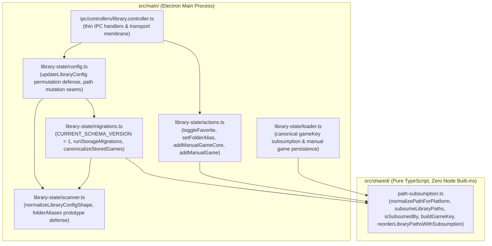
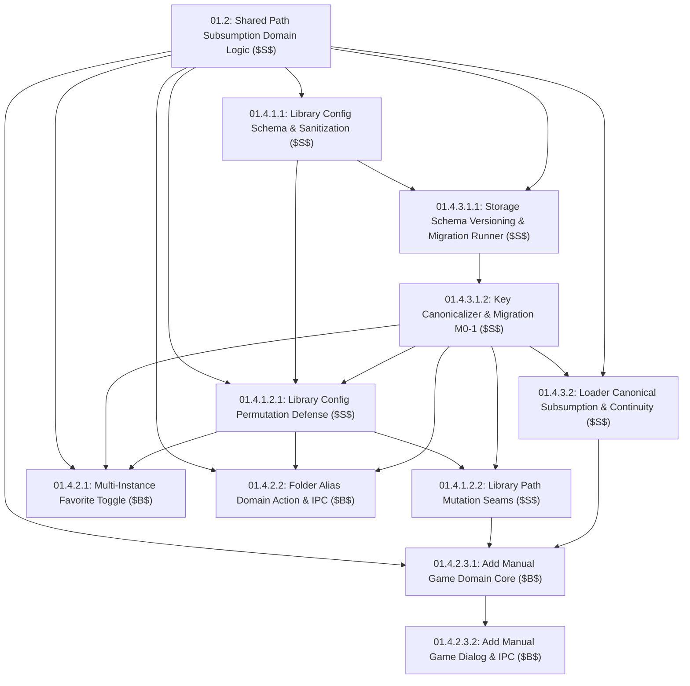

# PRD: Storage Schema Migration & Library Domain Core

## Goal Description
Establish root database schema versioning (`schemaVersion: 1`), an isolated storage schema migration runner ($M_{0 \to 1}$), pure-string cross-platform path subsumption algorithms in `src/shared/path-subsumption.ts`, and hardened configuration, IPC, and domain action security boundaries.

This epic isolates and hardens the backend data engine, guaranteeing non-destructive path mutation, canonical `gameKey` derivation, offline volume preservation, and category migration continuity across Windows, Linux, and macOS. All renderer UI views and drag-and-drop mechanics are decoupled from this foundation.

---

## User Review Required

> [!IMPORTANT]
> This epic establishes preparatory structural refactoring ($S$) followed by behavioral feature expansion ($B$) strictly in the headless domain core (`src/shared/` and `src/main/`). It introduces root database `schemaVersion: 1`, eliminates legacy key desynchronization, and establishes headless cross-platform path subsumption tested across Windows, Linux, and macOS. Renderer UI and drag reordering are deferred to downstream epics (Epic 08 React migration and Epic 09 Sort by Folder).

---

## Architectural Boundary & Responsibilities



| Module | Responsibility | Environment |
| :--- | :--- | :--- |
| **`src/shared/path-subsumption.ts`** | Pure string path normalization, segment boundary containment (`isSubsumedBy`), ancestor subsumption (`subsumeLibraryPaths`), canonical key derivation (`buildGameKey`), leaf extraction (`getFolderBaseName`), and data-loss-free reordering (`reorderLibraryPathsWithSubsumption`). | Pure TypeScript, zero Node `path` imports, browser and Node safe. |
| **`src/main/library-state/migrations.ts`** | Schema version declarations (`CURRENT_SCHEMA_VERSION = 1`), sequential migration runner, top-level legacy key adoption, prototype pollution defense, and canonical stored games re-keying (`canonicalizeStoredGames`). | Electron Main process runtime. |
| **`src/main/library-state/scanner.ts`** | Configuration shape normalization, `folderAliases` prototype pollution defense, and `WRAPPER_DIRECTORY_NAMES` export. | Electron Main process runtime. |
| **`src/main/library-state/config.ts`** | Configuration property whitelisting, permutation validation, filesystem root rejection, and path mutation seams (`setupLibrary`, `removeLibraryPath`, `changeLibraryPath`, `addLibraryPath`). | Electron Main process runtime. |
| **`src/main/library-state/loader.ts`** | Canonical stored games loading, ancestor subsumption key derivation, offline volume preservation, and manual game retention. | Electron Main process runtime. |
| **`src/main/library-state/actions.ts`** | Multi-instance favorite toggle (`toggleFavorite`), folder alias assignment (`setFolderAlias`), and manual game addition (`addManualGameCore`, `addManualGame`). | Electron Main process runtime. |
| **`src/main/ipc/controllers/library.controller.ts`** | Thin IPC transport membrane, input validation, and payload normalization. | Electron Main process runtime. |

---

### 4-Axis Readiness Scorecard (Kent Beck Governance)

| Axis | Pre-Refactor ($S_0$) | Post-Refactor ($B$) | Architectural Guarantee |
| :--- | :--- | :--- | :--- |
| **Maintainability** | Ad-hoc path comparisons using Node built-ins scattered across loader, config, and main controllers; unversioned storage envelope. | Unified pure-string path subsumption in `src/shared/path-subsumption.ts` and formal schema versioning (`schemaVersion: 1`) in `migrations.ts`. | Single canonical path validation and database migration pipeline. |
| **Extensibility** | Adding new library roots or modifying paths risks key divergence, category loss, or orphaned configuration aliases. | `canonicalizeStoredGames` seam and `reorderLibraryPathsWithSubsumption` handle key derivation, category migration, and alias preservation automatically. | Safe storage re-indexing and lossless configuration reordering. |
| **Debuggability** | Path normalization and folder subsumption logic lack isolated headless test suites; storage migration behavior requires full app boot. | Pure path subsumption, schema migration, config permutation defense, and domain actions are 100% headless and virtually testable in-memory with Vitest. | 100% isolated headless testability with zero mock DOM overhead. |
| **Updatability** | Storage schema lacks version tracking; future migrations require ad-hoc schema sniffing. | Explicit schema versioning runner `runStorageMigrations` executes sequentially at startup bootstrap before services mount. | Deterministic forward schema migrations ($M_{0 \to 1}, M_{1 \to 2}$). |

---

## Preparatory Refactoring ($S \to B$) Execution Sequence

1. **Stage $S_1$ (Structural Tidying - Shared Domain Seam - *Extract Helper / New Interface, Old Impl*)**:
   - Extract `subsumeLibraryPaths`, `reorderLibraryPathsWithSubsumption`, `isSubsumedBy`, `normalizePathForPlatform`, canonical key derivation `buildGameKey`, and pure-string `getFolderBaseName` into `src/shared/path-subsumption.ts` (operating strictly on pure strings with explicit `PlatformInput` normalizing both Node and Engine platform strings without `node:path` built-in imports or ambient Node globals).
   - In `buildGameKey`, identical directory detection must evaluate against platform-normalized paths (`normalizePathForPlatform(folderPath, platform) === normalizePathForPlatform(libraryPath, platform)`), extracting relative subpaths only when normalized paths differ, and deterministically falling back to `getFolderBaseName(folderPath)` if the extracted subpath is empty `""`.
   - Enforce strict path security invariants: strict fail-fast rejection of illegal control characters and null bytes in `normalizePathForPlatform` (if `typeof p !== 'string' || !p.trim() || /\0|\r|\n/.test(p)`, returning strictly an empty string `""` immediately prior to separator conversion or segment evaluation), defensive relative segment normalization (`.` and `..` without escaping root boundaries), non-root trailing slash stripping in `normalizePathForPlatform` (preserving `/` or `C:/` root boundaries, mapping bare Windows drive roots matching `^[A-Za-z]:$` to include a trailing root slash `C:/`), input sanitization in `subsumeLibraryPaths` filtering out empty, non-string, or whitespace-only elements, canonical deduplication by normalized form before ancestor filtering, platform-aware case sensitivity, and preservation of all configured paths in `reorderLibraryPathsWithSubsumption`.
   - Provide comprehensive cross-platform Vitest unit tests in `src/shared/path-subsumption.test.ts`. (Ticket `01.2`)

2. **Stage $S_2$ (Structural Tidying - Library Config Schema Extension & Prototype Sanitization)**:
   - Extend `LibraryConfig` interface in `src/main/library-state/scanner.ts` with `folderAliases?: Record<string, string>`.
   - Update `normalizeLibraryConfigShape` in `scanner.ts` to accept parameter seam `targetPlatform?: PlatformInput`, filter out root boundaries and deduplicate `libraryPaths` via `normalizePathForPlatform(p, targetPlatform)` while preserving authentic casing and path separators of surviving trimmed elements (`p.trim().replace(/[\\/]+$/, '')`), and safely sanitize `folderAliases` against prototype pollution by rejecting/stripping both raw keys and normalized `canonicalKey` values matching `__proto__`, `constructor`, `prototype`, trimming keys/values, and defaulting to `{}`.
   - Export `WRAPPER_DIRECTORY_NAMES` from `src/main/library-state/scanner.ts` to expose wrapper detection to storage migrations and canonicalizer seams.
   - Add unit tests in `src/main/library-state/config.test.ts`. (Ticket `01.4.1.1`)

3. **Stage $S_3$ (Structural Tidying - Isolated Storage Schema Migration Runner & Key Canonicalizer Seam)**:
    - Establish explicit schema versioning and minimal isolated storage migration runner in `src/main/library-state/migrations.ts`: declare `CURRENT_SCHEMA_VERSION = 1` and extend root database envelope `LibraryDatabase` with `schemaVersion: number`, `config: LibraryConfig`, `games: Record<string, StoredGameRecord>`, and `titleResolutionConfig` (defaulting unversioned stores to `0`).
      - In `src/main/library-state/index.ts`, update `isDegraded()` to report `isDegradedState` whenever either `options.dbFilePath` or `options.loadDB` is provided (`if (!options.dbFilePath && !options.loadDB) return false; return isDegradedState;`). In `loadDB()`, capture a monotonic failure epoch snapshot (`let migrationFailureEpoch = 0;`, `const failureEpochAtEntry = migrationFailureEpoch;`) synchronously at function entry before awaiting `inFlightMigration`, uniformly wrap database retrieval, defer `cachedDb = data` assignment until after plain-object validation and `initialVersion <= CURRENT_SCHEMA_VERSION` verification (preserving any pre-existing healthy `cachedDb` snapshot unmodified on degraded transitions), strictly validate that parsed database `data` is a non-null, non-array plain object (`isPlainObject(data)` or `data !== null && typeof data === 'object' && !Array.isArray(data)`), initialize fresh installs upon `ENOENT` with canonical envelope `{ schemaVersion: CURRENT_SCHEMA_VERSION, config: normalizeLibraryConfigShape({}, targetPlatform), games: {} }`, detect unsupported future schema versions (`if (typeof data.schemaVersion === 'number' && data.schemaVersion > CURRENT_SCHEMA_VERSION)`) logging structured error `console.error('[STORAGE_MIGRATIONS] Database schema version is newer than supported version, entering degraded state:', { dbFilePath: options.dbFilePath, databaseVersion: initialVersion, maxSupportedVersion: CURRENT_SCHEMA_VERSION })`, trip `isDegradedState = true`, and freeze mutations; when a valid plain-object payload with `initialVersion === CURRENT_SCHEMA_VERSION` is read, reset `isDegradedState = false` and assign `cachedDb = data`; when `initialVersion < CURRENT_SCHEMA_VERSION`, dispatch migrations using an isolated migration synchronization seam (such as a dedicated single-flight promise `inFlightMigration: Promise<LibraryDatabase> | null` or dedicated migration queue, decoupled from the facade's action `serializedQueue` to prevent reentrancy deadlocks, clearing `inFlightMigration = null;` via an outer `.finally()` callback attached to the promise reference with an explicit `.catch(() => {})` unhandled rejection sink and conditional reference check `if (inFlightMigration === migrationPromise) inFlightMigration = null;`) with double-checked locking that aborts if `migrationFailureEpoch !== failureEpochAtEntry || (cachedDb && (cachedDb.schemaVersion ?? 0) >= CURRENT_SCHEMA_VERSION)` (so concurrent callers waking after a failed migration do not re-run migrations on the same failing store, while subsequent `loadDB()` calls invoked after external v0 store restoration can still execute `runStorageMigrations` and recover), capturing an immutable snapshot of category state before executing `runStorageMigrations` (via `JSON.parse(JSON.stringify(rawCat))` if `context.categoryState?.loadCategoryState` is present), executing `data = await runStorageMigrations(data, context, options.targetPlatform);`, strictly resetting `isDegradedState = false` after `runStorageMigrations` resolves successfully and immediately prior to `persistDbDirectly` execution, executing secondary category rollback via `await context.categoryState.saveCategoryState(catStateSnapshot)` inside an isolated `try ... catch` error boundary in the `catch` block if migration or persistence fails before re-tripping `isDegradedState = true` and incrementing `migrationFailureEpoch++`, and assigning `cachedDb = data` strictly after `runStorageMigrations` and `persistDbDirectly` succeed; emit structured error logging and trip `isDegradedState = true` whenever invalid database structures are encountered. In `runStorageMigrations`, strictly validate that each sequential migration step returns a plain object via `db = isPlainObject(migratedDb) ? migratedDb : db;` (importing `isPlainObject` from `./scanner`), logging structured error `[STORAGE_MIGRATIONS]` and throwing `new Error('Migration step returned invalid database structure: expected plain object')` if a migration step returns an Array (`[]`), null, or non-plain object. In Migration $M_{0 \to 1}$, strictly initialize `db.games = isPlainObject(db.games) ? db.games : {};`.
      - Implement and export standalone async helper `canonicalizeStoredGames(db, categoryState, libraryPaths, targetPlatform?: PlatformInput, options?: { isBootstrapMigration?: boolean; purgeOrphans?: boolean }): Promise<{ migratedCount: number }>` in `src/main/library-state/migrations.ts` to re-key stored games to canonical `gameKey`s via `subsumeLibraryPaths` using an explicit decoupled two-pass architecture, capturing snapshot `const originalEntries = Object.entries(db.games || {});` and an immutable `initialAssignments` snapshot of `catState?.assignments` before Pass 1 alongside `nextGames: Record<string, any> = {}`, `uncontainedEntries: Array<[string, any]> = []`, `survivingLogicalIds = new Set<string>()`, `stationaryIds = new Set<string>()`, `remappedOldIds = new Set<string>()`, and `pendingCategoryMerges = new Map<string, Set<string>>()`. Explicitly probe `if (categoryState?.isDegraded?.() === true)` immediately after loading and during persistence, logging structured error `[STORAGE_CANONICALIZE]` and throwing `new Error('Category state is in degraded state')` to trip `loadDB`'s circuit breaker and caller rollback boundaries. In Pass 1 (Contained Games Indexing & NextGames Accumulation), for each entry `[legacyKey, record]` in `originalEntries`, locate its owning canonical root via `const matchingRoot = subsumedRoots.find(root => isSubsumedBy(record.folderPath, root, targetPlatform));` (pushing `[legacyKey, record]` to `uncontainedEntries` when `!matchingRoot`); when `matchingRoot` is found, verify that the game resides within a dedicated subdirectory beneath `matchingRoot`: if `normalizePathForPlatform(record.folderPath, targetPlatform) === normalizePathForPlatform(matchingRoot, targetPlatform)`, log structured warning `[STORAGE_CANONICALIZE] Blocked root-level stored game record without dedicated game folder:` and treat as uncontained (routing to `uncontainedEntries` for Pass 2 orphan evaluation or skipping); otherwise, derive `const canonicalGameKey = buildGameKey(matchingRoot, record.folderPath, targetPlatform);`, and accumulate all contained records into a fresh `nextGames` dictionary, deferring final assignment (`db.games = nextGames`) strictly until Pass 2 completes. Pre-index surviving contained game records into pre-initialized `survivingLogicalIds` with BOTH legacy logical IDs (`buildLogicalGameId({ ...record, gameKey: key, relativePath: record.relativePath || key })`) AND prospective canonical logical IDs (`buildLogicalGameId({ ...record, gameKey: canonicalGameKey, relativePath: canonicalGameKey })`) into a `Set<string>` of logical game IDs to eliminate $O(K \times N)$ quadratic scans; merge user metadata non-destructively on key collisions; guard against prototype pollution and null records; delete legacy keys; in Pass 1B (Uncontained Records Retention Sweep), when `options?.purgeOrphans !== true`, explicitly normalize coordinates on retained uncontained records (`nextGames[legacyKey] = { ...record, gameKey: legacyKey, relativePath: record.relativePath ? record.relativePath.replace(/\\/g, '/') : legacyKey }`); and track category assignment remappings across Pass 1 and Pass 1B (`stationaryIds`, `remappedOldIds`, and `pendingCategoryMerges` from `initialAssignments[fallbackOldId]`) without mutating or deleting `catState.assignments` in-place during loop iteration, then after Pass 1B (prior to Pass 2) execute two-phase category reconciliation wrapped in an isolated `try ... catch` error boundary that logs `[STORAGE_CANONICALIZE]` and re-throws errors (`throw err;`): Phase A deletes `catState.assignments[oldId]` for each `oldId` in `remappedOldIds` when `!stationaryIds.has(oldId)`, and Phase B merges `pendingCategoryMerges` into `catState.assignments[targetId]`. In Pass 2 (Orphan Evaluation & Category Purge Sweep), when `options?.purgeOrphans === true`, iterate `uncontainedEntries` for uncontained stored game records, omitting them from `nextGames` while purging category assignments for an orphan ID strictly and only if `!survivingLogicalIds.has(orphanId)`, preserving category tags for surviving multi-instance game copies. Commit `db.games = nextGames` upon completion of Pass 1, Pass 1B, and Pass 2.
    - Implement sequential migration runner `runStorageMigrations(db, context, targetPlatform?: PlatformInput)` invoked exclusively at startup bootstrap inside `createLibraryState.loadDB()` in `src/main/library-state/index.ts`.
    - Implement Migration $M_{0 \to 1}$ (Path Subsumption Key Canonicalization & Category Continuity): normalizes `db.config` via `normalizeLibraryConfigShape` and derives candidate roots `subsumeLibraryPaths(db.config.libraryPaths, targetPlatform)` before scanning records; adopts unversioned top-level legacy game records into `db.games` under their uncanonicalized legacy key, executing non-destructive field-level metadata merging on pre-existing `db.games[key]` collisions; sweeps `db.games` to purge transient `migratedFromGameKey` fields; explicitly initializes wrapper unwrapping via `let effectiveFolder = record.folderPath;`, handles macOS `.app` bundles via `resolveBundleRoot`, checks if `normExeDir` (extracted via pure-string segment slicing without Node `path.dirname`) is subsumed by `normFolder`, initializes `let currentDir = record.exePath.replace(/\\/g, '/'); currentDir = currentDir.includes('/') ? currentDir.slice(0, currentDir.lastIndexOf('/')) || '/' : currentDir;`, and iteratively ascends upward while `isSubsumedBy(normParent, normFolder, targetPlatform) && !candidateRoots.some((root: string) => normParent === normalizePathForPlatform(root, targetPlatform))` (so wrapper directories directly inside a library root are unwrapped to `record.folderPath` without stopping prematurely at `normParent !== normFolder`), checking `WRAPPER_DIRECTORY_NAMES.has(leaf)` and terminating if reaching filesystem root boundary or a candidate library root, resolving `effectiveFolder = currentDir` upon reaching the topmost non-wrapper folder containing `record.exePath` to preserve top-level legacy records in unique nested descendant folders per `tests/library-state.test.js:105-139` while maintaining authentic path casing and eliminating wrapper subdirectories; and delegates storage and category re-keying to `canonicalizeStoredGames(..., { isBootstrapMigration: true })`.
    - Update `tests/library-state.test.js` to align with canonical `schemaVersion: 1` envelope and canonical keys without `migratedFromGameKey`, maintaining 100% pass rate across all 311 legacy tests in `npm run test:node`. (Tickets `01.4.3.1.1` & `01.4.3.1.2`)

4. **Stage $S_4$ (Structural Tidying - Library Config Permutation Defense & Whitelist)**:
   - Update `config.ts` `updateLibraryConfig` to accept `targetPlatform?: PlatformInput` parameter seam, check `context.isDegraded?.() === true` and throw an Error on degraded database state, enforce property whitelisting against complete `LibraryConfig` keys rejecting or stripping unexpected fields, and strictly validate incoming `updates.libraryPaths` against arbitrary directory injection and path dropping by validating element types and symmetrically normalizing both `currentConfig.libraryPaths` and `updates.libraryPaths` via `normalizePathForPlatform`; log structured warning `console.warn('[SECURITY][CONFIG_PATH_INJECTION] Blocked invalid path containing illegal characters or invalid type in updateLibraryConfig:', { path: item })` on non-string or newline/null-byte control character paths (`/\0|\r|\n/`); reject invalid permutations by throwing an Error to guarantee transactional rollback across callers; validate incoming `updates.folderAliases` ensuring newly introduced alias keys reside within configured library paths via `isSubsumedBy`, exempting pre-existing keys to preserve durable tombstones per the Orphaned Folder Alias Lifecycle Invariant, and index `sanitizedUpdatesAliases` by `canonicalKey = normalizePathForPlatform(key, targetPlatform)` prior to merging `{ ...(currentConfig.folderAliases || {}), ...sanitizedUpdatesAliases }` so clearing an alias (`""`) with non-canonical casing or backslashes overwrites and prunes the matching canonical key in `currentConfig.folderAliases`.
   - Enforce Snapshot-and-Rollback Contract across mutative configuration actions in `config.ts`, snapshotting in-memory configuration objects before mutations and restoring them on persistence rejection prior to rethrowing.
   - Update `src/main/library-state/index.ts` facade method `updateLibraryConfig` to accept and forward `targetPlatform`; in `src/main/ipc/controllers/library.controller.ts`, delegate `'update-library-config'` to `libraryState.updateLibraryConfig(updates)` first, followed by synchronizing `TelemetryShipper.getInstance().setTelemetryEnabled(updates.telemetryEnabled)` wrapped in a non-fatal `try ... catch` error boundary logging structured diagnostics when `telemetryEnabled` is a boolean; persist sanitized `folderAliases`.
   - Add Vitest unit tests in `src/main/library-state/config.test.ts` and `src/main/ipc/controllers/library.controller.test.ts`. (Ticket `01.4.1.2.1`)

5. **Stage $S_5$ (Structural Tidying - Library Path Mutation Seams & Storage Canonicalization)**:
   - Symmetrically normalize path lookups in `setupLibrary`, `removeLibraryPath`, `changeLibraryPath`, and `addLibraryPath` using `normalizePathForPlatform(p, targetPlatform)`, checking `context.isDegraded?.() === true` at function entry, immediately after any pre-dialog/early-exit `loadDB()`, and inside `persistTask` immediately after `loadDB()` and throwing an Error before dialogs, early-exit returns, or mutations; in `setupLibrary`, validate `targetPath` against filesystem root boundaries (`/` on POSIX, `^[A-Za-z]:[/\\]?$` on Windows) and `normalizePathForPlatform(targetPath, resolvedPlatform)` BEFORE invoking `fsSync.mkdirSync(targetPath, { recursive: true })`; validate string arguments emitting structured warnings (`[LIBRARY_STATE][REMOVE_PATH]`, `[LIBRARY_STATE][CHANGE_PATH]`) and deriving `config` after `loadDB()`; synchronize `config.libraryPath = config.libraryPaths[0] || ''` and `db.config = config` across `removeLibraryPath`, `changeLibraryPath` (both `isDuplicateOfExisting` and replacement branches), and `addLibraryPath` prior to persistence; remove `serializedQueue` from `removeLibraryPath` in facade `index.ts:163` and dispatch `context.queue(persistTask)` strictly inside `config.ts` to prevent re-entrancy deadlocks; in ingress configuration actions (`setupLibrary`, `addLibraryPath`, and `changeLibraryPath`), reject filesystem root boundaries (`/` on POSIX, `^[A-Za-z]:[/\\]?$` on Windows) with structured warning `[SECURITY][CONFIG]` and throw an Error, while ensuring `removeLibraryPath` safely permits removing and pruning configured root boundaries without throwing (recognizing when `targetPath` matches a root path in `db.config.libraryPaths` filtered out by `normalizeLibraryConfigShape`, verifying surviving valid paths satisfy minimum root count `length >= 1`, assigning `db.config = config;`, and committing via `canonicalizeStoredGames(..., { purgeOrphans: true })` and `saveFn(db)`); declare `folderPickerSeam` on `LibraryContext` in `src/main/library-state/index.ts`; invoke `await canonicalizeStoredGames(db, context.categoryState, nextPaths, targetPlatform)` from `./migrations` (with `{ purgeOrphans: true }` in `removeLibraryPath`) to re-key stored records and migrate category assignments before committing `db`.
   - Enforce Orphaned Folder Alias Lifecycle Invariant: retain `folderAliases` mappings as persistent bookmarks/tombstones even when a folder path is removed from `libraryPaths`. In `changeLibraryPath`, validate `oldPath` existence prior to opening directory dialogs, guard `targetIndex !== -1` inside persist task, capture snapshots strictly BEFORE modifying `config.libraryPaths` or `config.folderAliases`; if `isDuplicateOfExisting` is true (pruning), retain `folderAliases` untouched as durable tombstones; if `!isDuplicateOfExisting` (replacement branch), construct a new dictionary for `folderAliases` to migrate keys subsumed by `oldPath` to replacement `chosenPath` (`isSubsumedBy(aliasKey, canonicalOldPath, targetPlatform)`), guarding against prototype pollution keys (`__proto__`, `constructor`, `prototype`) and leaving all other un-subsumed alias keys untouched.
   - Enforce Snapshot-and-Rollback Contract across path mutation actions, snapshotting in-memory configuration objects (deeply decoupling `libraryPaths` and `folderAliases`), stored games dictionary, and category state strictly before mutations and restoring them on persistence rejection or canonicalization failure prior to rethrowing, wrapping category state rollback within an isolated `try ... catch` error boundary to prevent secondary rollback rejections from masking primary persistence errors.
   - Update `src/main/library-state/index.ts` facade methods (`setupLibrary`, `addLibraryPath`, `removeLibraryPath`, `changeLibraryPath`) to accept and forward `targetPlatform`.
   - Add Vitest unit tests in `src/main/library-state/config.test.ts`. (Ticket `01.4.1.2.2`)

6. **Stage $S_6$ (Structural Tidying - Canonical Loader Reconciliation & Continuity)**:
    - Canonical Loader Read Invariant in `loader.ts`: consumes strictly canonical `schemaVersion: 1` storage; resolves `const resolvedPlatform = resolvePlatform(targetPlatform || context.targetPlatform);` once at entry and threads `resolvedPlatform` symmetrically through `normalizeLibraryConfigShape`, `mapStoredGamesByFolderPath` and `buildMoveMigrationMap` in `src/main/library-state/continuity.ts`, `collectGameCandidates`, `dedupeCandidates`, and `normalizePathForComparison`; replaces `if (activePaths.length === 0) return [];` with `if (normalizedConfig.libraryPaths.length === 0) return [];` so total-offline library roots (`activePaths.length === 0` and `normalizedConfig.libraryPaths.length > 0`) still proceed to `loadDB()` and `persistPhase` to preserve and return offline stored games; checks `if (context.isDegraded?.() === true)` immediately after `const db = await loadDB();`, logging structured warning `console.warn('[LOADER] Library database is in DEGRADED state, skipping scan and persistence:', { isDegraded: true });`, safely resolving category assignments (checking `if (categoryState?.isDegraded?.() === true)`, defaulting to `{ assignments: {} }`, or wrapping `categoryState.loadCategoryState()` in an isolated non-fatal `try ... catch` block defaulting to `{ assignments: {} }`), and returning existing stored games mapped through `normalizeGameRecord` and `buildLogicalGames(normalizedGames, categorySnapshot.assignments || {})` in read-only degraded mode without scanning candidate files or calling `persistPhase`; completely eliminates helper functions `readLegacyGames` and `removeLegacyGames`, call-sites `const legacyGames = readLegacyGames(db)`, and candidate fallback lookup `|| legacyMigrationMap.get(...)`; removes unused `buildLegacyMigrationMap` import; completely eliminates `migratedFromGameKey` across both `loader.ts` and renderer `library-order.ts:33`.
    - Pre-computes `canonicalActiveRoots = subsumeLibraryPaths(activePaths, resolvedPlatform)` once before iterating candidate games for candidate canonical key derivation, and replaces `isPathWithinDirectory` with `isSubsumedBy`.
      - In `persistPhase`, completely eliminates `combinedPaths` array union (`loader.ts:256-260`) and derives `authoritativeRoots = (latestDb.config?.libraryPaths && latestDb.config.libraryPaths.length > 0) ? latestDb.config.libraryPaths : normalizedConfig.libraryPaths`, initializing `latestDb.config.libraryPaths = authoritativeRoots` when unpopulated or empty, and strictly retains `latestDb.config.libraryPaths` as authoritative without re-combining with `normalizedConfig.libraryPaths` captured at scan start to prevent race conditions resurrecting deleted paths while ensuring cold-start databases resolve canonical roots and preserve scanned games, verifies candidate containment and re-derives canonical `gameKey` against `authoritativeCanonicalRoots = subsumeLibraryPaths(authoritativeRoots, resolvedPlatform)` under lock before metadata lookup to prevent resurrection of concurrently removed library paths or stale key lookups, and computes `inactivePaths` against `authoritativeRoots` to retain offline records without resurrecting deleted paths; validates derived candidate keys against empty strings and prototype pollution keys (`__proto__`, `constructor`, `prototype`) logging structured warning `[LOADER][UNSAFE_SCANNED_KEY]` and skipping unsafe candidates immediately; preserves user selections (`exePath`, `engine`, `folderPath`, `platform`, `manual: true`) conditional on `latest.exePath` being a valid non-empty string, `normRecordExe !== normRecordFolder` across all platforms (including macOS / Darwin where `exePath` must resolve to the regular executable binary file within `Contents/MacOS/`, never the `.app` bundle directory), contained within `scannedRecord.folderPath` via `isSubsumedBy`, and verified on physical disk via exception-safe `isRegularFileSafe(context.fsSync, latest.exePath)` helper (wrapping `statSync` in `try ... catch` or `{ throwIfNoEntry: false }` so missing files do not throw uncaught `ENOENT` exceptions); if missing, invalid, directory, or escaping, retain scanner detected executable and engine/platform, revert `scannedRecord.manual` to `false`, emit structured warning `[LOADER][MANUAL_EXE_FALLBACK]`, and continue reconciliation; in Stage 1 user metadata preservation, explicitly preserves `scannedRecord.name` from `latest.name` when `latest.customName === true` and `latest.name` is present (`scannedRecord.name = latest.customName && latest.name ? latest.name : scannedRecord.name; scannedRecord.customName = Boolean(latest.customName);`) to ensure user-curated game titles survive library rescans; validates re-derived manual game keys against prototype pollution (logging structured diagnostic warning `[LOADER][UNSAFE_MANUAL_KEY]` and skipping unsafe records); logs structured diagnostic warnings on folder stat, executable inspection, directory sizing, and game title resolution failures; audits `if (categoryState?.isDegraded?.() === true)` logging structured warning `[LOADER][CATEGORY_DEGRADED]` and defaulting to empty assignments, and wraps `categoryState.loadCategoryState()` in an isolated non-fatal `try ... catch` error boundary defaulting to empty assignments on failure to prevent post-persist rejections from breaking library loads.
     - Retains stored records across offline paths and manual additions unconditionally without disk checks to protect offline storage against data loss; for active paths in Stage 4, validates string coordinates first (emitting `[LOADER][MANUAL_CORRUPT]` and skipping malformed records before deduplication or root containment checks), deduplicates via `existingFolderPaths.has`, and retains un-scanned manual game records (`record.manual === true`) iff their enclosing library root is contained within `canonicalConfigRoots` (purging uncontained records whose parent library path was removed), verifies `normRecordExe !== normRecordFolder` across all platforms (including macOS / Darwin) and executable folder boundary containment via `isSubsumedBy(normRecordExe, normRecordFolder, resolvedPlatform)` purging with `[LOADER][MANUAL_PURGE]` (`reason: 'executable-escapes-folder'`) if uncontained or if `normRecordExe === normRecordFolder` (`reason: 'executable-is-directory'`), and verifies physical disk existence passes via exception-safe `isRegularFileSafe(context.fsSync, record.exePath)` and `context.fsSync.existsSync(record.folderPath)` before inserting into `nextGames`, emitting structured audit log `[LOADER][MANUAL_PURGE]` when purged due to root containment failure (`reason: 'outside-library-roots' | 'root-level-executable'`), folder boundary escape (`reason: 'executable-escapes-folder'`), executable being a directory (`reason: 'executable-is-directory'`), or missing physical files (`reason: 'missing-from-disk'`).
    - Unambiguously prohibits returning `scannedGames` early at entry of `persistPhase` or after `loadDB()` (which would drop offline records and un-scanned manual games); Stages 1 through 4 MUST execute to fully populate `nextGames`. Evaluates `if (context.isDegraded?.() === true)` strictly prior to persistence (`await (context.persistDbDirectly || saveDB)(latestDb)`): logs structured warning `console.warn('[LOADER] Persistence aborted: database is in DEGRADED state.', { isDegraded: true });` and returns `nextGames` populated by Stages 1–4 without invoking `context.persistDbDirectly` and without throwing an error; commits updated database to disk via single atomic write `await (context.persistDbDirectly || saveDB)(latestDb)`, enforcing the Snapshot-and-Rollback Contract: captures in-memory snapshots of `latestDb.games` and `latestDb.config` before mutation, and restores them in the catch block upon persistence failure before logging `[LOADER][PERSIST_FAIL]` and re-throwing.
   - Add Vitest unit tests in `src/main/library-state/loader.test.ts`. (Ticket `01.4.3.2`)

7. **Stage $B_7$ (Behavioral Expansion - Multi-Instance Favorite Toggle Action & Parameterized IPC Contract)**:
   - Implement parameterized `toggleFavorite(gameKey: string, targetFavorite?: boolean)` in `src/main/library-state/actions.ts` using scoped instance resolution instead of full-collection object synthesis: audits `context.isDegraded?.() === true` both at entry and inside `persistTask`, logging structured warning `console.warn('[LIBRARY_STATE][TOGGLE_FAVORITE] Operation aborted: database is in DEGRADED state')` and throwing `new Error('Database is in degraded state')`; computes `targetGameId` directly via `buildLogicalGameId` (supporting stored keys and `game:`/`path:` logical IDs), enforces fail-fast guard throwing `Game not found: <gameKey>` if unresolvable, scans `Object.entries(games)` for matching `buildLogicalGameId` to symmetrically propagate `nextFavorite` across all sibling instances without full-collection `buildLogicalGames` instantiation, resolving group aggregate favorite state (`matchedKeys.some(k => Boolean(games[k]?.favorite))`), and validating all instance keys against prototype pollution (`__proto__`, `constructor`, `prototype`) and own-property existence. Catches operational failures, logs structured error diagnostics, and re-throws the error to ensure deterministic rejection across IPC.
   - Bind `toggleFavorite` on `createLibraryState` in `src/main/library-state/index.ts`.
   - Update `ElectronAPI.toggleFavorite(gameKey: string, targetFavorite?: boolean): Promise<boolean>` in `src/shared/types/ipc.d.ts` and `src/preload.ts`.
   - Update `'toggle-favorite'` handler in `src/main/ipc/controllers/library.controller.ts` to receive and forward `targetFavorite` to `libraryState.toggleFavorite(gameKey, targetFavorite)`.
   - Add Vitest unit tests in `src/main/library-state/actions-favorite.test.ts` and `src/main/ipc/controllers/library.controller.test.ts`. (Ticket `01.4.2.1`)

8. **Stage $B_8$ (Behavioral Expansion - Set Folder Alias Domain Action & IPC Integration)**:
   - Implement `setFolderAlias(folderPath: string, alias: string, targetPlatform?: PlatformInput)` in `src/main/library-state/actions.ts`: dual degraded database guard logging structured warning `[LIBRARY_STATE][SET_FOLDER_ALIAS] Operation aborted: database is in DEGRADED state`, loads `const db = await context.loadDB()` and runs `normalizeLibraryConfigShape(db.config, targetPlatform)` prior to mutating aliases, prototype safety and control character validation (`/\0|\r|\n/`) against both raw `folderPath.trim()` and normalized `canonicalFolderPath` (`__proto__`, `constructor`, `prototype`), boundary validation via `isSubsumedBy` exempting pre-existing keys in `config.folderAliases` (`preExistingCanonicalKeys`), canonicalization via `normalizePathForPlatform`, 255 char bound, control character stripping, safe deletion on empty alias, wrapping atomic persistence in a `try ... catch` error boundary logging structured diagnostics.
   - Bind on `createLibraryState` in `src/main/library-state/index.ts` using `serializedQueue`.
   - Declare on `ElectronAPI` in `src/shared/types/ipc.d.ts` and expose in `src/preload.ts`.
   - Wire `library:set-folder-alias` thin IPC handler in `src/main/ipc/controllers/library.controller.ts`.
   - Add Vitest unit tests in `src/main/library-state/actions-alias.test.ts` and `src/main/ipc/controllers/library.controller.test.ts`. (Ticket `01.4.2.2`)

9. **Stage $B_9$ (Behavioral Expansion - Add Manual Game Domain Core & Database Persistence)**:
   - Implement `addManualGameCore(context, targetPath, options?: AddManualGameOptions)` in `src/main/library-state/actions.ts`: accepts typed `options?: AddManualGameOptions` (with optional `targetPlatform?: PlatformInput` and optional `enclosingFolderPath?: string`), checks degraded database state logging structured warning `[LIBRARY_STATE][MANUAL_ADD] Operation aborted: database is in DEGRADED state`, asynchronously loads `const db = await context.loadDB()` at function entry, determines candidate library roots via `candidateRoots = subsumeLibraryPaths(config.libraryPaths, platform)`, validates that `targetPath` resides within `candidateRoots` (`outside-library-roots` / `root-level-executable`) and satisfies `options?.enclosingFolderPath` containment (`outside-enclosing-folder`), strictly verifying that if `opts?.enclosingFolderPath` is provided it is a non-empty string, does not contain control characters or null bytes (`!/\0|\r|\n/.test(opts.enclosingFolderPath)`), does not match prototype pollution keys (`!['__proto__', 'constructor', 'prototype'].includes(opts.enclosingFolderPath.trim())`), and satisfies `isSubsumedBy` BEFORE invoking `context.fs.stat(targetPath)` or `context.fsSync.statSync(targetPath)`, validates physical disk existence of `targetPath`, distinguishes outer macOS `.app` bundle directories (`normTarget.toLowerCase().endsWith('.app')`, requiring `stat.isDirectory()` and resolving inner binary via `AppBundleInspector`) from inner executable files already inside an `.app` bundle (`normTarget.toLowerCase().includes('.app/')`, requiring `stat.isFile()`, skipping `AppBundleInspector` and fallback bundle-name synthesis to preserve the user's selected binary as `exePath`, verifying boundary containment via `isSubsumedBy`, and using `resolveBundleRoot` for `folderPath` derivation), derives `folderPath` from individual game executable containing directory with bounded wrapper unwrapping that breaks if `parentDir` is already a candidate library root, preserving authentic filesystem casing without lowercase conversion for stored coordinates and metadata while using `normalizePathForPlatform` for boundary containment checks, matches `owningLibPath` strictly against candidate roots, inspects binary via `YumeEngine.inspectExecutable`, checks derived `gameKey` against prototype pollution, re-queries `latestDb = await context.loadDB()` inside `persistTask`, overlays profile onto existing stored record, tags with `manual: true`, assigns `platform` derived from executable binary classification (tagging macOS bundles with 'macos', `.exe` binaries with 'windows', and falling back to normalized targetPlatform) to guarantee Wine/Proton runner resolution, commits database persistence through `context.queue(persistTask)` via `saveDB`, retains user category associations wrapped in a non-fatal `try ... catch` error boundary explicitly auditing `categoryState.isDegraded() === true` and logging diagnostic warning on degraded state or load failure before safely defaulting to empty categories, constructs returned `LogicalGame` instance via targeted filtering of `latestDb.games` for records sharing `targetGameId = buildLogicalGameId(recordCopy)` mapped through `normalizeGameRecord` and passed to `buildLogicalGames`, and returns `{ ok: true, game }`.
   - Declare optional `targetPlatform?: PlatformInput;` on `LibraryContext`, forward into internal `context`, and bind `addManualGameCore` on `createLibraryState` in `src/main/library-state/index.ts`.
   - Add Vitest unit tests in `src/main/library-state/actions-manual-game.test.ts`. (Ticket `01.4.2.3.1`)

10. **Stage $B_{10}$ (Behavioral Expansion - Add Manual Game Dialog, IPC Controller & Preload Wiring)**:
    - Implement `addManualGame(context, options?: { folderPath?: string; targetPlatform?: PlatformInput })` in `src/main/library-state/actions.ts`: checking `context.isDegraded?.() === true` and returning `{ ok: false, error: 'degraded-database' }` with diagnostic warning `[LIBRARY_STATE][ADD_MANUAL_GAME] Operation aborted: database is in DEGRADED state` immediately at function entry prior to dialogs or path validation, resolving `targetPlatform = options?.targetPlatform || context.targetPlatform`, consuming typed `folderPath` from `options?.folderPath`, consuming `dialog` from injected `context`, wrapping `dialog.showOpenDialog` in a `try ... catch` error boundary logging structured diagnostics, validating default `folderPath` via `isSubsumedBy`, delegating selected path to `addManualGameCore` forwarding `{ enclosingFolderPath: validatedEnclosing, targetPlatform }`, and handling dialog cancellation.
    - Bind `addManualGame` on `createLibraryState` in `src/main/library-state/index.ts`: `addManualGame: (options?: { folderPath?: string; targetPlatform?: PlatformInput }) => addManualGame(context, { ...options, targetPlatform: options?.targetPlatform || context.targetPlatform })`.
    - Declare on `ElectronAPI` in `src/shared/types/ipc.d.ts` as `addManualGame(data?: { folderPath?: string } | string): Promise<{ ok: boolean; game?: any; canceled?: boolean; error?: string }>` and expose in `src/preload.ts`.
    - Wire `library:add-manual-game` IPC handler in `src/main/ipc/controllers/library.controller.ts` strictly normalizing incoming payloads at the transport membrane boundary into canonical typed options `{ folderPath?: string }`, strictly validating that if `folderPath` is provided it is a non-empty string, does not contain control characters or null bytes (`!/\0|\r|\n/.test(folderPath)`), and does not match prototype pollution keys (`!['__proto__', 'constructor', 'prototype'].includes(folderPath.trim())`) (sanitizing to `undefined` if invalid or prototype polluting), and dropping untrusted fields such as renderer-injected `targetPlatform` before delegating to `libraryState.addManualGame(options)`.
    - Add Vitest unit tests in `src/main/library-state/actions-manual-game.test.ts` and `src/main/ipc/controllers/library.controller.test.ts`. (Ticket `01.4.2.3.2`)

---

## Work Breakdown Structure & Implementation Tickets



### Critical Path

The longest dependency chain dictating epic completion is the storage migration, configuration mutation, and manual add sequence:
`01.2` (Shared Path Subsumption) $\to$ `01.4.1.1` (Config Schema Sanitization) $\to$ `01.4.3.1.1` (Storage Schema Versioning & Runner) $\to$ `01.4.3.1.2` (Key Canonicalizer & Migration M0-1) $\to$ `01.4.1.2.1` (Library Config Permutation Defense) $\to$ `01.4.1.2.2` (Path Mutation Seams) (with parallel `01.4.3.2`) $\to$ `01.4.2.3.1` (Add Manual Game Domain Core) $\to$ `01.4.2.3.2` (Add Manual Game Dialog & IPC).

Concurrent paths:
- **Favorite State Propagation**: `01.2` + `01.4.3.1.2` + `01.4.1.2.1` $\to$ `01.4.2.1` (Multi-Instance Favorite Toggle, building upon storage migration and config permutation defense foundation).
- **Folder Alias Domain Action**: `01.2` + `01.4.1.2.1` + `01.4.3.1.2` $\to$ `01.4.2.2` (Set Folder Alias, running after storage migration and config permutation defense).
- **Canonical Loader Continuity**: `01.2` + `01.4.3.1.2` $\to$ `01.4.3.2` (Loader Canonical Subsumption, running in parallel with `01.4.1.2.1` / `01.4.1.2.2` before converging at `01.4.2.3.1`).

---

## Sequential Ticket Inventory

| Ticket ID | Type | Title | Dependencies | Description |
| :--- | :---: | :--- | :--- | :--- |
| `01.2` | $S$ | Shared Path Subsumption Domain Logic | None | Create pure-string headless `path-subsumption.ts` module, `PlatformInput` type, `normalizePathForPlatform`, `subsumeLibraryPaths`, `isSubsumedBy`, `getFolderBaseName`, `reorderLibraryPathsWithSubsumption`, and Vitest test suite. |
| `01.4.1.1` | $S$ | Library Config Schema Extension & Prototype Sanitization | `01.2` | Extend `LibraryConfig` with `folderAliases`, update `normalizeLibraryConfigShape` with `targetPlatform?: PlatformInput`, deduplicate `libraryPaths`, strip prototype pollution, bound alias strings to 255 chars, strip control chars, and guarantee default `{}`. |
| `01.4.3.1.1` | $S$ | Storage Schema Versioning & Migration Runner | `01.2`, `01.4.1.1` | Establish root database `schemaVersion: 1`, envelope `LibraryDatabase`, linear runner loop `runStorageMigrations`, `loadDB()` double-checked locking, `ENOENT` fresh install handling, degraded state logging, and test harness modernization. |
| `01.4.3.1.2` | $S$ | Storage Key Canonicalizer & Migration $M_{0 \to 1}$ | `01.4.3.1.1` | Implement standalone `canonicalizeStoredGames` with $O(1)$ Set pre-indexed orphan purging, collision metadata merging, category remapping, and Migration $M_{0 \to 1}$ adopting unversioned top-level legacy records and wrapper directories. |
| `01.4.1.2.1` | $S$ | Library Config Permutation Defense & Whitelist | `01.2`, `01.4.1.1`, `01.4.3.1.2` | Update `updateLibraryConfig` with `targetPlatform` seam, degraded database checks, property whitelist, array validation, and symmetric bijective permutation defense using `normalizePathForPlatform`; validate `folderAliases` containment via `isSubsumedBy`; delegate IPC handler with `TelemetryShipper` synchronization. |
| `01.4.1.2.2` | $S$ | Library Path Mutation Seams & Storage Canonicalization | `01.4.1.2.1`, `01.4.3.1.2` | Add `targetPlatform` seam and degraded checks across `setupLibrary`, `removeLibraryPath`, `changeLibraryPath`, and `addLibraryPath`; enforce filesystem root rejection; declare `folderPickerSeam` on `LibraryContext`; migrate/prune `folderAliases`; invoke `canonicalizeStoredGames` before committing. |
| `01.4.3.2` | $S$ | Loader Canonical Subsumption & Continuity Reconciliation | `01.2`, `01.4.3.1.2` | Enforce pure canonical read invariant in `loader.ts` eliminating `migratedFromGameKey`, reconcile manual games using pre-indexed folder path lookups and ancestor subsumption without clobbering user-selected executables. |
| `01.4.2.1` | $B$ | Library State Multi-Instance Favorite Toggle Action | `01.2`, `01.4.3.1.2`, `01.4.1.2.1` | Add parameterized `toggleFavorite(gameKey, targetFavorite?)` across `library.controller.ts`, `ipc.d.ts`, `preload.ts`, `index.ts`, and `actions.ts` propagating state symmetrically across all instances in logical game groups and saving atomically to database. |
| `01.4.2.2` | $B$ | Library State Folder Alias Domain Action & IPC Integration | `01.2`, `01.4.1.2.1`, `01.4.3.1.2` | Add `setFolderAlias(folderPath, alias)` with degraded database guard, prototype safety, library boundary validation via `isSubsumedBy`, 255 character limit, atomic database persistence, and vertical IPC wiring. |
| `01.4.2.3.1` | $B$ | Add Manual Game Domain Core & Database Persistence | `01.2`, `01.4.1.2.2`, `01.4.3.2` | Add `addManualGameCore(targetPath)` with macOS `.app` bundle resolution, binary inspection, authoritative database snapshot re-query, user metadata preservation, category error boundary, legacy key elimination on disk, atomic database persistence, and MultiOS virtual testability. |
| `01.4.2.3.2` | $B$ | Add Manual Game Dialog, IPC Controller & Preload Wiring | `01.4.2.3.1` | Add `addManualGame(folderPath?)` with non-blocking native dialog outside the write queue, fallback validation, IPC contract, preload bridge, and controller delegation. |

---

## Tickets

- [01.2 — Shared Path Subsumption Domain Logic ($S$)](file:///d:/Projects/YumeShelf/docs/specs/07-storage-schema-migration-and-domain-core/tickets/01.2-shared-path-subsumption-domain-logic.md)
- [01.4.1.1 — Library Config Schema Extension & Prototype Sanitization ($S$)](file:///d:/Projects/YumeShelf/docs/specs/07-storage-schema-migration-and-domain-core/tickets/01.4.1.1-library-config-schema-and-prototype-sanitization.md)
- [01.4.1.2.1 — Library Config Permutation Defense & Whitelist ($S$)](file:///d:/Projects/YumeShelf/docs/specs/07-storage-schema-migration-and-domain-core/tickets/01.4.1.2.1-library-config-permutation-defense.md)
- [01.4.1.2.2 — Library Path Mutation Seams & Storage Canonicalization ($S$)](file:///d:/Projects/YumeShelf/docs/specs/07-storage-schema-migration-and-domain-core/tickets/01.4.1.2.2-library-path-mutation-seams.md)
- [01.4.2.1 — Library State Multi-Instance Favorite Toggle Action ($B$)](file:///d:/Projects/YumeShelf/docs/specs/07-storage-schema-migration-and-domain-core/tickets/01.4.2.1-toggle-favorite-multi-instance-action.md)
- [01.4.2.2 — Library State Folder Alias Domain Action & IPC Integration ($B$)](file:///d:/Projects/YumeShelf/docs/specs/07-storage-schema-migration-and-domain-core/tickets/01.4.2.2-set-folder-alias-action.md)
- [01.4.2.3.1 — Add Manual Game Domain Core & Database Persistence ($B$)](file:///d:/Projects/YumeShelf/docs/specs/07-storage-schema-migration-and-domain-core/tickets/01.4.2.3.1-add-manual-game-domain-core.md)
- [01.4.2.3.2 — Add Manual Game Dialog, IPC Controller & Preload Wiring ($B$)](file:///d:/Projects/YumeShelf/docs/specs/07-storage-schema-migration-and-domain-core/tickets/01.4.2.3.2-add-manual-game-dialog-and-ipc.md)
- [01.4.3.1.1 — Storage Schema Versioning, Bootstrap Migration Runner & Lifecycle Isolation Seam ($S$)](file:///d:/Projects/YumeShelf/docs/specs/07-storage-schema-migration-and-domain-core/tickets/01.4.3.1.1-storage-schema-versioning-and-migration-runner.md)
- [01.4.3.1.2 — Stored Games Key Canonicalizer Seam & Migration $M_{0 \to 1}$ ($S$)](file:///d:/Projects/YumeShelf/docs/specs/07-storage-schema-migration-and-domain-core/tickets/01.4.3.1.2-storage-key-canonicalizer-and-migration-m0-1.md)
- [01.4.3.2 — Loader Canonical Subsumption & Continuity Reconciliation ($S$)](file:///d:/Projects/YumeShelf/docs/specs/07-storage-schema-migration-and-domain-core/tickets/01.4.3.2-loader-canonical-subsumption-and-continuity.md)

---

## Verification Plan

### Automated Consolidated Verification Commands
Execute the repository build and test verification pipeline to confirm full system integrity:
```bash
npm run build:main && npm run test:unit
```
*(or canonical alias `npm test`)*

### Verification Expectations
1. **Zero Compilation Errors**: `npx tsc --noEmit` exits with code 0 across the entire repository.
2. **Repository Baseline Continuity**: All 311 legacy unit tests in `node:test` pass cleanly via `npm run test:node`.
3. **Dedicated Vitest Unit Suites**: 100% pass rate across all dedicated domain test suites:
   - `npm run test:vitest -- src/shared/path-subsumption.test.ts`
   - `npm run test:vitest -- src/main/library-state/config.test.ts`
   - `npm run test:vitest -- src/main/library-state/migrations.test.ts`
   - `npm run test:vitest -- src/main/library-state/actions-favorite.test.ts`
   - `npm run test:vitest -- src/main/library-state/actions-alias.test.ts`
   - `npm run test:vitest -- src/main/library-state/actions-manual-game.test.ts`
   - `npm run test:vitest -- src/main/library-state/loader.test.ts`
   - `npm run test:vitest -- src/main/ipc/controllers/library.controller.test.ts`
4. **Virtual Filesystem and MultiOS Invariance**: Tests execute strictly in-memory without leaking host I/O or assuming host operating system semantics.

