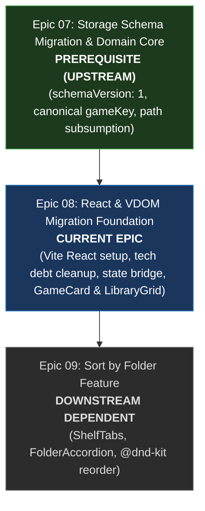

# PRD: React & Virtual DOM Migration Foundation

## 1. Overview & Objective

Migrate YumeShelf's renderer from raw imperative DOM manipulation to React (Virtual DOM) and resolve accumulated frontend drag-and-drop tech debt.

### Core Problem & Architectural Rationale
YumeShelf originally employed an imperative, hand-rolled DOM renderer without a component framework. Implementing multi-grid connected drag-and-drop, dynamic CSS Grid accordions, and manual FLIP animations in raw DOM led to layout thrashing, frame coalescing issues, and fragile manual DOM reconciliation.

To eliminate these lifecycle leaks and fragile DOM calculations, this epic establishes:
1. Modern build tooling with React and Virtual DOM (VDOM).
2. Complete cleanup of legacy frontend drag tech debt (deleting `drag-math.ts`, `flip-animation.ts`, and purging native HTML5 drag handlers).
3. A reactive bridge connecting existing runtime state and Electron IPC to React hooks and Context.
4. Declarative React components for flat library grids and game cards (`GameCard.tsx`, `LibraryGrid.tsx`).

This establishes a clean, modern foundation for Epic 09 (Sort by Folder), where folder shelves and accordions will be built using `@dnd-kit`.

---

## 2. Dependency Lineage

- **Upstream Prerequisite**: [Epic 07 (Storage Schema Migration & Domain Core)](file:///d:/Projects/YumeShelf/docs/specs/07-storage-schema-migration-and-domain-core/PRD.md).
- **Downstream Dependent**: [Epic 09 (Sort by Folder)](file:///d:/Projects/YumeShelf/docs/specs/09-sort-by-folder/PRD.md).

---

## 3. Scope & Architectural Boundaries

### In Scope
1. **Build & Tooling Setup**:
   - Install React 19, `@vitejs/plugin-react`, and configure `vite.config.ts`.
   - Update `tsconfig.json` with `"jsx": "react-jsx"`.
   - Setup Vitest test runner with `@testing-library/react` for 100% in-memory virtual testing.
2. **Frontend Tech Debt Cleanup**:
   - Delete obsolete legacy math and animation utilities: [`src/renderer/utils/drag-math.ts`](file:///d:/Projects/YumeShelf/src/renderer/utils/drag-math.ts) and [`src/renderer/utils/flip-animation.ts`](file:///d:/Projects/YumeShelf/src/renderer/utils/flip-animation.ts).
   - Strip legacy HTML5 drag listeners (`ondragstart`, `ondragend`, `ondragenter`, `ondragleave`, `ondragover`, `ondrop`, `attachZoneHandlers`) and `draggable` attributes from [`src/renderer/game-cards.ts`](file:///d:/Projects/YumeShelf/src/renderer/game-cards.ts), [`src/renderer/stack-cards.ts`](file:///d:/Projects/YumeShelf/src/renderer/stack-cards.ts), and [`src/renderer/library-grid.ts`](file:///d:/Projects/YumeShelf/src/renderer/library-grid.ts).
3. **React Root & Reactive State Bridge**:
   - Mount React component root (`#react-root`) alongside Electron preload and window controls.
   - Implement `LibraryStateContext` and reactive hook `useLibraryState` bridging [`src/renderer/state/ui-runtime-state.ts`](file:///d:/Projects/YumeShelf/src/renderer/state/ui-runtime-state.ts) and Electron IPC events to React components.
4. **Declarative Game Cards & Library Grid**:
   - Implement `GameCard.tsx` and `StackCard.tsx` declarative React components for game cards with launch actions, favorite toggle, context menus, and lazy icon rendering.
   - Implement `LibraryGrid.tsx` declarative component handling flat sort modes (`date`, `played`, `az`, `custom`), category filtering, and empty library states.

### Out of Scope
- Introducing "Sort by Folder" segmented shelf tabs or accordions (deferred to Epic 09).
- Drag-and-drop reordering library integration (deferred to Epic 09 via `@dnd-kit`).
- Rewriting backend storage, migration runners, or main-process IPC controllers (completed in Epic 07).

---

## 4. Modular Ticket Breakdown

| Ticket | Summary | Type | Target Files |
| :--- | :--- | :---: | :--- |
| **01** | [Build & Tooling Setup](file:///d:/Projects/YumeShelf/docs/specs/08-react-migration/tickets/01-build-and-tooling-setup.md) | Setup | `package.json`, `vite.config.ts`, `tsconfig.json`, `vitest.config.ts` |
| **02** | [Frontend Tech Debt Cleanup](file:///d:/Projects/YumeShelf/docs/specs/08-react-migration/tickets/02-frontend-tech-debt-cleanup.md) | Cleanup | `src/renderer/utils/drag-math.ts` (delete), `src/renderer/utils/flip-animation.ts` (delete), `src/renderer/game-cards.ts`, `src/renderer/stack-cards.ts`, `src/renderer/drag-drop-grid.ts` |
| **03** | [React Root & Reactive State Bridge](file:///d:/Projects/YumeShelf/docs/specs/08-react-migration/tickets/03-react-root-and-state-bridge.md) | Structural | `src/index.html`, `src/renderer/index.tsx`, `src/renderer/context/LibraryStateContext.tsx`, `src/renderer/hooks/useLibraryState.ts` |
| **04** | [Declarative Game Cards & Library Grid](file:///d:/Projects/YumeShelf/docs/specs/08-react-migration/tickets/04-declarative-react-game-cards-and-library-grid.md) | Feature | `src/renderer/components/GameCard.tsx`, `src/renderer/components/LibraryGrid.tsx`, `src/renderer/components/LibraryEmptyState.tsx` |

---

## 5. Verification Standards

- **Zero Global Leakage**: All React components must accept injected dependencies (`electronAPI`, `targetPlatform`) or read them from Context rather than accessing ambient window globals.
- **In-Memory Testing**: All component behavior (rendering, launching, favoriting, filtering) must be covered by `@testing-library/react` tests in headless Vitest.
- **Type Safety**: `npm run typecheck` passes with zero errors under strict TypeScript compiler options.
