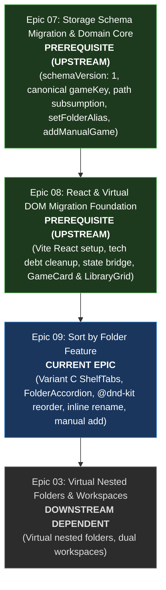
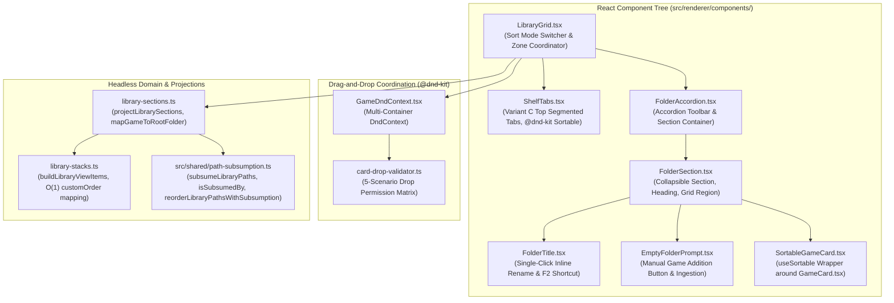

# PRD: Sort by Folder & Multi-Zone Drag-Drop

## 1. Overview & Goal Description

Implement the **Sort by Folder (Variant C)** experience in YumeShelf, providing users with a natural, folder-structured browsing experience for their game library.

Built directly on top of the declarative React foundation established in Epic 08 and consuming backend domain actions from Epic 07, this feature introduces:
1. **Top Segmented Shelf Tabs** (`ShelfTabs.tsx`) with `@dnd-kit` horizontal reordering.
2. **Collapsible Folder Accordions** (`FolderAccordion.tsx`, `FolderSection.tsx`) with smooth CSS Grid row animations and WAI-ARIA APG compliance.
3. **Multi-Container Drag-and-Drop** (`@dnd-kit`) supporting intra-folder reordering and cross-zone drag interactions with the Favorites section (dual placement).
4. **Settings Library Paths Reordering** (`PathReorderList.tsx`) with vertical drag reordering.
5. **Single-Click Inline Folder Rename** (`FolderTitle.tsx`) committing folder aliases to config via IPC.
6. **Empty Folder Manual Game Addition** (`EmptyFolderPrompt.tsx`) allowing users to launch native file pickers and ingest non-scanned executables into target folders.

---

## 2. Dependency Lineage

- **Upstream Prerequisites**:
  - [Epic 07 (Storage Schema Migration & Domain Core)](file:///d:/Projects/YumeShelf/docs/specs/07-storage-schema-migration-and-domain-core/PRD.md): Backend schema versioning, pure-string path subsumption algorithms in `src/shared/path-subsumption.ts`, and domain actions (`toggleFavorite`, `setFolderAlias`, `addManualGame`, `updateLibraryConfig`).
  - [Epic 08 (React & Virtual DOM Migration Foundation)](file:///d:/Projects/YumeShelf/docs/specs/08-react-migration/PRD.md): React 19 VDOM runtime, state bridge (`useLibraryState`), tech debt cleanup, and declarative `GameCard.tsx` and `LibraryGrid.tsx`.
- **Downstream Dependent**:
  - [Epic 03 (Virtual Nested Folders & Workspaces)](file:///d:/Projects/YumeShelf/docs/specs/03-virtual-nested-folders-and-workspaces/PRD.md).

---

## 3. Architecture & Component Blueprint

---

## 4. Feature Specifications & UX Invariants

### 4.1 Variant C Top Segmented Shelf Tabs (`ShelfTabs.tsx`)
- Pinned "All Folders" tab (index 0, non-draggable).
- Pinned "Favorites" tab (index 1, non-draggable, rendered strictly when `favoritesCount > 0`). Displays gold vector SVG star icon.
- Draggable folder tabs for configured canonical roots.
- Drag-and-drop reordering using `@dnd-kit/sortable` with horizontal list strategy.
- Pinned tab protection: cannot drop before or between pinned tabs.
- Full keyboard accessibility conforming to WAI-ARIA Tabs pattern (roving `tabindex`, horizontal arrow keys).
- Horizontal scroll container with overflow chevron navigation buttons and tooltips.
- Zero-favorite fallback: if active tab is `'fav'` and favorites drop to 0, automatically transitions active tab to `'all'`.

### 4.2 Collapsible Folder Accordions (`FolderAccordion.tsx`, `FolderSection.tsx`)
- Accordion toolbar on tab `'all'` with "Expand All" and "Collapse All" buttons.
- Collapsible section headers with chevron rotation, title, and item count badge.
- Hardware-accelerated CSS Grid rows (`grid-template-rows: 0fr <-> 1fr`) with `@media (prefers-reduced-motion: reduce)` bypass.
- Accessible heading decoupling: header is semantic heading (`role="heading"`), expand/collapse is isolated toggle button control.
- Accessibility barrier: collapsed sections apply HTML `inert` to child grids, preventing keyboard focus trapping.
- Tab-scoped visibility:
  - Tab `'all'`: displays top Favorites section followed by all folder sections.
  - Tab `'fav'`: displays top Favorites section only.
  - Tab `'<folder-id>'`: displays the selected folder section only (non-collapsible).

### 4.3 Multi-Container Drag-and-Drop (`@dnd-kit`)
- Multi-container drag context coordinating drops across Favorites and dynamic folder sections.
- 5-Scenario Drop Validation Matrix:
  1. **Same-container reordering**: always permitted; updates `customOrder`.
  2. **Folder section -> Favorites drop**: permitted if game not already in favorites; triggers `toggleFavorite(gameKey, true)` (dual placement).
  3. **Favorites -> Folder section drop**: permitted only into owning root folder; triggers `toggleFavorite(gameKey, false)` (unfavorites, keeps folder card).
  4. **Cross-folder drop**: dragging between two disparate folder sections is strictly rejected.
  5. **Flat sort modes**: cross-zone drop between favorites and non-favorites unconditionally allowed.
- Optimistic UI updates with persistence error rollback and toast pill notifications.

### 4.4 Settings Library Paths Reorder (`PathReorderList.tsx`)
- Vertical drag reordering of configured paths in Settings modal.
- Grip handle (`.grip-handle`) with accessible label and tooltip.
- Max 4 visible rows with `scrollbar-gutter: stable`.
- Optimistic update persisting via `electronAPI.updateLibraryConfig({ libraryPaths })` with rollback on failure.

### 4.5 Single-Click Inline Folder Rename (`FolderTitle.tsx`)
- Title heading element is keyboard-focusable (`tabindex="0"`) with accessible description.
- Single-click, `F2`, or `Enter` activates inline edit mode.
- Does not trigger accordion collapse toggle.
- Enter / blur commits alias via `electronAPI.setFolderAlias(folderPath, trimmedValue)`.
- Esc cancels editing and restores original display name.
- Failure keeps input mounted with typed text and error styling.

### 4.6 Empty Folder Manual Game Addition (`EmptyFolderPrompt.tsx`)
- Full-width dashed prompt box rendered when folder has 0 games in unfiltered state.
- Button text: "Your Game Is Not Scanned? Manually Add Them Here." (with accessible name complying with WCAG 2.5.3).
- Filtered invariant: when category filter is active and folder has 0 matching games, renders neutral filtered empty text instead of manual add prompt.
- Global empty state bypass: when 0 games exist in library but roots are configured, renders empty folder sections with prompts rather than global empty illustration.
- In-flight busy feedback during native file picker dialog invocation (`electronAPI.addManualGame`).
- Ingested game added to state and immediately focused.

---

## 5. Modular Ticket Breakdown

| Ticket | Summary | Type | Target Files |
| :--- | :--- | :---: | :--- |
| **01** | [Headless Section Projections & Stacks Custom Order](file:///d:/Projects/YumeShelf/docs/specs/09-sort-by-folder/tickets/01-headless-library-sections-and-stacks.md) | Domain | `src/renderer/library/library-sections.ts`, `src/renderer/library-stacks.ts` |
| **02** | [Folder Sort Styles, Design Tokens & Locales](file:///d:/Projects/YumeShelf/docs/specs/09-sort-by-folder/tickets/02-folder-sort-styles-tokens-and-locales.md) | Styling | `src/styles/theme.css`, `src/style.css`, `src/renderer/ui-text.ts`, `src/locales/builtins/*.json` |
| **03** | [Segmented Shelf Tabs with @dnd-kit](file:///d:/Projects/YumeShelf/docs/specs/09-sort-by-folder/tickets/03-segmented-shelf-tabs-dnd-kit.md) | Feature | `src/renderer/components/ShelfTabs.tsx`, `src/renderer/components/SortableTabItem.tsx` |
| **04** | [Folder Accordions & Section Components](file:///d:/Projects/YumeShelf/docs/specs/09-sort-by-folder/tickets/04-folder-accordions-and-sections.md) | Feature | `src/renderer/components/FolderAccordion.tsx`, `src/renderer/components/FolderSection.tsx` |
| **05** | [@dnd-kit Game Card Drag & Favorites Cross-Zone Drop](file:///d:/Projects/YumeShelf/docs/specs/09-sort-by-folder/tickets/05-dnd-kit-game-cards-and-cross-zone-drop.md) | Feature | `src/renderer/dnd/GameDndContext.tsx`, `src/renderer/dnd/card-drop-validator.ts`, `src/renderer/components/SortableGameCard.tsx` |
| **06** | [Folder Reordering & Settings Paths Drag Reorder](file:///d:/Projects/YumeShelf/docs/specs/09-sort-by-folder/tickets/06-folder-reorder-and-settings-paths-dnd.md) | Feature | `src/renderer/settings/PathReorderList.tsx`, `src/renderer/settings/SortablePathRow.tsx` |
| **07** | [Single-Click Inline Folder Rename](file:///d:/Projects/YumeShelf/docs/specs/09-sort-by-folder/tickets/07-inline-folder-rename.md) | Feature | `src/renderer/components/FolderTitle.tsx` |
| **08** | [Empty Folder Manual Game Addition](file:///d:/Projects/YumeShelf/docs/specs/09-sort-by-folder/tickets/08-empty-folder-manual-add.md) | Feature | `src/renderer/components/EmptyFolderPrompt.tsx` |

---

## 6. Verification & Quality Gates

- **MultiOS Path Hygiene**: All path comparisons and folder alias lookups use platform-aware normalization (`normalizePathForPlatform`) and path subsumption from `src/shared/path-subsumption.ts`.
- **100% In-Memory Virtual Testability**: All components tested headlessly via `@testing-library/react` and Vitest without live Electron or host filesystem dependencies.
- **Accessibility (WAI-ARIA APG)**: Tabs follow WAI-ARIA tabs pattern; accordions use heading wrappers with isolated toggle triggers; collapsed containers apply HTML `inert`.
- **XSS Immunity**: User-controlled folder names and aliases rendered via safe React JSX children bindings, strictly eliminating unescaped HTML string interpolation.
