# YumeShelf Specifications & Architecture Roadmap

This directory contains the authoritative Product Requirements Documents (PRDs) and modular implementation tickets for YumeShelf epics.

---

## Authoritative Epic Execution Roadmap

The implementation sequence of epics follows a strict dependency and architectural layering pipeline:

```mermaid
flowchart TD
    E01["Epic 01: Yume Engine Core<br/><b>STATUS: IMPLEMENTED</b><br/>(Headless inspection & save codecs)"]
    --> E02["Epic 02: Codebase Readiness & MultiOS<br/><b>STATUS: IMPLEMENTED</b><br/>(Cross-platform seams & path hygiene)"]
    --> E06["Epic 06: Headless Icon Pipeline<br/><b>STATUS: IMPLEMENTED</b><br/>(PE/Bundle icon extractor & cache)"]
    --> E07["Epic 07: Storage Schema Migration & Domain Core<br/><b>STATUS: IMPLEMENTED / READY</b><br/>(schemaVersion: 1, canonical gameKey, path subsumption)"]
    --> E08["Epic 08: React & VDOM Migration Foundation<br/><b>STATUS: NOT IMPLEMENTED (NEXT)</b><br/>(Vite React setup, tech debt cleanup, state bridge, GameCard & LibraryGrid)"]
    --> E09["Epic 09: Sort by Folder Feature<br/><b>STATUS: SPEC READY</b><br/>(Variant C ShelfTabs, FolderAccordion, @dnd-kit reorder)"]
    --> E03["Epic 03: Virtual Nested Folders & Workspaces<br/><b>STATUS: ACTIVE SPEC REVIEW</b><br/>(App folders, dual workspaces, drag & drop)"]
    --> E04["Epic 04: Marketplace & Tool Manager<br/><b>STATUS: SCHEDULED</b><br/>(Community add-ons & tool runners)"]
    --> E05["Epic 05: macOS Implementation<br/><b>STATUS: SCHEDULED</b><br/>(Native macOS runtime, DMG & runners)"]

    classDef implemented fill:#1e3a1e,stroke:#4caf50,color:#fff;
    classDef next fill:#3d2f00,stroke:#ffb74d,color:#fff;
    classDef reviewing fill:#1e2d40,stroke:#64b5f6,color:#fff;
    classDef scheduled fill:#2c2c2c,stroke:#888,color:#ddd;
    classDef ready fill:#1a365d,stroke:#3182ce,color:#fff;

    class E01,E02,E06,E07 implemented;
    class E08 next;
    class E09 ready;
    class E03 reviewing;
    class E04,E05 scheduled;
```

---

## Epic Details & Status Overview

| Sequence | Epic | Directory | Implementation Status | Core Responsibility |
| :---: | :--- | :--- | :---: | :--- |
| **01** | **Yume Engine Core** | [`01-yume-engine-core/`](01-yume-engine-core/) | **Implemented** | Headless single source of truth for PE binary header inspection, section mapping, import tables, save folder resolution, and save file codecs (`packages/yume-engine/`). |
| **02** | **Codebase Readiness MultiOS** | [`02-codebase-readiness-multios/`](02-codebase-readiness-multios/) | **Implemented** | Cross-platform architectural baseline for Windows, Linux, and macOS. Deep seams abstracting platform paths, path normalization, and 100% in-memory virtual testability. |
| **06** | **Headless Icon Pipeline** | [`06-headless-icon-pipeline/`](06-headless-icon-pipeline/) | **Implemented** | Headless extraction, normalization, and caching pipeline for game executable icons (`.ico`, `.exe` resources, `.icns`, `.app` bundles). Provides high-fidelity thumbnail icon assets. |
| **07** | **Storage Schema Migration & Domain Core** | [`07-storage-schema-migration-and-domain-core/`](07-storage-schema-migration-and-domain-core/) | **Implemented / Ready** | Root database schema versioning (`schemaVersion: 1`), isolated storage schema migration runner, pure-string cross-platform path subsumption, canonical `gameKey` derivation, and domain actions (`toggleFavorite`, `setFolderAlias`, `addManualGame`). |
| **08** | **React & Virtual DOM Migration Foundation** | [`08-react-migration/`](08-react-migration/) | **Not Implemented (Next)** | Setup React 19 and `@vitejs/plugin-react`, purge frontend drag tech debt (`drag-math.ts`, `flip-animation.ts`, HTML5 drag handlers), mount React root and reactive state bridge to `ui-runtime-state.ts`, and migrate flat Library Grid and Game Cards to declarative components (`GameCard.tsx`, `LibraryGrid.tsx`). |
| **09** | **Sort by Folder & Multi-Zone Drag-Drop** | [`09-sort-by-folder/`](09-sort-by-folder/) | **Spec Ready** | Sort by Folder (Variant C Top Segmented Shelf Tabs), collapsible CSS Grid accordions, multi-container `@dnd-kit` drag-and-drop reordering, favorites cross-zone drop, single-click inline folder rename, and empty folder manual game addition. |
| **03** | **Virtual Nested Folders & Dual Workspaces** | [`03-virtual-nested-folders-and-workspaces/`](03-virtual-nested-folders-and-workspaces/) | **Active Spec Review** | Virtual folder hierarchies (iOS/Android-style app folders), dual workspace modes ("Favorite Desk" vs "Library"), spring-loaded drag-and-drop, atomic write coordination, and virtualized grid viewport recycling. Consumes Epic 06 for 2x2 folder card preview matrix. |
| **04** | **Marketplace & Tool Manager** | [`04-marketplace-and-tool-manager/`](04-marketplace-and-tool-manager/) | **Scheduled** | Community add-on registries, external tool execution, and cascading tool menus. Plugs into Epic 03 via the `cardActionMenuProviders` extension seam. |
| **05** | **macOS Implementation** | [`05-macos-implementation/`](05-macos-implementation/) | **Scheduled** | Native macOS runtime capabilities, DMG auto-updater strategy, Wine/Whisky process wrappers, and macOS-specific menu integration. Consumes platform-agnostic gesture and shortcut seams from Epic 03. |

---

## Architectural Dependencies & Inter-Epic Seams

1. **Epic 07 as Headless Prerequisite to Epics 08 and 09**:
   - Epic 07 establishes the database versioning, path subsumption algorithms (`src/shared/path-subsumption.ts`), and main-process domain actions without touching renderer DOM code.
   - Epic 08 and 09 consume this hardened backend seam directly.

2. **Epic 08 as React Foundation for Epic 09**:
   - Epic 08 migrates the flat library grid to React and excises legacy HTML5 drag math and animations.
   - Epic 09 builds folder tabs, accordions, and `@dnd-kit` drag-and-drop directly into the declarative React component tree.

3. **Epic 06 as Prerequisite to Epic 03 UI Assets**:
   - Epic 03 introduces folder cards displaying an automated 2x2 thumbnail preview matrix of child games.
   - Epic 06 builds the headless icon extraction and thumbnail cache pipeline. Executing Epic 06 before Epic 03 ensures high-fidelity game icon assets are available when implementing the folder preview matrix and card grid rendering.

4. **Epic 03 Extension Seams for Downstream Epics (04 & 05)**:
   - **`cardActionMenuProviders` Hook (for Epic 04)**: Folder and game card context menus expose a pluggable provider seam so Epic 04 can register community tools and launch actions without touching card components.
   - **Platform-Agnostic Gesture Seam (for Epic 05)**: Drag-and-drop timers and keyboard shortcuts in Epic 03 consume normalized abstractions (`IClock`, standard keyboard codes) to ensure zero regression when macOS support lands in Epic 05.
   - **Strict Anti-Duplication Rule**: Epic 03 does not implement or duplicate features reserved for Epics 04 or 05.
