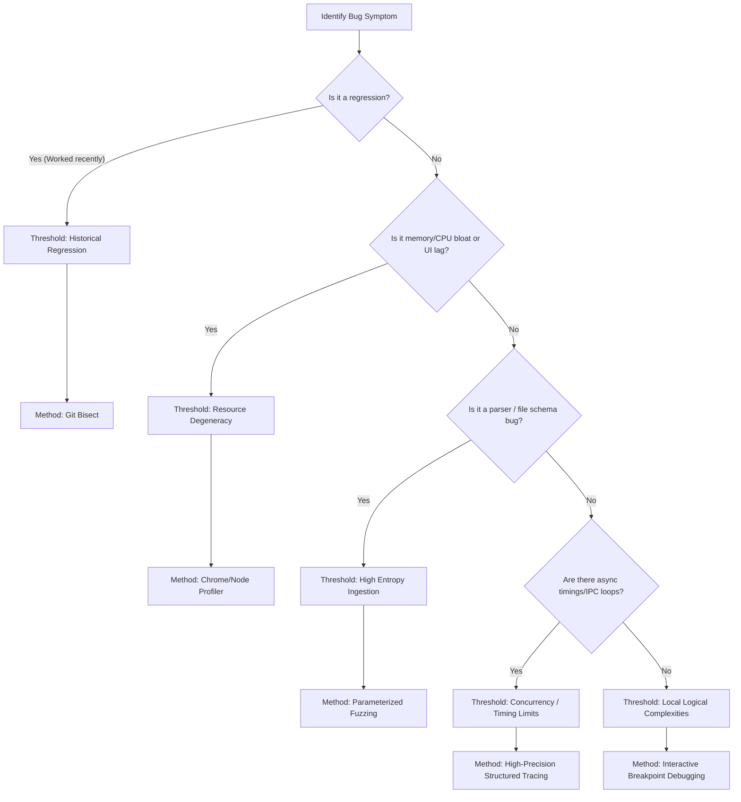

# 🔍 YumeShelf Bug-Finding & Systematic Diagnostics Guide

Welcome, developer or AI agent! In YumeShelf, we strictly enforce the **Anti-Blind-Fixing Rule** defined in [SOP/03-sandbox-verification.md](../SOP/03-sandbox-verification.md#3-anti-blind-fixing--active-diagnostic-handoff). 

Ad-hoc log insertion (the classic `console.log` / `printf` loop) is our baseline starting point. However, **if you hit a "Log-Loop Trap" (i.e., you have added, run, and modified console logs 3+ times without isolating the root cause), you MUST halt and pivot to one of the structured methodologies below.**

---

## 🚦 1. The Threshold-Method Decision Tree

When ad-hoc logging fails or the bug exhibits specific behaviors, evaluate the following thresholds to select the correct diagnostic tool:



---

## 🛠️ 2. Step-by-Step Implementation of Methodologies

### ⏱️ Method A: Interactive Debugging & Breakpoints
*   **When to Use**: You have a deterministic function (e.g., translation matching, category indexing) returning incorrect values, and logging produces too much noise.
*   **YumeShelf Action**:
    1. For the **Renderer Process** (Save Editor UI): In the Electron window, press `Ctrl+Shift+I` (or `F12`) to open Chrome DevTools. Navigate to the `Sources` tab, find the file (e.g., `translator.js`), and click the line number to set a breakpoint.
    2. For the **Main Process** (`main.js`): Start the app in debug mode by running `npm start -- --inspect` or set up a VS Code Launch configuration for Electron. Step through using `F10` (Step Over) and `F11` (Step Into).

### 🧬 Method B: Parameterized Testing & Fuzz Testing
*   **When to Use**: You are parsing highly variable or obfuscated user save files (Ren'Py, RPG Maker, etc.) in `src/renderer/save-editor/engines/` and hitting obscure parsing anomalies.
*   **YumeShelf Action**:
    1. Create a lightweight test harness in `scratch/test_parser.js`.
    2. Feed the parser a set of varied base templates.
    3. Programmatically corrupt random offsets or inject non-UTF-8 bytes.
    4. Assert that the parser safely throws a handled exception instead of crashing the Node runtime or triggering silent corruption.

### 📜 Method C: Systematic Delta Debugging (`git bisect`)
*   **When to Use**: A feature (e.g., game updater, categories loading) was functioning recently but is now broken, and the regression is buried in multiple commits.
*   **YumeShelf Action**:
    1. Write a self-contained reproduction script in the root directory (e.g., `scratch/check_bug.js`) that automatically asserts the behavior and exits with code `0` (success) or `1` (failure).
    2. Run:
       ```bash
       git bisect start
       git bisect bad HEAD
       git bisect good <commit-hash-where-it-worked>
       git bisect run node scratch/check_bug.js
       ```
    3. Git will automatically find the exact offending commit in $O(\log N)$ steps.

### 📊 Method D: Dynamic Profiling (Heap & Flame Graphs)
*   **When to Use**: The app stutters while scrolling categories, exhibits sluggishness after loading 100+ cards, or crashes due to memory leaks.
*   **YumeShelf Action**:
    1. Open Chrome DevTools inside the Electron Renderer.
    2. Go to the **Performance** tab and record a trace during scrolling. Check for "Long Tasks" (red blocks) forcing layout reflows.
    3. Go to the **Memory** tab, take a Heap Snapshot, perform the lag-inducing action, trigger Garbage Collection (trash can icon), and take a second snapshot. Compare them using the "Comparison" filter to find unreleased DOM elements or closures.

### 🛰️ Method E: High-Precision Structured Tracing
*   **When to Use**: Race conditions or packet drops across the Electron Main-Renderer IPC boundary (`src/main/core/ipc.js` or `preload.js`).
*   **YumeShelf Action**:
    *   Avoid using interactive step-debuggers, as pausing one thread will break timing and make the bug disappear.
    *   Inject high-precision trace logs instead, leveraging the `safe-console.js` system. Format logs as JSON containing:
        *   `timestamp`: Using `performance.now()` for sub-millisecond precision.
        *   `process`: `"main"` or `"renderer"`.
        *   `correlationId`: A unique uuid generated at request inception to trace its lifecycle across the IPC boundary.

---

## 🛑 3. Remember the Collaboration Boundary
If you have applied the appropriate methodology above and are still blocked by an **Observability Blackout**, an **Information Entropy Boundary**, or **Logical Indeterminism**, you **MUST** halt execution immediately and hand off diagnostics to the user by asking for exact target environments, minimal repro payloads, or live console logs. Do not guess.
