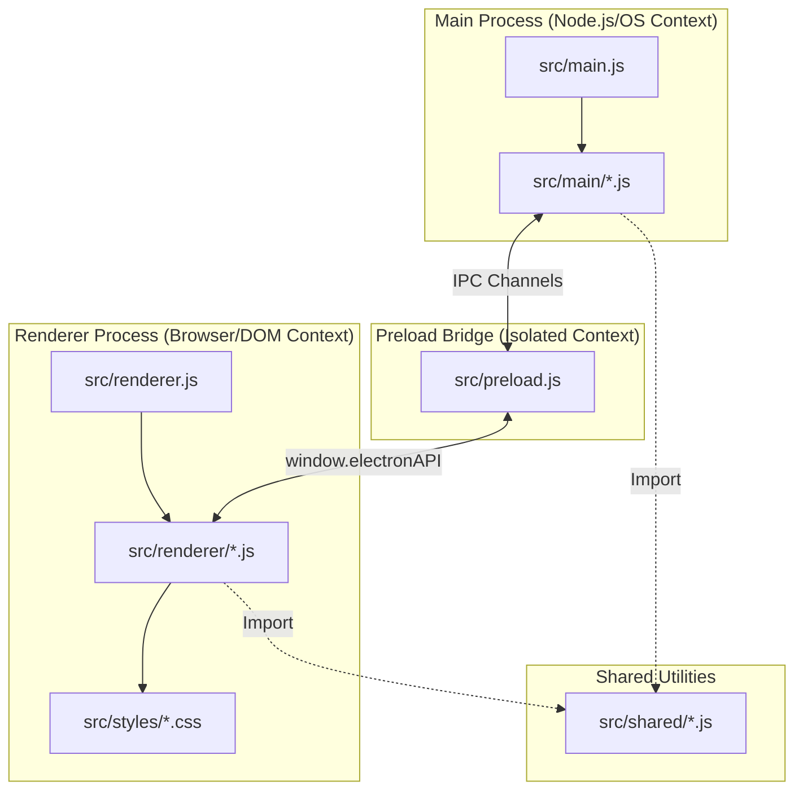
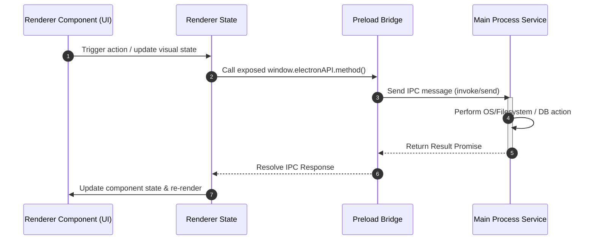

# YumeShelf Code Modularization Guidelines

To maintain a clean, performant, and scalable Electron application, all agents and developers **MUST** adhere strictly to these modularization guidelines when modifying or adding codebase features in `YumeShelf`.

---

## 🗺️ 1. Architecture Overview & Process Boundaries

YumeShelf maintains a strict separation of concerns between processes. **Never** violate these boundaries.

### 🚨 Boundary 1: Main Process vs. Renderer Process
- **Main Process (`src/main/` & `src/main.js`)**: Runs in a native Node.js/OS environment. It has full filesystem, OS, child processes, and native API access. **Never** import visual UI elements or DOM-dependent code here.
- **Renderer Process (`src/renderer/` & `src/renderer.js`)**: Runs in an isolated browser context. It handles UI rendering, themes, translation, and user inputs. **Never** import native Node.js core modules (`fs`, `child_process`, `path`, etc.) or Main Process services directly. All OS/FS interactions must be brokered through the IPC Bridge.

---

## 🔌 2. The Preload IPC Bridge (`src/preload.js`)

The preload script acts as the secure, unidirectional/bidirectional gateway between the Main and Renderer processes.

### 2.1 Preload Registration (`src/preload.js`)
- Expose methods explicitly via Electron's `contextBridge.exposeInMainWorld('electronAPI', { ... })`.
- Group API functions logically (e.g., `library`, `saveEditor`, `updater`, `system`).
- Keep IPC functions minimal. Expose functional contracts rather than raw database or implementation objects.

### 2.2 IPC Event Handlers in Main (`src/main/ipc/`)
- Listeners for IPC events must be registered cleanly in dedicated modules (e.g. in `src/main/ipc/`).
- Use `ipcMain.handle` for bidirectional operations (Request-Response) returning promises.
- Use `ipcMain.on` for fire-and-forget message notifications.
- **Always** sanitize and validate parameters received from the Renderer process before execution. Treat the Renderer process as an untrusted client.

---

## 🧩 3. Renderer Architecture & Decoupling

The Renderer process should remain clean, testable, and responsive.

### 3.1 Controller & View Decoupling (Composition Pattern)
- Avoid massive single-file UI controllers.
- Use the **Composition Pattern** modeled in `src/renderer.js` via `createRendererComposition()`.
- Group UI elements into individual modules under `src/renderer/ui-components/` or specific feature folders (e.g., `src/renderer/save-editor/`).
- Separation of concerns:
  - **State (`src/renderer/state/`)**: Holds the reactive state and client-side data cache (e.g., loaded game list, filter settings).
  - **UI/Components**: Visual rendering, DOM creation, transition handling, and styling hookups.
  - **Events (`src/renderer/events/`)**: Handles UI event bindings and triggers IPC calls or State modifications.

### 3.2 Pure Helper Functions & Shared Utils (`src/shared/`)
- Place code that is used in *both* Main and Renderer processes (e.g., path patterns, schemas, serializable contracts) under `src/shared/`.
- Files in `src/shared/` **MUST NOT** import any Node.js native packages or browser/DOM-specific objects so they remain process-agnostic.

---

## 🎨 4. CSS & Styling Modularization

Aesthetics are vital, but messy styling slows down rendering and ruins maintainability.

- **No Style Bloat**: Never write large chunks of inline styles in Javascript code unless dynamic calculation is unavoidable (e.g. dragging positions).
- **Style Files (`src/styles/`)**: Keep CSS files modularized by component or layout (e.g. `save-editor.css`, `grid.css`, `variables.css`).
- **CSS Variables / Design System**:
  - Always use variables declared in the main CSS variables file (`src/styles/variables.css` or equivalent) for colors, fonts, margins, and transition speeds to maintain consistent high-quality theme colors, dark modes, and aesthetic values.
  - Ensure all hover states, focus indicators, and transitions use the predefined design system values.

---

## 🛠️ 5. Step-by-Step Feature Implementation Workflow

When asked to build a new feature or modify an existing one, strictly follow these modularization steps:

1. **Define the Service (Main)**:
   - Implement the core logic inside a dedicated module in `src/main/` (e.g., `src/main/my-feature/my-service.js`).
2. **Expose the Interface (IPC & Preload)**:
   - Add IPC listener registration in the Main process IPC files.
   - Declare the client-side signature under the appropriate namespace in `src/preload.js`.
3. **Manage the Client State (Renderer State)**:
   - Add state-tracking and reactive models to `src/renderer/state/` if the new feature requires UI data persistence.
4. **Implement UI & Event Controller (Renderer Component)**:
   - Create/modify components under `src/renderer/ui-components/` to handle visual layouts, user action listeners, and transitions.
5. **Attach Styling**:
   - Write clean, modular CSS in a dedicated stylesheet under `src/styles/`, using CSS variables for high-fidelity animations and themes.
