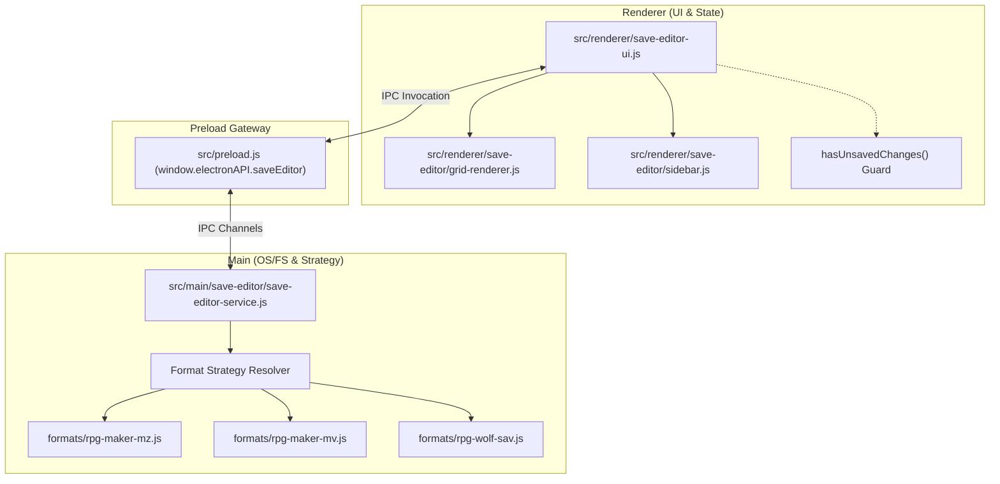

# YumeShelf Save Editor & Serialization Guidelines

To maintain robust, error-free save manipulation across diverse game engines and formats, all agents and developers **MUST** adhere strictly to these serialization and state-safety guidelines when modifying, extending, or testing the YumeShelf Save Editor.

---

## 🗺️ 1. Save Editor Architecture Overview

The YumeShelf Save Editor decouples visual representation, logical state management, and file-format serialization into a clean, modular structure.



*   **Format Strategy Pattern:** All engine-specific serialization, parsing, and compression details are strictly isolated under `src/main/save-editor/formats/`.
*   **Renderer UI Decoupling:** The grid and sidebar controllers handle only UI rendering and state interaction, calling process-isolated Main services via secure IPC bridges for all file operations.

---

## 🔒 2. Serialization & Compression Specifications

When working with save compression and encoding algorithms (such as the LZString algorithm commonly used in RPG Maker MV/MZ games), developers must honor exact bitstream alignments.

### 2.1 The Bitstream Alignment & Padding Rule (16-bit Word Boundary)
Standard RPG Maker engines rely on standard legacy `lz-string` (v1.3.x/v1.4.x) algorithms that require **16-bit word-aligned bitstreams** (`bitsPerChar = 16`).

*   **Compression Process:** 
    1.  The raw JSON string is compressed into an array of 16-bit characters.
    2.  If the trailing bits do not end on a 16-bit boundary, they must be padded with zeroes up to the nearest **16-bit boundary**.
    3.  The 16-bit words are then mapped to standard 6-bit Base64 characters via a custom character translation matrix.
*   **The 6-bit Padding Trap:** Never implement single-pass minimal compressors that pad trailing streams directly to 6-bit boundaries. While such streams may decode successfully in standard browser environments (which are highly fault-tolerant), they lack crucial trailing zero bits and will be **strictly rejected** by native game engines.

---

## 🚨 3. The Silent Reversion Pitfall

One of the most elusive bugs in save editing is the **Silent Reversion** failure mode.

### 3.1 Failure Mechanics
*   When a game engine receives a save file with incorrect alignment or faulty padding, it **does not crash** or throw a visible stack trace.
*   Instead, during the game loop or scene refresh, the engine’s internal state machine detects a decompression failure, silently rejects the file, and restores the previous session state from either an active in-memory cache or a backup file (e.g., `global.rpgsave` or auto-save backup).
*   This creates a delayed symptom: edited values appear on screen for a split second, then revert back to their original state.

### 3.2 The Anti-Tolerant Decoding Principle
*   **Do not trust local decompression:** Just because YumeShelf can successfully compress, save, and decompress its own files without throwing an error **does not mean** the target game engine will accept the output.
*   **Verification Requirement:** Output produced by custom encoders must be validated to ensure it is byte-for-byte identical or perfectly compliant with standard original engines.

---

## ⚡ 4. State Mutation & Clobbering Safety

To prevent background library syncs, metadata refreshes, or UI updates from clobbering active, unsaved user edits, the Save Editor implements strict state boundaries.

### 4.1 Live Container Mutation
*   When rendering variables or bitsets on a grid, **never** modify values via closed-over stale variables or copy arrays.
*   Always perform mutations **directly on the live, raw data container** that represents the save state in memory (`saveData.variables._data` or equivalent nested data structures), ensuring all structural changes propagate instantly.

### 4.2 Unsaved Changes Guards
Before reloading a file list, changing tabs, or triggering sync routines, the UI Controller must call `hasUnsavedChanges()` to check if the memory state is dirty. If dirty, a native dialog **MUST** prompt the user to confirm discarding or saving their active work.

---

## 🧪 5. Developer Verification Loop & Differential Testing

To guarantee that no future commits introduce regression into the save editing pipeline, follow this systematic testing loop.

### 5.1 Run Automated Regression Test Suites
YumeShelf maintains automated tests specifically designed to verify end-to-end save integrity. Before pushing any changes to files under `src/main/core/`, `src/main/save-editor/`, or `src/renderer/save-editor/`, run:

```bash
# 1. Verify byte-perfect LZ-String compression round-trips
node tests/test-rpgsave-cycle.js

# 2. Verify deep live-mutation and persistence
node tests/test-rpgsave-mutation.js

# 3. Run all core project tests
npm test
```

### 5.2 Differential Verification Protocol
If you must integrate a new save format (e.g., Unity Mono, Wolf RPG, or custom JSON structure):
1.  **Extract Native Game Encoders:** Locate the target game's native serialization script or library.
2.  **Generate Test Outputs:** Compress a sample string using the native game's encoder.
3.  **Perform Byte-Level Diffing:** Compress the same string using your strategy module. Verify that the output strings are **100% byte-for-byte identical**.
4.  **Game Sandbox Test:** Launch the packaged game locally, load the save file edited by YumeShelf, trigger a scene change (forcing the engine to read/write state), and verify that all edits persist without silent reverts.
